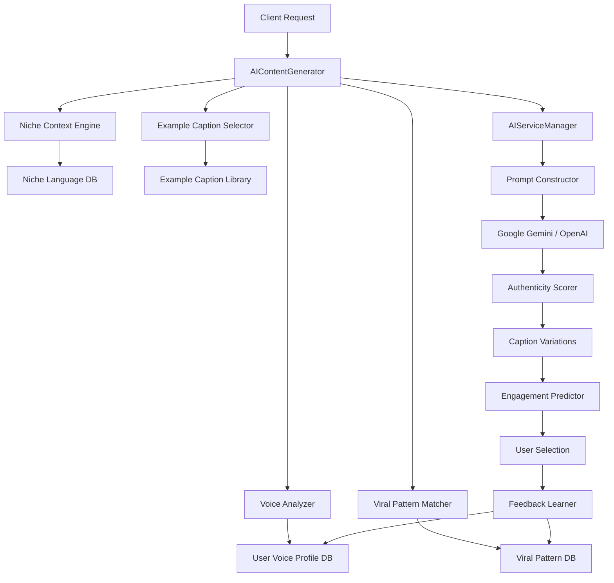
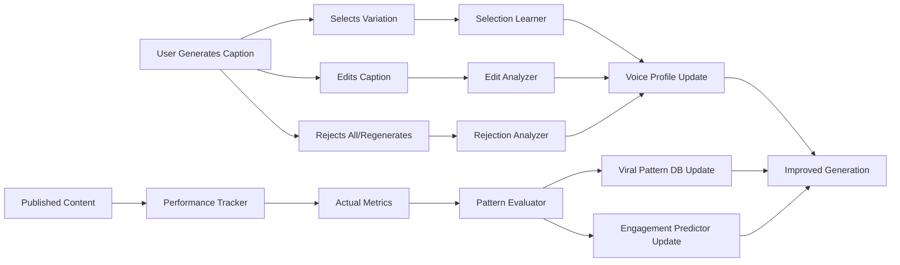

# Technical Design Document: Authentic Instagram Caption Generation

## Overview

The Authentic Instagram Caption Generation system transforms the existing AI caption generator from producing corporate, robotic content into generating authentic, platform-native captions that match individual creator voices and leverage proven viral patterns. This system addresses the core problem of AI-generated content sounding too generic by implementing voice analysis, viral pattern databases, niche-specific language engines, and continuous learning mechanisms.

**Core Innovation:** Rather than trying to make AI sound less like AI through generic prompt engineering, this system learns from real high-performing Instagram content and individual creator styles, then blends these learned patterns to generate captions that are indistinguishable from human-written posts.

**Integration Point:** This feature extends the existing `AIContentGenerator` class in `server/ai-content-generator.ts` and leverages the `AIServiceManager` for multi-provider AI support (Google Gemini, OpenAI GPT-4).

## Architecture

### System Components



### Component Responsibilities

**Voice Analyzer**
- Extracts writing patterns from user's past captions (sample uploads or connected accounts)
- Identifies vocabulary frequency, sentence structure, emoji usage, tone markers
- Creates and maintains User Voice Profiles
- Updates profiles based on user edits and selections

**Viral Pattern Matcher**
- Queries viral pattern database based on niche and content type
- Selects 3-5 relevant patterns for the current generation request
- Adapts patterns to user's voice rather than copying verbatim
- Learns from user's published content that outperforms predictions

**Niche Context Engine**
- Provides niche-specific vocabulary, slang, cultural references
- Tracks trending topics and language in specific verticals (last 30 days)
- Blends language naturally from multiple niches when content spans categories
- Filters outdated terms based on usage frequency trends

**Example Caption Selector**
- Retrieves 3-5 high-performing examples from target niche
- Filters by engagement rate, post type, and style characteristics
- Provides examples as few-shot learning samples to AI
- Updates library weekly with newly identified high-performing content

**Authenticity Scorer**
- Evaluates captions against 12+ human-likeness criteria
- Flags AI tells (corporate jargon, unnatural emoji usage, generic phrases)
- Compares against user's voice profile for consistency
- Triggers regeneration if score < 80/100

**Engagement Predictor**
- Analyzes hook strength, readability, CTA clarity, emotional resonance
- Predicts like rate, comment rate, save rate, share rate
- Considers user-specific factors (past performance, audience demographics)
- Tracks actual performance to improve accuracy

**Feedback Learner**
- Analyzes user edits before publishing to identify preferences
- Tracks caption selection patterns (which variations users choose)
- Correlates caption characteristics with actual engagement
- Updates voice profiles and viral patterns monthly

### Data Flow

1. **Generation Request** → User provides media, post type, platform, existing caption (optional)
2. **Context Gathering** → System loads voice profile, viral patterns, niche language, examples
3. **Prompt Construction** → Builds comprehensive prompt with all context for AI
4. **AI Generation** → AIServiceManager generates 3 variations using configured provider
5. **Quality Check** → Authenticity Scorer evaluates each variation
6. **Prediction** → Engagement Predictor scores each variation
7. **User Selection** → User chooses favorite variation or regenerates
8. **Feedback Loop** → System learns from selection and updates profiles

## Components and Interfaces

### Voice Profile Service

**File:** `server/services/VoiceProfileService.ts`

```typescript
export interface VoiceProfile {
  userId: string;
  workspaceId: string;
  
  // Voice Characteristics
  vocabularyFrequency: Record<string, number>;  // Word → frequency
  signaturePhrases: string[];                   // e.g., ["let's be real", "here's the thing"]
  sentenceLengthDistribution: {
    short: number;   // 1-5 words
    medium: number;  // 6-15 words
    long: number;    // 16+ words
  };
  paragraphStructure: 'single' | 'short-breaks' | 'long-form';
  
  // Emoji & Punctuation
  emojiUsagePattern: {
    frequency: 'none' | 'minimal' | 'moderate' | 'heavy';
    placement: 'inline' | 'end' | 'both';
    topEmojis: string[];  // Most used emojis
  };
  punctuationStyle: {
    exclamationUsage: 'rare' | 'moderate' | 'frequent';
    questionUsage: 'rare' | 'moderate' | 'frequent';
    ellipsisUsage: boolean;
  };
  
  // Tone & Style
  toneMarkers: {
    casual: number;      // 0-1 score
    professional: number;
    humorous: number;
    inspirational: number;
    educational: number;
    conversational: number;
  };
  
  // Pattern Recognition
  hookPatterns: string[];              // Opening sentence structures
  engagementQuestionStyle: string[];   // How they ask questions
  storytellingStructure: 'linear' | 'flashback' | 'buildup' | 'revelation';
  
  // Metadata
  sampleSize: number;          // Number of captions analyzed
  confidence: number;          // 0-1 accuracy score
  lastUpdated: Date;
  createdAt: Date;
}

export class VoiceProfileService {
  /**
   * Analyze user's sample captions to create voice profile
   */
  async analyzeAndCreateProfile(
    userId: string,
    workspaceId: string,
    sampleCaptions: string[]
  ): Promise<VoiceProfile>;
  
  /**
   * Get existing voice profile or return default
   */
  async getProfile(userId: string, workspaceId: string): Promise<VoiceProfile>;
  
  /**
   * Update profile based on user edits
   */
  async updateFromEdit(
    userId: string,
    workspaceId: string,
    originalCaption: string,
    editedCaption: string
  ): Promise<void>;
  
  /**
   * Update profile based on caption selection
   */
  async updateFromSelection(
    userId: string,
    workspaceId: string,
    selectedCaption: string,
    rejectedCaptions: string[]
  ): Promise<void>;
  
  /**
   * Convert voice profile to prompt instructions
   */
  voiceProfileToPrompt(profile: VoiceProfile): string;
}
```

### Viral Pattern Service

**File:** `server/services/ViralPatternService.ts`

```typescript
export interface ViralPattern {
  id: string;
  
  // Pattern Details
  name: string;                    // e.g., "Story-Insight-Question"
  category: 'hook' | 'structure' | 'engagement' | 'storytelling';
  pattern: string;                 // Template with placeholders
  description: string;
  
  // Targeting
  niches: string[];               // fitness, food, travel, etc.
  postTypes: ('post' | 'story' | 'reel')[];
  
  // Performance
  avgEngagementRate: number;      // Historical average
  usageCount: number;             // How many times used
  successRate: number;            // % of times it performed well
  
  // Examples
  exampleCaptions: string[];      // Real captions using this pattern
  
  // Metadata
  trending: boolean;              // Currently trending
  lastUsed: Date;
  createdAt: Date;
}

export interface ViralHook {
  id: string;
  hookText: string;               // e.g., "Hot take:", "POV:"
  niche: string;
  avgEngagementBoost: number;     // % increase in engagement
  usageCount: number;
}

export class ViralPatternService {
  /**
   * Get relevant patterns for generation request
   */
  async getRelevantPatterns(
    niche: string,
    postType: 'post' | 'story' | 'reel',
    limit: number
  ): Promise<ViralPattern[]>;
  
  /**
   * Get viral hooks for niche
   */
  async getViralHooks(niche: string, limit: number): Promise<ViralHook[]>;
  
  /**
   * Add new pattern from user's successful content
   */
  async extractAndAddPattern(
    caption: string,
    engagementRate: number,
    niche: string,
    postType: string
  ): Promise<void>;
  
  /**
   * Update pattern performance
   */
  async updatePatternPerformance(
    patternId: string,
    actualEngagement: number
  ): Promise<void>;
}
```

### Niche Context Service

**File:** `server/services/NicheContextService.ts`

```typescript
export interface NicheContext {
  niche: string;
  
  // Language
  vocabulary: string[];           // Niche-specific words
  slangTerms: Record<string, string>;  // slang → meaning
  culturalReferences: string[];   // Current references in niche
  
  // Trends (last 30 days)
  trendingTopics: string[];
  trendingHashtags: string[];
  trendingPhrases: string[];
  
  // Style
  typicalEmojis: string[];
  toneGuidelines: string;
  
  // Metadata
  lastUpdated: Date;
}

export class NicheContextService {
  /**
   * Get niche context for generation
   */
  async getNicheContext(niche: string): Promise<NicheContext>;
  
  /**
   * Get blended context for multi-niche content
   */
  async getBlendedContext(niches: string[]): Promise<NicheContext>;
  
  /**
   * Check if term is outdated
   */
  async isTermOutdated(term: string, niche: string): Promise<boolean>;
  
  /**
   * Update trends from external sources
   */
  async updateTrends(niche: string): Promise<void>;
}
```

### Example Caption Library Service

**File:** `server/services/ExampleCaptionService.ts`

```typescript
export interface ExampleCaption {
  id: string;
  caption: string;
  
  // Source
  source: 'user' | 'curated' | 'scraped';
  sourceAccount?: string;
  
  // Classification
  niche: string;
  postType: 'post' | 'story' | 'reel';
  style: string;  // storytelling, question-based, etc.
  
  // Performance
  engagementRate: number;
  likes: number;
  comments: number;
  saves: number;
  shares: number;
  
  // Characteristics
  captionLength: number;
  hookType: string;
  hasQuestion: boolean;
  hasEmoji: boolean;
  emojiCount: number;
  
  // Metadata
  capturedAt: Date;
  verified: boolean;  // Manually verified as high quality
}

export class ExampleCaptionService {
  /**
   * Get high-performing examples for few-shot learning
   */
  async getExamplesForGeneration(
    niche: string,
    postType: string,
    limit: number
  ): Promise<ExampleCaption[]>;
  
  /**
   * Add caption from user's successful content
   */
  async addUserExample(
    userId: string,
    caption: string,
    metrics: {
      engagementRate: number;
      likes: number;
      comments: number;
      saves: number;
    },
    niche: string,
    postType: string
  ): Promise<void>;
  
  /**
   * Extract patterns from example
   */
  async extractPatterns(caption: ExampleCaption): Promise<{
    hookStructure: string;
    storytellingTechnique: string;
    engagementFormat: string;
  }>;
}
```

### Authenticity Scorer Service

**File:** `server/services/AuthenticityScorer.ts`

```typescript
export interface AuthenticityScore {
  overallScore: number;  // 0-100
  
  // Criteria Scores (each 0-10)
  criteriaScores: {
    vocabularyNaturalness: number;
    sentenceFlow: number;
    emojiPlacement: number;
    conversationalTone: number;
    platformAppropriateness: number;
    avoidsCorporateJargon: number;
    avoidsGenericPhrases: number;
    voiceConsistency: number;
    mobileReadability: number;
    hookStrength: number;
    engagementClarity: number;
    emotionalResonance: number;
  };
  
  // Flags
  aiTellsDetected: string[];  // Specific phrases that sound AI-like
  recommendations: string[];  // Suggestions for improvement
  
  passesThreshold: boolean;  // >= 80
}

export class AuthenticityScorer {
  /**
   * Evaluate caption authenticity
   */
  async scoreCaption(
    caption: string,
    voiceProfile: VoiceProfile,
    platform: string
  ): Promise<AuthenticityScore>;
  
  /**
   * Check for AI tells
   */
  detectAITells(caption: string): string[];
  
  /**
   * Compare caption to voice profile
   */
  checkVoiceConsistency(
    caption: string,
    profile: VoiceProfile
  ): number;
}
```

### Engagement Predictor Service

**File:** `server/services/EngagementPredictor.ts`

```typescript
export interface EngagementPrediction {
  // Predicted Rates
  predictedLikeRate: number;     // %
  predictedCommentRate: number;  // %
  predictedSaveRate: number;     // %
  predictedShareRate: number;    // %
  
  // Confidence
  confidence: number;  // 0-1
  
  // Contributing Factors
  factors: {
    hookStrength: number;        // 0-10
    readabilityScore: number;    // 0-10
    ctaClarity: number;          // 0-10
    emotionalResonance: number;  // 0-10
    lengthOptimality: number;    // 0-10
    trendingTopicBonus: number;  // 0-10
  };
  
  // Comparison
  vsUserAverage: number;  // % difference from user's avg
  confidence: number;
}

export class EngagementPredictor {
  /**
   * Predict engagement for caption
   */
  async predictEngagement(
    caption: string,
    userId: string,
    workspaceId: string,
    postType: string,
    platform: string
  ): Promise<EngagementPrediction>;
  
  /**
   * Update model with actual performance
   */
  async recordActualPerformance(
    captionId: string,
    actualMetrics: {
      likes: number;
      comments: number;
      saves: number;
      shares: number;
      impressions: number;
    }
  ): Promise<void>;
  
  /**
   * Get user's average performance
   */
  async getUserAverageMetrics(
    userId: string,
    workspaceId: string
  ): Promise<{
    avgLikeRate: number;
    avgCommentRate: number;
    avgSaveRate: number;
  }>;
}
```

## Data Models

### Database Schema Extensions

**Voice Profiles Collection**

```typescript
// MongoDB Collection: voiceprofiles
{
  _id: ObjectId,
  userId: String,
  workspaceId: String,
  
  // Voice Characteristics
  vocabularyFrequency: Map<String, Number>,
  signaturePhrases: [String],
  sentenceLengthDistribution: {
    short: Number,
    medium: Number,
    long: Number
  },
  paragraphStructure: String,
  
  // Emoji & Punctuation
  emojiUsagePattern: {
    frequency: String,
    placement: String,
    topEmojis: [String]
  },
  punctuationStyle: {
    exclamationUsage: String,
    questionUsage: String,
    ellipsisUsage: Boolean
  },
  
  // Tone & Style
  toneMarkers: {
    casual: Number,
    professional: Number,
    humorous: Number,
    inspirational: Number,
    educational: Number,
    conversational: Number
  },
  
  // Pattern Recognition
  hookPatterns: [String],
  engagementQuestionStyle: [String],
  storytellingStructure: String,
  
  // Metadata
  sampleSize: Number,
  confidence: Number,
  lastUpdated: Date,
  createdAt: Date,
  
  // Indexes
  indexes: [
    { userId: 1, workspaceId: 1 },
    { lastUpdated: -1 }
  ]
}
```

**Viral Patterns Collection**

```typescript
// MongoDB Collection: viralpatterns
{
  _id: ObjectId,
  
  // Pattern Details
  name: String,
  category: String,  // hook | structure | engagement | storytelling
  pattern: String,
  description: String,
  
  // Targeting
  niches: [String],
  postTypes: [String],
  
  // Performance
  avgEngagementRate: Number,
  usageCount: Number,
  successRate: Number,
  
  // Examples
  exampleCaptions: [String],
  
  // Metadata
  trending: Boolean,
  lastUsed: Date,
  createdAt: Date,
  
  // Indexes
  indexes: [
    { niches: 1, postTypes: 1 },
    { trending: 1, avgEngagementRate: -1 },
    { category: 1 }
  ]
}
```

**Viral Hooks Collection**

```typescript
// MongoDB Collection: viralhooks
{
  _id: ObjectId,
  hookText: String,
  niche: String,
  avgEngagementBoost: Number,
  usageCount: Number,
  createdAt: Date,
  
  // Indexes
  indexes: [
    { niche: 1, avgEngagementBoost: -1 }
  ]
}
```

**Niche Context Collection**

```typescript
// MongoDB Collection: nichecontexts
{
  _id: ObjectId,
  niche: String,
  
  // Language
  vocabulary: [String],
  slangTerms: Map<String, String>,
  culturalReferences: [String],
  
  // Trends
  trendingTopics: [String],
  trendingHashtags: [String],
  trendingPhrases: [String],
  
  // Style
  typicalEmojis: [String],
  toneGuidelines: String,
  
  // Metadata
  lastUpdated: Date,
  
  // Indexes
  indexes: [
    { niche: 1 },
    { lastUpdated: -1 }
  ]
}
```

**Example Captions Collection**

```typescript
// MongoDB Collection: examplecaptions
{
  _id: ObjectId,
  caption: String,
  
  // Source
  source: String,  // user | curated | scraped
  sourceAccount: String,
  userId: String,  // if source is user
  
  // Classification
  niche: String,
  postType: String,
  style: String,
  
  // Performance
  engagementRate: Number,
  likes: Number,
  comments: Number,
  saves: Number,
  shares: Number,
  
  // Characteristics
  captionLength: Number,
  hookType: String,
  hasQuestion: Boolean,
  hasEmoji: Boolean,
  emojiCount: Number,
  
  // Metadata
  capturedAt: Date,
  verified: Boolean,
  
  // Indexes
  indexes: [
    { niche: 1, postType: 1, engagementRate: -1 },
    { verified: 1, engagementRate: -1 },
    { source: 1 }
  ]
}
```

**Generated Caption Tracking**

```typescript
// MongoDB Collection: generatedcaptions
{
  _id: ObjectId,
  userId: String,
  workspaceId: String,
  contentId: String,  // Reference to Content collection
  
  // Generation Context
  variations: [{
    caption: String,
    hashtagsGenerated: [String],
    authenticityScore: Number,
    engagementPrediction: {
      likeRate: Number,
      commentRate: Number,
      saveRate: Number,
      shareRate: Number,
      confidence: Number
    },
    usedPatterns: [String],  // Pattern IDs
    usedHooks: [String],     // Hook IDs
  }],
  
  // User Interaction
  selectedVariationIndex: Number,
  wasEdited: Boolean,
  originalCaption: String,  // Before user edit
  editedCaption: String,    // After user edit
  editDistance: Number,     // Levenshtein distance
  
  // Actual Performance (filled in later)
  actualMetrics: {
    likes: Number,
    comments: Number,
    saves: Number,
    shares: Number,
    impressions: Number,
    engagementRate: Number
  },
  performanceRecordedAt: Date,
  
  // Metadata
  generatedAt: Date,
  publishedAt: Date,
  
  // Indexes
  indexes: [
    { userId: 1, workspaceId: 1, generatedAt: -1 },
    { contentId: 1 },
    { publishedAt: -1 }
  ]
}
```

**Caption Feedback**

```typescript
// MongoDB Collection: captionfeedback
{
  _id: ObjectId,
  userId: String,
  workspaceId: String,
  generatedCaptionId: String,
  
  // Feedback Type
  feedbackType: String,  // selection | edit | rejection | regeneration
  
  // Details
  selectedVariation: Number,
  rejectedVariations: [Number],
  editsMade: [{
    type: String,  // vocabulary | structure | emoji | length | tone
    before: String,
    after: String,
    reason: String  // inferred
  }],
  
  // Pattern Preferences
  preferredPatterns: [String],
  rejectedPatterns: [String],
  
  // Metadata
  timestamp: Date,
  
  // Indexes
  indexes: [
    { userId: 1, timestamp: -1 },
    { feedbackType: 1 }
  ]
}
```

## AI Prompt Engineering Approach

### Multi-Layered Prompt Architecture

The system uses a sophisticated prompt construction strategy that layers multiple context sources to guide the AI toward authentic, voice-matched output:

**Layer 1: Base System Instructions**
- Platform-native writing principles (already implemented in existing system)
- Current viral caption formulas and patterns
- "What NOT to do" guidelines (corporate jargon, generic phrases)

**Layer 2: Voice Profile Integration**
```typescript
// Example voice profile prompt injection
`
VOICE PROFILE - Match this exact writing style:
- Vocabulary: Uses "${topVocabulary.join('", "')}" frequently
- Signature phrases: "${signaturePhrases.join('", "')}"
- Sentence length: ${profile.sentenceLengthDistribution.short}% short, 
  ${profile.sentenceLengthDistribution.medium}% medium, 
  ${profile.sentenceLengthDistribution.long}% long
- Paragraph style: ${profile.paragraphStructure}
- Emoji usage: ${profile.emojiUsagePattern.frequency} (${profile.emojiUsagePattern.placement})
- Top emojis: ${profile.emojiUsagePattern.topEmojis.join(' ')}
- Tone: ${getToneDescription(profile.toneMarkers)}
- Hook patterns: "${profile.hookPatterns.slice(0, 3).join('", "')}"
`
```

**Layer 3: Viral Pattern Selection**
```typescript
// Example viral pattern prompt injection
`
USE THESE PROVEN VIRAL PATTERNS (adapt to voice, don't copy):

Pattern 1: ${pattern1.name}
Structure: ${pattern1.pattern}
Example: "${pattern1.exampleCaptions[0]}"
Avg engagement: +${pattern1.avgEngagementRate}%

Pattern 2: ${pattern2.name}
Structure: ${pattern2.pattern}
Example: "${pattern2.exampleCaptions[0]}"
Avg engagement: +${pattern2.avgEngagementRate}%

Viral hooks to consider:
- "${hooks[0].hookText}" (+${hooks[0].avgEngagementBoost}% engagement)
- "${hooks[1].hookText}" (+${hooks[1].avgEngagementBoost}% engagement)
- "${hooks[2].hookText}" (+${hooks[2].avgEngagementBoost}% engagement)
`
```

**Layer 4: Niche Context**
```typescript
// Example niche context prompt injection
`
NICHE-SPECIFIC LANGUAGE (${nicheContext.niche}):

Current trending topics:
${nicheContext.trendingTopics.slice(0, 5).join(', ')}

Niche vocabulary to use naturally:
${nicheContext.vocabulary.slice(0, 20).join(', ')}

Current slang/phrases:
${Object.entries(nicheContext.slangTerms).slice(0, 5)
  .map(([term, meaning]) => `"${term}" (${meaning})`).join(', ')}

Typical emojis: ${nicheContext.typicalEmojis.join(' ')}

Tone guidelines: ${nicheContext.toneGuidelines}
`
```

**Layer 5: Few-Shot Learning Examples**
```typescript
// Example high-performing captions
`
REAL HIGH-PERFORMING ${postType.toUpperCase()} CAPTIONS IN THIS NICHE:

Example 1 (${examples[0].engagementRate}% engagement):
"${examples[0].caption}"

Example 2 (${examples[1].engagementRate}% engagement):
"${examples[1].caption}"

Example 3 (${examples[2].engagementRate}% engagement):
"${examples[2].caption}"

Study the structure, tone, and authenticity of these examples.
Generate something with similar energy but unique content.
`
```

**Layer 6: Content-Specific Context**
```typescript
// Media analysis and user intent
`
YOUR SPECIFIC TASK:

${mediaAnalysis ? `Visual content: ${mediaAnalysis}` : ''}
${existingCaption ? `Improve this caption: "${existingCaption}"` : ''}
Post type: ${postType}
Platform: ${platform}
Optimization goal: ${optimizationGoals}

Generate 3 DISTINCT VARIATIONS:
1. Maximum virality (aggressive hook, trending patterns)
2. Authentic storytelling (personal, relatable, voice-first)
3. Balanced engagement (proven formula + unique voice)

Each variation must:
- Score 80+ on authenticity (sound human, not AI)
- Match the user's voice profile exactly
- Use niche-specific language naturally
- Include a viral hook from the provided list
- Follow mobile-first formatting
- End with a clear engagement question
`
```

### Prompt Construction Service

**File:** `server/services/PromptConstructorService.ts`

```typescript
export class PromptConstructorService {
  /**
   * Build comprehensive generation prompt
   */
  async buildGenerationPrompt(params: {
    userId: string;
    workspaceId: string;
    mediaAnalysis?: string;
    existingCaption?: string;
    postType: 'post' | 'story' | 'reel';
    platform: string;
    aiPreferences: any;
  }): Promise<string> {
    
    // Load all context
    const voiceProfile = await voiceProfileService.getProfile(
      params.userId, 
      params.workspaceId
    );
    
    const viralPatterns = await viralPatternService.getRelevantPatterns(
      aiPreferences.contentNiche,
      params.postType,
      3
    );
    
    const viralHooks = await viralPatternService.getViralHooks(
      aiPreferences.contentNiche,
      5
    );
    
    const nicheContext = await nicheContextService.getNicheContext(
      aiPreferences.contentNiche
    );
    
    const examples = await exampleCaptionService.getExamplesForGeneration(
      aiPreferences.contentNiche,
      params.postType,
      3
    );
    
    // Build layered prompt
    const baseInstructions = this.getBaseInstructions(params.platform, params.postType);
    const voiceInstructions = this.voiceProfileToPrompt(voiceProfile);
    const viralInstructions = this.viralPatternsToPrompt(viralPatterns, viralHooks);
    const nicheInstructions = this.nicheContextToPrompt(nicheContext);
    const exampleInstructions = this.examplesToPrompt(examples, params.postType);
    const taskInstructions = this.buildTaskInstructions(params);
    
    return `${baseInstructions}\n\n${voiceInstructions}\n\n${viralInstructions}\n\n${nicheInstructions}\n\n${exampleInstructions}\n\n${taskInstructions}`;
  }
}
```

## Authenticity Scoring Algorithm

The authenticity scorer evaluates captions across 12 criteria, each scored 0-10, for a total possible score of 120 points, normalized to 0-100.

### Scoring Criteria

**1. Vocabulary Naturalness (0-10)**
- Checks against common AI words: "delve", "explore", "journey", "unlock", "leverage", "transform"
- Verifies words exist in user's voice profile vocabulary
- Penalizes overly formal or academic language
- Bonus points for casual contractions (it's, don't, you're)

**2. Sentence Flow (0-10)**
- Analyzes sentence length variation
- Checks for natural rhythm (not all sentences same length)
- Verifies mix of simple and compound sentences
- Penalizes run-on sentences or choppy structure

**3. Emoji Placement (0-10)**
- Checks emoji frequency matches user's profile
- Verifies placement style (inline vs end)
- Penalizes emoji clusters (3+ in a row)
- Verifies emojis are contextually relevant

**4. Conversational Tone (0-10)**
- Checks for direct address ("you", "your")
- Verifies questions or conversational prompts
- Penalizes lecture-style writing
- Bonus for rhetorical questions or asides

**5. Platform Appropriateness (0-10)**
- Verifies Instagram-native terms used
- Checks mobile readability (line breaks)
- Verifies appropriate length for post type
- Penalizes cross-platform generic language

**6. Avoids Corporate Jargon (0-10)**
- Blacklist check: "synergy", "leverage", "optimize", "revolutionize", etc.
- Penalizes business buzzwords
- Checks for marketing speak
- Bonus for casual, everyday language

**7. Avoids Generic Phrases (0-10)**
- Blacklist: "Let's dive in", "In today's digital age", "Are you ready to"
- Checks for cliché openers
- Penalizes template-like structure
- Bonus for unique, specific openings

**8. Voice Consistency (0-10)**
- Compares to user's voice profile metrics
- Checks vocabulary overlap percentage
- Verifies tone markers match
- Checks signature phrase usage

**9. Mobile Readability (0-10)**
- Verifies short paragraphs (1-2 sentences)
- Checks line break frequency
- Verifies scannable structure
- Penalizes dense text blocks

**10. Hook Strength (0-10)**
- Analyzes first 5 words for impact
- Checks for emotion/curiosity/controversy
- Verifies hook from viral hook database or similar
- Penalizes weak openings ("Today I want to talk about")

**11. Engagement Clarity (0-10)**
- Verifies clear CTA or question
- Checks question is specific (not "thoughts?")
- Verifies easy to answer
- Penalizes vague or missing CTA

**12. Emotional Resonance (0-10)**
- Checks for emotional words
- Verifies personal/vulnerable elements
- Checks for specificity (names, numbers, moments)
- Penalizes generic or detached writing

### Implementation

```typescript
export class AuthenticityScorer {
  private readonly AI_VOCABULARY_BLACKLIST = [
    'delve', 'explore', 'journey', 'unlock', 'leverage', 'transform',
    'revolutionize', 'optimize', 'synergy', 'paradigm', 'robust'
  ];
  
  private readonly GENERIC_PHRASE_BLACKLIST = [
    "let's dive in", "in today's digital age", "are you ready to",
    "buckle up", "here's the thing", "let me tell you", "picture this"
  ];
  
  private readonly CORPORATE_JARGON = [
    'synergy', 'leverage', 'optimize', 'revolutionize', 'disrupt',
    'innovate', 'streamline', 'empower', 'solution', 'ecosystem'
  ];
  
  async scoreCaption(
    caption: string,
    voiceProfile: VoiceProfile,
    platform: string
  ): Promise<AuthenticityScore> {
    const scores = {
      vocabularyNaturalness: this.scoreVocabularyNaturalness(caption, voiceProfile),
      sentenceFlow: this.scoreSentenceFlow(caption),
      emojiPlacement: this.scoreEmojiPlacement(caption, voiceProfile),
      conversationalTone: this.scoreConversationalTone(caption),
      platformAppropriateness: this.scorePlatformAppropriateness(caption, platform),
      avoidsCorporateJargon: this.scoreAvoidsCorporateJargon(caption),
      avoidsGenericPhrases: this.scoreAvoidsGenericPhrases(caption),
      voiceConsistency: this.scoreVoiceConsistency(caption, voiceProfile),
      mobileReadability: this.scoreMobileReadability(caption),
      hookStrength: this.scoreHookStrength(caption),
      engagementClarity: this.scoreEngagementClarity(caption),
      emotionalResonance: this.scoreEmotionalResonance(caption)
    };
    
    // Calculate overall score (sum / 12) * 10 to get 0-100
    const totalScore = Object.values(scores).reduce((a, b) => a + b, 0);
    const overallScore = Math.round((totalScore / 120) * 100);
    
    const aiTells = this.detectAITells(caption);
    const recommendations = this.generateRecommendations(scores, aiTells);
    
    return {
      overallScore,
      criteriaScores: scores,
      aiTellsDetected: aiTells,
      recommendations,
      passesThreshold: overallScore >= 80
    };
  }
  
  private scoreVocabularyNaturalness(caption: string, profile: VoiceProfile): number {
    const words = caption.toLowerCase().split(/\s+/);
    let score = 10;
    
    // Penalize AI vocabulary
    const aiWordCount = words.filter(w => this.AI_VOCABULARY_BLACKLIST.includes(w)).length;
    score -= aiWordCount * 2;
    
    // Check vocabulary overlap with user profile
    const vocabularyOverlap = words.filter(w => 
      profile.vocabularyFrequency[w] > 0
    ).length / words.length;
    
    if (vocabularyOverlap < 0.3) score -= 2;
    
    // Bonus for contractions
    const hasContractions = /\b(it's|don't|you're|can't|won't|isn't)\b/i.test(caption);
    if (hasContractions) score += 1;
    
    return Math.max(0, Math.min(10, score));
  }
  
  // Additional scoring methods...
}
```

## Strategic Hashtag Generation System

The hashtag generation system moves beyond simple keyword matching to create strategic, audience-targeted hashtag sets that balance discoverability with competition.

### Hashtag Strategy

**Competition-Based Segmentation**
- **High-competition (30%):** 1M+ posts - Brand awareness, trend participation
- **Medium-competition (50%):** 100K-1M posts - Sweet spot for discovery
- **Low-competition (20%):** <100K posts - Niche targeting, higher engagement rate

### Hashtag Analysis Service

**File:** `server/services/HashtagStrategyService.ts`

```typescript
export interface HashtagAnalysis {
  tag: string;
  postCount: number;
  competitionLevel: 'low' | 'medium' | 'high';
  recentEngagementRate: number;  // Avg in last 30 days
  trending: boolean;
  relevanceScore: number;  // 0-1 based on content match
  nicheRelevance: string;  // which niche it targets
  banned: boolean;
  spamAssociated: boolean;
}

export interface HashtagStrategy {
  tags: string[];  // 15-25 tags
  breakdown: {
    high: string[];    // 30% - big tags
    medium: string[];  // 50% - sweet spot
    low: string[];     // 20% - micro-niche
  };
  branded: string[];  // User's brand hashtags
  reasoning: string;  // Why these tags
}

export class HashtagStrategyService {
  /**
   * Generate strategic hashtag set
   */
  async generateHashtagStrategy(params: {
    caption: string;
    mediaAnalysis?: string;
    niche: string;
    userId: string;
    workspaceId: string;
  }): Promise<HashtagStrategy> {
    
    // 1. Extract content themes
    const contentThemes = await this.extractThemes(params.caption, params.mediaAnalysis);
    
    // 2. Get candidate hashtags
    const candidates = await this.getCandidateHashtags(contentThemes, params.niche);
    
    // 3. Analyze each hashtag
    const analyzed = await Promise.all(
      candidates.map(tag => this.analyzeHashtag(tag, params.niche))
    );
    
    // 4. Filter out banned/spam
    const valid = analyzed.filter(h => !h.banned && !h.spamAssociated);
    
    // 5. Sort by relevance * engagement rate
    const sorted = valid.sort((a, b) => 
      (b.relevanceScore * b.recentEngagementRate) - (a.relevanceScore * a.recentEngagementRate)
    );
    
    // 6. Segment by competition
    const high = sorted.filter(h => h.competitionLevel === 'high').slice(0, 7);
    const medium = sorted.filter(h => h.competitionLevel === 'medium').slice(0, 12);
    const low = sorted.filter(h => h.competitionLevel === 'low').slice(0, 6);
    
    // 7. Add user's branded hashtags
    const branded = await this.getUserBrandedHashtags(params.userId, params.workspaceId);
    
    // 8. Combine
    const allTags = [...high, ...medium, ...low].map(h => h.tag);
    
    return {
      tags: [...allTags, ...branded],
      breakdown: {
        high: high.map(h => h.tag),
        medium: medium.map(h => h.tag),
        low: low.map(h => h.tag)
      },
      branded,
      reasoning: this.explainStrategy(high, medium, low, contentThemes)
    };
  }
  
  /**
   * Extract themes from caption using AI
   */
  private async extractThemes(caption: string, mediaAnalysis?: string): Promise<string[]> {
    const prompt = `Analyze this Instagram caption and extract 5-8 specific content themes:

Caption: "${caption}"
${mediaAnalysis ? `Visual: ${mediaAnalysis}` : ''}

Extract specific themes, not generic categories. Examples:
- Instead of "fitness", extract "home workouts", "bodyweight exercises"
- Instead of "food", extract "meal prep", "vegan recipes"

Return JSON array of themes: ["theme1", "theme2", ...]`;
    
    const result = await aiServiceManager.generateJSON(prompt, { creativityLevel: 0.3 });
    return result.themes || [];
  }
  
  /**
   * Get candidate hashtags from various sources
   */
  private async getCandidateHashtags(themes: string[], niche: string): Promise<string[]> {
    // Combine from multiple sources
    const themeBasedTags = themes.flatMap(theme => this.generateTagVariations(theme));
    const nicheTrendingTags = await this.getNicheTrendingHashtags(niche);
    const relatedTags = await this.getRelatedHashtags(themeBasedTags);
    
    return [...new Set([...themeBasedTags, ...nicheTrendingTags, ...relatedTags])];
  }
  
  /**
   * Analyze hashtag performance and characteristics
   */
  private async analyzeHashtag(tag: string, niche: string): Promise<HashtagAnalysis> {
    // Check blacklist
    const banned = await this.isHashtagBanned(tag);
    const spamAssociated = await this.isHashtagSpamAssociated(tag);
    
    // Get metrics (would integrate with Instagram API or cached data)
    const postCount = await this.getHashtagPostCount(tag);
    const recentEngagementRate = await this.getHashtagEngagementRate(tag);
    const trending = await this.isHashtagTrending(tag, niche);
    
    // Determine competition level
    let competitionLevel: 'low' | 'medium' | 'high';
    if (postCount < 100000) competitionLevel = 'low';
    else if (postCount < 1000000) competitionLevel = 'medium';
    else competitionLevel = 'high';
    
    return {
      tag,
      postCount,
      competitionLevel,
      recentEngagementRate,
      trending,
      relevanceScore: 0.8,  // Would calculate based on content match
      nicheRelevance: niche,
      banned,
      spamAssociated
    };
  }
}
```

### Hashtag Blacklist Management

**File:** `server/services/HashtagBlacklistService.ts`

```typescript
// MongoDB Collection: hashtagblacklist
{
  _id: ObjectId,
  hashtag: String,
  reason: String,  // banned | spam | broken | shadowban
  detectedAt: Date,
  verifiedBanned: Boolean,
  indexes: [{ hashtag: 1 }]
}

export class HashtagBlacklistService {
  /**
   * Check if hashtag is banned
   */
  async isHashtagBanned(tag: string): Promise<boolean>;
  
  /**
   * Add hashtag to blacklist
   */
  async addToBlacklist(tag: string, reason: string): Promise<void>;
  
  /**
   * Update blacklist from community reports
   */
  async updateBlacklistFromSources(): Promise<void>;
}
```

## Learning and Feedback Loops

The system continuously improves through multiple feedback mechanisms:

### Feedback Loop Architecture



### Feedback Learning Service

**File:** `server/services/FeedbackLearningService.ts`

```typescript
export class FeedbackLearningService {
  /**
   * Learn from caption selection
   */
  async learnFromSelection(params: {
    userId: string;
    workspaceId: string;
    selectedVariation: string;
    rejectedVariations: string[];
    patternsUsed: string[];
  }): Promise<void> {
    
    // Analyze what made selected variation preferred
    const selectedFeatures = await this.extractCaptionFeatures(params.selectedVariation);
    const rejectedFeatures = await Promise.all(
      params.rejectedVariations.map(v => this.extractCaptionFeatures(v))
    );
    
    // Update voice profile with preferences
    await voiceProfileService.updateFromSelection(
      params.userId,
      params.workspaceId,
      params.selectedVariation,
      params.rejectedVariations
    );
    
    // Track pattern success
    await this.updatePatternPreferences(params.userId, params.patternsUsed, 'selected');
    
    // Record feedback
    await this.recordFeedback({
      userId: params.userId,
      workspaceId: params.workspaceId,
      feedbackType: 'selection',
      selectedVariation: 0,  // Index
      preferredPatterns: params.patternsUsed
    });
  }
  
  /**
   * Learn from caption edits
   */
  async learnFromEdit(params: {
    userId: string;
    workspaceId: string;
    originalCaption: string;
    editedCaption: string;
  }): Promise<void> {
    
    // Analyze edit types
    const edits = await this.analyzeEdits(
      params.originalCaption,
      params.editedCaption
    );
    
    // Update voice profile
    await voiceProfileService.updateFromEdit(
      params.userId,
      params.workspaceId,
      params.originalCaption,
      params.editedCaption
    );
    
    // Record detailed feedback
    await this.recordFeedback({
      userId: params.userId,
      workspaceId: params.workspaceId,
      feedbackType: 'edit',
      editsMade: edits
    });
  }
  
  /**
   * Learn from actual performance
   */
  async learnFromPerformance(params: {
    generatedCaptionId: string;
    actualMetrics: {
      likes: number;
      comments: number;
      saves: number;
      shares: number;
      impressions: number;
    };
  }): Promise<void> {
    
    // Get generated caption data
    const captionData = await this.getGeneratedCaptionData(params.generatedCaptionId);
    
    // Calculate actual engagement rate
    const actualEngagementRate = this.calculateEngagementRate(params.actualMetrics);
    
    // Compare to prediction
    const predictionAccuracy = this.compareToPrediction(
      actualEngagementRate,
      captionData.engagementPrediction
    );
    
    // Update engagement predictor model
    await engagementPredictor.recordActualPerformance(
      params.generatedCaptionId,
      params.actualMetrics
    );
    
    // If performed exceptionally well, extract patterns
    if (actualEngagementRate > captionData.userAverageRate * 1.5) {
      await this.extractSuccessPatterns(captionData);
    }
    
    // Update pattern performance
    for (const patternId of captionData.patternsUsed) {
      await viralPatternService.updatePatternPerformance(
        patternId,
        actualEngagementRate
      );
    }
  }
  
  /**
   * Analyze what changed between original and edited caption
   */
  private async analyzeEdits(original: string, edited: string): Promise<Array<{
    type: string;
    before: string;
    after: string;
    reason: string;
  }>> {
    
    const edits = [];
    
    // Vocabulary changes
    const originalWords = new Set(original.toLowerCase().split(/\s+/));
    const editedWords = new Set(edited.toLowerCase().split(/\s+/));
    const removedWords = [...originalWords].filter(w => !editedWords.has(w));
    const addedWords = [...editedWords].filter(w => !originalWords.has(w));
    
    if (removedWords.length > 0 || addedWords.length > 0) {
      edits.push({
        type: 'vocabulary',
        before: removedWords.join(', '),
        after: addedWords.join(', '),
        reason: 'vocabulary_preference'
      });
    }
    
    // Structure changes
    const originalSentences = original.split(/[.!?]+/).length;
    const editedSentences = edited.split(/[.!?]+/).length;
    if (Math.abs(originalSentences - editedSentences) > 1) {
      edits.push({
        type: 'structure',
        before: `${originalSentences} sentences`,
        after: `${editedSentences} sentences`,
        reason: 'length_preference'
      });
    }
    
    // Emoji changes
    const originalEmojis = (original.match(/[\u{1F300}-\u{1F9FF}]/gu) || []).length;
    const editedEmojis = (edited.match(/[\u{1F300}-\u{1F9FF}]/gu) || []).length;
    if (originalEmojis !== editedEmojis) {
      edits.push({
        type: 'emoji',
        before: `${originalEmojis} emojis`,
        after: `${editedEmojis} emojis`,
        reason: 'emoji_preference'
      });
    }
    
    // Tone changes (use AI to detect)
    const toneComparison = await this.compareTone(original, edited);
    if (toneComparison.changed) {
      edits.push({
        type: 'tone',
        before: toneComparison.originalTone,
        after: toneComparison.editedTone,
        reason: 'tone_preference'
      });
    }
    
    return edits;
  }
  
  /**
   * Extract successful patterns from high-performing content
   */
  private async extractSuccessPatterns(captionData: any): Promise<void> {
    const caption = captionData.selectedCaption;
    
    // Extract hook structure
    const firstSentence = caption.split(/[.!?]/)[0];
    const hookStructure = await this.abstractHookPattern(firstSentence);
    
    // Extract engagement technique
    const hasQuestion = /\?/.test(caption);
    const questionPosition = hasQuestion ? 'end' : 'none';
    
    // Add to viral pattern database
    await viralPatternService.extractAndAddPattern(
      caption,
      captionData.actualMetrics.engagementRate,
      captionData.niche,
      captionData.postType
    );
    
    // Add to example library
    await exampleCaptionService.addUserExample(
      captionData.userId,
      caption,
      captionData.actualMetrics,
      captionData.niche,
      captionData.postType
    );
  }
}
```

### Monthly Profile Recalibration

```typescript
// Scheduled job - runs monthly
export async function recalibrateUserProfiles() {
  console.log('[Voice Profile] Starting monthly recalibration...');
  
  // Get all active users
  const activeUsers = await storage.getActiveUsers();
  
  for (const user of activeUsers) {
    try {
      // Get recent feedback
      const recentFeedback = await feedbackLearningService.getRecentFeedback(
        user.id,
        user.workspaceId,
        30  // last 30 days
      );
      
      // Get recent published content
      const recentContent = await storage.getContentByWorkspace(
        user.workspaceId,
        50
      );
      
      // Analyze patterns in selections and edits
      const patterns = await feedbackLearningService.analyzePatterns(recentFeedback);
      
      // Update voice profile
      await voiceProfileService.updateProfileFromPatterns(
        user.id,
        user.workspaceId,
        patterns
      );
      
      console.log(`[Voice Profile] Recalibrated profile for user ${user.id}`);
      
    } catch (error) {
      console.error(`[Voice Profile] Failed to recalibrate user ${user.id}:`, error);
    }
  }
  
  console.log('[Voice Profile] Monthly recalibration complete');
}
```

## Integration with Existing AI Content Generator

The new services integrate with the existing `AIContentGenerator` class while maintaining backward compatibility.

### Enhanced AIContentGenerator Integration

**File:** `server/ai-content-generator.ts` (modifications)

```typescript
export class AIContentGenerator {
  // Add new service instances
  private voiceProfileService: VoiceProfileService;
  private viralPatternService: ViralPatternService;
  private nicheContextService: NicheContextService;
  private exampleCaptionService: ExampleCaptionService;
  private authenticityScorer: AuthenticityScorer;
  private engagementPredictor: EngagementPredictor;
  private promptConstructor: PromptConstructorService;
  private hashtagStrategy: HashtagStrategyService;
  private feedbackLearner: FeedbackLearningService;
  
  constructor() {
    // Initialize new services
    this.voiceProfileService = new VoiceProfileService();
    this.viralPatternService = new ViralPatternService();
    this.nicheContextService = new NicheContextService();
    this.exampleCaptionService = new ExampleCaptionService();
    this.authenticityScorer = new AuthenticityScorer();
    this.engagementPredictor = new EngagementPredictor();
    this.promptConstructor = new PromptConstructorService();
    this.hashtagStrategy = new HashtagStrategyService();
    this.feedbackLearner = new FeedbackLearningService();
  }
  
  /**
   * Enhanced content generation with authenticity system
   */
  async generateContent(params: GenerateContentParams): Promise<GeneratedContent> {
    const startTime = Date.now();
    
    // Check if authentic mode is enabled (feature flag)
    const useAuthenticMode = params.aiPreferences?.enableAuthenticCaptions !== false;
    
    if (!useAuthenticMode) {
      // Fallback to existing implementation
      return this.generateContentLegacy(params);
    }
    
    try {
      // Step 1: Build comprehensive prompt with all context
      const prompt = await this.promptConstructor.buildGenerationPrompt({
        userId: params.userId,
        workspaceId: params.workspaceId || '',
        mediaAnalysis: params.mediaUrl ? 
          await this.analyzeMedia(params.mediaUrl, params.mediaType!, params.aiPreferences) : 
          undefined,
        existingCaption: params.existingCaption,
        postType: params.postType || 'post',
        platform: params.platform || 'instagram',
        aiPreferences: params.aiPreferences || {}
      });
      
      // Step 2: Generate 3 variations
      const variations = await this.generateVariations(prompt, params.aiPreferences);
      
      // Step 3: Score each variation for authenticity
      const voiceProfile = await this.voiceProfileService.getProfile(
        params.userId,
        params.workspaceId || ''
      );
      
      const scoredVariations = await Promise.all(
        variations.map(async (caption) => {
          const authenticityScore = await this.authenticityScorer.scoreCaption(
            caption,
            voiceProfile,
            params.platform || 'instagram'
          );
          
          const engagementPrediction = await this.engagementPredictor.predictEngagement(
            caption,
            params.userId,
            params.workspaceId || '',
            params.postType || 'post',
            params.platform || 'instagram'
          );
          
          return {
            caption,
            authenticityScore,
            engagementPrediction
          };
        })
      );
      
      // Step 4: Regenerate any variation that scores < 80
      const finalVariations = await Promise.all(
        scoredVariations.map(async (variant) => {
          if (!variant.authenticityScore.passesThreshold) {
            // Regenerate with feedback
            const improvedPrompt = this.buildImprovementPrompt(
              prompt,
              variant.authenticityScore.recommendations
            );
            const improvedCaption = await aiServiceManager.generateText(
              improvedPrompt,
              params.aiPreferences
            );
            
            // Re-score
            const newScore = await this.authenticityScorer.scoreCaption(
              improvedCaption,
              voiceProfile,
              params.platform || 'instagram'
            );
            
            const newPrediction = await this.engagementPredictor.predictEngagement(
              improvedCaption,
              params.userId,
              params.workspaceId || '',
              params.postType || 'post',
              params.platform || 'instagram'
            );
            
            return {
              caption: improvedCaption,
              authenticityScore: newScore,
              engagementPrediction: newPrediction
            };
          }
          
          return variant;
        })
      );
      
      // Step 5: Generate strategic hashtags
      const hashtagStrategy = await this.hashtagStrategy.generateHashtagStrategy({
        caption: finalVariations[0].caption,  // Use first variation for analysis
        mediaAnalysis: params.mediaUrl ? 
          await this.analyzeMedia(params.mediaUrl, params.mediaType!, params.aiPreferences) : 
          undefined,
        niche: params.aiPreferences?.contentNiche || 'general',
        userId: params.userId,
        workspaceId: params.workspaceId || ''
      });
      
      // Step 6: Return best variation with metadata
      const bestVariation = finalVariations.sort(
        (a, b) => b.engagementPrediction.predictedLikeRate - a.engagementPrediction.predictedLikeRate
      )[0];
      
      console.log(`[AI CONTENT] Authentic generation complete (${Date.now() - startTime}ms)`, {
        authenticityScore: bestVariation.authenticityScore.overallScore,
        predictedEngagement: bestVariation.engagementPrediction.predictedLikeRate,
        variations: finalVariations.length
      });
      
      return {
        caption: bestVariation.caption,
        hashtags: hashtagStrategy.tags,
        engagementScore: bestVariation.authenticityScore.overallScore,
        viralityScore: this.calculateViralityScore(bestVariation.engagementPrediction),
        ctaRecommendation: this.generateCTA(params.postType || 'post', params.aiPreferences?.optimizationGoals),
        
        // Extended metadata for UI
        variations: finalVariations.map(v => ({
          caption: v.caption,
          authenticityScore: v.authenticityScore.overallScore,
          predictedEngagement: v.engagementPrediction.predictedLikeRate,
          recommendations: v.authenticityScore.recommendations
        })),
        hashtagStrategy: {
          breakdown: hashtagStrategy.breakdown,
          reasoning: hashtagStrategy.reasoning
        }
      };
      
    } catch (error: any) {
      console.error('[AI CONTENT] Authentic generation failed:', error);
      // Fallback to legacy implementation
      return this.generateContentLegacy(params);
    }
  }
  
  /**
   * Generate 3 distinct variations
   */
  private async generateVariations(
    basePrompt: string,
    aiPreferences: any
  ): Promise<string[]> {
    
    const variationPrompts = [
      // Variation 1: Maximum virality
      `${basePrompt}\n\nVARIATION 1: MAXIMUM VIRALITY\nFocus on aggressive hook, trending patterns, and maximum engagement potential.`,
      
      // Variation 2: Authentic storytelling
      `${basePrompt}\n\nVARIATION 2: AUTHENTIC STORYTELLING\nFocus on personal, relatable content with voice-first approach.`,
      
      // Variation 3: Balanced
      `${basePrompt}\n\nVARIATION 3: BALANCED APPROACH\nBlend proven viral formulas with authentic voice for optimal results.`
    ];
    
    const results = await Promise.all(
      variationPrompts.map(prompt => 
        aiServiceManager.generateText(prompt, aiPreferences)
      )
    );
    
    return results;
  }
  
  /**
   * Calculate virality score from engagement prediction
   */
  private calculateViralityScore(prediction: EngagementPrediction): number {
    const weights = {
      likeRate: 0.3,
      commentRate: 0.3,
      saveRate: 0.25,
      shareRate: 0.15
    };
    
    const score = (
      prediction.predictedLikeRate * weights.likeRate +
      prediction.predictedCommentRate * weights.commentRate +
      prediction.predictedSaveRate * weights.saveRate +
      prediction.predictedShareRate * weights.shareRate
    ) * 10;  // Scale to 0-100
    
    return Math.min(100, Math.round(score));
  }
}
```

### New API Endpoints

**File:** `server/routes/ai-content.ts`

```typescript
/**
 * POST /api/ai-content/voice-profile/analyze
 * Analyze sample captions to create voice profile
 */
router.post('/voice-profile/analyze', requireAuth, async (req, res) => {
  try {
    const { userId } = req.user!;
    const { workspaceId, sampleCaptions } = req.body;
    
    if (!sampleCaptions || sampleCaptions.length < 5) {
      return res.status(400).json({ 
        error: 'At least 5 sample captions required for analysis' 
      });
    }
    
    const voiceProfileService = new VoiceProfileService();
    const profile = await voiceProfileService.analyzeAndCreateProfile(
      userId,
      workspaceId,
      sampleCaptions
    );
    
    res.json({ 
      success: true,
      profile: {
        confidence: profile.confidence,
        sampleSize: profile.sampleSize,
        toneMarkers: profile.toneMarkers,
        emojiUsagePattern: profile.emojiUsagePattern
      }
    });
    
  } catch (error: any) {
    console.error('[API] Voice profile analysis failed:', error);
    res.status(500).json({ error: error.message });
  }
});

/**
 * POST /api/ai-content/generate/enhanced
 * Generate caption with authenticity system
 */
router.post('/generate/enhanced', requireAuth, async (req, res) => {
  try {
    const { userId } = req.user!;
    const params = {
      userId,
      ...req.body
    };
    
    const generator = new AIContentGenerator();
    const result = await generator.generateContent(params);
    
    res.json({
      success: true,
      content: result
    });
    
  } catch (error: any) {
    console.error('[API] Enhanced generation failed:', error);
    res.status(500).json({ error: error.message });
  }
});

/**
 * POST /api/ai-content/feedback/selection
 * Record user's caption selection
 */
router.post('/feedback/selection', requireAuth, async (req, res) => {
  try {
    const { userId } = req.user!;
    const { workspaceId, selectedVariation, rejectedVariations, patternsUsed } = req.body;
    
    const feedbackLearner = new FeedbackLearningService();
    await feedbackLearner.learnFromSelection({
      userId,
      workspaceId,
      selectedVariation,
      rejectedVariations,
      patternsUsed
    });
    
    res.json({ success: true });
    
  } catch (error: any) {
    console.error('[API] Feedback recording failed:', error);
    res.status(500).json({ error: error.message });
  }
});

/**
 * POST /api/ai-content/feedback/edit
 * Record user's caption edits
 */
router.post('/feedback/edit', requireAuth, async (req, res) => {
  try {
    const { userId } = req.user!;
    const { workspaceId, originalCaption, editedCaption } = req.body;
    
    const feedbackLearner = new FeedbackLearningService();
    await feedbackLearner.learnFromEdit({
      userId,
      workspaceId,
      originalCaption,
      editedCaption
    });
    
    res.json({ success: true });
    
  } catch (error: any) {
    console.error('[API] Edit feedback recording failed:', error);
    res.status(500).json({ error: error.message });
  }
});

/**
 * POST /api/ai-content/feedback/performance
 * Record actual content performance
 */
router.post('/feedback/performance', requireAuth, async (req, res) => {
  try {
    const { generatedCaptionId, actualMetrics } = req.body;
    
    const feedbackLearner = new FeedbackLearningService();
    await feedbackLearner.learnFromPerformance({
      generatedCaptionId,
      actualMetrics
    });
    
    res.json({ success: true });
    
  } catch (error: any) {
    console.error('[API] Performance feedback recording failed:', error);
    res.status(500).json({ error: error.message });
  }
});

/**
 * GET /api/ai-content/voice-profile
 * Get user's voice profile
 */
router.get('/voice-profile', requireAuth, async (req, res) => {
  try {
    const { userId } = req.user!;
    const { workspaceId } = req.query;
    
    const voiceProfileService = new VoiceProfileService();
    const profile = await voiceProfileService.getProfile(userId, workspaceId as string);
    
    res.json({
      success: true,
      profile
    });
    
  } catch (error: any) {
    console.error('[API] Voice profile fetch failed:', error);
    res.status(500).json({ error: error.message });
  }
});
```

## Error Handling

### Graceful Degradation

The system implements graceful degradation at multiple levels:

**1. Service-Level Fallbacks**
```typescript
// If voice profile analysis fails, use default profile
try {
  voiceProfile = await voiceProfileService.getProfile(userId, workspaceId);
} catch (error) {
  console.warn('[AI CONTENT] Voice profile unavailable, using default');
  voiceProfile = getDefaultVoiceProfile();
}

// If viral patterns fail, continue without them
try {
  viralPatterns = await viralPatternService.getRelevantPatterns(niche, postType, 3);
} catch (error) {
  console.warn('[AI CONTENT] Viral patterns unavailable');
  viralPatterns = [];
}
```

**2. Authenticity Score Fallback**
```typescript
// If authenticity scoring fails, allow caption through
try {
  authenticityScore = await authenticityScorer.scoreCaption(caption, profile, platform);
} catch (error) {
  console.error('[AI CONTENT] Authenticity scoring failed:', error);
  authenticityScore = {
    overallScore: 75,  // Assume passing score
    passesThreshold: true,
    criteriaScores: {},
    aiTellsDetected: [],
    recommendations: []
  };
}
```

**3. Complete System Fallback**
```typescript
// If entire authentic system fails, fallback to legacy implementation
try {
  return await this.generateContentAuthentic(params);
} catch (error) {
  console.error('[AI CONTENT] Authentic system failed, using legacy:', error);
  return await this.generateContentLegacy(params);
}
```

### Error Logging and Monitoring

```typescript
export class ErrorTracker {
  static async logAuthenticityFailure(
    userId: string,
    stage: string,
    error: Error,
    context: any
  ) {
    await storage.createAuditLog({
      userId,
      action: 'authenticity_system_error',
      category: 'ai_content',
      details: {
        stage,
        error: error.message,
        stack: error.stack,
        context
      },
      severity: 'error',
      timestamp: new Date()
    });
  }
}
```

## Testing Strategy

### Unit Tests

**Voice Profile Service Tests**
- Test vocabulary frequency extraction
- Test tone marker calculation
- Test emoji pattern detection
- Test profile update logic
- Test voice-to-prompt conversion

**Authenticity Scorer Tests**
- Test each scoring criterion independently
- Test AI tell detection
- Test voice consistency checking
- Test threshold enforcement
- Test recommendation generation

**Viral Pattern Matcher Tests**
- Test pattern selection by niche
- Test pattern adaptation to voice
- Test performance tracking
- Test trending detection

**Hashtag Strategy Tests**
- Test competition segmentation
- Test blacklist filtering
- Test relevance scoring
- Test strategy generation

### Integration Tests

**End-to-End Caption Generation**
```typescript
describe('Authentic Caption Generation', () => {
  it('should generate caption that passes authenticity threshold', async () => {
    const result = await generator.generateContent({
      userId: 'test-user',
      workspaceId: 'test-workspace',
      postType: 'post',
      platform: 'instagram',
      aiPreferences: { contentNiche: 'fitness' }
    });
    
    expect(result.engagementScore).toBeGreaterThanOrEqual(80);
    expect(result.variations).toHaveLength(3);
    expect(result.hashtags.length).toBeGreaterThanOrEqual(15);
  });
  
  it('should apply voice profile to generated captions', async () => {
    // Create mock voice profile with specific characteristics
    const mockProfile = {
      emojiUsagePattern: { frequency: 'minimal', placement: 'end' },
      toneMarkers: { casual: 0.9, professional: 0.1 }
    };
    
    const result = await generator.generateContent({
      userId: 'test-user',
      workspaceId: 'test-workspace',
      postType: 'post',
      platform: 'instagram'
    });
    
    // Verify generated caption matches profile
    const emojiCount = (result.caption.match(/[\u{1F300}-\u{1F9FF}]/gu) || []).length;
    expect(emojiCount).toBeLessThanOrEqual(2);  // Minimal usage
  });
});
```

**Feedback Loop Tests**
```typescript
describe('Feedback Learning', () => {
  it('should update voice profile from user edits', async () => {
    const original = "This is amazing! 🎉🎉🎉";
    const edited = "This is great 🎉";
    
    await feedbackLearner.learnFromEdit({
      userId: 'test-user',
      workspaceId: 'test-workspace',
      originalCaption: original,
      editedCaption: edited
    });
    
    const profile = await voiceProfileService.getProfile('test-user', 'test-workspace');
    expect(profile.emojiUsagePattern.frequency).toBe('minimal');
  });
});
```

### Property-Based Tests

Not applicable for this feature due to the nature of AI generation and subjective quality metrics. The system relies on:
- AI model behavior (non-deterministic)
- User preferences (subjective)
- Engagement predictions (probabilistic)
- Content moderation (context-dependent)

These characteristics make property-based testing inappropriate. Instead, the system uses:
- Example-based unit tests with known inputs/outputs
- Integration tests with mock data
- Manual quality assurance with real users
- A/B testing in production
- Continuous monitoring of authenticity scores and engagement predictions

### Manual QA Checklist

**Voice Profile Analysis**
- [ ] Upload 5 sample captions from different styles
- [ ] Verify profile extracts correct tone markers
- [ ] Verify emoji usage patterns detected
- [ ] Verify signature phrases identified

**Caption Generation**
- [ ] Generate caption for fitness niche
- [ ] Generate caption for food niche
- [ ] Generate caption for business niche
- [ ] Verify all 3 variations pass authenticity threshold
- [ ] Verify captions don't sound corporate/robotic
- [ ] Verify niche-specific language used

**Hashtag Strategy**
- [ ] Verify 15-25 hashtags generated
- [ ] Verify competition segmentation (30/50/20)
- [ ] Verify no banned hashtags included
- [ ] Verify hashtags relevant to content

**Feedback Learning**
- [ ] Select variation, verify selection recorded
- [ ] Edit caption, verify changes analyzed
- [ ] Publish content, verify performance tracked
- [ ] Regenerate after month, verify profile updated

## Performance Considerations

### Caching Strategy

**Voice Profiles**
- Cache duration: Until updated (user-triggered)
- Cache key: `voice_profile:${userId}:${workspaceId}`
- Invalidation: On manual recalibration or monthly update

**Viral Patterns**
- Cache duration: 24 hours
- Cache key: `viral_patterns:${niche}:${postType}`
- Invalidation: On new pattern addition or performance update

**Niche Context**
- Cache duration: 7 days
- Cache key: `niche_context:${niche}`
- Invalidation: On trend update

**Example Captions**
- Cache duration: 7 days
- Cache key: `examples:${niche}:${postType}:${limit}`
- Invalidation: On new example addition

### Database Indexing

**Critical Indexes**
```typescript
// voiceprofiles collection
{ userId: 1, workspaceId: 1 }  // Primary lookup
{ lastUpdated: -1 }             // For monthly recalibration

// viralpatterns collection
{ niches: 1, postTypes: 1 }     // Pattern selection
{ trending: 1, avgEngagementRate: -1 }  // Trending patterns
{ category: 1 }                 // Category filtering

// examplecaptions collection
{ niche: 1, postType: 1, engagementRate: -1 }  // Example selection
{ verified: 1, engagementRate: -1 }  // Verified examples
{ source: 1 }                   // Source filtering

// generatedcaptions collection
{ userId: 1, workspaceId: 1, generatedAt: -1 }  // User history
{ contentId: 1 }                // Content reference
{ publishedAt: -1 }             // Performance tracking
```

### Performance Targets

- Voice profile analysis: < 5 seconds
- Caption generation (3 variations): < 10 seconds
- Authenticity scoring: < 500ms per caption
- Hashtag strategy generation: < 2 seconds
- Total generation time: < 15 seconds

### Optimization Strategies

**1. Parallel Processing**
```typescript
// Generate variations in parallel
const variations = await Promise.all([
  generateVariation1(),
  generateVariation2(),
  generateVariation3()
]);

// Score variations in parallel
const scored = await Promise.all(
  variations.map(v => scoreVariation(v))
);
```

**2. Lazy Loading**
```typescript
// Only load examples if authenticity score is low
if (authenticityScore < 80) {
  const examples = await exampleCaptionService.getExamples(niche, postType, 3);
  // Use examples for improvement
}
```

**3. Background Jobs**
```typescript
// Update trends in background
cron.schedule('0 2 * * *', async () => {
  await nicheContextService.updateAllNicheTrends();
});

// Monthly profile recalibration
cron.schedule('0 3 1 * *', async () => {
  await recalibrateUserProfiles();
});
```

---

**Design Document Status:** Complete
**Last Updated:** 2025
**Version:** 1.0
