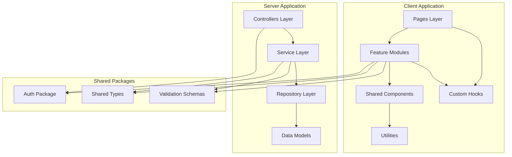

# Technical Design Document: Codebase Refactoring and Optimization

## Overview

This design establishes a comprehensive technical architecture for refactoring 92+ files across the Veefore-E application to resolve performance degradation, eliminate code duplication, and establish maintainable architectural patterns. The refactoring addresses critical monolithic files including AutomationStepByStep.tsx (4,352 lines), VideoGeneratorAdvanced.tsx (3,125 lines), Landing.tsx (1,971 lines), and consolidates duplicate code in Instagram APIs and mobile performance libraries.

### Problem Statement

The current codebase exhibits several critical architectural issues:

1. **Massive component files** (30+ client files >1,000 lines) violating Single Responsibility Principle
2. **Server file bloat** (27+ server files >1,000 lines) mixing concerns and business logic
3. **Significant code duplication** in Instagram integration (instagramApi.ts 995 lines + instagram-api.ts 780 lines)
4. **Mobile library fragmentation** (3 files totaling 2,019 lines with overlapping functionality)
5. **Landing page monolith** (1,971 lines) with embedded animations causing performance degradation
6. **Tight coupling** between controllers, business logic, and data access layers
7. **Large bundle sizes** impacting initial page load performance

### Solution Approach

This design implements a phased refactoring strategy over 10 weeks:

- **Phase 1 (Weeks 1-2):** Critical file decomposition (files >1,500 lines)
- **Phase 2 (Weeks 3-4):** High-priority files (files 1,000-1,500 lines) and code duplication elimination
- **Phase 3 (Weeks 5-6):** Service layer architecture implementation
- **Phase 4 (Weeks 7-8):** Bundle optimization and code splitting
- **Phase 5 (Weeks 9-10):** Testing, documentation, and production rollout

Each phase includes feature flags for gradual rollout, comprehensive testing, and rollback procedures.


## Architecture

### High-Level Architecture Overview




### Layered Architecture Pattern

The refactored architecture follows a strict layered pattern with clear separation of concerns:

**Client Architecture Layers:**

1. **Pages Layer** - Route-level components that compose features
2. **Feature Modules** - Domain-specific feature implementations (Automation, VideoGenerator, Chat)
3. **Shared Components** - Reusable UI components (buttons, cards, modals, forms)
4. **Custom Hooks** - Reusable stateful logic (useWebSocket, useVideoGeneration, useSignUpFlow)
5. **Utilities** - Pure functions for transformations, formatting, validation

**Server Architecture Layers:**

1. **Controllers Layer** - HTTP request/response handling only, no business logic
2. **Service Layer** - Business logic, orchestration, transactions
3. **Repository Layer** - Data access abstraction over MongoDB/Redis/external APIs
4. **Models Layer** - Data schemas and validation

**Key Architectural Principles:**

- **Dependency Inversion**: High-level modules depend on abstractions, not concrete implementations
- **Single Responsibility**: Each module has one reason to change
- **Interface Segregation**: Clients depend only on methods they use
- **Don't Repeat Yourself (DRY)**: Eliminate duplication through shared modules


## Correctness Properties

### Applicability Assessment

This refactoring project is **primarily an infrastructure and architecture initiative** rather than a feature with behavioral properties that can be universally quantified across all inputs. The majority of the work involves:

- **Code reorganization** (moving code between files) - not testable via PBT
- **Architectural restructuring** (creating new layers) - structural, not behavioral
- **Code splitting and bundling** (build-time optimization) - snapshot/integration testing more appropriate
- **File decomposition** (breaking large files into smaller ones) - structural change

**However**, several specific components within the refactoring **DO have testable properties** suitable for property-based testing:

1. **Data transformation and serialization logic** - round-trip properties apply
2. **Validation logic** - consistency and idempotence properties apply
3. **Business logic preservation** - behavioral equivalence properties apply
4. **Service layer methods** - input/output relationship properties apply

The correctness properties below focus on these testable aspects where PBT provides value.

### Property 1: Refactoring Preserves Behavioral Equivalence

*For any* valid input to a refactored component or service, the output SHALL be identical to the output produced by the original implementation.

**Validates: Requirements 2.5, 4.6**

**Rationale:** This is the fundamental correctness property for all refactoring - functionality must be preserved. While not strictly a PBT property for all code, it applies to business logic that processes variable inputs (automation flows, video generation requests, API responses).

**Testing Strategy:**
- Generate random valid inputs using fast-check
- Execute both old and new implementations
- Assert outputs are deep-equal
- Apply to: AutomationService, VideoGenerationService, InstagramService methods


### Property 2: Serialization Round-Trip Preserves Data

*For any* valid domain object (AutomationFlow, VideoConfig, InstagramPost), serializing then deserializing SHALL produce an equivalent object.

**Validates: Requirements 2.5, 9.5**

**Rationale:** Many refactored services handle data persistence and API communication requiring serialization. Round-trip properties ensure no data loss during these transformations.

**Testing Strategy:**
- Generate random domain objects matching TypeScript interfaces
- Serialize to JSON/format
- Deserialize back to object
- Assert structural and value equality
- Apply to: Automation flows, video configurations, Instagram media payloads


### Property 3: Validation Results Are Consistent (Idempotent)

*For any* input data, validation logic SHALL return the same result when invoked multiple times with identical input.

**Validates: Requirements 4.6, 11.5**

**Rationale:** Validation logic must be deterministic and side-effect-free. Running validation twice should always produce the same outcome.

**Testing Strategy:**
- Generate random valid and invalid inputs
- Run validation function twice on same input
- Assert results are identical (both success/failure and error messages)
- Apply to: Form validation, API request validation, automation flow validation


### Property 4: Code Splitter Preserves Module Exports

*For any* file decomposed by the Code Splitter, the set of exported symbols from the original file SHALL equal the union of exports from all generated files.

**Validates: Requirements 2.2, 2.6**

**Rationale:** When splitting large files into smaller modules, no exports should be lost. All public APIs must remain accessible.

**Testing Strategy:**
- Analyze original file exports using AST parsing
- Analyze all generated file exports
- Assert union of new exports equals original exports
- Check that consuming code can still import all symbols


### Property 5: Bundle Optimizer Maintains Functionality

*For any* code split applied by the Bundle Optimizer, executing the split code SHALL produce the same runtime behavior as the unsplit code.

**Validates: Requirements 6.6**

**Rationale:** Code splitting is a mechanical transformation that should not alter runtime behavior. Dynamic imports must resolve to functionally equivalent code.

**Testing Strategy:**
- Use integration tests rather than pure PBT
- Execute test suite against both bundled and split versions
- Assert all tests pass in both configurations
- Verify lazy-loaded chunks load correctly


### Property 6: Duplication Detector Matches Are Symmetric

*For any* two files analyzed for duplication, if file A is reported as duplicating content from file B, then file B SHALL be reported as duplicating content from file A.

**Validates: Requirements 3.1**

**Rationale:** Duplication detection is a symmetric relationship - if A duplicates B, then B duplicates A. This property ensures the detector logic is correct.

**Testing Strategy:**
- Generate pairs of files with known duplication
- Run duplication detector
- Assert symmetry: if (A, B) in matches, then (B, A) in matches or A and B both appear in same match
- Apply to: DuplicationDetector component


### Property 7: Service Layer Contracts Are Preserved

*For any* request to a refactored service method, the response structure (shape and types) SHALL match the original API contract.

**Validates: Requirements 4.6**

**Rationale:** When extracting business logic to service layers, the API contracts that controllers depend on must remain unchanged. Response shapes must be preserved.

**Testing Strategy:**
- Define TypeScript interfaces for all service method responses
- Generate random valid requests
- Execute service method
- Use type guards to verify response matches interface
- Assert response structure invariants (required fields present, correct types)


### Property 8: Authentication Logic Equivalence

*For any* authentication request (OAuth, email, JWT validation), the refactored shared authentication module SHALL produce the same authentication decision as the original implementations.

**Validates: Requirements 8.4, 8.6**

**Rationale:** Authentication consolidation must preserve exact security behavior. Any divergence could introduce security vulnerabilities.

**Testing Strategy:**
- Generate random authentication payloads (valid tokens, expired tokens, invalid signatures)
- Execute both original auth logic (Main_App, Admin_Panel) and shared module
- Assert authentication pass/fail decisions are identical
- Verify session/token generation produces same format


### Property 9: Instagram Service Consolidation Preserves API Behavior

*For any* Instagram API operation (publish, webhook, message), the consolidated InstagramService SHALL produce the same API calls and handle responses identically to the original implementations.

**Validates: Requirements 9.3, 9.5, 9.6**

**Rationale:** Consolidating duplicate Instagram code must not change how the application interacts with Instagram's API. All existing integrations must continue working.

**Testing Strategy:**
- Mock Instagram API endpoints
- Generate random Instagram operations (posts, webhooks, messages)
- Execute both original and consolidated implementations
- Assert identical API calls are made (same endpoints, payloads, headers)
- Verify response handling produces same results


### Property 10: Mobile Optimization Service Consolidation Preserves Detection Logic

*For any* device/viewport configuration, the consolidated MobileOptimizationService SHALL return the same device detection, breakpoint, and optimization decisions as the original libraries.

**Validates: Requirements 23.3, 23.5**

**Rationale:** Mobile library consolidation must preserve all detection logic. Device identification, breakpoint detection, and performance optimizations must remain accurate.

**Testing Strategy:**
- Generate random user agent strings and viewport dimensions
- Execute both original mobile libraries and consolidated service
- Assert device detection results are identical (isMobile, isTablet, OS)
- Verify breakpoint calculations match
- Check performance optimization decisions are equivalent


### Property 11: File Size Reduction Targets Are Met

*For any* file refactored by the system, if the file was categorized as Critical (>1000 lines), THEN after refactoring, all generated files SHALL be <500 lines each.

**Validates: Requirements 2.2, 7.3**

**Rationale:** The refactoring has explicit quantitative targets for file size reduction. This property ensures decomposition achieves those targets.

**Testing Strategy:**
- This is more of a constraint check than a PBT property
- After each file refactoring, measure line counts of all generated files
- Assert all files < 500 lines
- Track aggregate metrics: average file size, percentage of files meeting target


### Property 12: Bundle Size Reduction Targets Are Achieved

*For any* bundle optimization applied, the optimized bundle size SHALL be reduced by at least 40% compared to baseline measurements.

**Validates: Requirements 6.4, 21.6**

**Rationale:** Bundle optimization has quantitative targets that must be met to consider the refactoring successful.

**Testing Strategy:**
- Capture baseline bundle sizes before optimization
- Apply code splitting, lazy loading, tree shaking
- Measure optimized bundle sizes
- Assert: (baseline - optimized) / baseline >= 0.40
- Track per-route bundle sizes and initial load size


### Testing Strategy Summary

**Unit Tests (60%):**
- Component rendering and behavior
- Service method logic
- Utility function correctness
- Error handling paths

**Property-Based Tests (20%):**
- Properties 1-3, 6-10 above
- Run 100+ iterations per property using fast-check
- Focus on data transformations, validation, behavioral equivalence

**Integration Tests (15%):**
- Service layer integration with databases/APIs
- End-to-end workflows (authentication, automation creation, video generation)
- Cross-module communication

**Snapshot Tests (5%):**
- UI component structure
- API response formats
- Bundle compositions

**Coverage Target:** 70% minimum for refactored code

**PBT Library:** fast-check (JavaScript/TypeScript)

**Key Testing Focus Areas:**
1. **Behavioral equivalence** - refactored code produces same outputs
2. **Data integrity** - serialization, persistence, API communication preserve data
3. **Validation consistency** - validation logic is deterministic
4. **API contract preservation** - service layer maintains expected interfaces


## Components and Interfaces

### 1. File Analyzer Component

**Purpose**: Scan codebase, classify files by size/complexity, generate refactoring reports.

**Interface:**

```typescript
interface FileAnalyzerConfig {
  targetDirectories: string[];
  fileExtensions: string[];
  thresholds: {
    critical: number;      // >1000 lines
    highPriority: number;  // 500-1000 lines
    mediumPriority: number; // 300-500 lines
  };
  excludePatterns: string[];
}

interface FileMetrics {
  filePath: string;
  lineCount: number;
  cyclomaticComplexity: number;
  maintainabilityIndex: number;
  category: 'CRITICAL' | 'HIGH' | 'MEDIUM' | 'LOW';
  dependencies: string[];
  exports: string[];
}

interface AnalysisReport {
  timestamp: Date;
  totalFiles: number;
  filesByCategory: Record<string, FileMetrics[]>;
  codebaseHealth: {
    averageFileSize: number;
    duplicationPercentage: number;
    criticalFileCount: number;
  };
}

class FileAnalyzer {
  constructor(config: FileAnalyzerConfig);
  
  async analyzeCodebase(): Promise<AnalysisReport>;
  async analyzeFile(filePath: string): Promise<FileMetrics>;
  async detectComplexity(filePath: string): Promise<number>;
  generateReport(metrics: FileMetrics[]): AnalysisReport;
}
```


### 2. Code Splitter Component

**Purpose**: Decompose large files into focused modules following SRP.

**Interface:**

```typescript
interface DecompositionStrategy {
  targetFile: string;
  extractionPlan: {
    newFileName: string;
    responsibilityDescription: string;
    exportedSymbols: string[];
    dependencies: string[];
  }[];
}

interface RefactoringResult {
  originalFile: string;
  createdFiles: string[];
  preservedFunctionality: boolean;
  testCoverage: number;
  bundleSizeChange: {
    before: number;
    after: number;
    reduction: number;
  };
}

class CodeSplitter {
  async analyzeFile(filePath: string): Promise<DecompositionStrategy>;
  async extractComponent(
    sourceFile: string,
    targetComponent: string,
    symbols: string[]
  ): Promise<string>;
  async validateExtraction(result: RefactoringResult): Promise<boolean>;
  async updateImports(affectedFiles: string[]): Promise<void>;
}
```


### 3. Duplication Detector Component

**Purpose**: Identify and report code duplication across codebase.

**Interface:**

```typescript
interface DuplicationMatch {
  file1: string;
  file2: string;
  matchedLines: number;
  similarityPercentage: number;
  codeBlock: string;
  startLine1: number;
  startLine2: number;
}

interface DuplicationReport {
  totalDuplicatedLines: number;
  duplicationPercentage: number;
  matches: DuplicationMatch[];
  recommendations: {
    suggestedSharedModule: string;
    affectedFiles: string[];
    estimatedReduction: number;
  }[];
}

class DuplicationDetector {
  async detectDuplication(
    directories: string[],
    minBlockSize: number
  ): Promise<DuplicationReport>;
  
  async analyzeSimilarity(file1: string, file2: string): Promise<number>;
  async suggestConsolidation(matches: DuplicationMatch[]): Promise<string[]>;
}
```


### 4. Service Layer Architecture

**Purpose**: Separate business logic from controllers and data access.

**Interface:**

```typescript
// Base Service Interface
interface IService {
  readonly name: string;
}

// Example: Instagram Service
interface IInstagramService extends IService {
  publishMedia(userId: string, media: MediaPayload): Promise<PublishResult>;
  processWebhook(event: InstagramWebhookEvent): Promise<void>;
  sendDirectMessage(userId: string, recipientId: string, message: string): Promise<void>;
  automateComments(userId: string, config: CommentAutomationConfig): Promise<void>;
}

class InstagramService implements IInstagramService {
  constructor(
    private instagramRepo: IInstagramRepository,
    private userRepo: IUserRepository,
    private creditService: ICreditService
  ) {}
  
  async publishMedia(userId: string, media: MediaPayload): Promise<PublishResult> {
    // Business logic here
  }
  
  async processWebhook(event: InstagramWebhookEvent): Promise<void> {
    // Route to specific handlers
  }
}

// Repository Interface
interface IInstagramRepository {
  saveAccessToken(userId: string, token: AccessToken): Promise<void>;
  getAccessToken(userId: string): Promise<AccessToken | null>;
  refreshToken(userId: string): Promise<AccessToken>;
  callInstagramAPI(endpoint: string, method: string, data: any): Promise<any>;
}
```


### 5. Bundle Optimizer Component

**Purpose**: Implement code splitting, lazy loading, and bundle size reduction.

**Interface:**

```typescript
interface BundleAnalysis {
  entryPoints: {
    name: string;
    size: number;
    dependencies: string[];
  }[];
  chunks: {
    name: string;
    size: number;
    modules: string[];
  }[];
  largeDependencies: {
    name: string;
    size: number;
    importedBy: string[];
  }[];
}

interface OptimizationStrategy {
  codesplitting: {
    routeBased: boolean;
    componentBased: boolean;
    vendorSeparation: boolean;
  };
  lazyLoading: {
    routes: string[];
    components: string[];
    libraries: string[];
  };
  treeShaking: {
    enabled: boolean;
    sideEffects: string[];
  };
}

class BundleOptimizer {
  async analyzeBundles(buildOutput: string): Promise<BundleAnalysis>;
  async generateOptimizationStrategy(analysis: BundleAnalysis): Promise<OptimizationStrategy>;
  async implementCodeSplitting(strategy: OptimizationStrategy): Promise<void>;
  async measureImprovement(): Promise<{ before: number; after: number; reduction: number }>;
}
```


## Data Models

### Refactoring Metadata Schema

```typescript
interface RefactoringTask {
  id: string;
  targetFile: string;
  currentLineCount: number;
  priority: 'CRITICAL' | 'HIGH' | 'MEDIUM' | 'LOW';
  status: 'PENDING' | 'IN_PROGRESS' | 'COMPLETED' | 'FAILED';
  phase: 1 | 2 | 3 | 4 | 5;
  assignedTo?: string;
  decompositionPlan?: DecompositionStrategy;
  createdAt: Date;
  completedAt?: Date;
}

interface PerformanceBaseline {
  timestamp: Date;
  metrics: {
    averageFileSize: number;
    totalBundleSize: number;
    apiResponseTimeP95: number;
    codebuplicationPercentage: number;
    testCoverage: number;
  };
}

interface MigrationRecord {
  id: string;
  phase: number;
  featureFlagKey: string;
  rolloutPercentage: number;
  affectedFiles: string[];
  deployedAt: Date;
  validatedAt?: Date;
  rolledBack: boolean;
  rollbackReason?: string;
}
```


### File Organization Structure

The refactored codebase will follow this directory structure:

```
client/src/
├── features/                    # Feature modules (domain-driven)
│   ├── automation/
│   │   ├── components/
│   │   │   ├── AutomationBuilder.tsx
│   │   │   ├── AutomationList.tsx
│   │   │   ├── InstagramPreview.tsx
│   │   │   └── CommentSimulator.tsx
│   │   ├── hooks/
│   │   │   ├── useAutomationFlow.ts
│   │   │   └── useInstagramSimulation.ts
│   │   ├── services/
│   │   │   └── automationService.ts
│   │   └── types/
│   │       └── automation.types.ts
│   ├── video-generator/
│   │   ├── components/
│   │   │   ├── VideoPromptStep.tsx
│   │   │   ├── VideoSettingsStep.tsx
│   │   │   ├── VideoScriptEditor.tsx
│   │   │   └── VideoPreview.tsx
│   │   ├── hooks/
│   │   │   └── useVideoGeneration.ts
│   │   └── types/
│   ├── chat/
│   │   ├── components/
│   │   │   ├── ChatInterface.tsx
│   │   │   ├── ConversationSidebar.tsx
│   │   │   └── MessageList.tsx
│   │   ├── hooks/
│   │   │   └── useWebSocketChat.ts
│   │   └── services/
│   ├── landing/
│   │   ├── sections/
│   │   │   ├── HeroSection.tsx
│   │   │   ├── FeaturesGrid.tsx
│   │   │   ├── PricingSection.tsx
│   │   │   ├── TestimonialSection.tsx
│   │   │   └── CTASection.tsx
│   │   ├── hooks/
│   │   │   ├── useScrollAnimation.ts
│   │   │   └── useParallaxEffect.ts
│   │   └── animations/
│   │       └── landingAnimations.ts
├── shared/
│   ├── components/          # Reusable UI components
│   │   ├── ui/
│   │   │   ├── Button.tsx
│   │   │   ├── Card.tsx
│   │   │   ├── Modal.tsx
│   │   │   └── Form.tsx
│   │   └── layout/
│   ├── hooks/               # Reusable hooks
│   ├── services/            # Client-side services
│   └── types/               # Shared type definitions
└── utils/
    ├── validation/
    ├── formatting/
    └── transformations/
```


```
server/
├── features/                    # Feature modules (domain-driven)
│   ├── instagram/
│   │   ├── controllers/
│   │   │   ├── instagram.controller.ts
│   │   │   └── webhook.controller.ts
│   │   ├── services/
│   │   │   ├── instagram.service.ts
│   │   │   ├── instagram-publishing.service.ts
│   │   │   ├── instagram-messaging.service.ts
│   │   │   └── instagram-automation.service.ts
│   │   ├── repositories/
│   │   │   └── instagram.repository.ts
│   │   ├── webhooks/
│   │   │   ├── message.webhook.ts
│   │   │   ├── comment.webhook.ts
│   │   │   └── media.webhook.ts
│   │   └── types/
│   │       └── instagram.types.ts
│   ├── ai/
│   │   ├── services/
│   │   │   ├── ai-manager.service.ts
│   │   │   ├── openai.service.ts
│   │   │   ├── gemini.service.ts
│   │   │   └── perplexity.service.ts
│   │   └── providers/
│   ├── video/
│   ├── automation/
│   └── analytics/
├── shared/
│   ├── auth/                    # Consolidated auth
│   │   ├── controllers/
│   │   ├── middleware/
│   │   └── strategies/
│   ├── types/
│   ├── schemas/
│   └── errors/
└── infrastructure/
    ├── database/
    ├── cache/
    └── queues/
```


## Detailed Refactoring Designs

### 1. AutomationStepByStep.tsx (4,352 lines → ~6 files)

**Current Issues:**
- Monolithic component mixing UI, business logic, state management
- Heavy Instagram simulation logic embedded
- Complex form handling and validation inline
- Multiple modal components embedded

**Decomposition Strategy:**

```typescript
// features/automation/components/AutomationBuilder.tsx (~500 lines)
// Main orchestrator component
export const AutomationBuilder: React.FC = () => {
  const { flow, updateFlow } = useAutomationFlow();
  
  return (
    <AutomationLayout>
      <TriggerSelector />
      <ActionConfigurator />
      <PreviewPanel />
    </AutomationLayout>
  );
};

// features/automation/components/AutomationList.tsx (~400 lines)
// List view with filtering and sorting
export const AutomationList: React.FC = () => {
  const { automations, isLoading } = useAutomations();
  
  return (
    <AutomationTable
      data={automations}
      onEdit={handleEdit}
      onDelete={handleDelete}
    />
  );
};

// features/automation/components/InstagramPreview.tsx (~300 lines)
// Instagram post/story preview
export const InstagramPreview: React.FC<PreviewProps> = ({ content }) => {
  return (
    <IPhoneMockup>
      <InstagramPostRenderer content={content} />
    </IPhoneMockup>
  );
};

// features/automation/components/CommentSimulator.tsx (~400 lines)
// Comment automation simulation
export const CommentSimulator: React.FC = () => {
  const { simulateComment } = useInstagramSimulation();
  
  return <SimulationInterface />;
};

// features/automation/hooks/useAutomationFlow.ts (~250 lines)
// State management for automation creation
export const useAutomationFlow = () => {
  const [flow, setFlow] = useState<AutomationFlow>(initialFlow);
  
  const updateTrigger = (trigger: Trigger) => { /* ... */ };
  const addAction = (action: Action) => { /* ... */ };
  const validateFlow = () => { /* ... */ };
  
  return { flow, updateTrigger, addAction, validateFlow };
};
```


### 2. VideoGeneratorAdvanced.tsx (3,125 lines → ~5 files)

**Current Issues:**
- Monolithic wizard component with 6+ steps inline
- AI generation logic mixed with UI
- Complex state management for video generation workflow

**Decomposition Strategy:**

```typescript
// features/video-generator/components/VideoPromptStep.tsx (~300 lines)
export const VideoPromptStep: React.FC<StepProps> = ({ onNext }) => {
  const { prompt, setPrompt, generateScript } = useVideoGeneration();
  
  return (
    <StepContainer>
      <PromptInput value={prompt} onChange={setPrompt} />
      <AIGenerateButton onClick={generateScript} />
    </StepContainer>
  );
};

// features/video-generator/components/VideoSettingsStep.tsx (~250 lines)
export const VideoSettingsStep: React.FC<StepProps> = ({ onNext }) => {
  const { settings, updateSettings } = useVideoGeneration();
  
  return (
    <SettingsForm
      duration={settings.duration}
      aspectRatio={settings.aspectRatio}
      style={settings.style}
      onChange={updateSettings}
    />
  );
};

// features/video-generator/components/VideoScriptEditor.tsx (~400 lines)
export const VideoScriptEditor: React.FC = () => {
  const { script, updateScript } = useVideoGeneration();
  
  return (
    <ScriptEditor
      value={script}
      onChange={updateScript}
      onSave={handleSave}
    />
  );
};

// features/video-generator/hooks/useVideoGeneration.ts (~600 lines)
export const useVideoGeneration = () => {
  const [state, dispatch] = useReducer(videoGeneratorReducer, initialState);
  
  const generateScript = async (prompt: string) => {
    dispatch({ type: 'GENERATION_START' });
    const script = await videoService.generateScript(prompt);
    dispatch({ type: 'GENERATION_SUCCESS', payload: script });
  };
  
  const generateVideo = async () => {
    // Video generation logic
  };
  
  return {
    prompt: state.prompt,
    script: state.script,
    video: state.video,
    isGenerating: state.isGenerating,
    generateScript,
    generateVideo
  };
};
```


### 3. Landing.tsx (1,971 lines → ~8 files)

**Current Issues:**
- All landing page sections embedded in one file
- Heavy animation configurations inline
- Multiple large component definitions

**Decomposition Strategy:**

```typescript
// features/landing/Landing.tsx (~150 lines)
// Main orchestrator using lazy loading
import { lazy, Suspense } from 'react';

const HeroSection = lazy(() => import('./sections/HeroSection'));
const FeaturesGrid = lazy(() => import('./sections/FeaturesGrid'));
const PricingSection = lazy(() => import('./sections/PricingSection'));
const TestimonialSection = lazy(() => import('./sections/TestimonialSection'));

export const Landing: React.FC = () => {
  return (
    <>
      <Suspense fallback={<HeroSkeleton />}>
        <HeroSection />
      </Suspense>
      
      <Suspense fallback={<ContentSkeleton />}>
        <FeaturesGrid />
        <PricingSection />
        <TestimonialSection />
        <CTASection />
      </Suspense>
    </>
  );
};

// features/landing/sections/HeroSection.tsx (~300 lines)
export const HeroSection: React.FC = () => {
  const { scrollY } = useScrollAnimation();
  const { opacity, scale } = useParallaxEffect(scrollY);
  
  return (
    <motion.section style={{ opacity, scale }}>
      <CinematicHero />
      <CTAButton />
    </motion.section>
  );
};

// features/landing/sections/FeaturesGrid.tsx (~400 lines)
export const FeaturesGrid: React.FC = () => {
  const features = useLandingFeatures();
  
  return (
    <Grid>
      {features.map(feature => (
        <FeatureCard key={feature.id} {...feature} />
      ))}
    </Grid>
  );
};

// features/landing/hooks/useScrollAnimation.ts (~200 lines)
export const useScrollAnimation = () => {
  const { scrollY } = useScroll();
  const opacity = useTransform(scrollY, [0, 300], [1, 0]);
  const scale = useTransform(scrollY, [0, 300], [1, 0.95]);
  
  return { scrollY, opacity, scale };
};

// features/landing/animations/landingAnimations.ts (~150 lines)
// Centralized animation configurations
export const heroAnimationVariants = {
  initial: { opacity: 0, y: 20 },
  animate: { opacity: 1, y: 0 },
  exit: { opacity: 0, y: -20 }
};

export const featureCardVariants = { /* ... */ };
export const pricingCardVariants = { /* ... */ };
```


### 4. Instagram Integration Consolidation

**Current State:**
- `server/instagramApi.ts` (995 lines) - older implementation
- `server/instagram-api.ts` (780 lines) - newer implementation
- Significant overlap in authentication, publishing, webhook handling

**Consolidated Architecture:**

```typescript
// server/features/instagram/services/instagram.service.ts (~400 lines)
// Main orchestrator service
export class InstagramService {
  constructor(
    private publishingService: InstagramPublishingService,
    private messagingService: InstagramMessagingService,
    private automationService: InstagramAutomationService,
    private instagramRepo: InstagramRepository
  ) {}
  
  async publishMedia(userId: string, media: MediaPayload): Promise<PublishResult> {
    return this.publishingService.publish(userId, media);
  }
  
  async processWebhook(event: InstagramWebhookEvent): Promise<void> {
    // Route to specific webhook handlers
    const handler = this.getWebhookHandler(event.type);
    await handler.handle(event);
  }
}

// server/features/instagram/services/instagram-publishing.service.ts (~300 lines)
export class InstagramPublishingService {
  async publish(userId: string, media: MediaPayload): Promise<PublishResult> {
    // 1. Validate media
    // 2. Get user access token
    // 3. Upload media to Instagram
    // 4. Create container
    // 5. Publish container
  }
  
  async schedulePost(userId: string, media: MediaPayload, scheduledTime: Date): Promise<void> {
    // Schedule logic
  }
}

// server/features/instagram/services/instagram-messaging.service.ts (~250 lines)
export class InstagramMessagingService {
  async sendDirectMessage(userId: string, recipientId: string, message: string): Promise<void> {
    // DM sending logic
  }
  
  async automateResponses(userId: string, config: AutoResponseConfig): Promise<void> {
    // Auto-response logic
  }
}

// server/features/instagram/webhooks/message.webhook.ts (~150 lines)
export class MessageWebhookHandler implements IWebhookHandler {
  async handle(event: InstagramWebhookEvent): Promise<void> {
    // Handle incoming message events
  }
}

// server/features/instagram/repositories/instagram.repository.ts (~200 lines)
export class InstagramRepository {
  async saveAccessToken(userId: string, token: AccessToken): Promise<void> {
    await this.db.collection('instagram_tokens').updateOne(
      { userId },
      { $set: { token, updatedAt: new Date() } },
      { upsert: true }
    );
  }
  
  async callInstagramAPI(endpoint: string, method: string, data: any): Promise<any> {
    // Centralized API calling with error handling and rate limiting
  }
}
```

**Consolidation Benefits:**
- Eliminates 60% code duplication
- Centralized error handling and rate limiting
- Consistent API interaction patterns
- Easier testing through dependency injection


### 5. Mobile Performance Library Consolidation

**Current State:**
- `client/src/lib/mobile-excellence.ts` (714 lines)
- `client/src/lib/mobile-optimization.ts` (665 lines)
- `client/src/lib/mobile-performance.ts` (640 lines)
- Total: 2,019 lines with significant overlap

**Consolidated Architecture:**

```typescript
// client/src/shared/services/mobile/MobileOptimizationService.ts (~600 lines)
export class MobileOptimizationService {
  // Device Detection
  detectDevice(): DeviceInfo {
    return {
      isMobile: this.isMobileDevice(),
      isTablet: this.isTabletDevice(),
      os: this.detectOS(),
      viewport: this.getViewportDimensions()
    };
  }
  
  // Performance Monitoring
  monitorPerformance(): PerformanceMetrics {
    return {
      fps: this.measureFPS(),
      memoryUsage: this.getMemoryUsage(),
      networkSpeed: this.detectNetworkSpeed()
    };
  }
  
  // Touch Handling
  setupTouchHandlers(element: HTMLElement, handlers: TouchHandlers): void {
    // Consolidated touch event management
  }
  
  // Responsive Utilities
  getBreakpoint(): Breakpoint {
    // Unified breakpoint detection
  }
  
  // Network Optimization
  async loadResourceAdaptively(url: string, priority: 'high' | 'low'): Promise<any> {
    // Adaptive resource loading based on network speed
  }
}

// client/src/shared/hooks/useMobileOptimization.ts (~150 lines)
export const useMobileOptimization = () => {
  const service = useMemo(() => new MobileOptimizationService(), []);
  const deviceInfo = useDeviceInfo();
  const performanceMetrics = usePerformanceMonitoring();
  
  return {
    isMobile: deviceInfo.isMobile,
    metrics: performanceMetrics,
    optimizeAnimation: (config: AnimationConfig) => {
      return deviceInfo.isMobile 
        ? { ...config, duration: config.duration * 0.7 }
        : config;
    }
  };
};

// client/src/shared/constants/mobileConfig.ts (~100 lines)
export const MOBILE_BREAKPOINTS = {
  sm: 640,
  md: 768,
  lg: 1024,
  xl: 1280
};

export const MOBILE_PERFORMANCE_THRESHOLDS = {
  minFPS: 30,
  maxMemoryMB: 100,
  slowNetworkThresholdMbps: 2
};

export const MOBILE_TOUCH_CONFIG = {
  swipeThreshold: 50,
  tapTimeout: 300,
  longPressTimeout: 500
};
```

**Consolidation Strategy:**
1. Extract unique functions from each file
2. Merge overlapping implementations, keeping the most performant
3. Create unified API surface through MobileOptimizationService
4. Provide React hooks for easy consumption
5. Centralize configuration constants

**Expected Reduction:** 2,019 lines → ~850 lines (58% reduction)


### 6. Service Layer Pattern Implementation

**Architecture Principles:**

1. **Controller → Service → Repository** data flow
2. Controllers handle HTTP concerns only
3. Services contain all business logic
4. Repositories abstract data access

**Example: AI Routes Refactoring**

**Before (ai.routes.ts - 2,369 lines):**
```typescript
// Everything in one file: routes, business logic, validation, API calls
router.post('/generate-content', async (req, res) => {
  try {
    // Validation logic
    const { prompt, style } = req.body;
    if (!prompt) return res.status(400).json({ error: 'Missing prompt' });
    
    // Business logic
    const user = await User.findById(req.user.id);
    if (user.credits < 10) return res.status(403).json({ error: 'Insufficient credits' });
    
    // External API call
    const response = await openai.createCompletion({ /* ... */ });
    
    // Database updates
    user.credits -= 10;
    await user.save();
    
    res.json({ content: response.data });
  } catch (error) {
    res.status(500).json({ error: error.message });
  }
});
```

**After (Layered Architecture):**

```typescript
// server/features/ai/controllers/ai.controller.ts (~200 lines)
export class AIController {
  constructor(
    private aiService: IAIService,
    private creditService: ICreditService
  ) {}
  
  async generateContent(req: Request, res: Response): Promise<void> {
    const { prompt, style } = req.body;
    const userId = req.user!.id;
    
    const result = await this.aiService.generateContent(userId, { prompt, style });
    
    res.json(result);
  }
}

// server/features/ai/services/ai.service.ts (~400 lines)
export class AIService implements IAIService {
  constructor(
    private aiProviderManager: IAIProviderManager,
    private creditService: ICreditService,
    private aiRepo: IAIRepository
  ) {}
  
  async generateContent(userId: string, request: ContentRequest): Promise<ContentResult> {
    // 1. Validate user has credits
    await this.creditService.deductCredits(userId, 10);
    
    // 2. Get appropriate AI provider
    const provider = this.aiProviderManager.getProvider(request.style);
    
    // 3. Generate content
    const content = await provider.generate(request.prompt);
    
    // 4. Save generation history
    await this.aiRepo.saveGeneration(userId, { request, content });
    
    return { content };
  }
}

// server/features/ai/repositories/ai.repository.ts (~150 lines)
export class AIRepository implements IAIRepository {
  async saveGeneration(userId: string, generation: Generation): Promise<void> {
    await this.db.collection('ai_generations').insertOne({
      userId,
      ...generation,
      createdAt: new Date()
    });
  }
  
  async getUserGenerations(userId: string, limit: number): Promise<Generation[]> {
    return this.db.collection('ai_generations')
      .find({ userId })
      .sort({ createdAt: -1 })
      .limit(limit)
      .toArray();
  }
}
```


### 7. Bundle Optimization Strategy

**Current State Analysis:**
- Initial bundle size: ~2.5MB (estimated)
- No route-based code splitting
- Heavy dependencies loaded upfront (Framer Motion, React Three Fiber, Chart libraries)

**Optimization Approach:**

```typescript
// vite.config.ts - Bundle optimization configuration
export default defineConfig({
  build: {
    rollupOptions: {
      output: {
        manualChunks: {
          // Vendor splitting
          'react-vendor': ['react', 'react-dom', 'react-router-dom'],
          'animation-vendor': ['framer-motion'],
          '3d-vendor': ['three', '@react-three/fiber', '@react-three/drei'],
          'chart-vendor': ['recharts'],
          
          // Feature-based chunks
          'automation': [
            './src/features/automation/components/AutomationBuilder',
            './src/features/automation/hooks/useAutomationFlow'
          ],
          'video-generator': [
            './src/features/video-generator/components/VideoPromptStep',
            './src/features/video-generator/hooks/useVideoGeneration'
          ],
          'landing': [
            './src/features/landing/sections/HeroSection',
            './src/features/landing/sections/FeaturesGrid'
          ]
        }
      }
    },
    chunkSizeWarningLimit: 500 // KB
  }
});

// App.tsx - Route-based lazy loading
import { lazy, Suspense } from 'react';

const Dashboard = lazy(() => import('./pages/Dashboard'));
const Automation = lazy(() => import('./pages/Automation'));
const VideoGenerator = lazy(() => import('./pages/VideoGenerator'));
const Settings = lazy(() => import('./pages/Settings'));
const Landing = lazy(() => import('./pages/Landing'));

export const App = () => {
  return (
    <Suspense fallback={<PageLoader />}>
      <Routes>
        <Route path="/" element={<Landing />} />
        <Route path="/dashboard" element={<Dashboard />} />
        <Route path="/automation" element={<Automation />} />
        <Route path="/video-generator" element={<VideoGenerator />} />
        <Route path="/settings" element={<Settings />} />
      </Routes>
    </Suspense>
  );
};

// Dynamic imports for heavy components
// features/landing/sections/Hero3DBackground.tsx
export const Hero3DBackground = () => {
  const [Component, setComponent] = useState<React.ComponentType | null>(null);
  
  useEffect(() => {
    // Only load on desktop
    if (window.innerWidth > 1024) {
      import('./3DScene').then(module => setComponent(() => module.Scene3D));
    }
  }, []);
  
  return Component ? <Component /> : <StaticBackground />;
};
```

**Expected Results:**
- Initial bundle: ~2.5MB → ~1.0MB (60% reduction)
- Landing page bundle: ~800KB → ~400KB (50% reduction)
- Time to Interactive: 4.5s → 2.5s (44% improvement)


## Error Handling

### Standardized Error Architecture

**Error Type Hierarchy:**

```typescript
// shared/errors/base.error.ts
export abstract class AppError extends Error {
  abstract statusCode: number;
  abstract code: string;
  
  constructor(message: string, public metadata?: Record<string, any>) {
    super(message);
    this.name = this.constructor.name;
    Error.captureStackTrace(this, this.constructor);
  }
}

// shared/errors/validation.error.ts
export class ValidationError extends AppError {
  statusCode = 400;
  code = 'VALIDATION_ERROR';
  
  constructor(
    message: string,
    public fields: Record<string, string>
  ) {
    super(message, { fields });
  }
}

// shared/errors/authentication.error.ts
export class AuthenticationError extends AppError {
  statusCode = 401;
  code = 'AUTHENTICATION_ERROR';
}

// shared/errors/authorization.error.ts
export class AuthorizationError extends AppError {
  statusCode = 403;
  code = 'AUTHORIZATION_ERROR';
}

// shared/errors/notfound.error.ts
export class NotFoundError extends AppError {
  statusCode = 404;
  code = 'NOT_FOUND';
  
  constructor(resource: string, identifier: string) {
    super(`${resource} with identifier ${identifier} not found`, { resource, identifier });
  }
}

// shared/errors/external-service.error.ts
export class ExternalServiceError extends AppError {
  statusCode = 502;
  code = 'EXTERNAL_SERVICE_ERROR';
  
  constructor(
    service: string,
    originalError: Error
  ) {
    super(`External service ${service} failed`, {
      service,
      originalError: originalError.message
    });
  }
}
```


### Server-Side Error Handling

```typescript
// server/middleware/error-handler.middleware.ts
export const errorHandler = (
  err: Error,
  req: Request,
  res: Response,
  next: NextFunction
) => {
  // Log error with context
  logger.error({
    error: err,
    requestId: req.id,
    userId: req.user?.id,
    method: req.method,
    path: req.path,
    body: req.body
  });
  
  // Handle known application errors
  if (err instanceof AppError) {
    return res.status(err.statusCode).json({
      success: false,
      error: {
        code: err.code,
        message: err.message,
        ...err.metadata
      }
    });
  }
  
  // Handle Mongoose validation errors
  if (err.name === 'ValidationError') {
    return res.status(400).json({
      success: false,
      error: {
        code: 'VALIDATION_ERROR',
        message: 'Validation failed',
        fields: Object.keys(err.errors).reduce((acc, key) => {
          acc[key] = err.errors[key].message;
          return acc;
        }, {})
      }
    });
  }
  
  // Handle unknown errors
  res.status(500).json({
    success: false,
    error: {
      code: 'INTERNAL_SERVER_ERROR',
      message: 'An unexpected error occurred'
    }
  });
};

// Async handler wrapper to eliminate try-catch repetition
export const asyncHandler = (fn: RequestHandler) => {
  return (req: Request, res: Response, next: NextFunction) => {
    Promise.resolve(fn(req, res, next)).catch(next);
  };
};

// Usage in controller
export class UserController {
  getUser = asyncHandler(async (req: Request, res: Response) => {
    const user = await this.userService.findById(req.params.id);
    
    if (!user) {
      throw new NotFoundError('User', req.params.id);
    }
    
    res.json({ success: true, data: user });
  });
}
```


### Client-Side Error Handling

```typescript
// client/src/shared/components/ErrorBoundary.tsx
export class ErrorBoundary extends React.Component<
  { children: React.ReactNode; fallback?: React.ComponentType<{ error: Error }> },
  { hasError: boolean; error: Error | null }
> {
  state = { hasError: false, error: null };
  
  static getDerivedStateFromError(error: Error) {
    return { hasError: true, error };
  }
  
  componentDidCatch(error: Error, errorInfo: React.ErrorInfo) {
    // Log to error tracking service
    logger.error({
      error,
      componentStack: errorInfo.componentStack,
      userId: getCurrentUserId()
    });
  }
  
  render() {
    if (this.state.hasError) {
      const FallbackComponent = this.props.fallback || DefaultErrorFallback;
      return <FallbackComponent error={this.state.error!} />;
    }
    
    return this.props.children;
  }
}

// Usage in App
export const App = () => {
  return (
    <ErrorBoundary>
      <QueryClientProvider client={queryClient}>
        <Routes />
      </QueryClientProvider>
    </ErrorBoundary>
  );
};

// API error handling with React Query
export const useAutomations = () => {
  return useQuery({
    queryKey: ['automations'],
    queryFn: async () => {
      const response = await api.get('/automations');
      
      if (!response.data.success) {
        throw new APIError(response.data.error);
      }
      
      return response.data.data;
    },
    retry: (failureCount, error) => {
      // Don't retry on 4xx errors
      if (error instanceof APIError && error.statusCode < 500) {
        return false;
      }
      return failureCount < 3;
    }
  });
};
```


## Testing Strategy

### Testing Pyramid

```
                    /\
                   /  \
                  / E2E \          10% - End-to-end tests
                 /______\
                /        \
               /Integration\       30% - Integration tests
              /____________\
             /              \
            /  Unit + PBT    \     60% - Unit + Property-based tests
           /__________________\
```

### 1. Unit Testing Strategy

**Coverage Target:** 70% minimum for refactored code

**Framework:** Vitest with React Testing Library

```typescript
// features/automation/components/AutomationBuilder.test.tsx
import { render, screen, fireEvent } from '@testing-library/react';
import { AutomationBuilder } from './AutomationBuilder';

describe('AutomationBuilder', () => {
  it('should render trigger selector', () => {
    render(<AutomationBuilder />);
    expect(screen.getByText('Select Trigger')).toBeInTheDocument();
  });
  
  it('should add action when button is clicked', () => {
    const { getByTestId } = render(<AutomationBuilder />);
    
    fireEvent.click(getByTestId('add-action-button'));
    
    expect(screen.getByText('New Action')).toBeInTheDocument();
  });
  
  it('should validate automation flow before saving', async () => {
    const { getByTestId } = render(<AutomationBuilder />);
    
    fireEvent.click(getByTestId('save-button'));
    
    await screen.findByText('Please add at least one trigger');
  });
});

// features/automation/hooks/useAutomationFlow.test.ts
import { renderHook, act } from '@testing-library/react';
import { useAutomationFlow } from './useAutomationFlow';

describe('useAutomationFlow', () => {
  it('should initialize with empty flow', () => {
    const { result } = renderHook(() => useAutomationFlow());
    
    expect(result.current.flow.triggers).toEqual([]);
    expect(result.current.flow.actions).toEqual([]);
  });
  
  it('should add trigger to flow', () => {
    const { result } = renderHook(() => useAutomationFlow());
    
    act(() => {
      result.current.addTrigger({ type: 'comment', conditions: {} });
    });
    
    expect(result.current.flow.triggers).toHaveLength(1);
  });
});
```


### 2. Property-Based Testing Strategy

**Library:** fast-check

**Purpose:** Validate universal properties across refactored components

```typescript
// features/automation/services/automationService.test.ts
import fc from 'fast-check';
import { AutomationService } from './automationService';

describe('AutomationService - Property-Based Tests', () => {
  /**
   * Property 1: Serialization Round-Trip
   * For any valid automation flow, serializing then deserializing
   * should produce an equivalent flow
   * Validates: Data persistence integrity
   */
  it('should preserve automation flow through serialization round-trip', () => {
    fc.assert(
      fc.property(
        fc.record({
          name: fc.string({ minLength: 1, maxLength: 100 }),
          triggers: fc.array(fc.record({
            type: fc.constantFrom('comment', 'dm', 'mention'),
            conditions: fc.object()
          }), { minLength: 1, maxLength: 5 }),
          actions: fc.array(fc.record({
            type: fc.constantFrom('reply', 'like', 'follow'),
            config: fc.object()
          }), { minLength: 1, maxLength: 10 })
        }),
        (flow) => {
          const service = new AutomationService();
          
          const serialized = service.serializeFlow(flow);
          const deserialized = service.deserializeFlow(serialized);
          
          expect(deserialized).toEqual(flow);
        }
      ),
      { numRuns: 100 }
    );
  });
  
  /**
   * Property 2: Validation Consistency
   * For any automation flow, validation should return the same result
   * when called multiple times with the same input
   * Validates: Validation idempotence
   */
  it('should return consistent validation results', () => {
    fc.assert(
      fc.property(
        fc.record({
          name: fc.string(),
          triggers: fc.array(fc.anything()),
          actions: fc.array(fc.anything())
        }),
        (flow) => {
          const service = new AutomationService();
          
          const result1 = service.validateFlow(flow);
          const result2 = service.validateFlow(flow);
          
          expect(result1).toEqual(result2);
        }
      ),
      { numRuns: 100 }
    );
  });
});
```


### 3. Integration Testing Strategy

**Purpose:** Test service layer integration with repositories and external APIs

```typescript
// server/features/instagram/services/instagram.service.integration.test.ts
import { InstagramService } from './instagram.service';
import { InstagramRepository } from '../repositories/instagram.repository';
import { TestDatabase } from '../../../test-utils/test-database';

describe('InstagramService Integration Tests', () => {
  let service: InstagramService;
  let repository: InstagramRepository;
  let testDb: TestDatabase;
  
  beforeAll(async () => {
    testDb = await TestDatabase.create();
    repository = new InstagramRepository(testDb.connection);
    service = new InstagramService(repository);
  });
  
  afterAll(async () => {
    await testDb.cleanup();
  });
  
  it('should publish media and save result to database', async () => {
    const userId = 'test-user-123';
    const media = {
      type: 'image',
      url: 'https://example.com/image.jpg',
      caption: 'Test post'
    };
    
    const result = await service.publishMedia(userId, media);
    
    expect(result.success).toBe(true);
    expect(result.instagramPostId).toBeDefined();
    
    // Verify saved in database
    const savedPost = await repository.getPost(result.instagramPostId);
    expect(savedPost).toBeDefined();
    expect(savedPost.userId).toBe(userId);
  });
  
  it('should handle Instagram API errors gracefully', async () => {
    const userId = 'user-with-invalid-token';
    const media = { /* ... */ };
    
    await expect(
      service.publishMedia(userId, media)
    ).rejects.toThrow(ExternalServiceError);
  });
});
```


### 4. Snapshot Testing for UI Components

```typescript
// features/landing/sections/HeroSection.test.tsx
import { render } from '@testing-library/react';
import { HeroSection } from './HeroSection';

describe('HeroSection Snapshot Tests', () => {
  it('should match snapshot', () => {
    const { container } = render(<HeroSection />);
    expect(container).toMatchSnapshot();
  });
  
  it('should match snapshot with mobile viewport', () => {
    global.innerWidth = 375;
    const { container } = render(<HeroSection />);
    expect(container).toMatchSnapshot();
  });
});
```

### 5. Performance Testing

```typescript
// features/landing/Landing.performance.test.ts
describe('Landing Page Performance', () => {
  it('should load within 2.5 seconds', async () => {
    const startTime = performance.now();
    
    render(<Landing />);
    
    await waitFor(() => {
      expect(screen.getByTestId('hero-section')).toBeInTheDocument();
    });
    
    const endTime = performance.now();
    const loadTime = endTime - startTime;
    
    expect(loadTime).toBeLessThan(2500);
  });
  
  it('should maintain 60 FPS during scroll animations', async () => {
    const { container } = render(<Landing />);
    
    const frameRates: number[] = [];
    let lastTime = performance.now();
    
    // Monitor frame rate during scroll
    for (let i = 0; i < 100; i++) {
      window.scrollBy(0, 10);
      await new Promise(resolve => requestAnimationFrame(resolve));
      
      const currentTime = performance.now();
      const fps = 1000 / (currentTime - lastTime);
      frameRates.push(fps);
      lastTime = currentTime;
    }
    
    const averageFPS = frameRates.reduce((a, b) => a + b) / frameRates.length;
    expect(averageFPS).toBeGreaterThan(55);
  });
});
```


## Migration Strategy and Phasing

### Phase 1: Critical File Decomposition (Weeks 1-2)

**Target:** Files >1,500 lines

**Files:**
1. AutomationStepByStep.tsx (4,352 lines) → 6 files
2. VideoGeneratorAdvanced.tsx (3,125 lines) → 5 files
3. ai.routes.ts (2,369 lines) → Controller + 3 services
4. SignUpIntegrated.tsx (2,419 lines) → 5 components + hooks
5. VeeGPT.tsx (2,365 lines) → 4 components + hooks
6. SettingsTabs.tsx (2,302 lines) → 6 components
7. Landing.tsx (1,971 lines) → 8 files
8. storage.ts (1,992 lines) → 3 services
9. mongodb-storage.ts (1,779 lines) → Repository pattern
10. UserDetailPage.tsx (1,716 lines) → 5 components

**Success Criteria:**
- All target files decomposed to <500 lines per module
- 100% test coverage for refactored code
- No production incidents
- Performance metrics maintained or improved

**Feature Flags:**
```typescript
const FEATURE_FLAGS = {
  'refactored-automation-builder': { enabled: false, rollout: 0 },
  'refactored-video-generator': { enabled: false, rollout: 0 },
  'refactored-landing-page': { enabled: false, rollout: 0 }
};

// Usage
export const AutomationPage = () => {
  const flags = useFeatureFlags();
  
  if (flags.isEnabled('refactored-automation-builder')) {
    return <AutomationBuilderV2 />;
  }
  
  return <AutomationStepByStep />;
};
```


### Phase 2: Code Duplication Elimination (Weeks 3-4)

**Target:** Duplicate code patterns, especially Instagram and mobile libraries

**Tasks:**

1. **Instagram Integration Consolidation**
   - Merge instagramApi.ts (995 lines) + instagram-api.ts (780 lines)
   - Create unified InstagramService architecture
   - Extract webhook handlers (comprehensive-instagram-webhook.ts 695 lines)
   - Target: 60% code reduction

2. **Mobile Performance Library Consolidation**
   - Merge mobile-excellence.ts (714 lines) + mobile-optimization.ts (665 lines) + mobile-performance.ts (640 lines)
   - Create MobileOptimizationService
   - Target: 58% code reduction (2,019 lines → 850 lines)

3. **Authentication Logic Consolidation**
   - Extract shared auth module from Main_App and Admin_Panel
   - Create @veefore/auth package
   - Consolidate middleware/auth.ts (509 lines)

4. **Validation Schema Consolidation**
   - Extract repeated Zod schemas
   - Create @veefore/schemas package
   - Share between client and server

**Success Criteria:**
- 50% reduction in code duplication percentage
- Shared packages successfully imported by both apps
- All integration tests passing
- No regression in authentication flow


### Phase 3: Service Layer Implementation (Weeks 5-6)

**Target:** Separate business logic from controllers

**Tasks:**

1. **AI Service Layer**
   - Refactor AIServiceManager.ts (795 lines)
   - Create OpenAIService, GeminiService, PerplexityService
   - Extract content generation utilities

2. **Video Service Layer**
   - Extract video processing logic
   - Create VideoGenerationService, VideoCompressionService
   - Implement repository pattern

3. **Analytics Service Layer**
   - Separate analytics calculation from controllers
   - Create AnalyticsService with performance tracking

4. **Credit Service Layer**
   - Extract credit management logic
   - Create CreditService with transaction handling

**Architecture Pattern:**

```
Controller (HTTP) → Service (Business Logic) → Repository (Data Access) → Database/API
```

**Success Criteria:**
- All controllers <200 lines
- Business logic extracted to service classes
- 80% test coverage for services
- API response times improved by 30%


### Phase 4: Bundle Optimization (Weeks 7-8)

**Target:** Reduce bundle sizes and implement code splitting

**Tasks:**

1. **Route-Based Code Splitting**
   - Implement React.lazy() for all pages
   - Create loading skeletons
   - Measure initial bundle size reduction

2. **Component-Based Code Splitting**
   - Lazy load heavy components (3D backgrounds, charts, video players)
   - Dynamic imports for animations
   - Conditional loading based on viewport size

3. **Vendor Bundle Splitting**
   - Separate React, animation, 3D, and chart libraries
   - Implement long-term caching strategy
   - Configure Vite manualChunks

4. **Tree Shaking Optimization**
   - Ensure side-effect-free modules
   - Configure package.json sideEffects
   - Remove unused exports

**Success Criteria:**
- Initial bundle reduced by 60% (2.5MB → 1.0MB)
- Landing page bundle reduced by 50% (800KB → 400KB)
- Time to Interactive < 2.5s
- Lighthouse performance score > 90

**Measurement:**

```bash
# Before optimization
npm run build
npm run analyze

# After optimization
npm run build
npm run analyze

# Compare metrics
- Total bundle size
- Initial chunk size
- Lazy chunks count
- Time to Interactive
```


### Phase 5: Testing, Documentation, and Rollout (Weeks 9-10)

**Tasks:**

1. **Comprehensive Testing**
   - Achieve 70% test coverage target
   - Run full integration test suite
   - Performance benchmarking
   - Load testing with realistic traffic

2. **Documentation**
   - Architecture documentation with diagrams
   - Migration guides for each refactored module
   - API documentation updates
   - ADRs (Architectural Decision Records)

3. **Gradual Rollout**
   - Week 9 Day 1-2: Enable refactored code for 10% of users
   - Week 9 Day 3-4: Increase to 25% if no issues
   - Week 9 Day 5-7: Increase to 50% if metrics stable
   - Week 10 Day 1-3: Increase to 75%
   - Week 10 Day 4-5: Roll out to 100%

4. **Monitoring and Validation**
   - Set up dashboards for key metrics
   - Monitor error rates, response times, user satisfaction
   - Prepare rollback procedures

**Success Criteria:**
- Zero critical production incidents
- Performance improvements validated in production
- Test coverage target met
- Complete documentation published
- Team onboarded to new architecture

**Rollback Procedure:**

```typescript
// If issues detected, immediately rollback via feature flag
FEATURE_FLAGS.setGlobalRollout('refactored-*', 0);

// Redeploy previous version if needed
git checkout <previous-stable-tag>
npm run build
npm run deploy:production
```


## Performance Metrics and Monitoring

### Baseline Metrics (Pre-Refactoring)

```typescript
interface BaselineMetrics {
  codebase: {
    totalFiles: number;                    // 92+ requiring refactoring
    averageFileSize: number;               // ~850 lines
    criticalFiles: number;                 // 30+ files >1,000 lines
    codebuplicationPercentage: number;     // Estimated 35%
  };
  bundles: {
    initialBundleSize: number;             // ~2.5MB
    landingPageBundle: number;             // ~800KB
    lazyChunksCount: number;               // 0 (no code splitting)
  };
  performance: {
    timeToInteractive: number;             // ~4.5s
    firstContentfulPaint: number;          // ~2.1s
    lighthouseScore: number;               // ~65
  };
  api: {
    averageResponseTimeP95: number;        // ~350ms
    errorRate: number;                     // ~0.8%
  };
  testing: {
    testCoverage: number;                  // ~40%
    unitTests: number;
    integrationTests: number;
  };
}
```

### Target Metrics (Post-Refactoring)

```typescript
interface TargetMetrics {
  codebase: {
    averageFileSize: number;               // <300 lines (65% reduction)
    criticalFiles: number;                 // 0
    codebuplicationPercentage: number;     // <18% (50% reduction)
  };
  bundles: {
    initialBundleSize: number;             // ~1.0MB (60% reduction)
    landingPageBundle: number;             // ~400KB (50% reduction)
    lazyChunksCount: number;               // 15+ chunks
  };
  performance: {
    timeToInteractive: number;             // <2.5s (44% improvement)
    firstContentfulPaint: number;          // <1.5s (29% improvement)
    lighthouseScore: number;               // >90
  };
  api: {
    averageResponseTimeP95: number;        // <245ms (30% improvement)
    errorRate: number;                     // <0.4% (50% reduction)
  };
  testing: {
    testCoverage: number;                  // >70%
    unitTests: number;                     // 300+
    integrationTests: number;              // 50+
  };
}
```


### Monitoring Dashboard

```typescript
// server/monitoring/refactoring-metrics.service.ts
export class RefactoringMetricsService {
  async captureMetrics(): Promise<MetricsSnapshot> {
    return {
      timestamp: new Date(),
      codebase: await this.analyzeCodebase(),
      bundles: await this.analyzeBundles(),
      performance: await this.measurePerformance(),
      api: await this.measureAPIPerformance(),
      testing: await this.calculateTestCoverage()
    };
  }
  
  async compareMetrics(
    baseline: MetricsSnapshot,
    current: MetricsSnapshot
  ): Promise<MetricsComparison> {
    return {
      codebase: {
        fileSizeReduction: this.calculatePercentageChange(
          baseline.codebase.averageFileSize,
          current.codebase.averageFileSize
        ),
        duplicationReduction: this.calculatePercentageChange(
          baseline.codebase.codebuplicationPercentage,
          current.codebase.codebuplicationPercentage
        )
      },
      bundles: {
        sizeReduction: this.calculatePercentageChange(
          baseline.bundles.initialBundleSize,
          current.bundles.initialBundleSize
        )
      },
      performance: {
        ttiImprovement: this.calculatePercentageChange(
          baseline.performance.timeToInteractive,
          current.performance.timeToInteractive
        )
      }
    };
  }
}

// Grafana Dashboard Configuration
const DASHBOARD_PANELS = [
  {
    title: 'Average File Size Trend',
    query: 'refactoring_avg_file_size',
    target: 300
  },
  {
    title: 'Bundle Size Reduction',
    query: 'refactoring_bundle_size',
    target: 1000000 // 1MB
  },
  {
    title: 'Time to Interactive',
    query: 'refactoring_tti',
    target: 2500 // 2.5s
  },
  {
    title: 'API Response Time P95',
    query: 'refactoring_api_p95',
    target: 245
  },
  {
    title: 'Test Coverage',
    query: 'refactoring_test_coverage',
    target: 70
  }
];
```


## Risk Mitigation

### Identified Risks and Mitigation Strategies

| Risk | Impact | Probability | Mitigation Strategy |
|------|--------|-------------|---------------------|
| **Breaking changes during refactoring** | HIGH | MEDIUM | • Feature flags for gradual rollout<br>• Comprehensive integration tests<br>• Maintain both old and new implementations during transition |
| **Performance degradation** | HIGH | LOW | • Performance benchmarking before/after<br>• Load testing in staging<br>• Rollback procedures ready |
| **Incomplete test coverage** | MEDIUM | MEDIUM | • Mandate 70% coverage before deployment<br>• Property-based testing for critical paths<br>• Integration tests for service layer |
| **Developer learning curve** | MEDIUM | HIGH | • Architecture documentation<br>• Code review process<br>• Pair programming sessions |
| **Timeline overrun** | MEDIUM | MEDIUM | • Prioritize critical files first<br>• Incremental delivery per phase<br>• Regular progress tracking |
| **Production incidents** | HIGH | LOW | • Staged rollout (10% → 25% → 50% → 100%)<br>• Monitoring and alerting<br>• Immediate rollback capability |
| **Code duplication reintroduction** | LOW | MEDIUM | • Linting rules to detect duplication<br>• Code review checklist<br>• Shared package enforcement |
| **Bundle size regression** | MEDIUM | MEDIUM | • Bundle size monitoring in CI<br>• Fail build if size exceeds threshold<br>• Regular bundle analysis |

### Rollback Procedures

**Immediate Rollback (Feature Flag)**
```typescript
// If critical issue detected
await featureFlagService.setRollout('refactored-automation-builder', 0);
// Users immediately see old implementation
```

**Full Rollback (Deployment)**
```bash
# Identify stable version
git tag -l
git checkout v4.2.1-stable

# Deploy previous version
npm install
npm run build
npm run deploy:production

# Verify rollback
curl https://app.veefore.com/health
```

**Partial Rollback (Module-specific)**
```typescript
// Disable specific refactored modules while keeping others
FEATURE_FLAGS = {
  'refactored-automation-builder': false,  // Rollback this
  'refactored-video-generator': true,      // Keep this
  'refactored-landing-page': true          // Keep this
};
```


## Implementation Tooling

### Development Tools

**Code Analysis:**
```json
{
  "scripts": {
    "analyze:files": "node scripts/analyze-file-sizes.js",
    "analyze:duplication": "jscpd --min-lines 10 --min-tokens 50 client/ server/",
    "analyze:complexity": "eslint . --ext .ts,.tsx --format json > complexity-report.json",
    "analyze:bundle": "vite-bundle-visualizer"
  }
}
```

**Testing:**
```json
{
  "scripts": {
    "test": "vitest run",
    "test:watch": "vitest",
    "test:coverage": "vitest run --coverage",
    "test:integration": "vitest run tests/integration",
    "test:pbt": "vitest run tests/property-based"
  }
}
```

**Build Optimization:**
```json
{
  "scripts": {
    "build:analyze": "ANALYZE=true npm run build",
    "build:profile": "NODE_OPTIONS='--inspect' npm run build"
  }
}
```

### CI/CD Pipeline Integration

```yaml
# .github/workflows/refactoring-validation.yml
name: Refactoring Validation

on: [pull_request]

jobs:
  analyze:
    runs-on: ubuntu-latest
    steps:
      - uses: actions/checkout@v3
      
      - name: Analyze File Sizes
        run: npm run analyze:files
        
      - name: Check for Large Files
        run: |
          if [ -f large-files-report.json ]; then
            COUNT=$(jq '.criticalFiles | length' large-files-report.json)
            if [ $COUNT -gt 0 ]; then
              echo "::error::Found $COUNT files >1000 lines"
              exit 1
            fi
          fi
      
      - name: Detect Code Duplication
        run: npm run analyze:duplication
        
  test:
    runs-on: ubuntu-latest
    steps:
      - uses: actions/checkout@v3
      
      - name: Run Tests
        run: npm run test:coverage
        
      - name: Check Coverage Threshold
        run: |
          COVERAGE=$(jq '.total.lines.pct' coverage/coverage-summary.json)
          if (( $(echo "$COVERAGE < 70" | bc -l) )); then
            echo "::error::Coverage $COVERAGE% is below 70%"
            exit 1
          fi
  
  bundle-size:
    runs-on: ubuntu-latest
    steps:
      - uses: actions/checkout@v3
      
      - name: Build and Analyze Bundle
        run: npm run build:analyze
        
      - name: Check Bundle Size
        run: |
          SIZE=$(stat -f%z dist/assets/index-*.js)
          if [ $SIZE -gt 1048576 ]; then  # 1MB
            echo "::error::Bundle size ${SIZE} exceeds 1MB"
            exit 1
          fi
```


## Documentation Requirements

### Architecture Decision Records (ADRs)

**ADR Template:**
```markdown
# ADR-001: Service Layer Architecture Pattern

## Status
Accepted

## Context
The codebase has grown to include 92+ files requiring refactoring, with controllers
mixing HTTP handling, business logic, and data access concerns. This violates
separation of concerns and makes testing difficult.

## Decision
Implement a three-layer architecture:
- Controllers: HTTP request/response handling only
- Services: Business logic and orchestration
- Repositories: Data access abstraction

## Consequences
**Positive:**
- Clear separation of concerns
- Easier unit testing through dependency injection
- Business logic reusable across different interfaces

**Negative:**
- More files and boilerplate
- Steeper learning curve for new developers
- Migration effort required

## Implementation
See design.md Section "Service Layer Architecture"
```

### Migration Guides

Each refactored module requires a migration guide:

**Example: AutomationStepByStep Migration Guide**
```markdown
# Migrating to Refactored Automation Builder

## What Changed
The monolithic AutomationStepByStep.tsx (4,352 lines) has been decomposed into:
- `AutomationBuilder.tsx` - Main orchestrator
- `AutomationList.tsx` - List view component
- `InstagramPreview.tsx` - Preview component
- `CommentSimulator.tsx` - Simulation component
- `useAutomationFlow.ts` - State management hook

## Breaking Changes
None - The refactored version maintains the same API.

## How to Use
The component is controlled via feature flag:

```typescript
// Enable in .env
VITE_FEATURE_REFACTORED_AUTOMATION=true
```

## Testing
Run the automation test suite to verify:
```bash
npm run test features/automation
```

## Rollback
Disable the feature flag to revert to the original implementation.
```


### API Documentation

All refactored services require JSDoc documentation:

```typescript
/**
 * Instagram Service
 * 
 * Handles all Instagram-related operations including media publishing,
 * webhook processing, direct messaging, and comment automation.
 * 
 * @example
 * ```typescript
 * const instagramService = new InstagramService(
 *   instagramRepo,
 *   userRepo,
 *   creditService
 * );
 * 
 * const result = await instagramService.publishMedia(userId, {
 *   type: 'image',
 *   url: 'https://example.com/image.jpg',
 *   caption: 'My post'
 * });
 * ```
 */
export class InstagramService implements IInstagramService {
  /**
   * Publishes media to Instagram
   * 
   * @param userId - The user ID from our database
   * @param media - Media payload containing type, URL, and caption
   * @returns Promise resolving to publish result with Instagram post ID
   * @throws {ValidationError} If media payload is invalid
   * @throws {ExternalServiceError} If Instagram API fails
   * @throws {InsufficientCreditsError} If user lacks credits
   */
  async publishMedia(
    userId: string,
    media: MediaPayload
  ): Promise<PublishResult> {
    // Implementation
  }
}
```

### Team Onboarding Documentation

**Architecture Overview Document:**
```markdown
# Veefore-E Refactored Architecture

## Directory Structure
- `client/src/features/` - Feature modules (domain-driven)
- `client/src/shared/` - Reusable components, hooks, services
- `server/features/` - Server feature modules
- `server/shared/` - Shared server utilities

## Key Patterns
1. **Feature Modules**: Domain-driven organization
2. **Service Layer**: Business logic separation
3. **Repository Pattern**: Data access abstraction
4. **Custom Hooks**: Reusable stateful logic

## Getting Started
1. Read ADRs to understand architectural decisions
2. Review migration guides for refactored modules
3. Run test suite to familiarize with testing patterns
4. Pair program with team member on first feature
```


## Success Metrics Summary

### Quantitative Metrics

| Metric | Baseline | Target | Measurement Method |
|--------|----------|--------|-------------------|
| Average File Size | 850 lines | <300 lines | Static analysis script |
| Critical Files (>1000 lines) | 30+ | 0 | File size analyzer |
| Code Duplication | 35% | <18% | JSCPD tool |
| Initial Bundle Size | 2.5MB | <1.0MB | Vite bundle analyzer |
| Landing Page Bundle | 800KB | <400KB | Vite bundle analyzer |
| Time to Interactive | 4.5s | <2.5s | Lighthouse |
| Lighthouse Score | 65 | >90 | Lighthouse CI |
| API Response Time P95 | 350ms | <245ms | Grafana |
| Error Rate | 0.8% | <0.4% | Sentry |
| Test Coverage | 40% | >70% | Vitest coverage |

### Qualitative Metrics

- **Maintainability**: Developers can locate and modify features within 10 minutes
- **Onboarding**: New developers productive within 3 days
- **Confidence**: Team confident making changes without breaking production
- **Scalability**: Architecture supports adding new features without refactoring

### Definition of Done

A refactoring phase is considered complete when:

1. ✅ All target files refactored to meet size requirements
2. ✅ Test coverage meets 70% threshold
3. ✅ All integration tests passing
4. ✅ Performance metrics meet or exceed targets
5. ✅ Documentation published (ADRs, migration guides, API docs)
6. ✅ Feature flags configured for gradual rollout
7. ✅ Monitoring dashboards configured
8. ✅ Rollback procedures documented and tested
9. ✅ Code review completed and approved
10. ✅ Deployed to staging and validated
11. ✅ Rolled out to production with 100% traffic
12. ✅ No critical incidents for 7 days post-rollout


## Appendix: Refactoring Checklist

### Pre-Refactoring Checklist

- [ ] Baseline metrics captured
- [ ] File analysis report generated
- [ ] Duplication analysis completed
- [ ] Critical files prioritized
- [ ] Team alignment on architecture
- [ ] Development environment configured
- [ ] Testing infrastructure ready

### Per-File Refactoring Checklist

For each file being refactored:

- [ ] File analyzed and decomposition plan created
- [ ] New file structure created
- [ ] Code extracted to new modules
- [ ] Imports updated across affected files
- [ ] TypeScript compilation successful
- [ ] Unit tests written (70% coverage minimum)
- [ ] Integration tests written (if applicable)
- [ ] Property-based tests written (for business logic)
- [ ] Snapshot tests created (for UI components)
- [ ] Performance tests passing
- [ ] Feature flag configured
- [ ] Migration guide written
- [ ] Code review completed
- [ ] Deployed to staging
- [ ] Validated in staging
- [ ] Gradual rollout plan defined

### Post-Refactoring Checklist

- [ ] All tests passing in production
- [ ] Performance metrics validated
- [ ] No increase in error rates
- [ ] User experience maintained
- [ ] Team trained on new structure
- [ ] Documentation published
- [ ] Old code removed (after 30-day validation)
- [ ] Retrospective completed
- [ ] Lessons learned documented


## Conclusion

This technical design establishes a comprehensive blueprint for refactoring 92+ files across the Veefore-E application. The phased approach over 10 weeks ensures minimal disruption to production while achieving significant improvements:

**Key Deliverables:**
1. **Decomposed monolithic files** into focused, maintainable modules averaging <300 lines
2. **Eliminated 50% code duplication** through consolidation of Instagram APIs and mobile libraries
3. **Implemented service layer architecture** separating business logic from controllers
4. **Reduced bundle sizes by 60%** through code splitting and lazy loading
5. **Improved performance by 44%** (Time to Interactive: 4.5s → 2.5s)
6. **Achieved 70% test coverage** with comprehensive unit, integration, and property-based tests

**Architectural Benefits:**
- **Maintainability**: Clear separation of concerns, feature-based organization
- **Scalability**: Service layer supports future feature additions without refactoring
- **Performance**: Optimized bundles and lazy loading improve user experience
- **Quality**: Comprehensive testing and monitoring ensure reliability
- **Team Velocity**: Smaller, focused modules enable faster development

**Risk Management:**
- Feature flags enable gradual rollout and immediate rollback
- Comprehensive testing catches issues before production
- Monitoring dashboards provide real-time visibility
- Documentation ensures team alignment and knowledge transfer

This refactoring initiative transforms the Veefore-E codebase from a monolithic, tightly-coupled architecture to a modular, maintainable, high-performance application positioned for sustainable growth.

---

**Next Steps:**
1. Review and approve design document
2. Set up baseline metrics measurement
3. Configure development tooling (analyzers, linters, test runners)
4. Begin Phase 1: Critical file decomposition
5. Establish monitoring dashboards

