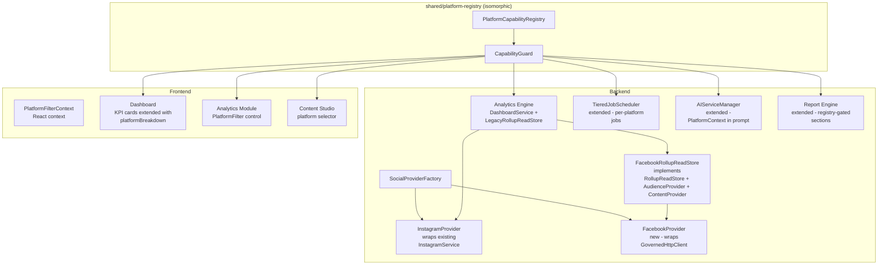
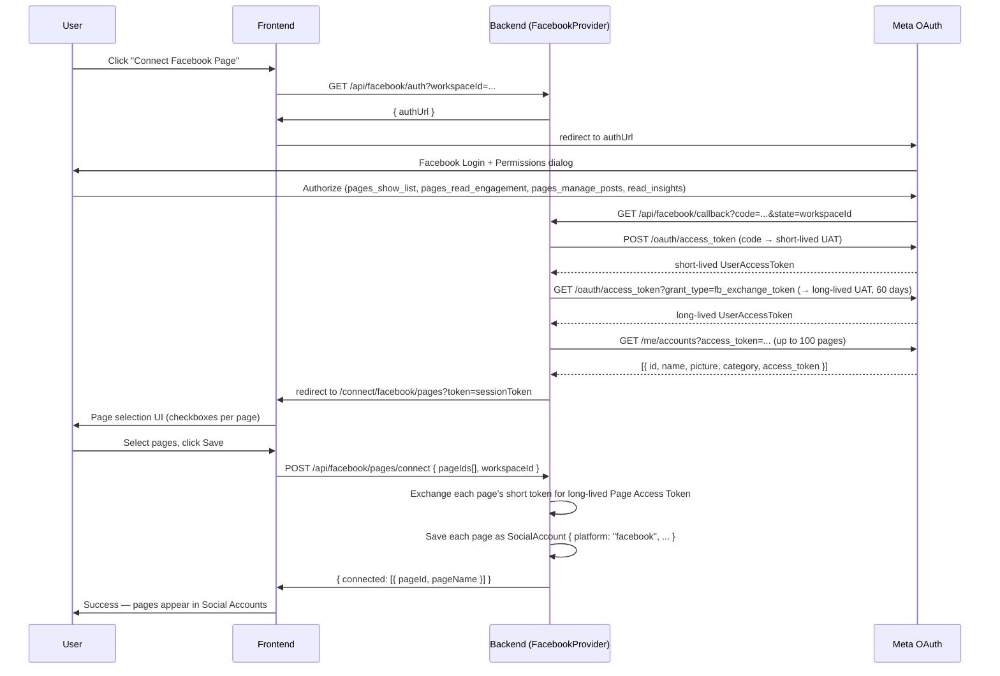

# Design Document: Facebook Page Integration

## Overview

This document describes the technical design for adding Facebook Page support to Veefore alongside the existing Instagram implementation. The design extends every layer of the stack — database, backend providers, analytics engine, scheduler, AI engine, reports, and frontend — without replacing or duplicating any existing Instagram code.

The two central architectural pillars are:

1. **`SocialPlatformProvider` interface** — a typed contract that both `InstagramProvider` (wrapper around existing `InstagramService`) and `FacebookProvider` implement, consumed by a provider factory so no caller ever uses a platform string comparison.
2. **`PlatformCapabilityRegistry`** — an isomorphic, deeply-frozen module at `src/shared/platform-registry/` that declares every capability for every platform. All UI, analytics, AI, and report code calls `CapabilityGuard` instead of writing `if (platform === "facebook")`.

---

## Architecture



### What is new vs extended

| Layer | Status | Notes |
|---|---|---|
| `PlatformCapabilityRegistry` | **New** | `src/shared/platform-registry/` |
| `SocialPlatformProvider` interface | **New** | `server/features/social/providers/types.ts` |
| `FacebookProvider` | **New** | `server/features/facebook/` |
| `InstagramProvider` | **New wrapper** | Thin wrapper around existing `InstagramService`; no behavior change |
| `SocialProviderFactory` | **New** | `server/features/social/providers/factory.ts` |
| `SocialAccount` Mongoose schema | **Extended** | `platform` discriminator + `platformMetadata` sub-doc |
| `FacebookRollupReadStore` | **New** | Implements existing `ports.ts` interfaces |
| `DashboardService` | **Extended** | Multi-provider rollup merging; `platforms` query param |
| `TieredJobScheduler` | **Extended** | Per-platform job creation; token status pre-check |
| `AIServiceManager` | **Extended** | `platformContext` field in prompt construction |
| Report Engine | **Extended** | Registry-gated section inclusion |
| Frontend `PlatformFilterContext` | **New** | React context shared by Dashboard + Analytics |
| Dashboard KPI cards | **Extended** | `platformBreakdown` prop on existing widget components |

---

## 1. Platform Capability Registry

### Location

`src/shared/platform-registry/index.ts` — importable from both Node.js backend and React frontend (no Node-only APIs).

### TypeScript interfaces

```typescript
// src/shared/platform-registry/types.ts

export type PlatformId =
  | 'instagram' | 'facebook'
  | 'linkedin' | 'youtube' | 'tiktok'
  | 'pinterest' | 'x' | 'threads'

export type MetricSupportLevel = 'FULL' | 'PARTIAL' | 'DERIVED' | 'NONE'

export interface AuthCapabilities {
  oauthSupported: boolean
  tokenRefresh: boolean
  tokenExpiration: boolean
  multipleAccounts: boolean
  multipleWorkspaces: boolean
}

export interface PublishingCapabilities {
  textPosts: boolean
  imagePosts: boolean
  videoPosts: boolean
  carouselPosts: boolean
  reels: boolean
  stories: boolean
  linkPosts: boolean
  drafts: boolean
  scheduledPublishing: boolean
  immediatePublishing: boolean
  crossPlatformPublishing: boolean
}

export interface AnalyticsCapabilities {
  metrics: Record<string, MetricSupportLevel>
}

export interface AICapabilities {
  captionGeneration: boolean
  hashtagSuggestions: boolean
  aiInsights: boolean
  performanceRecommendations: boolean
  postingTimeRecommendations: boolean
  contentQualityAnalysis: boolean
  competitorAnalysis: boolean
  sentimentAnalysis: boolean
  contentRepurposing: boolean
  trendDetection: boolean
}

export interface InboxCapabilities {
  comments: boolean
  replies: boolean
  directMessages: boolean
  messenger: boolean
  moderation: boolean
  autoReplies: boolean
}

export interface ReportCapabilities {
  executiveReports: boolean
  pdf: boolean
  excel: boolean
  csv: boolean
  powerpoint: boolean
  aiSummary: boolean
  comparisonReports: boolean
}

export interface SchedulerCapabilities {
  queue: boolean
  calendar: boolean
  bulkScheduling: boolean
  mediaPreview: boolean
  separateCaptions: boolean
  platformSpecificRules: boolean
}

export interface PlatformCapabilities {
  auth: AuthCapabilities
  publishing: PublishingCapabilities
  analytics: AnalyticsCapabilities
  ai: AICapabilities
  inbox: InboxCapabilities
  reports: ReportCapabilities
  scheduler: SchedulerCapabilities
}

export type PlatformRegistry = Readonly<Record<PlatformId, PlatformCapabilities>>
```

### Registry definition (abbreviated)

```typescript
// src/shared/platform-registry/index.ts

import type { PlatformId, PlatformCapabilities, PlatformRegistry } from './types'

const _registry: Record<PlatformId, PlatformCapabilities> = {
  instagram: {
    auth: { oauthSupported: true, tokenRefresh: true, tokenExpiration: true,
            multipleAccounts: true, multipleWorkspaces: true },
    publishing: { textPosts: false, imagePosts: true, videoPosts: true,
                  carouselPosts: true, reels: true, stories: true, linkPosts: false,
                  drafts: true, scheduledPublishing: true, immediatePublishing: true,
                  crossPlatformPublishing: true },
    analytics: {
      metrics: {
        followers_total: 'FULL', reach_total: 'FULL', impressions_total: 'FULL',
        total_engagements: 'FULL', likes: 'FULL', comments: 'FULL', shares: 'FULL',
        saves: 'FULL', video_views: 'FULL', profile_visits: 'FULL',
        website_clicks: 'FULL', published_posts: 'FULL',
        facebook_reactions: 'NONE', facebook_page_views: 'NONE',
      }
    },
    ai: { captionGeneration: true, hashtagSuggestions: true, aiInsights: true,
          performanceRecommendations: true, postingTimeRecommendations: true,
          contentQualityAnalysis: true, competitorAnalysis: true,
          sentimentAnalysis: true, contentRepurposing: true, trendDetection: true },
    inbox: { comments: true, replies: true, directMessages: true, messenger: false,
             moderation: true, autoReplies: true },
    reports: { executiveReports: true, pdf: true, excel: true, csv: true,
               powerpoint: true, aiSummary: true, comparisonReports: true },
    scheduler: { queue: true, calendar: true, bulkScheduling: true, mediaPreview: true,
                 separateCaptions: true, platformSpecificRules: true },
  },
  facebook: {
    auth: { oauthSupported: true, tokenRefresh: true, tokenExpiration: true,
            multipleAccounts: true, multipleWorkspaces: true },
    publishing: { textPosts: true, imagePosts: true, videoPosts: true,
                  carouselPosts: false, reels: true, stories: false, linkPosts: true,
                  drafts: true, scheduledPublishing: true, immediatePublishing: true,
                  crossPlatformPublishing: true },
    analytics: {
      metrics: {
        followers_total: 'FULL', reach_total: 'FULL', impressions_total: 'FULL',
        total_engagements: 'FULL', likes: 'FULL', comments: 'FULL', shares: 'FULL',
        saves: 'NONE', video_views: 'FULL', profile_visits: 'FULL',
        website_clicks: 'FULL', published_posts: 'FULL',
        facebook_reactions: 'FULL', facebook_page_views: 'FULL',
      }
    },
    ai: { captionGeneration: true, hashtagSuggestions: true, aiInsights: true,
          performanceRecommendations: true, postingTimeRecommendations: true,
          contentQualityAnalysis: true, competitorAnalysis: true,
          sentimentAnalysis: true, contentRepurposing: true, trendDetection: true },
    inbox: { comments: true, replies: true, directMessages: false, messenger: true,
             moderation: true, autoReplies: true },
    reports: { executiveReports: true, pdf: true, excel: true, csv: true,
               powerpoint: true, aiSummary: true, comparisonReports: true },
    scheduler: { queue: true, calendar: true, bulkScheduling: true, mediaPreview: true,
                 separateCaptions: true, platformSpecificRules: true },
  },
  // Future platforms declared with NONE capabilities (prevents future migrations)
  linkedin: { auth: { oauthSupported: false, tokenRefresh: false, tokenExpiration: false, multipleAccounts: false, multipleWorkspaces: false }, publishing: { textPosts: false, imagePosts: false, videoPosts: false, carouselPosts: false, reels: false, stories: false, linkPosts: false, drafts: false, scheduledPublishing: false, immediatePublishing: false, crossPlatformPublishing: false }, analytics: { metrics: {} }, ai: { captionGeneration: false, hashtagSuggestions: false, aiInsights: false, performanceRecommendations: false, postingTimeRecommendations: false, contentQualityAnalysis: false, competitorAnalysis: false, sentimentAnalysis: false, contentRepurposing: false, trendDetection: false }, inbox: { comments: false, replies: false, directMessages: false, messenger: false, moderation: false, autoReplies: false }, reports: { executiveReports: false, pdf: false, excel: false, csv: false, powerpoint: false, aiSummary: false, comparisonReports: false }, scheduler: { queue: false, calendar: false, bulkScheduling: false, mediaPreview: false, separateCaptions: false, platformSpecificRules: false } },
  youtube: { auth: { oauthSupported: false, tokenRefresh: false, tokenExpiration: false, multipleAccounts: false, multipleWorkspaces: false }, publishing: { textPosts: false, imagePosts: false, videoPosts: false, carouselPosts: false, reels: false, stories: false, linkPosts: false, drafts: false, scheduledPublishing: false, immediatePublishing: false, crossPlatformPublishing: false }, analytics: { metrics: {} }, ai: { captionGeneration: false, hashtagSuggestions: false, aiInsights: false, performanceRecommendations: false, postingTimeRecommendations: false, contentQualityAnalysis: false, competitorAnalysis: false, sentimentAnalysis: false, contentRepurposing: false, trendDetection: false }, inbox: { comments: false, replies: false, directMessages: false, messenger: false, moderation: false, autoReplies: false }, reports: { executiveReports: false, pdf: false, excel: false, csv: false, powerpoint: false, aiSummary: false, comparisonReports: false }, scheduler: { queue: false, calendar: false, bulkScheduling: false, mediaPreview: false, separateCaptions: false, platformSpecificRules: false } },
  tiktok: { auth: { oauthSupported: false, tokenRefresh: false, tokenExpiration: false, multipleAccounts: false, multipleWorkspaces: false }, publishing: { textPosts: false, imagePosts: false, videoPosts: false, carouselPosts: false, reels: false, stories: false, linkPosts: false, drafts: false, scheduledPublishing: false, immediatePublishing: false, crossPlatformPublishing: false }, analytics: { metrics: {} }, ai: { captionGeneration: false, hashtagSuggestions: false, aiInsights: false, performanceRecommendations: false, postingTimeRecommendations: false, contentQualityAnalysis: false, competitorAnalysis: false, sentimentAnalysis: false, contentRepurposing: false, trendDetection: false }, inbox: { comments: false, replies: false, directMessages: false, messenger: false, moderation: false, autoReplies: false }, reports: { executiveReports: false, pdf: false, excel: false, csv: false, powerpoint: false, aiSummary: false, comparisonReports: false }, scheduler: { queue: false, calendar: false, bulkScheduling: false, mediaPreview: false, separateCaptions: false, platformSpecificRules: false } },
  pinterest: { auth: { oauthSupported: false, tokenRefresh: false, tokenExpiration: false, multipleAccounts: false, multipleWorkspaces: false }, publishing: { textPosts: false, imagePosts: false, videoPosts: false, carouselPosts: false, reels: false, stories: false, linkPosts: false, drafts: false, scheduledPublishing: false, immediatePublishing: false, crossPlatformPublishing: false }, analytics: { metrics: {} }, ai: { captionGeneration: false, hashtagSuggestions: false, aiInsights: false, performanceRecommendations: false, postingTimeRecommendations: false, contentQualityAnalysis: false, competitorAnalysis: false, sentimentAnalysis: false, contentRepurposing: false, trendDetection: false }, inbox: { comments: false, replies: false, directMessages: false, messenger: false, moderation: false, autoReplies: false }, reports: { executiveReports: false, pdf: false, excel: false, csv: false, powerpoint: false, aiSummary: false, comparisonReports: false }, scheduler: { queue: false, calendar: false, bulkScheduling: false, mediaPreview: false, separateCaptions: false, platformSpecificRules: false } },
  x: { auth: { oauthSupported: false, tokenRefresh: false, tokenExpiration: false, multipleAccounts: false, multipleWorkspaces: false }, publishing: { textPosts: false, imagePosts: false, videoPosts: false, carouselPosts: false, reels: false, stories: false, linkPosts: false, drafts: false, scheduledPublishing: false, immediatePublishing: false, crossPlatformPublishing: false }, analytics: { metrics: {} }, ai: { captionGeneration: false, hashtagSuggestions: false, aiInsights: false, performanceRecommendations: false, postingTimeRecommendations: false, contentQualityAnalysis: false, competitorAnalysis: false, sentimentAnalysis: false, contentRepurposing: false, trendDetection: false }, inbox: { comments: false, replies: false, directMessages: false, messenger: false, moderation: false, autoReplies: false }, reports: { executiveReports: false, pdf: false, excel: false, csv: false, powerpoint: false, aiSummary: false, comparisonReports: false }, scheduler: { queue: false, calendar: false, bulkScheduling: false, mediaPreview: false, separateCaptions: false, platformSpecificRules: false } },
  threads: { auth: { oauthSupported: false, tokenRefresh: false, tokenExpiration: false, multipleAccounts: false, multipleWorkspaces: false }, publishing: { textPosts: false, imagePosts: false, videoPosts: false, carouselPosts: false, reels: false, stories: false, linkPosts: false, drafts: false, scheduledPublishing: false, immediatePublishing: false, crossPlatformPublishing: false }, analytics: { metrics: {} }, ai: { captionGeneration: false, hashtagSuggestions: false, aiInsights: false, performanceRecommendations: false, postingTimeRecommendations: false, contentQualityAnalysis: false, competitorAnalysis: false, sentimentAnalysis: false, contentRepurposing: false, trendDetection: false }, inbox: { comments: false, replies: false, directMessages: false, messenger: false, moderation: false, autoReplies: false }, reports: { executiveReports: false, pdf: false, excel: false, csv: false, powerpoint: false, aiSummary: false, comparisonReports: false }, scheduler: { queue: false, calendar: false, bulkScheduling: false, mediaPreview: false, separateCaptions: false, platformSpecificRules: false } },
}

// Deep freeze to enforce immutability at runtime
export const PLATFORM_REGISTRY: PlatformRegistry = deepFreeze(_registry) as PlatformRegistry

function deepFreeze<T>(obj: T): T {
  Object.freeze(obj)
  if (obj && typeof obj === 'object') {
    for (const value of Object.values(obj)) deepFreeze(value)
  }
  return obj
}

export const CapabilityGuard = {
  getMetricSupport(platform: PlatformId, metricKey: string): MetricSupportLevel {
    const p = PLATFORM_REGISTRY[platform]
    if (!p) {
      console.warn(`[CapabilityGuard] Unknown platform: ${platform}`)
      return 'NONE'
    }
    return p.analytics.metrics[metricKey] ?? 'NONE'
  },

  supportsPublishing(platform: PlatformId, postType: keyof PublishingCapabilities): boolean {
    const p = PLATFORM_REGISTRY[platform]
    if (!p) { console.warn(`[CapabilityGuard] Unknown platform: ${platform}`); return false }
    return Boolean(p.publishing[postType])
  },

  supportsAuth(platform: PlatformId, capability: keyof AuthCapabilities): boolean {
    const p = PLATFORM_REGISTRY[platform]
    if (!p) { console.warn(`[CapabilityGuard] Unknown platform: ${platform}`); return false }
    return Boolean(p.auth[capability])
  },

  getRegisteredPlatforms(): PlatformId[] {
    return Object.keys(PLATFORM_REGISTRY) as PlatformId[]
  },

  getConnectablePlatforms(): PlatformId[] {
    return (Object.keys(PLATFORM_REGISTRY) as PlatformId[])
      .filter(p => PLATFORM_REGISTRY[p].auth.oauthSupported)
  },
}
```

---

## 2. Database Schema Extension

### Existing SocialAccount model location
The existing `SocialAccount` Mongoose model is at `server/models/SocialAccount/SocialAccount.ts` (or equivalent). We extend it — never replace it.

### Extended schema

```typescript
// server/models/SocialAccount/SocialAccount.ts  (additions only)

import { Schema, model, type Document } from 'mongoose'

export type ConnectionStatus = 'ACTIVE' | 'DISCONNECTED' | 'REQUIRES_RECONNECT' | 'SYNCING'

export interface FacebookPlatformMetadata {
  pageCategory?: string
  pageFanCount?: number
  metaBusinessId?: string    // for MetaBusinessRelationship detection
  linkedInstagramAccountId?: string
}

export interface InstagramPlatformMetadata {
  accountType?: 'BUSINESS' | 'CREATOR' | 'PERSONAL'
  metaBusinessId?: string
}

// The shared top-level schema gains these fields:
const socialAccountSchemaExtension = {
  platform: {
    type: String,
    enum: ['instagram', 'facebook', 'linkedin', 'youtube', 'tiktok', 'pinterest', 'x', 'threads'],
    required: true,
    default: 'instagram',   // backward compat for existing records
  },
  pageName: { type: String },
  pageCategory: { type: String },
  tokenExpiresAt: { type: Date },
  permissions: [{ type: String }],
  connectedAt: { type: Date, default: Date.now },
  lastSyncAt: { type: Date },
  connectionStatus: {
    type: String,
    enum: ['ACTIVE', 'DISCONNECTED', 'REQUIRES_RECONNECT', 'SYNCING'],
    default: 'ACTIVE',
  },
  platformMetadata: { type: Schema.Types.Mixed, default: {} },
}

// Compound unique index — prevents duplicate connections
// { workspaceId: 1, platform: 1, accountId: 1 }  unique: true
```

**Migration strategy for existing Instagram records:** A one-time migration script sets `platform: "instagram"` and `connectionStatus: "ACTIVE"` on all existing `SocialAccount` documents that lack these fields. The compound unique index is added after migration. The script is idempotent and safe to re-run.

---

## Components and Interfaces

See sections 3–12 below for detailed component designs.

---

## Data Models

### SocialAccount (extended Mongoose schema)

See section 2 above for the full schema extension. Key additions:
- `platform`: discriminator enum (instagram, facebook, linkedin, youtube, tiktok, pinterest, x, threads)
- `pageName`, `pageCategory`: Facebook Page-specific top-level fields
- `connectionStatus`: enum (ACTIVE, DISCONNECTED, REQUIRES_RECONNECT, SYNCING)
- `tokenExpiresAt`: token expiry timestamp
- `permissions`: array of granted OAuth permission strings
- `platformMetadata`: Mixed sub-document for platform-specific fields (Facebook: pageCategory, metaBusinessId, linkedInstagramAccountId; Instagram: accountType, metaBusinessId)
- Compound unique index: `{ workspaceId, platform, accountId }`

### NormalizedMetricResult

```typescript
interface NormalizedMetricResult {
  metrics: Record<string, number>   // only present keys; absent = not supported
  rawResponse?: unknown             // in-memory only for debugging
}
```

### MultiPlatformPublishRequest

```typescript
interface MultiPlatformPublishRequest {
  workspaceId: string
  platforms: Array<{
    platform: PlatformId
    caption: string
    mediaUrls?: string[]
    scheduledAt?: Date
  }>
  sharedMediaUrls?: string[]
}
```

### PlatformContribution (frontend KPI widget)

```typescript
interface PlatformContribution {
  platform: PlatformId
  value: number | null        // null = metric not supported on this platform
  supportLevel: MetricSupportLevel
}
```

---

## 3. Backend Provider Architecture

### `SocialPlatformProvider` interface

```typescript
// server/features/social/providers/types.ts

import type { PlatformId } from '../../../shared/platform-registry'

export interface OAuthInitResult {
  authUrl: string
  state: string
}

export interface OAuthCallbackResult {
  longLivedToken: string
  tokenExpiresAt: Date
  userId: string
}

export interface ManagedPage {
  pageId: string
  pageName: string
  profilePictureUrl: string
  pageCategory: string
  accessToken: string
  tokenExpiresAt: Date
  permissions: string[]
  metaBusinessId?: string
  linkedInstagramAccountId?: string
}

export interface ProfileResult {
  accountId: string
  displayName: string
  profilePictureUrl: string
  followersCount: number
  platformMetadata: Record<string, unknown>
}

export interface NormalizedMetricResult {
  metrics: Record<string, number>
  rawResponse?: unknown   // preserved in-memory for debugging, never stored
}

export interface PublishResult {
  platformPostId: string
  permalink?: string
}

export interface SocialPlatformProvider {
  readonly platform: PlatformId

  // OAuth
  initiateOAuth(workspaceId: string, redirectUri: string): OAuthInitResult
  handleOAuthCallback(code: string, redirectUri: string): Promise<OAuthCallbackResult>
  getManagedPages(userAccessToken: string): Promise<ManagedPage[]>

  // Token lifecycle
  refreshToken(accessToken: string): Promise<{ accessToken: string; expiresAt: Date }>
  revokeToken(accessToken: string): Promise<void>

  // Profile
  getProfile(accessToken: string, accountId: string): Promise<ProfileResult>

  // Analytics (matches ports.ts interfaces)
  getAnalytics(params: {
    accessToken: string
    accountId: string
    from: Date
    to: Date
  }): Promise<NormalizedMetricResult>

  // Publishing
  publish(params: {
    accessToken: string
    accountId: string
    mediaType: string
    mediaUrl?: string
    caption?: string
    scheduledAt?: Date
  }): Promise<PublishResult>
}
```

### Provider factory

```typescript
// server/features/social/providers/factory.ts

import type { PlatformId } from '../../../shared/platform-registry'
import type { SocialPlatformProvider } from './types'
import { InstagramProvider } from '../../instagram/providers/InstagramProvider'
import { FacebookProvider } from '../../facebook/providers/FacebookProvider'

export class UnsupportedPlatformError extends Error {
  constructor(public readonly platform: string) {
    super(`Unsupported platform: ${platform}`)
    this.name = 'UnsupportedPlatformError'
  }
}

// Singleton instances — shared services (cache, rate-limiting) injected once
const _providers = new Map<PlatformId, SocialPlatformProvider>()

export function getProvider(platform: string): SocialPlatformProvider {
  const p = platform as PlatformId
  if (_providers.has(p)) return _providers.get(p)!
  if (p === 'instagram') {
    const prov = new InstagramProvider()
    _providers.set(p, prov)
    return prov
  }
  if (p === 'facebook') {
    const prov = new FacebookProvider()
    _providers.set(p, prov)
    return prov
  }
  throw new UnsupportedPlatformError(platform)
}
```

### `InstagramProvider` (wrapper — no behavior change)

```typescript
// server/features/instagram/providers/InstagramProvider.ts

import { InstagramService } from '../services/instagram.service'
import type { SocialPlatformProvider, OAuthInitResult, OAuthCallbackResult,
              ManagedPage, ProfileResult, NormalizedMetricResult, PublishResult } from '../../social/providers/types'

export class InstagramProvider implements SocialPlatformProvider {
  readonly platform = 'instagram' as const
  private readonly service = new InstagramService()

  initiateOAuth(workspaceId: string, redirectUri: string): OAuthInitResult {
    const authUrl = this.service.generateAuthUrl(redirectUri, workspaceId)
    return { authUrl, state: workspaceId }
  }

  async handleOAuthCallback(code: string, redirectUri: string): Promise<OAuthCallbackResult> {
    const short = await this.service.exchangeCodeForToken(code, redirectUri)
    const long  = await this.service.getLongLivedToken(short.access_token)
    return {
      longLivedToken: long.access_token,
      tokenExpiresAt: new Date(Date.now() + long.expires_in * 1000),
      userId: short.user_id ?? '',
    }
  }

  async getManagedPages(): Promise<ManagedPage[]> {
    return []  // Instagram does not expose managed page selection
  }

  async refreshToken(accessToken: string) {
    const result = await this.service.refreshAccessToken(accessToken)
    return { accessToken: result.access_token, expiresAt: new Date(Date.now() + result.expires_in * 1000) }
  }

  async revokeToken(): Promise<void> { /* Instagram token revocation is handled at account disconnect */ }

  async getProfile(accessToken: string, accountId: string): Promise<ProfileResult> {
    const p = await this.service.getUserProfile(accessToken, accountId)
    return { accountId: p.id, displayName: p.username, profilePictureUrl: p.profile_picture_url ?? '', followersCount: p.followers_count, platformMetadata: { accountType: p.account_type } }
  }

  async getAnalytics(params: { accessToken: string; accountId: string; from: Date; to: Date }): Promise<NormalizedMetricResult> {
    const insights = await this.service.getAccountInsights(params.accessToken, params.accountId)
    return {
      metrics: {
        followers_total: insights.follower_count ?? 0,
        reach_total: insights.reach_days_28 ?? insights.reach ?? 0,
        profile_visits: insights.profile_views ?? 0,
        website_clicks: insights.website_clicks ?? 0,
      }
    }
  }

  async publish(params: { accessToken: string; accountId: string; mediaType: string; mediaUrl?: string; caption?: string }): Promise<PublishResult> {
    const result = await this.service.publishMedia(params.accessToken, params.mediaType as any, params.mediaUrl ?? '', { caption: params.caption, accountId: params.accountId })
    return { platformPostId: result.id, permalink: result.permalink }
  }
}
```

---

## 4. Facebook OAuth Flow



### Route handlers

```typescript
// server/routes/facebook.routes.ts

router.get('/api/facebook/auth', requireAuth, async (req, res) => {
  const { workspaceId } = req.query
  const provider = getProvider('facebook')
  const { authUrl } = provider.initiateOAuth(String(workspaceId), FACEBOOK_REDIRECT_URI)
  res.json({ authUrl })
})

router.get('/api/facebook/callback', async (req, res) => {
  const { code, state: workspaceId, error } = req.query
  if (error || !code) {
    return res.redirect(`/connect/facebook/error?reason=${encodeURIComponent(String(error ?? 'unknown'))}`)
  }
  try {
    const provider = getProvider('facebook') as FacebookProvider
    const callbackResult = await provider.handleOAuthCallback(String(code), FACEBOOK_REDIRECT_URI)
    const pages = await provider.getManagedPages(callbackResult.longLivedToken)
    const sessionToken = await createPageSelectionSession({ workspaceId, pages, callbackResult })
    res.redirect(`/connect/facebook/pages?token=${sessionToken}`)
  } catch (err) {
    const reason = mapFacebookError(err)
    res.redirect(`/connect/facebook/error?reason=${encodeURIComponent(reason)}`)
  }
})

router.post('/api/facebook/pages/connect', requireAuth, validateBody(connectPagesSchema), async (req, res) => {
  const { pageIds, workspaceId, sessionToken } = req.body
  const provider = getProvider('facebook') as FacebookProvider
  const connected = await provider.connectPages({ pageIds, workspaceId, sessionToken })
  res.json({ connected })
})
```

### Token refresh cron

```typescript
// server/jobs/facebook-token-refresh.job.ts
// Runs every 6 hours via existing BullMQ repeatable job infrastructure

export async function refreshExpiringFacebookTokens(): Promise<void> {
  const expiringAccounts = await socialAccountRepository.findExpiringFacebook(7) // within 7 days
  for (const account of expiringAccounts) {
    try {
      const provider = getProvider('facebook') as FacebookProvider
      const { accessToken, expiresAt } = await provider.refreshToken(account.accessToken)
      await socialAccountRepository.updateToken(account._id, { accessToken, tokenExpiresAt: expiresAt })
    } catch (err) {
      // After 3 consecutive failures, mark REQUIRES_RECONNECT and notify
      await handleTokenRefreshFailure(account, err)
    }
  }
}
```

---

## 5. FacebookProvider Implementation

```typescript
// server/features/facebook/providers/FacebookProvider.ts

import { GovernedHttpClient, type GovernedRequestOptions } from '../../../services/GovernedHttpClient'
import { getUsageStoreInstance } from '../../../services/UsageStore'
import { rateLimitConfig } from '../../../config/rateLimitConfig'
import type { SocialPlatformProvider, ManagedPage, NormalizedMetricResult, ProfileResult } from '../../social/providers/types'

const FB_GRAPH_BASE = 'https://graph.facebook.com'
const FB_API_VERSION = 'v22.0'

export class FacebookProvider implements SocialPlatformProvider {
  readonly platform = 'facebook' as const

  private makeClient(baseUrl: string = FB_GRAPH_BASE): GovernedHttpClient {
    const usageStore = getUsageStoreInstance()
    return new GovernedHttpClient(
      { baseUrl, timeout: rateLimitConfig.httpTimeoutMs, maxRetries: rateLimitConfig.maxRetries,
        deduplicationWindowMs: rateLimitConfig.deduplicationWindowMs },
      usageStore
    )
  }

  private async fbGet<T>(path: string, token: string, params?: Record<string, string>): Promise<T> {
    const client = this.makeClient()
    // Extract Facebook Page ID from path for rate-limit tracking
    // e.g. /{version}/{pageId}/insights → pageId
    const pageIdMatch = path.match(/\/v\d+\.\d+\/(\d{10,})\//)
    const accountId = pageIdMatch ? pageIdMatch[1] : 'unknown'

    const opts: GovernedRequestOptions = {
      method: 'GET', path, token, params, accountId, priority: 'normal'
    }
    const response = await client.request<T>(opts)
    return response.data
  }

  // OAuth — see FacebookOAuthService (separated for testability)
  initiateOAuth(workspaceId: string, redirectUri: string) {
    const scope = 'pages_show_list,pages_read_engagement,pages_manage_posts,read_insights'
    const params = new URLSearchParams({
      client_id: process.env.FACEBOOK_APP_ID!,
      redirect_uri: redirectUri, scope, response_type: 'code', state: workspaceId
    })
    return { authUrl: `https://www.facebook.com/dialog/oauth?${params}`, state: workspaceId }
  }

  async handleOAuthCallback(code: string, redirectUri: string) {
    // 1. Short-lived token
    const shortParams = new URLSearchParams({
      client_id: process.env.FACEBOOK_APP_ID!, client_secret: process.env.FACEBOOK_APP_SECRET!,
      redirect_uri: redirectUri, code
    })
    const short = await this.fbGet<{ access_token: string }>(`/${FB_API_VERSION}/oauth/access_token`, '', Object.fromEntries(shortParams))

    // 2. Long-lived token (60 days)
    const longParams = new URLSearchParams({
      grant_type: 'fb_exchange_token', client_id: process.env.FACEBOOK_APP_ID!,
      client_secret: process.env.FACEBOOK_APP_SECRET!, fb_exchange_token: short.access_token
    })
    const long = await this.fbGet<{ access_token: string; expires_in: number }>(`/oauth/access_token`, '', Object.fromEntries(longParams))
    return {
      longLivedToken: long.access_token,
      tokenExpiresAt: new Date(Date.now() + long.expires_in * 1000),
      userId: ''
    }
  }

  async getManagedPages(userAccessToken: string): Promise<ManagedPage[]> {
    const result = await this.fbGet<{ data: any[] }>(
      `/${FB_API_VERSION}/me/accounts`,
      userAccessToken,
      { fields: 'id,name,picture,category,access_token,instagram_business_account', limit: '100' }
    )
    return result.data.map(p => ({
      pageId: p.id, pageName: p.name,
      profilePictureUrl: p.picture?.data?.url ?? '',
      pageCategory: p.category ?? '',
      accessToken: p.access_token,
      tokenExpiresAt: new Date(Date.now() + 60 * 24 * 60 * 60 * 1000),
      permissions: [],
      linkedInstagramAccountId: p.instagram_business_account?.id,
    }))
  }

  async refreshToken(accessToken: string) {
    const result = await this.fbGet<{ access_token: string; expires_in: number }>(
      `/oauth/access_token`,
      accessToken,
      { grant_type: 'fb_exchange_token', client_id: process.env.FACEBOOK_APP_ID!,
        client_secret: process.env.FACEBOOK_APP_SECRET!, fb_exchange_token: accessToken }
    )
    return { accessToken: result.access_token, expiresAt: new Date(Date.now() + result.expires_in * 1000) }
  }

  async revokeToken(accessToken: string): Promise<void> {
    try {
      await this.fbGet(`/${FB_API_VERSION}/me/permissions`, accessToken, { method: 'DELETE' })
    } catch { /* Ignore revocation failures — local disconnect still happens */ }
  }

  async getProfile(accessToken: string, accountId: string): Promise<ProfileResult> {
    const p = await this.fbGet<any>(`/${FB_API_VERSION}/${accountId}`, accessToken, {
      fields: 'id,name,picture,fan_count,category'
    })
    return {
      accountId: p.id, displayName: p.name,
      profilePictureUrl: p.picture?.data?.url ?? '',
      followersCount: p.fan_count ?? 0,
      platformMetadata: { pageCategory: p.category }
    }
  }

  async getAnalytics(params: { accessToken: string; accountId: string; from: Date; to: Date }): Promise<NormalizedMetricResult> {
    const { accessToken, accountId, from, to } = params
    const sinceSec = Math.floor(from.getTime() / 1000)
    const untilSec = Math.floor(to.getTime() / 1000)

    // Fetch each metric group in parallel; partial failures are caught individually
    const [pageInsights, postInsights, profile] = await Promise.allSettled([
      this.fetchPageInsights(accessToken, accountId, sinceSec, untilSec),
      this.fetchPostInsights(accessToken, accountId, from, to),
      this.getProfile(accessToken, accountId),
    ])

    const raw: any = {}
    if (pageInsights.status === 'fulfilled') Object.assign(raw, pageInsights.value)
    if (postInsights.status === 'fulfilled') Object.assign(raw, postInsights.value)

    // Map to NormalizedMetric keys — omit keys for which no data was returned
    const metrics: Record<string, number> = {}
    if (raw.page_fan_count != null) metrics.followers_total = raw.page_fan_count
    if (raw.page_impressions_unique != null) metrics.reach_total = raw.page_impressions_unique
    if (raw.page_impressions != null) metrics.impressions_total = raw.page_impressions
    if (raw.page_post_engagements != null) metrics.total_engagements = raw.page_post_engagements
    if (raw.page_actions_post_reactions_like_total != null) metrics.likes = raw.page_actions_post_reactions_like_total
    if (raw.page_video_views != null) metrics.video_views = raw.page_video_views
    if (raw.page_views_total != null) metrics.profile_visits = raw.page_views_total
    // Facebook-specific metrics (not in Instagram normalized schema)
    if (raw.page_actions_post_reactions_total != null) metrics.facebook_reactions = raw.page_actions_post_reactions_total
    if (raw.page_views_total != null) metrics.facebook_page_views = raw.page_views_total

    return { metrics, rawResponse: raw }  // rawResponse in-memory only, never stored
  }

  // Fetch de-duplicated reach using page_impressions_unique/days_28
  // (analogous to InstagramService.fetchReachTotal)
  private async fetchPageInsights(accessToken: string, accountId: string, since: number, until: number) {
    const metrics = ['page_fan_count', 'page_impressions_unique', 'page_impressions',
                     'page_post_engagements', 'page_actions_post_reactions_like_total',
                     'page_video_views', 'page_views_total',
                     'page_actions_post_reactions_total'].join(',')
    const result = await this.fbGet<{ data: Array<{ name: string; values: Array<{ value: number }> }> }>(
      `/${FB_API_VERSION}/${accountId}/insights`, accessToken,
      { metric: metrics, period: 'day', since: String(since), until: String(until) }
    )
    const out: Record<string, number> = {}
    for (const m of result.data ?? []) {
      const values = m.values ?? []
      if (values.length) out[m.name] = values.reduce((s, v) => s + (v.value ?? 0), 0)
    }
    return out
  }

  private async fetchPostInsights(accessToken: string, accountId: string, from: Date, to: Date) {
    // Published posts count from page feed
    try {
      const result = await this.fbGet<{ data: any[] }>(
        `/${FB_API_VERSION}/${accountId}/posts`, accessToken,
        { fields: 'id', since: String(Math.floor(from.getTime() / 1000)),
          until: String(Math.floor(to.getTime() / 1000)), limit: '100' }
      )
      return { published_posts: result.data?.length ?? 0 }
    } catch {
      return {}
    }
  }

  async publish(params: { accessToken: string; accountId: string; mediaType: string; mediaUrl?: string; caption?: string; scheduledAt?: Date }): Promise<{ platformPostId: string; permalink?: string }> {
    const body: Record<string, string> = { access_token: params.accessToken }
    if (params.caption) body.message = params.caption
    if (params.mediaUrl) body.url = params.mediaUrl
    if (params.scheduledAt) {
      body.published = 'false'
      body.scheduled_publish_time = String(Math.floor(params.scheduledAt.getTime() / 1000))
    }
    const result = await this.fbGet<{ id: string }>(`/${FB_API_VERSION}/${params.accountId}/feed`, params.accessToken, body)
    return { platformPostId: result.id }
  }
}
```

---

## 6. Facebook Analytics Provider

The `FacebookRollupReadStore` implements the same `RollupReadStore`, `AudienceProvider`, and `ContentProvider` interfaces from `server/features/analytics/api/ports.ts` that `LegacyRollupReadStore` already implements. This makes it a drop-in addition to the analytics engine.

```typescript
// server/features/facebook/analytics/FacebookRollupReadStore.ts

import { socialAccountRepository } from '../../../repositories/SocialAccountRepository'
import { FacebookProvider } from '../providers/FacebookProvider'
import type { RollupReadStore, AudienceProvider, ContentProvider,
              RollupReadQuery, MetricRollup, DistributionSlice, TopItem } from '../../analytics/api/ports'

export class FacebookRollupReadStore implements RollupReadStore, AudienceProvider, ContentProvider {
  private readonly provider = new FacebookProvider()

  async getRollups(query: RollupReadQuery): Promise<MetricRollup[]> {
    const accounts = await socialAccountRepository.findActiveByWorkspace(query.workspaceId, 'facebook')
    if (accounts.length === 0) return []

    const from = query.from ? new Date(query.from) : new Date(Date.now() - 30 * 86400000)
    const to   = query.to   ? new Date(query.to)   : new Date()

    const results = await Promise.allSettled(
      accounts.map(async (acc) => {
        const result = await this.provider.getAnalytics({
          accessToken: acc.accessToken,
          accountId: String(acc.accountId),
          from, to
        })
        return {
          workspaceId: query.workspaceId,
          platform: 'facebook' as const,
          granularity: query.granularity,
          periodStart: from.toISOString(),
          periodEnd:   to.toISOString(),
          metrics: result.metrics,
          eventCount: 1,
          lastEventAt: to.toISOString(),
        } satisfies MetricRollup
      })
    )

    return results
      .filter(r => r.status === 'fulfilled')
      .map(r => (r as PromiseFulfilledResult<MetricRollup>).value)
  }

  async getAudienceByCountry(query: RollupReadQuery): Promise<DistributionSlice[]> {
    const accounts = await socialAccountRepository.findActiveByWorkspace(query.workspaceId, 'facebook')
    if (!accounts[0]) return []
    try {
      const result = await this.provider.fbGet<{ data: any[] }>(
        `/v22.0/${accounts[0].accountId}/insights`,
        accounts[0].accessToken,
        { metric: 'page_fans_country', period: 'lifetime' }
      )
      const countryData = result.data?.[0]?.values?.[0]?.value ?? {}
      return Object.entries(countryData)
        .map(([label, value]) => ({ label, value: Number(value) }))
        .sort((a, b) => b.value - a.value)
        .slice(0, 10)
    } catch { return [] }
  }

  async getTopContent(query: RollupReadQuery): Promise<TopItem[]> {
    const accounts = await socialAccountRepository.findActiveByWorkspace(query.workspaceId, 'facebook')
    if (!accounts[0]) return []
    try {
      const posts = await this.provider.fbGet<{ data: any[] }>(
        `/v22.0/${accounts[0].accountId}/posts`,
        accounts[0].accessToken,
        { fields: 'id,message,created_time,full_picture,likes.summary(true),comments.summary(true),shares', limit: '10' }
      )
      return (posts.data ?? []).map(p => ({
        id: p.id,
        label: p.message?.slice(0, 80) ?? '(no caption)',
        value: (p.likes?.summary?.total_count ?? 0) + (p.comments?.summary?.total_count ?? 0),
        thumbnailUrl: p.full_picture,
        publishedAt: p.created_time,
        metrics: {
          likes: p.likes?.summary?.total_count ?? 0,
          comments: p.comments?.summary?.total_count ?? 0,
          shares: p.shares?.count ?? 0,
        }
      }))
    } catch { return [] }
  }
}
```

### Hooking Facebook into the DashboardService

The existing `DashboardService` in `server/features/analytics/api/dashboard.service.ts` already accepts a `readStore` in its constructor. At the route level, we compose both stores:

```typescript
// server/routes/analytics.routes.ts (extension)

import { MultiPlatformRollupStore } from '../features/analytics/bridge/MultiPlatformRollupStore'

// MultiPlatformRollupStore fans out getRollups() to both Instagram and Facebook stores
// based on which platforms are connected in the workspace, merges results, and
// respects the `platforms` filter from the query.
const multiStore = new MultiPlatformRollupStore()
const service = new DashboardService({ readStore: multiStore, seriesStore: multiStore,
                                        audienceProvider: multiStore, contentProvider: multiStore })
```

```typescript
// server/features/analytics/bridge/MultiPlatformRollupStore.ts

export class MultiPlatformRollupStore implements RollupReadStore, AudienceProvider, ContentProvider {
  private readonly legacyStore = new LegacyRollupReadStore()        // Instagram
  private readonly facebookStore = new FacebookRollupReadStore()    // Facebook

  async getRollups(query: RollupReadQuery): Promise<MetricRollup[]> {
    const platforms = query.platforms ?? ['instagram', 'facebook']
    const fetches: Promise<MetricRollup[]>[] = []
    if (platforms.includes('instagram')) fetches.push(this.legacyStore.getRollups(query))
    if (platforms.includes('facebook')) fetches.push(this.facebookStore.getRollups(query))
    const results = await Promise.allSettled(fetches)
    return results.flatMap(r => r.status === 'fulfilled' ? r.value : [])
  }
  // ... getAudienceByCountry, getTopContent delegate similarly
}
```

---

## 7. Facebook Metric-to-NormalizedMetric Mapping

| Facebook Graph API metric | Normalized key in `metrics/registry.ts` | MetricSupportLevel |
|---|---|---|
| `page_fan_count` | `followers_total` | FULL |
| `page_impressions_unique` (days_28) | `reach_total` | FULL |
| `page_impressions` | `impressions_total` | FULL |
| `page_post_engagements` | `total_engagements` | FULL |
| `page_actions_post_reactions_like_total` | `likes` | FULL |
| `page_video_views` | `video_views` | FULL |
| `page_views_total` | `profile_visits` | FULL |
| Feed post count (from `/posts` endpoint) | `published_posts` | FULL |
| `page_actions_post_reactions_total` | `facebook_reactions` | FULL (FB only) |
| `page_views_total` | `facebook_page_views` | FULL (FB only) |
| `saves` / bookmarks | *(not available)* | NONE |
| Story insights | *(stories not supported on Pages API)* | NONE |

Facebook-specific metrics (`facebook_reactions`, `facebook_page_views`) are added to the existing `METRIC_DEFINITIONS` in `server/features/analytics/metrics/registry.ts` and to the `METRIC_IDS` constants, continuing the `MTR-0000XX` sequence.

---

## 8. Dashboard Platform Filter — Frontend

### PlatformFilterContext

```typescript
// client/src/features/analytics/context/PlatformFilterContext.tsx

export type PlatformSelection = 'instagram' | 'facebook' | 'all'

interface PlatformFilterContextValue {
  selection: PlatformSelection
  setSelection: (s: PlatformSelection) => void
  connectedPlatforms: PlatformId[]
  showFilter: boolean   // true only when both instagram & facebook are connected
}

export const PlatformFilterContext = createContext<PlatformFilterContextValue>({
  selection: 'all', setSelection: () => {}, connectedPlatforms: [], showFilter: false
})

export function PlatformFilterProvider({ children }: { children: ReactNode }) {
  const { connectedPlatforms } = useConnectedPlatforms()  // queries SocialAccount API
  const showFilter = connectedPlatforms.includes('instagram') && connectedPlatforms.includes('facebook')
  const [selection, setSelection] = useState<PlatformSelection>('all')

  return (
    <PlatformFilterContext.Provider value={{ selection, setSelection, connectedPlatforms, showFilter }}>
      {children}
    </PlatformFilterContext.Provider>
  )
}
```

### KPI card `platformBreakdown` prop extension

The existing KPI card component (`client/src/features/analytics/widgets/`) receives a new optional `platformBreakdown` prop. When present and the global filter is `all`, the card renders sub-rows below the total:

```typescript
// Extension to existing WidgetBaseProps in client/src/features/analytics/widgets/types.ts

export interface PlatformContribution {
  platform: PlatformId
  value: number | null        // null = not supported; never 0
  supportLevel: MetricSupportLevel
}

// Added to KpiWidgetProps (not WidgetBaseProps — platform context is KPI-specific)
export interface KpiPlatformProps {
  platformBreakdown?: PlatformContribution[]
  isApproximateCombined?: boolean  // true when aggregation !== "sum"
}
```

### Platform filter rendering logic (pseudocode)

```
function renderKpiCard(metricKey, platformFilter, connectedPlatforms):
  for each platform in connectedPlatforms:
    supportLevel = CapabilityGuard.getMetricSupport(platform, metricKey)
    if supportLevel === "NONE": skip (no row, not even zero)
    else: include platform contribution row

  if platformFilter === "all" AND >1 platform contributed:
    aggregationType = METRIC_DEFINITIONS[metricKey].aggregation
    if aggregationType === "sum":
      show combined total (exact)
    else:
      show combined total labeled "Approximate Combined"
```

---

## 9. Analytics Module Extension

The `PlatformFilter` control renders inside the existing analytics page header, immediately after the time-range filter. It is visible only when `PlatformFilterContext.showFilter === true`.

When the user changes the platform filter:
1. The new `PlatformSelection` is stored in `PlatformFilterContext`
2. All analytics data-fetching hooks observe the context via `usePlatformFilter()`
3. The analytics API route receives `?platforms=instagram`, `?platforms=facebook`, or `?platforms=instagram,facebook`
4. `MultiPlatformRollupStore.getRollups()` fans the query to the appropriate stores

The same `platforms` query param flows through to report generation, CSV/Excel exports, and AI insight requests.

---

## 10. AI Engine Extension

The `AIServiceManager.generateText()` and `generateTextStream()` methods already accept a `preferences` object. We extend `PromptConstructorService` to inject platform context into the system prompt:

```typescript
// Extension to PromptConstructionParams in server/services/PromptConstructorService.ts

export interface PromptConstructionParams {
  // ... existing fields ...
  platformContext?: 'instagram' | 'facebook' | 'all'
  availableCapabilities?: string[]  // from CapabilityGuard for the platform
}
```

```typescript
// In PromptConstructorService.buildInsightPrompt():

if (params.platformContext === 'facebook') {
  systemPrefix += `\nYou are analyzing Facebook Page data. Only reference Facebook Page metrics and content formats (text posts, link posts, images, videos). Do not mention Instagram Stories, Instagram Reels, or Instagram-specific features unless explicitly supported on Facebook per the capabilities list.`
} else if (params.platformContext === 'instagram') {
  systemPrefix += `\nYou are analyzing Instagram Business account data. Only reference Instagram-specific content formats.`
} else {
  systemPrefix += `\nYou are analyzing data across both Instagram and Facebook. Structure your response with: (1) Instagram insights section, (2) Facebook insights section, (3) Combined strategic recommendations.`
}

// Gate individual recommendation references via CapabilityGuard
// (done at the caller site, filtering recommendations before sending to AI)
```

---

## 11. Scheduler Extension

`ContentPublishRequest` is extended to support multiple platforms:

```typescript
// Extension to existing ContentPublishRequest type
export interface PlatformPublishSpec {
  platform: PlatformId
  caption: string           // platform-specific caption
  mediaUrls?: string[]
  scheduledAt?: Date        // platform-specific scheduled time
}

export interface MultiPlatformPublishRequest {
  workspaceId: string
  platforms: PlatformPublishSpec[]  // one entry per target platform
  sharedMediaUrls?: string[]        // common media if not per-platform
}
```

When `TieredJobScheduler` receives a `MultiPlatformPublishRequest`:

1. For each `PlatformPublishSpec`, validate token status via `socialAccountRepository`
2. If any platform account has `connectionStatus !== 'ACTIVE'` → reject that platform's job immediately with a typed error, but continue with other platforms
3. Consult `CapabilityGuard.supportsPublishing(platform, postType)` — if unsupported, reject that job with a clear error
4. Enqueue independent `SCHEDULED_POST` jobs per platform through existing `TieredJobScheduler.dispatchOrDefer()`
5. Return per-platform job IDs so the frontend can track each independently

---

## 12. Content Studio Extension

```typescript
// Additions to the content generation request type
export interface ContentGenerationRequest {
  // ... existing fields ...
  targetPlatforms: PlatformId[]   // ['instagram'] | ['facebook'] | ['instagram', 'facebook']
}

export interface MultiPlatformCaptionResult {
  sharedBrief?: string               // only when both platforms requested
  captions: {
    platform: PlatformId
    caption: string
    characterCount: number
    hashtagCount: number
    error?: string                   // set if generation failed for this platform
  }[]
}
```

Platform-specific prompt constraints are enforced server-side before calling `AIServiceManager`:
- Facebook: max 500 chars, max 3 hashtags, conversational tone directive
- Instagram: max 2200 chars, hashtag-discovery tone directive

---

## 13. Report Engine Extension

The existing report engine already iterates over metric keys when building sections. The extension wraps each section with a registry check:

```typescript
// Pseudocode for report section inclusion guard
function shouldIncludeMetricSection(metricKey: string, platforms: PlatformId[]): boolean {
  return platforms.some(p =>
    CapabilityGuard.getMetricSupport(p, metricKey) !== 'NONE'
  )
}

function buildReportSection(metricKey: string, platforms: PlatformId[], data: ReportData) {
  if (!shouldIncludeMetricSection(metricKey, platforms)) return null
  // For each platform, check support and omit platform slot if NONE
  // Never emit a 0 or "No data" for NONE — omit the row entirely
}
```

For multi-platform PDF/PowerPoint: platform logos are embedded adjacent to section headers using the existing asset map keyed by `platform: PlatformId`.

For Excel/CSV: column headers are prefixed with `Instagram_` or `Facebook_` per platform, or a platform-name sheet tab is used.

---

## 14. Error Handling Architecture

```typescript
// server/features/facebook/providers/error-mapper.ts

export function mapFacebookApiError(err: unknown): FacebookApiError {
  const code = extractMetaCode(err)
  const subcode = extractMetaSubcode(err)

  if (code === 190) return { type: 'TOKEN_EXPIRED', requiresReconnect: true, code }
  if (code === 10 || code === 200 || code === 803)
    return { type: 'PERMISSION_DENIED', requiresReconnect: false, code,
             missingPermission: extractMissingPermission(err) }
  if (code === 80002 || isRateLimitError(err))
    return { type: 'RATE_LIMITED', requiresReconnect: false, code, retryAfter: extractRetryAfter(err) }

  return { type: 'UNKNOWN', requiresReconnect: false, code }
}
```

Error propagation flow:
```
FacebookProvider.getAnalytics() → throws FacebookApiError
  ↓ FacebookRollupReadStore.getRollups() → catches, returns partial MetricRollup or []
    ↓ MultiPlatformRollupStore.getRollups() → one platform failed, other continues
      ↓ DashboardService.buildDashboard() → partialData: true, warnings: ["Facebook data temporarily unavailable"]
        ↓ Frontend DashboardService response → non-blocking banner in UI
```

Token expiry → `connectionStatus: "REQUIRES_RECONNECT"` → polling stops → reconnect prompt in Social Accounts page + Dashboard banner.

---

## 15. Caching Strategy

Cache keys follow the Instagram pattern, extended with `fb:` prefix:

| Cache key pattern | TTL | Content |
|---|---|---|
| `fb:{pageId}:dashboard:{from}:{to}` | 60s | Dashboard rollup response |
| `fb:{pageId}:insights:{metricGroup}:{from}:{to}` | 300s | Raw Facebook insights |
| `fb:{pageId}:audience:{breakdown}` | 1800s | Audience demographics |
| `fb:{pageId}:posts:{from}:{to}` | 300s | Published posts list |

Deduplication: the `GovernedHttpClient` already enforces a 2-second deduplication window per `accountId`. Facebook Page IDs extracted from the URL path serve as `accountId` values, mirroring the Instagram pattern.

When the frontend changes the `PlatformFilter`, the API route includes `?platforms=` in the request URL. If a cached response exists for that platform+time combination, it is served without a new API call.

---

## 16. New File Map

### New files

| File | Description |
|---|---|
| `src/shared/platform-registry/index.ts` | PlatformCapabilityRegistry + CapabilityGuard (isomorphic) |
| `src/shared/platform-registry/types.ts` | TypeScript interfaces for capabilities |
| `server/features/social/providers/types.ts` | `SocialPlatformProvider` interface + shared types |
| `server/features/social/providers/factory.ts` | Provider factory + `UnsupportedPlatformError` |
| `server/features/instagram/providers/InstagramProvider.ts` | `SocialPlatformProvider` wrapper for existing `InstagramService` |
| `server/features/facebook/providers/FacebookProvider.ts` | Full Facebook Graph API provider |
| `server/features/facebook/analytics/FacebookRollupReadStore.ts` | Implements `RollupReadStore` + `AudienceProvider` + `ContentProvider` |
| `server/features/analytics/bridge/MultiPlatformRollupStore.ts` | Fan-out to Instagram + Facebook stores |
| `server/features/facebook/oauth/FacebookOAuthService.ts` | Page selection session management |
| `server/features/facebook/providers/error-mapper.ts` | Facebook API error classification |
| `server/routes/facebook.routes.ts` | OAuth routes (`/api/facebook/auth`, `/api/facebook/callback`, `/api/facebook/pages/connect`) |
| `server/jobs/facebook-token-refresh.job.ts` | Cron job for 7-day expiry refresh |
| `server/migrations/social-account-platform-field.ts` | One-time migration: add `platform: "instagram"` to existing records |
| `client/src/features/analytics/context/PlatformFilterContext.tsx` | React context for platform selection |
| `client/src/features/social-accounts/components/FacebookAccountCard.tsx` | Facebook-specific account card display |
| `client/src/features/social-accounts/components/MetaBusinessIndicator.tsx` | Shared Meta Business relationship badge |

### Modified files

| File | Change |
|---|---|
| `server/models/SocialAccount/SocialAccount.ts` | Add `platform`, `pageName`, `connectionStatus`, `platformMetadata`, compound unique index |
| `server/features/analytics/metrics/registry.ts` | Add `facebook_reactions`, `facebook_page_views` metric definitions |
| `server/features/analytics/metrics/metric-ids.ts` | Add `FACEBOOK_REACTIONS`, `FACEBOOK_PAGE_VIEWS` IDs |
| `server/features/analytics/api/dashboard.service.ts` | Use `MultiPlatformRollupStore` by default; pass `platforms` filter |
| `server/services/TieredJobScheduler.ts` | Add `MultiPlatformPublishRequest` handling; per-platform job creation |
| `server/services/PromptConstructorService.ts` | Add `platformContext` to prompt params |
| `server/services/AIServiceManager.ts` | Pass `platformContext` through to `PromptConstructorService` |
| `client/src/features/analytics/widgets/types.ts` | Add `PlatformContribution`, `KpiPlatformProps` |
| `client/src/features/analytics/dashboards/OverviewDashboard.tsx` | Wrap with `PlatformFilterProvider`, pass platform breakdown to KPI cards |
| `client/src/features/analytics/design-system/components/FilterChips.tsx` | Add platform filter chip group |

---

## Correctness Properties

See section 17 (Property-Based Testing Strategy) below for the five PBT properties covering:
1. CapabilityGuard immutability
2. Metric normalization idempotency
3. Per-platform job isolation
4. Platform filter propagation
5. No-fake-data invariant

### Property 1: CapabilityGuard Immutability

For any platform and any attempt to mutate the registry after initialization, the `CapabilityGuard.getMetricSupport()` call returns the original declared value unchanged.

**Invariant:** `mutate(registry); result = getMetricSupport(p, k)` must equal the pre-mutation value for all `p`, `k`.

**Validates: Requirements 1.7**

### Property 2: Metric Normalization Idempotency

For any raw Facebook API response object, applying the metric normalization mapping twice produces the same result as applying it once.

**Invariant:** `normalize(normalize(raw)) === normalize(raw)` for all valid raw response shapes.

**Validates: Requirements 7.2, 7.3**

### Property 3: Per-Platform Job Isolation

For any multi-platform publish request where exactly one platform's account has `connectionStatus !== ACTIVE`, the scheduler creates a job for the valid platform and rejects only the invalid platform's job.

**Invariant:** `result.valid.status === 'created' && result.invalid.status === 'rejected'` for all such requests.

**Validates: Requirements 10.4, 10.6**

### Property 4: Platform Filter Propagation

For any `PlatformSelection` value (`instagram`, `facebook`, `all`), the analytics API query constructed from that selection always contains a `platforms` parameter that matches the selection.

**Invariant:** `selection === 'all'` implies `query.platforms` is undefined or contains all connected platforms; otherwise `query.platforms` contains exactly the selected platform.

**Validates: Requirements 6.1, 6.4**

### Property 5: No-Fake-Data Invariant

For any metric key where `CapabilityGuard.getMetricSupport(platform, key) === 'NONE'`, the normalized metric result object for that platform never contains that key, not even as `0` or `null`.

**Invariant:** `supportLevel === 'NONE'` implies `!(key in normalizedResult.metrics)`.

**Validates: Requirements 5.6, 6.5, 12.6**

---

## Error Handling

See section 14 (Error Handling Architecture) above. Summary of error-to-action mapping:

| Facebook error code | System action |
|---|---|
| 190 (expired token) | `connectionStatus = REQUIRES_RECONNECT`, stop polling, surface reconnect notification |
| 10, 200, 803 (permission denied) | Log missing permission, mark affected features unavailable via CapabilityGuard, continue unaffected features |
| 80002 / 429 (rate limit) | GovernedHttpClient exponential backoff; non-blocking banner only if all retries exhausted |
| Network / unknown | Log, return partial data, non-blocking banner |

The Dashboard never crashes due to one platform failing. Instagram data remains visible when Facebook fails and vice versa.

---

## Testing Strategy

See section 17 (Property-Based Testing Strategy) for PBT properties. Additional testing approach:

- **OAuth flow**: Integration tests with mocked Meta endpoints for the full code → short-lived → long-lived token exchange, page selection, and SocialAccount persistence.
- **Provider isolation**: Unit tests for `FacebookProvider` with `GovernedHttpClient` mocked — verify rate limit handling, error code mapping, metric normalization.
- **No-fake-data**: Property test verifying that metrics with `MetricSupportLevel = NONE` never appear in normalized output.
- **Dashboard resilience**: Integration test simulating Facebook provider failure — verify Instagram KPIs still render and warning banner appears.
- **Scheduler isolation**: Test that one platform's job failure does not cancel the other platform's job.
- **CapabilityGuard immutability**: Property test verifying that mutation attempts are silently rejected.

---

## 17. Property-Based Testing Strategy

The following correctness properties should be verified with a PBT framework (e.g. `fast-check`):

```typescript
// Property 1: CapabilityGuard immutability
// Forall platform, capability: mutating the registry leaves original value unchanged
fc.property(fc.constantFrom('instagram', 'facebook'), fc.string(), (platform, key) => {
  const before = CapabilityGuard.getMetricSupport(platform as any, key)
  try { (PLATFORM_REGISTRY as any)[platform].analytics.metrics[key] = 'FULL' } catch {}
  return CapabilityGuard.getMetricSupport(platform as any, key) === before
})

// Property 2: Metric normalization idempotency
// Forall rawFacebookResponse: mapping twice produces the same result as mapping once
fc.property(arbitraryFacebookInsightsResponse(), (raw) => {
  const first  = mapFacebookMetrics(raw)
  const second = mapFacebookMetrics(raw)
  return deepEqual(first, second)
})

// Property 3: Per-platform job isolation
// Forall multiPlatformRequest where one platform fails:
// the other platform's job is still created
fc.property(arbitraryMultiPlatformRequest(), async (req) => {
  const results = await scheduler.createPlatformJobs(req)
  return results.every(r => r.status === 'created' || r.status === 'rejected')
    && results.some(r => r.status === 'created')  // at least one succeeds
})

// Property 4: Platform filter propagation
// Forall platformSelection: analytics query always has matching platforms param
fc.property(fc.constantFrom('instagram', 'facebook', 'all'), (selection) => {
  const query = buildAnalyticsQuery({ platformSelection: selection })
  if (selection === 'all') return query.platforms === undefined || query.platforms.length > 0
  return query.platforms?.includes(selection)
})

// Property 5: No-fake-data invariant
// Forall metricKey, platform where support is NONE:
// normalized result never contains that key
fc.property(
  fc.constantFrom(...noneMetrics),
  (metricKey) => {
    const result = normalizeMetrics({ facebook: { [metricKey]: 42 } }, 'facebook')
    return !(metricKey in result.metrics)
  }
)
```
