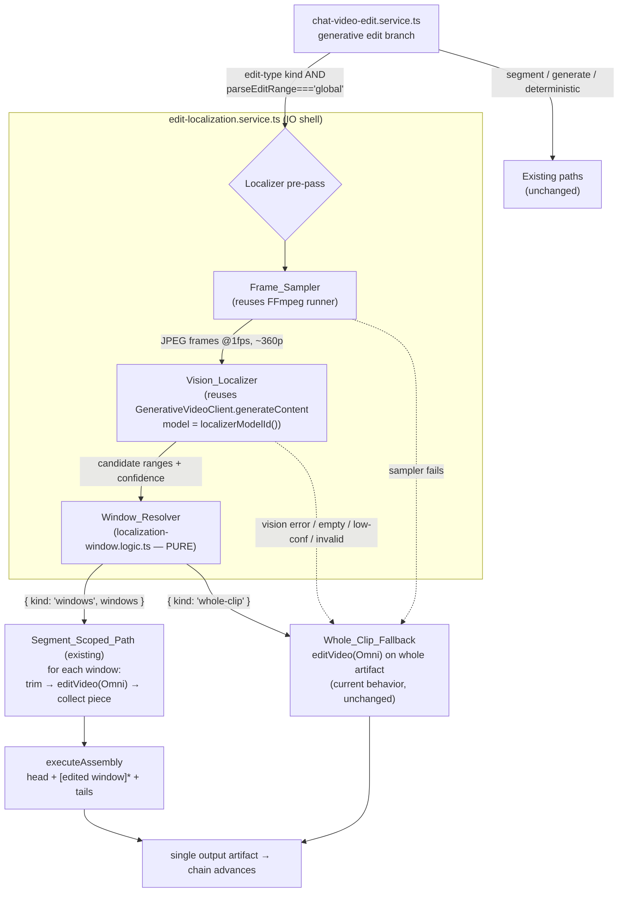
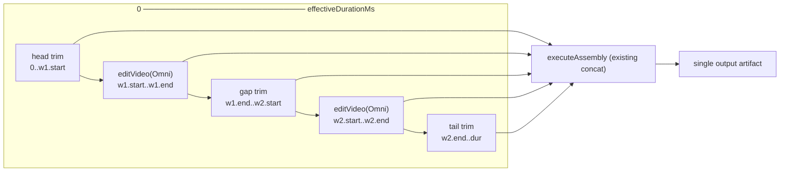

# Design Document

## Overview

This feature adds a cheap **localization pre-pass** to the ONE existing code path where an
edit-type generative operation (`object_removal`, `background_replace`, `generative_edit`) is
requested WITHOUT an explicit time range — i.e. the "global branch" in
`chat-video-edit.service.ts` where `parseEditRange(message)` returns `mode: 'global'`.

Today that branch sends the WHOLE current artifact to Omni Flash (`generativeVideo.editVideo`).
That is correct but expensive. The pre-pass:

1. Samples low-resolution frames from the current artifact using the EXISTING FFmpeg runner
   pattern (Frame_Sampler).
2. Asks a cheap Gemini vision model (`gemini-2.5-flash` by default) where the requested edit
   visually applies, reusing the EXISTING `GenerativeVideoClient` structural interface and its
   `models.generateContent` call (Vision_Localizer).
3. Merges/clamps/sorts/caps the returned candidate ranges into at most three clean,
   non-overlapping windows through a NEW pure logic module (Window_Resolver), mirroring
   `highlight-selection.logic.ts` and the clamp helpers in `edit-range.logic.ts`.
4. Feeds those windows into the EXISTING segment-scoped `trim → editVideo(Omni) → splice(executeAssembly)`
   pipeline — the same one the `mode: 'segment'` branch already uses — so only the detected
   windows pass through Omni.

The feature is bounded by the **No-Mock rule (Req 23)**: at every failure point (sampler error,
vision error, empty/low-confidence/invalid response, zero windows, or whole-clip promotion) the
system emits an honest streamed progress note and falls back to the **current whole-clip behavior**.
A time range is never fabricated.

Nothing else changes: deterministic ops, generate-type (Veo) flows, and the explicit-user-range
branch are all untouched. When a user supplies a range, `parseEditRange` returns `mode: 'segment'`
and the localizer never runs (an explicit range always wins).

### Design principles (from the existing codebase)

- **Reuse, never duplicate** (Req 7.4, 8.3, 8.4): the Frame_Sampler reuses the FFmpeg runner
  pattern from `render-engine.service.ts` / `video-analysis.service.ts`; the Vision_Localizer
  reuses the `GenerativeVideoClient` structural interface from `generative-video.service.ts`; the
  wiring reuses `editor.execute({ kind: 'trim' })`, `generativeVideo.editVideo`, and
  `editor.executeAssembly` exactly as the existing segment branch does.
- **Pure core, IO shell**: the Window_Resolver is pure/total/deterministic (mirrors
  `highlight-selection.logic.ts`); all IO lives in the service shell.
- **Dependency injection everywhere** (mirrors `GenerativeVideoDeps` / `RenderEngineServiceDeps`):
  the FFmpeg runner and the vision client are injectable so unit tests run with no network and no
  FFmpeg.
- **ESM static imports only; string-first logger** (Req 8.1, 8.2).

## Architecture



### Component list

| Component | Location | Kind | Responsibility |
| --- | --- | --- | --- |
| **Window_Resolver** | `server/features/video-editor/services/localization-window.logic.ts` (NEW) | Pure logic module | Merge/clamp/sort/cap candidate ranges into ≤3 non-overlapping windows, or emit the whole-clip promotion signal. Pure/total/deterministic. |
| **Localizer_Model_Resolver** | `generative-video.service.ts` (NEW export `localizerModelId()`) | Pure resolver | Return the cheap vision model id, env-overridable. Mirrors `omniVideoModelId()`/`veoModelId()`. |
| **Frame_Sampler** | `edit-localization.service.ts` (NEW) | IO (FFmpeg) | Download current artifact bytes and sample low-res JPEG frames using the existing FFmpeg runner. |
| **Vision_Localizer** | `edit-localization.service.ts` (NEW) | IO (Gemini) | Send frames + instruction to `localizerModelId()` via the `GenerativeVideoClient` structural interface; parse candidate ranges + confidence; hand them to the Window_Resolver. |
| **EditLocalizationService** | `edit-localization.service.ts` (NEW) | Orchestrator | Compose Frame_Sampler → Vision_Localizer → Window_Resolver; map every failure to the whole-clip fallback signal; stream honest progress. |
| **Wiring change** | `chat-video-edit.service.ts` (MODIFIED, global branch ~L1303) | Integration | When edit-type kind AND `mode: 'global'`, call the localizer; loop the existing segment path per window; on fallback signal use the current whole-clip behavior unchanged. |

## Components and Interfaces

### 1. Window_Resolver — `localization-window.logic.ts` (NEW, pure)

Mirrors the structure, JSDoc discipline, sanitize/clamp/merge helpers, and honest-degrade posture of
`highlight-selection.logic.ts`, and reuses the same clamp / `MIN_WINDOW_MS` / whole-clip-epsilon
idioms as `edit-range.logic.ts`.

```typescript
/**
 * Localization_Window_Logic — PURE, TOTAL, DETERMINISTIC resolution of raw
 * vision-model candidate ranges into clean, clamped, non-overlapping windows for
 * the segment-scoped generative edit path. No IO, no clock, no randomness.
 * Mirrors highlight-selection.logic.ts and the clamp helpers in edit-range.logic.ts.
 */

/** A raw candidate range from the vision model (may be malformed/out-of-bounds). */
export interface CandidateRange {
  startMs: number;
  endMs: number;
  /** Model-reported detection confidence in [0,1]; missing/invalid ⇒ treated as 0. */
  confidence?: number;
}

/** A concrete, clamped localization window `[startMs, endMs)` (ms). */
export interface LocalizationWindow {
  startMs: number;
  endMs: number;
}

/** Tunable options for {@link resolveLocalizationWindows}. All optional. */
export interface WindowResolverOptions {
  /** Hard ceiling on returned windows. Default {@link DEFAULT_MAX_WINDOWS} (3). */
  maxWindows?: number;
  /** Minimum trimmable window length (ms). Default {@link MIN_WINDOW_MS} (500). */
  minWindowMs?: number;
  /** Gap (ms) at/under which two windows are considered adjacent and merged. Default {@link MERGE_GAP_MS}. */
  mergeGapMs?: number;
  /** Tolerance (ms) for the "covers ~the whole clip" promotion check. Default {@link WHOLE_CLIP_EPS_MS}. */
  wholeClipEpsMs?: number;
  /** Confidence floor; candidates strictly below are dropped. Default {@link DEFAULT_MIN_CONFIDENCE}. */
  minConfidence?: number;
}

/**
 * The resolver result. `kind: 'windows'` carries ≥1 clean segment windows to feed
 * into the segment-scoped path. `kind: 'whole-clip'` is the Whole_Clip_Fallback
 * signal — emitted for empty/invalid/all-low-confidence input, zero usable
 * windows, or whole-clip promotion. NEVER a fabricated window (No-Mock, Req 23).
 */
export type WindowResolution =
  | { kind: 'windows'; windows: LocalizationWindow[] }
  | { kind: 'whole-clip' };

export const DEFAULT_MAX_WINDOWS = 3;
export const MIN_WINDOW_MS = 500;
export const MERGE_GAP_MS = 250;
export const WHOLE_CLIP_EPS_MS = 300;
export const DEFAULT_MIN_CONFIDENCE = 0.3;

/**
 * Resolve raw candidate ranges into clean windows or the whole-clip fallback
 * signal. PURE and total — never throws, never performs IO. Guarantees (for any
 * input, including empty/out-of-order/negative/NaN/over-duration candidates and
 * any finite non-negative sourceDurationMs):
 *   - Every returned window w: 0 <= w.startMs < w.endMs <= sourceDurationMs.
 *   - Every returned window: w.endMs - w.startMs >= minWindowMs.
 *   - windows.length <= maxWindows.
 *   - Windows sorted strictly ascending by startMs, pairwise non-overlapping
 *     (a.endMs <= b.startMs for consecutive a,b).
 *   - Feeding the resolver's own windows back in yields the same windows (merge idempotence).
 *   - When merged windows cover [0, sourceDurationMs] within wholeClipEpsMs ⇒ 'whole-clip'.
 *   - When no valid window survives (empty/low-confidence/invalid/degenerate) ⇒ 'whole-clip'.
 *   - Deterministic: identical inputs always produce identical output.
 */
export function resolveLocalizationWindows(
  candidates: readonly CandidateRange[] | null | undefined,
  sourceDurationMs: number,
  options?: WindowResolverOptions,
): WindowResolution;
```

**Algorithm (pure, deterministic):**

1. If `sourceDurationMs` is not a finite positive number → `{ kind: 'whole-clip' }` (nothing to
   scope against; mirrors `parseEditRange`'s `dur <= 0` guard).
2. Sanitize: keep candidates whose `startMs`/`endMs` are finite, whose `endMs > startMs` after
   ordering, and whose `confidence` (defaulting missing → 0) is `>= minConfidence`. Clamp each to
   `[0, sourceDurationMs]` with the `clamp` helper. Expand any sub-`minWindowMs` survivor to
   `minWindowMs` using the same forward-then-backward `ensureWindow` idiom as `edit-range.logic.ts`.
3. If no candidate survives sanitize → `{ kind: 'whole-clip' }` (No-Mock: never fabricate).
4. Sort by `startMs`; merge overlapping OR adjacent (`gap <= mergeGapMs`) windows into single
   windows (same merge loop shape as `computeHighlightSegments` / `deriveSpeechSegments`).
5. Whole-clip promotion: if the union of merged windows covers `[0, sourceDurationMs]` within
   `wholeClipEpsMs` (i.e. first `startMs <= eps` and last `endMs >= dur - eps` with no interior gap
   larger than `eps`) → `{ kind: 'whole-clip' }` (mirrors `coversWholeClip`).
6. Cap to `maxWindows`: keep the `maxWindows` longest windows, then re-sort chronologically (keeps
   the cap deterministic and preserves ordering/disjointness).
7. Final safety filter: drop any window now shorter than `minWindowMs`. If none remain →
   `{ kind: 'whole-clip' }`; else `{ kind: 'windows', windows }`.

### 2. Localizer_Model_Resolver — new export in `generative-video.service.ts`

Placed alongside `veoModelId()` / `omniVideoModelId()` and following the exact same structure so one
Google key powers image + video + localization.

```typescript
/** Default cheap Gemini vision model id for edit localization (env-overridable). */
export function localizerModelId(): string {
  return process.env.GEMINI_LOCALIZER_MODEL || 'gemini-2.5-flash';
}
```

The localizer reuses `generativeVideoApiKey()` and the exported `GenerativeVideoClient` /
`GenerativeVideoClientFactory` types for its vision call (Req 8.4).

### 3. EditLocalizationService — `edit-localization.service.ts` (NEW, IO shell)

Injectable dependencies mirror `GenerativeVideoDeps` and `RenderEngineServiceDeps` so tests run with
zero network / zero FFmpeg.

```typescript
import fs from 'fs';
import os from 'os';
import path from 'path';
import { randomUUID } from 'crypto';
import { spawn } from 'child_process';
import '../../../config/ffmpeg-paths';           // side-effect: configure ffmpeg-static path (reuse)
import ffmpegStatic from 'ffmpeg-static';
import type { GenerateContentResponse } from '@google/genai';

import { logger as defaultLogger } from '../../../config/logger';
import { getStorageService, type IStorageService } from '../../storage/services/storage.service';
import {
  localizerModelId,
  generativeVideoApiKey,
  type GenerativeVideoClient,
  type GenerativeVideoClientFactory,
} from './generative-video.service';
import {
  resolveLocalizationWindows,
  type CandidateRange,
  type LocalizationWindow,
  type WindowResolution,
} from './localization-window.logic';

const COMPONENT = 'videoEditor.EditLocalizationService';

/** Samples low-res JPEG frames from a local input file. Injectable for testing. */
export type FrameSampleRunner = (args: string[]) => Promise<void>;

/** Env-overridable sampling knobs (all have safe defaults). */
export interface LocalizationConfig {
  /** Sampling rate (frames per second). Default 1. Env: LOCALIZER_SAMPLE_FPS. */
  sampleFps: number;
  /** Downscale target height in px. Default 360. Env: LOCALIZER_FRAME_HEIGHT. */
  frameHeight: number;
  /** Max windows. Default 3. Env: LOCALIZER_MAX_WINDOWS. */
  maxWindows: number;
  /** Confidence floor. Default 0.3. Env: LOCALIZER_MIN_CONFIDENCE. */
  minConfidence: number;
}

export interface EditLocalizationDeps {
  logger?: Pick<typeof defaultLogger, 'info' | 'warn' | 'error' | 'debug'>;
  storage?: IStorageService;
  clientFactory?: GenerativeVideoClientFactory;   // reuse generative-video client
  /** FFmpeg runner; defaults to spawning ffmpeg-static (same shape as RenderEngine). */
  frameRunner?: FrameSampleRunner;
  ffmpegPath?: string | null;
  tempDir?: string;
  config?: Partial<LocalizationConfig>;
}

export interface LocalizeInput {
  projectId: string;
  workspaceId: string;
  userId: string;
  /** Storage key of the CURRENT chained artifact to localize against. */
  sourceStorageKey: string;
  sourceFileName: string;
  /** The edit instruction, e.g. "remove the person in the background". */
  instruction: string;
  /** Effective source duration (ms) — the same value the wiring already computes. */
  sourceDurationMs: number;
  /** The user's own Google key, if set (else env key). */
  apiKey?: string;
  /** Streams honest progress into the chat. */
  onProgress?: (status: string) => void;
  signal?: AbortSignal;
}

export class EditLocalizationService {
  constructor(deps?: EditLocalizationDeps);

  /**
   * Localize a global edit into ≤maxWindows windows, or the whole-clip fallback.
   * NEVER throws: every failure (sampler, vision, empty/low-conf/invalid, zero
   * windows, whole-clip promotion) resolves to `{ kind: 'whole-clip' }` with a
   * streamed honest note (No-Mock, Req 23).
   */
  async localize(input: LocalizeInput): Promise<WindowResolution>;
}

/** Shared singleton (mirrors getGenerativeVideoService / renderEngineService). */
export function getEditLocalizationService(): EditLocalizationService;
```

**`localize` flow (all inside one try/finally with temp-dir cleanup, mirroring `editVideo`):**

1. Resolve config from env with defaults:
   - `LOCALIZER_SAMPLE_FPS` → `sampleFps` (default `1`; invalid/≤0 → default).
   - `LOCALIZER_FRAME_HEIGHT` → `frameHeight` (default `360`; invalid → default).
   - `LOCALIZER_MAX_WINDOWS` → `maxWindows` (default `3`; invalid/<1 → default).
   - `LOCALIZER_MIN_CONFIDENCE` → `minConfidence` (default `0.3`).
   - `GEMINI_LOCALIZER_MODEL` → resolved via `localizerModelId()`.
2. **Frame_Sampler**: download source bytes via `storage.downloadFile(sourceStorageKey)` (same as
   `editVideo`), write to a temp input, run the injected `frameRunner` with a deterministic arg
   vector (below) that emits numbered JPEGs. Read the JPEGs into base64. On ANY error → log
   string-first warn, stream note, return `{ kind: 'whole-clip' }` (Req 3, 6, 8.3).
3. **Vision_Localizer**: build the vision prompt (below), call
   `clientFactory(apiKey).models.generateContent({ model: localizerModelId(), contents: [...] })`
   with one `inlineData` part per JPEG plus the text prompt. On thrown error / empty response →
   `{ kind: 'whole-clip' }` (Req 4.4, 6.1). Parse the JSON range schema (below) into
   `CandidateRange[]`; unparseable → `{ kind: 'whole-clip' }` (Req 6.3).
4. **Window_Resolver**: call `resolveLocalizationWindows(candidates, sourceDurationMs, { maxWindows, minConfidence })`.
   Return its result directly (`'windows'` or `'whole-clip'`), Req 5, 6.4.

**Frame_Sampler FFmpeg arg vector** (built as a plain `string[]`, run by the injected runner exactly
like `RenderEngineService.createDefaultRunner` spawns `ffmpeg-static`):

```
-i <inputPath>
-vf fps=<sampleFps>,scale=-2:<frameHeight>
-q:v 4
-f image2
<workDir>/frame-%04d.jpg
```

The default runner is the SAME `spawn(ffmpegPath, args, …)` promise shape used by the render engine
(resolve on exit code 0, reject with stderr tail otherwise) — no new FFmpeg abstraction is created
(Req 7.4, 8.3).

**Vision prompt shape** (JSON-only, mirroring `buildEnrichmentInstruction` in
`video-analysis.service.ts`):

```
You are given <N> frames sampled at <sampleFps> fps from a video that is <durationMs> ms long.
Frame i (0-based) corresponds to timestamp round(i * 1000 / <sampleFps>) ms.
The user wants this edit applied: "<instruction>".
Identify the time ranges where this edit visually applies.
Respond with ONLY a JSON object of the exact shape:
{
  "ranges": [ { "startMs": <int>, "endMs": <int>, "confidence": <number 0..1> } ]
}
Every startMs/endMs must fall within [0, <durationMs>] with startMs < endMs.
If the edit applies to the whole video, return a single range covering [0, <durationMs>].
If you cannot confidently locate it, return { "ranges": [] }.
Do not include any prose, explanation, or markdown fences — JSON only.
```

**JSON range schema the model must return** and its mapping to the fallback signal:

| Model output | Parsed result | Outcome |
| --- | --- | --- |
| `{ "ranges": [ {startMs,endMs,confidence}, … ] }` valid | `CandidateRange[]` | → Window_Resolver |
| `{ "ranges": [] }` | `[]` | Resolver returns `whole-clip` (Req 6.1) |
| all `confidence < minConfidence` | filtered to `[]` by resolver | `whole-clip` (Req 6.2) |
| malformed / non-JSON / missing `ranges` | parse fails | `whole-clip` (Req 6.3) |
| generateContent throws / empty candidates | n/a | `whole-clip` (Req 4.4) |
| ranges union ≈ whole clip | merged | `whole-clip` promotion (Req 5.7) |

JSON extraction reuses the balanced-brace `extractFirstJsonObject` idiom already proven in
`video-analysis.service.ts` (copied as a small local pure helper, not new IO).

### 4. Wiring change — `chat-video-edit.service.ts` global branch

Only the `if (scope.mode === 'global' || !scope.range) { … }` block (~L1303) changes. The
`else` (explicit-segment) block, the `isGenerateKind` block, deterministic ops, and captions are
untouched. New injectable dep (defaulted) added to `ChatVideoEditDeps`:

```typescript
editLocalizer?: Pick<EditLocalizationService, 'localize'>;
```

Replacement logic for the global branch:

```typescript
if (scope.mode === 'global' || !scope.range) {
  // NEW: cheap localization pre-pass. Only for edit-type generative kinds with
  // no explicit user range (we are already inside that branch).
  const resolution = await editLocalizer.localize({
    projectId: input.projectId,
    workspaceId: input.workspaceId,
    userId: input.userId,
    sourceStorageKey: currentStorageKey,
    sourceFileName: currentFileName,
    instruction,
    sourceDurationMs: effectiveDurationMs,
    onProgress: (status) => emitStep('rendering', status, unitPercent()),
  });

  if (resolution.kind === 'whole-clip') {
    // Whole_Clip_Fallback — the CURRENT behavior, byte-for-byte unchanged.
    genResult = await generativeVideo.editVideo({
      projectId: input.projectId, workspaceId: input.workspaceId, userId: input.userId,
      jobId, inputVersionId,
      sourceStorageKey: currentStorageKey, sourceFileName: currentFileName,
      instruction, kind: gop.kind, onProgress: onGenProgress,
    });
  } else {
    // One or more localized windows → reuse the EXISTING segment-scoped path
    // (trim → editVideo(Omni) → splice) for EACH window, then splice all edited
    // windows back into a SINGLE timeline via executeAssembly.
    genResult = await runLocalizedWindows(resolution.windows, /* ctx */);
  }
} else {
  // …existing explicit-segment branch, UNCHANGED…
}
```

**`runLocalizedWindows` (new private helper in the same service; reuses existing primitives only):**

Windows arrive sorted, non-overlapping, clamped, and capped at ≤3 (guaranteed by the resolver). The
splice composes the original timeline as `head + [edited window]* + gap tails + final tail`:

1. Build an ordered piece list by walking the windows with a `cursor` starting at `0`:
   - For each window `w`: if `cursor < w.startMs`, `trim(cursor, w.startMs)` → unedited "gap" piece
     (reuses `editor.execute({ kind: 'trim' })`). Then `trim(w.startMs, w.endMs)` →
     `editVideo(Omni, instruction)` on that segment → edited piece. Advance `cursor = w.endMs`.
   - After the loop, if `cursor < effectiveDurationMs`, `trim(cursor, effectiveDurationMs)` → final
     tail piece.
2. **No-Mock per window (Req 6.5)**: if any window's `editVideo` returns `outcome !== 'rendered'`,
   abandon the localized splice for this turn and fall back to a single whole-clip
   `editVideo` on the current artifact, streaming an honest note — never splice a partial/fabricated
   result.
3. If the assembled piece list is a single edited piece covering the whole clip, use it directly
   (same short-circuit the existing segment branch has for `pieces.length === 1`). Otherwise call
   `editor.executeAssembly({ sources: pieces, targetWidth, targetHeight, fps })` — the SAME concat
   used today — and wrap the result as `{ outcome: 'rendered', … }`.
4. Label override: `AI edit (localized: <k> window(s))`, reusing the existing `appliedLabelOverride`
   channel and `formatTimestamp` for the per-window ranges.

Splice piece ordering diagram (2 windows example):



This reuses `editor.execute` (trim), `generativeVideo.editVideo` (Omni), and `editor.executeAssembly`
(concat) exactly as the existing segment branch does — no new render, trim, ingestion, or splice
logic is introduced (Req 7.1–7.4).

## Data Models

```typescript
// localization-window.logic.ts
interface CandidateRange { startMs: number; endMs: number; confidence?: number; }
interface LocalizationWindow { startMs: number; endMs: number; }
type WindowResolution =
  | { kind: 'windows'; windows: LocalizationWindow[] }
  | { kind: 'whole-clip' };

// edit-localization.service.ts
interface LocalizationConfig { sampleFps: number; frameHeight: number; maxWindows: number; minConfidence: number; }
```

### Environment variables (all overridable, with defaults)

| Env var | Default | Purpose | Requirement |
| --- | --- | --- | --- |
| `GEMINI_LOCALIZER_MODEL` | `gemini-2.5-flash` | Cheap vision model id via `localizerModelId()` | 2.1–2.4 |
| `LOCALIZER_SAMPLE_FPS` | `1` | Frame sampling rate (fps) | 3.1, 3.4 |
| `LOCALIZER_FRAME_HEIGHT` | `360` | Downscale target height (px, `scale=-2:H`) | 3.2, 3.5 |
| `LOCALIZER_MAX_WINDOWS` | `3` | Max localization windows | 5.2, 5.3, 7.2 |
| `LOCALIZER_MIN_CONFIDENCE` | `0.3` | Confidence floor for candidate ranges | 6.2 |

The Google API key reuses the existing resolution (`generativeVideoApiKey()`): no new key env var.

## Error Handling

No-Mock honest-degrade (Req 6, 23).

Every failure point maps to the SAME safe outcome — the Whole_Clip_Fallback — with a string-first
log and a streamed progress note. The localizer NEVER throws to the caller and NEVER fabricates a
window.

| Failure point | Detection | Action |
| --- | --- | --- |
| Source download / temp write fails | try/catch in Frame_Sampler | log warn, note "Couldn't sample frames — editing the whole clip.", return `whole-clip` |
| FFmpeg sampling fails (non-zero exit) | runner rejects | same as above |
| Zero frames produced | empty JPEG list | return `whole-clip` |
| `generateContent` throws | try/catch in Vision_Localizer | log warn, note, return `whole-clip` (Req 4.4) |
| Empty / text-only response | no JSON object | return `whole-clip` (Req 6.1) |
| Malformed / non-numeric ranges | parse guard | return `whole-clip` (Req 6.3) |
| All candidates below confidence | resolver filter → `[]` | resolver returns `whole-clip` (Req 6.2) |
| Zero usable windows after resolve | resolver | `whole-clip` (Req 6.4) |
| Windows ≈ whole clip | resolver promotion | `whole-clip` (Req 5.7) |
| A window's `editVideo` not `rendered` | wiring per-window check | fall back to single whole-clip `editVideo`, honest note (Req 6.5) |

Because the fallback path calls the identical `generativeVideo.editVideo` on the whole artifact, all
of the generative service's own honest outcomes (`needs_async` / `clarification` / `error`) continue
to flow through unchanged.

## Testing Strategy

**Dual approach.** Property tests target the pure Window_Resolver (large randomized input space).
Example/edge tests target the resolvers, the sampler arg construction, the vision parse/error
mapping, and the wiring — all with injected fakes so **no network and no FFmpeg** are needed.

**Dependency injection for testability:**
- `EditLocalizationDeps.frameRunner` — a fake that writes N stub JPEG files (or throws) instead of
  spawning FFmpeg.
- `EditLocalizationDeps.clientFactory` — returns a fake `GenerativeVideoClient` whose
  `models.generateContent` returns canned JSON / throws / returns empty.
- `EditLocalizationDeps.storage` — a fake `IStorageService.downloadFile`.
- `ChatVideoEditDeps.editLocalizer` — a fake `localize` returning `windows` or `whole-clip`.

**Property test configuration:** minimum 100 iterations per property; each test tagged
`Feature: generative-edit-localization, Property <n>: <text>` and references its design property.

## Correctness Properties

*A property is a characteristic or behavior that should hold true across all valid executions of a
system — a formal statement about what the system should do. Properties bridge human-readable
specifications and machine-verifiable correctness guarantees.*

All properties below target the pure `resolveLocalizationWindows` function and hold for ANY array of
candidate ranges (including empty, out-of-order, negative, NaN, and over-duration bounds) and ANY
finite non-negative `sourceDurationMs`.

### Property 1: Clamping

For any candidate ranges and any finite non-negative `sourceDurationMs`, every returned window `w`
satisfies `0 <= w.startMs < w.endMs <= sourceDurationMs`.

**Validates: Requirements 5.1**

### Property 2: Minimum window

For any input, every returned segment window `w` satisfies `w.endMs - w.startMs >= minWindowMs`
(default `MIN_WINDOW_MS`), or the result is the whole-clip fallback signal.

**Validates: Requirements 5.6**

### Property 3: Max windows cap

For any input and any `maxWindows >= 1`, when the result is `kind: 'windows'` the number of returned
windows is `<= maxWindows` (default 3).

**Validates: Requirements 5.2, 5.3, 7.2**

### Property 4: Sorted ascending

For any input, returned windows are sorted strictly ascending by `startMs` (for consecutive windows
`a` then `b`, `a.startMs < b.startMs`).

**Validates: Requirements 5.5**

### Property 5: Non-overlapping

For any input, any two consecutive returned windows `a` then `b` satisfy `a.endMs <= b.startMs`.

**Validates: Requirements 5.4, 5.5**

### Property 6: Merge idempotence

For any input, feeding the resolver's own returned windows back in as candidates yields the same
windows (no further merging or reduction occurs).

**Validates: Requirements 5.4**

### Property 7: Whole-clip promotion

For any candidate set whose merged windows cover `[0, sourceDurationMs]` within `wholeClipEpsMs`, the
resolver returns the whole-clip fallback signal rather than near-whole windows.

**Validates: Requirements 5.7**

### Property 8: Never-empty-when-segment (and zero-usable ⇒ fallback)

For any input, when the resolver returns `kind: 'windows'` there is at least one window and every
window is non-empty; whenever no valid window can be produced (empty, all-low-confidence, invalid, or
degenerate input) it returns the whole-clip fallback signal instead.

**Validates: Requirements 6.1, 6.2, 6.3, 6.4**

### Property 9: No fabrication (No-Mock)

For any input, every returned window's bounds are traceable to (a clamp/merge of) the supplied
candidate ranges — the resolver never introduces a window that does not derive from its input — and
empty input always yields the whole-clip fallback signal, never a window.

**Validates: Requirements 6.5**

### Property 10: Determinism and totality

For any input (including empty candidates, out-of-order ranges, negative/NaN bounds, and ranges
exceeding the duration), the resolver returns a defined result, never throws, performs no IO/clock/
randomness, and identical inputs always produce identical outputs.

**Validates: Requirements 5.8**
