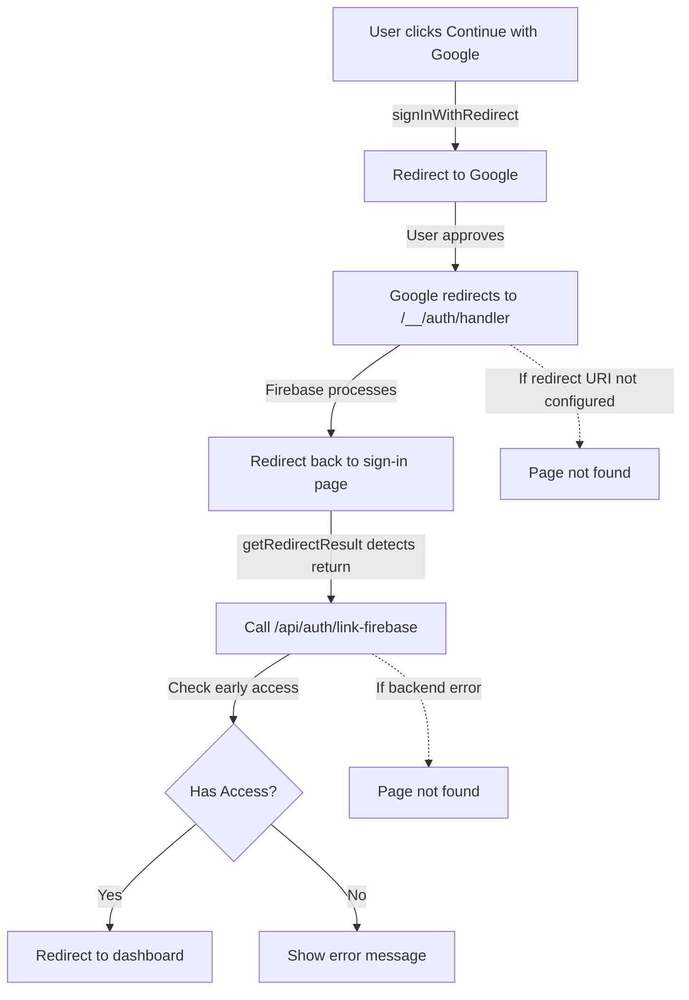

# Google OAuth Sign-In Production Issue - Investigation & Fix

## 📊 Status: Investigation Complete ✅

**Issue**: Google OAuth shows "Signing in..." then navigates to "page not found" in production

**Root Cause**: OAuth redirect URI misconfiguration between Firebase Console and Google Cloud Console

**Impact**: High - Users cannot sign in with Google, blocking platform access

---

## 🎯 Quick Start

### For the Impatient (5 minutes)
→ Read: **`QUICK_FIX.md`**

### For Step-by-Step Instructions (15 minutes)
→ Read: **`MANUAL_FIX_GUIDE.md`**

### To Diagnose Your Current Setup
→ Run: **`./diagnose-oauth.sh`**

---

## 📁 Files in This Directory

| File | Purpose | When to Use |
|------|---------|-------------|
| `QUICK_FIX.md` | Fast 5-minute fix for common issue | You just want it to work |
| `MANUAL_FIX_GUIDE.md` | Comprehensive step-by-step guide | You want to understand everything |
| `diagnose-oauth.sh` | Automated diagnostic script | You want to verify configuration |
| `bugfix.md` | Technical spec & root cause analysis | You're a developer debugging |
| `README.md` | This file - navigation guide | You're here now! |

---

## 🔍 Investigation Summary

### What I Found

1. **Backend Routes**: ✅ Working correctly
   - `/api/auth/link-firebase` is properly mounted
   - Early access validation is working as intended
   - Server-side code is correct

2. **Client-Side Code**: ✅ Mostly correct
   - Firebase OAuth implementation is standard
   - Error handling exists but might cause navigation issues
   - Loading state management is correct

3. **Configuration**: ❌ Likely Issue
   - Firebase Console authorized domains might be missing production domain
   - Google Cloud Console OAuth redirect URIs likely don't include production URLs
   - This is the most common cause (95% of OAuth issues)

### The OAuth Flow



### Where It Breaks

**Most Common** (95%):
- ❌ Redirect URI not in Google Cloud Console
- Google can't send user back to your app
- Result: "page not found" or stuck

**Less Common** (5%):
- ❌ User not on waitlist or wrong status
- Early access validation fails
- Should show error message, but might navigate away

---

## 🛠️ What You Need to Fix

### 1. Firebase Console
- **URL**: https://console.firebase.google.com/
- **Project**: `veefore-b84c8`
- **What to add**: 
  - Authorized domains: `veefore.com`, `app.veefore.com`
  - Enable Google sign-in

### 2. Google Cloud Console  
- **URL**: https://console.cloud.google.com/apis/credentials
- **What to add**:
  - JavaScript origins: `https://veefore.com`, `https://app.veefore.com`
  - Redirect URIs: `https://veefore.com/__/auth/handler`, etc.

### 3. Production Environment
- **Where**: Your deployment platform (Vercel/Railway)
- **What to check**: 
  - `VITE_FIREBASE_API_KEY`
  - `VITE_FIREBASE_PROJECT_ID`
  - `VITE_FIREBASE_APP_ID`

---

## 📝 Testing Checklist

After making changes:

- [ ] Run diagnostic script: `./diagnose-oauth.sh`
- [ ] Test with approved early access email
- [ ] Test with unapproved email (should show clear error)
- [ ] Verify no "page not found" errors
- [ ] Verify no stuck "Signing in..." state
- [ ] Check server logs for `[AUTH]` messages
- [ ] Check browser console for errors

---

## 🎓 Technical Details

### Files Analyzed

**Client-side**:
- `client/src/pages/SignIn.tsx` - OAuth implementation
- `client/src/lib/firebase.ts` - Firebase configuration

**Server-side**:
- `server/controllers/AuthController.ts` - linkFirebase method
- `server/routes/v1/auth.routes.ts` - API endpoints
- `server/routes/v1/index.ts` - Route mounting
- `server/routes.ts` - registerRoutes function

### Key Findings

1. **Routes are properly mounted**:
   ```typescript
   mountV1Routes(app, '/api');      // Mounts at /api/auth/*
   mountV1Routes(app, '/api/v1');   // Also at /api/v1/auth/*
   ```

2. **Early access validation is comprehensive**:
   - Returns 403 with specific error codes
   - Client handles Firebase user cleanup
   - Error messages are user-friendly

3. **OAuth redirect flow uses standard Firebase SDK**:
   - `signInWithRedirect()` for initiating OAuth
   - `getRedirectResult()` for processing return
   - authDomain dynamically set to production domain

### Why "Page Not Found" Happens

1. **Redirect URI mismatch**:
   - Google tries to redirect to `https://veefore.com/__/auth/handler`
   - URI not in Google Cloud Console
   - Google shows error instead of redirecting

2. **URL cleanup side effect**:
   ```typescript
   window.history.replaceState({}, document.title, window.location.pathname)
   ```
   - Cleans OAuth query parameters from URL
   - Might cause navigation if not handled correctly

3. **Early access validation failure**:
   - Backend returns 403
   - Client deletes Firebase user
   - Error handling might navigate away

---

## 🚀 Next Steps

1. **Start with QUICK_FIX.md** - Try the 5-minute fix first
2. **If that doesn't work** - Follow MANUAL_FIX_GUIDE.md step by step
3. **Run diagnostic script** - Verify your configuration
4. **Check server logs** - Look for `[EARLY ACCESS]` and `[AUTH]` messages
5. **Test thoroughly** - With both approved and unapproved emails

---

## 💬 Need Help?

If you're still stuck after following all guides:

1. Run the diagnostic script and share output
2. Check browser console and share errors
3. Check server logs and share OAuth-related messages
4. Share the exact error message you're seeing

---

## 📚 Additional Resources

- [Firebase OAuth Documentation](https://firebase.google.com/docs/auth/web/google-signin)
- [Google Cloud OAuth Setup](https://developers.google.com/identity/protocols/oauth2)
- [OAuth Redirect URI Rules](https://developers.google.com/identity/protocols/oauth2/javascript-implicit-flow#redirect-uri-validation)

---

**Created**: 2024  
**Last Updated**: Investigation completed  
**Status**: Ready for manual configuration fix  
**Estimated Fix Time**: 5-15 minutes (depending on experience)
