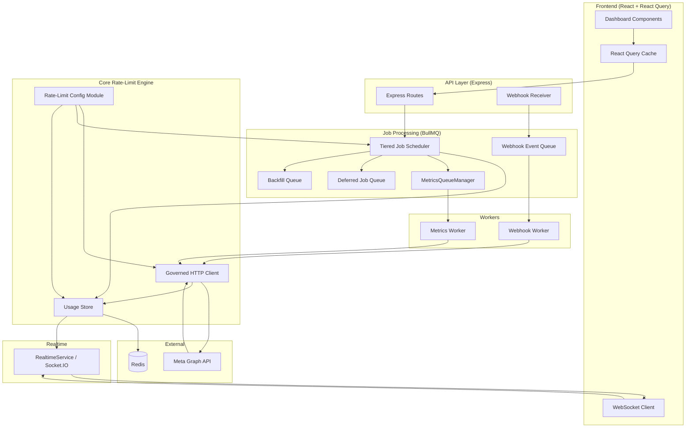
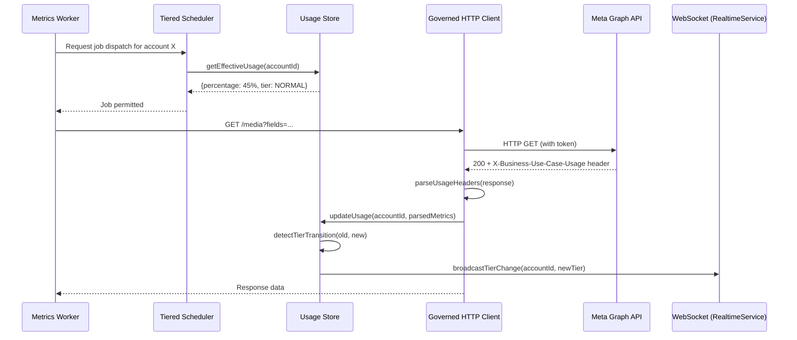

# Design Document: Instagram Rate-Limit Architecture

## Overview

This design transforms Veefore's Instagram API integration from the existing simplified flat-rate budget model (`ApiBudgetTracker` with 200 calls/hour) into a production-grade, impression-scaled rate-limit architecture governed by Meta's Business Use Case (BUC) formula (`4,800 × daily impressions` per account within a 24-hour rolling window).

The architecture introduces five core subsystems that replace or enhance existing infrastructure:

1. **Governed HTTP Client** — replaces `makeApiRequest` in `InstagramApiService`, capturing usage headers from every Meta API response
2. **Usage Store** — replaces `ApiBudgetTracker`, storing real-time per-account BUC percentages in Redis
3. **Tiered Job Scheduler** — integrates with existing `MetricsQueueManager`/BullMQ infrastructure, adding tier-aware gating
4. **Webhook Receiver/Worker Separation** — refactors existing `routes/webhooks.ts` to enqueue-only reception with separate worker processing
5. **Stale-While-Revalidate UX** — enhances existing React Query patterns with tier status indicators and "last updated" timestamps

### Key Design Decisions

| Decision | Rationale |
|----------|-----------|
| Replace `makeApiRequest` in-place | Avoids parallel code paths; all existing callers automatically gain governance |
| Replace `ApiBudgetTracker` entirely | Same Redis-based concept but with BUC awareness instead of flat 200/hour |
| Integrate with existing BullMQ | `MetricsQueueManager` already handles scheduling; adding tier checks before dispatch is additive |
| Refactor webhook handler, not rewrite | `routes/webhooks.ts` already validates signatures; separation means removing inline processing |
| Extend React Query patterns | Frontend already uses stale-while-revalidate via `@tanstack/react-query`; additions are incremental |

---

## Architecture



### Data Flow: API Call Lifecycle



---

## Components and Interfaces

### 1. Governed HTTP Client (`server/services/GovernedHttpClient.ts`)

Replaces `InstagramApiService.makeApiRequest`. All existing callers in `instagramApi.ts` will use this internally.

```typescript
interface GovernedHttpClientConfig {
  baseUrl: string; // 'https://graph.facebook.com' or 'https://graph.instagram.com'
  timeout: number;
  maxRetries: number;
  deduplicationWindowMs: number;
}

interface GovernedRequestOptions {
  method: 'GET' | 'POST';
  path: string;
  token: string;
  params?: Record<string, string>;
  body?: unknown;
  accountId: string; // Required for usage tracking
  priority?: 'critical' | 'normal' | 'low';
}

interface GovernedResponse<T> {
  data: T;
  usageMetrics: ParsedUsageMetrics | null;
  statusCode: number;
}

interface ParsedUsageMetrics {
  accountMetrics: Map<string, AccountUsageMetrics>;
  appMetrics: AppUsageMetrics | null;
}

interface AccountUsageMetrics {
  callCountPct: number;
  totalCputimePct: number;
  totalTimePct: number;
  estimatedMinutesToRegainAccess: number;
}

interface AppUsageMetrics {
  callCountPct: number;
  totalCputimePct: number;
  totalTimePct: number;
}

class GovernedHttpClient {
  constructor(config: GovernedHttpClientConfig, usageStore: UsageStore);

  async request<T>(options: GovernedRequestOptions): Promise<GovernedResponse<T>>;

  // Internal methods
  private parseBusinessUseCaseHeader(headerValue: string): Map<string, AccountUsageMetrics>;
  private parseAppUsageHeader(headerValue: string): AppUsageMetrics;
  private isDuplicate(requestKey: string): boolean;
  private retryWithBackoff<T>(fn: () => Promise<T>, retries: number): Promise<T>;
}
```

**Integration point:** `InstagramApiService.makeApiRequest` becomes a thin wrapper that delegates to `GovernedHttpClient.request`, mapping existing parameters.

### 2. Usage Store (`server/services/UsageStore.ts`)

Replaces `ApiBudgetTracker`. Same Redis connection from `metricsQueue.ts`.

```typescript
enum UsageTier {
  NORMAL = 'NORMAL',       // 0-60%
  CAUTION = 'CAUTION',     // 60-80%
  RESTRICTED = 'RESTRICTED', // 80-95%
  CRITICAL = 'CRITICAL'    // 95%+
}

enum CeilingClassification {
  HIGH = 'HIGH',
  LOW = 'LOW'
}

interface AccountUsageRecord {
  accountId: string;
  callCountPct: number;
  totalCputimePct: number;
  totalTimePct: number;
  estimatedMinutesToRegainAccess: number;
  rollingImpressionsEstimate: number | null;
  lastUpdatedAt: number; // Unix timestamp ms
  ceilingClassification: CeilingClassification;
}

interface UsageStoreConfig {
  ttlSeconds: number; // default 7200 (2 hours)
  stalenessThresholdMs: number; // default 300000 (5 minutes)
  tierThresholds: { caution: number; restricted: number; critical: number };
  highCeilingThreshold: number; // impressions threshold
}

class UsageStore {
  constructor(redis: Redis, config: UsageStoreConfig, realtimeService: RealtimeService);

  async updateUsage(accountId: string, metrics: Partial<AccountUsageMetrics>): Promise<void>;
  async updateImpressionsEstimate(accountId: string, impressions: number): Promise<void>;
  async getUsageRecord(accountId: string): Promise<AccountUsageRecord | null>;
  async getEffectiveUsage(accountId: string): Promise<{ percentage: number; tier: UsageTier; isStale: boolean }>;
  async getTier(accountId: string): Promise<UsageTier>;
  async getCeilingClassification(accountId: string): Promise<CeilingClassification>;
  async escalateToCritical(accountId: string, minutesToRegain: number): Promise<void>;

  // Pure functions (testable)
  static computeEffectivePercentage(record: AccountUsageRecord): number;
  static determineTier(percentage: number, thresholds: UsageStoreConfig['tierThresholds']): UsageTier;
  static classifyCeiling(impressions: number | null, threshold: number): CeilingClassification;
}
```

**Fallback behavior:** When Redis is unavailable, the store maintains a local `Map<string, AccountUsageRecord>` as a degraded cache, defaulting unknown accounts to Caution tier.

### 3. Tiered Job Scheduler (`server/services/TieredJobScheduler.ts`)

Integrates with existing `MetricsQueueManager`. Acts as a gating layer that checks usage before allowing `MetricsQueueManager` to dispatch jobs.

```typescript
enum JobType {
  ANALYTICS_REFRESH = 'ANALYTICS_REFRESH',
  BACKFILL = 'BACKFILL',
  POLLING = 'POLLING',
  AUTOMATION_REPLY = 'AUTOMATION_REPLY',
  SCHEDULED_POST = 'SCHEDULED_POST',
  USER_INITIATED = 'USER_INITIATED',
  ACTIVE_VIEW = 'ACTIVE_VIEW'
}

interface ScheduledJob {
  id: string;
  accountId: string;
  type: JobType;
  payload: unknown;
  priority: number;
  scheduledAt: number;
  retryCount: number;
  maxRetries: number;
  deferredAt?: number;
}

interface TierPolicy {
  permitted: JobType[];
}

interface PollingCadence {
  accountInsightsMs: number;
  postInsightsRecentMs: number;
  postInsightsOlderMs: number;
  newPostDetectionMs: number;
  followerCountMs: number;
}

class TieredJobScheduler {
  constructor(
    usageStore: UsageStore,
    queueManager: MetricsQueueManager,
    config: RateLimitConfig,
    realtimeService: RealtimeService
  );

  async canDispatch(accountId: string, jobType: JobType): Promise<boolean>;
  async dispatchOrDefer(job: ScheduledJob): Promise<'dispatched' | 'deferred'>;
  async getPollingCadence(accountId: string): Promise<PollingCadence>;
  async reEvaluateDeferredJobs(accountId: string): Promise<number>; // returns count dispatched
  async getDeferredJobCount(accountId: string): Promise<number>;

  // Pure function (testable)
  static isJobPermitted(tier: UsageTier, jobType: JobType, tierPolicies: Record<UsageTier, TierPolicy>): boolean;
  static computePollingCadence(classification: CeilingClassification, config: RateLimitConfig): PollingCadence;
}
```

**Integration:** `MetricsWorker.processMetricsFetchJob` gains a pre-check call to `TieredJobScheduler.canDispatch` before executing. `MetricsQueueManager.scheduleMetricsFetch` and `scheduleSmartPolling` use `getPollingCadence` to determine repeat intervals.

### 4. Webhook Receiver Refactor (`server/routes/webhooks.ts`)

The existing webhook route already validates signatures and returns 200. The refactor removes inline `processWebhookEntry` logic from the request handler, making it enqueue-only.

```typescript
// Simplified webhook POST handler (in routes/webhooks.ts)
router.post('/instagram', verifyWebhookSignature, async (req, res) => {
  // Return 200 immediately — no processing inline
  res.status(200).json({ status: 'received' });

  // Enqueue each entry for async processing
  const { object, entry } = req.body;
  if (object === 'instagram' && Array.isArray(entry)) {
    for (const entryItem of entry) {
      await WebhookQueueManager.enqueue(entryItem);
    }
  }
});
```

**Webhook Worker** (`server/workers/webhookWorker.ts`) — new dedicated worker:

```typescript
class WebhookWorker {
  constructor(
    usageStore: UsageStore,
    governedClient: GovernedHttpClient,
    config: RateLimitConfig
  );

  async processEvent(event: WebhookEvent): Promise<void>;
  private async evaluateAutomationRules(event: WebhookEvent): Promise<AutomationAction | null>;
  private async executeReply(accountId: string, action: AutomationAction): Promise<void>;
}
```

**Queue isolation:** A separate BullMQ queue (`webhook-events`) with per-account concurrency limits via `bullmq` group feature, ensuring one account's flood doesn't starve others.

### 5. Rate-Limit Configuration Module (`server/config/rateLimitConfig.ts`)

```typescript
interface RateLimitConfig {
  // Meta-published constants
  bucMultiplier: number; // 4800
  platformRateLimitMultiplier: number; // 200
  publishLimitPerDay: number; // 25
  messagingCeilingPerHour: number;

  // Tier thresholds
  tierThresholds: {
    caution: number; // 60
    restricted: number; // 80
    critical: number; // 95
  };

  // Polling cadence (all in ms)
  polling: {
    highCeiling: PollingCadence;
    lowCeiling: PollingCadence;
  };

  // Classification
  highCeilingImpressionThreshold: number; // e.g., 1000

  // Queue config
  queue: {
    webhookConcurrencyPerAccount: number;
    maxDeferredRetries: number;
    deferredAlertThresholdHours: number;
    queueDepthAlertThreshold: number;
  };

  // TTLs
  usageRecordTtlSeconds: number; // 7200
  stalenessThresholdMs: number; // 300000

  // Backfill
  initialFetchCount: number; // 25
  initialFetchCountLowCeiling: number; // 20

  // Timeouts
  httpTimeoutMs: number; // 10000
  maxRetries: number; // 3
  deduplicationWindowMs: number; // 2000

  // Error message mapping
  errorMessageMap: Record<string | number, string>;
}
```

### 6. Frontend Enhancements

**New React Query wrapper with tier awareness:**

```typescript
// client/src/hooks/useGovernedQuery.ts
interface GovernedQueryMeta {
  lastUpdatedAt: number | null;
  tier: UsageTier;
  isStale: boolean;
  nextRefreshEstimate: string | null; // "~20 minutes"
}

function useGovernedQuery<T>(
  queryKey: QueryKey,
  queryFn: QueryFunction<T>,
  accountId: string
): UseQueryResult<T> & { meta: GovernedQueryMeta };
```

**WebSocket tier status listener** (enhances existing `instagram-webhook-listener.tsx`):

```typescript
// New events listened to:
// 'tier-change' → { accountId, oldTier, newTier, estimatedMinutesToRecover }
// 'sync-complete' → { accountId, postsLoaded }
// 'deferred-operation' → { accountId, operation, estimatedRetryMinutes }
```

---

## Data Models

### Redis Key Schema

```
usage:{accountId}              → Hash (AccountUsageRecord fields)
usage:{accountId}:tier_history → List (last N tier transitions for observability)
deferred:{accountId}           → Sorted Set (score = priority, value = job JSON)
webhook:queue                  → BullMQ Queue (webhook-events)
backfill:queue                 → BullMQ Queue (backfill-jobs)
```

### AccountUsageRecord (Redis Hash)

| Field | Type | Description |
|-------|------|-------------|
| `call_count_pct` | number (0-100) | Current BUC call count percentage |
| `total_cputime_pct` | number (0-100) | Current CPU time percentage |
| `total_time_pct` | number (0-100) | Current total time percentage |
| `estimated_minutes_to_regain` | number | Minutes until throttle lifts (0 = not throttled) |
| `rolling_impressions_estimate` | number \| null | Latest daily impressions count |
| `last_updated_at` | number | Unix timestamp (ms) of last header update |
| `ceiling_classification` | 'HIGH' \| 'LOW' | Derived from impressions vs threshold |

### DeferredJob (BullMQ Job Data)

```typescript
interface DeferredJobData {
  originalJobId: string;
  accountId: string;
  jobType: JobType;
  payload: unknown;
  originalScheduledAt: number;
  deferredAt: number;
  retryCount: number;
  maxRetries: number;
  priority: number; // Lower = higher priority
}
```

### WebhookEvent (BullMQ Job Data)

```typescript
interface WebhookEventData {
  instagramAccountId: string;
  eventType: 'comment' | 'mention' | 'story_insights' | 'message' | 'media_update';
  rawPayload: unknown;
  receivedAt: number;
}
```

### Tier Policy Matrix (Config-Driven)

| Job Type | Normal | Caution | Restricted | Critical |
|----------|--------|---------|------------|----------|
| ANALYTICS_REFRESH | ✅ | ❌ defer | ❌ defer | ❌ defer |
| BACKFILL | ✅ | ❌ defer | ❌ defer | ❌ defer |
| POLLING | ✅ | ❌ defer | ❌ defer | ❌ defer |
| AUTOMATION_REPLY | ✅ | ✅ | ❌ defer | ❌ defer |
| SCHEDULED_POST | ✅ | ✅ | ❌ defer | ✅ (due now only) |
| USER_INITIATED | ✅ | ✅ | ❌ defer | ❌ defer |
| ACTIVE_VIEW | ✅ | ✅ | ✅ | ❌ defer |

---

## Correctness Properties

*A property is a characteristic or behavior that should hold true across all valid executions of a system — essentially, a formal statement about what the system should do. Properties serve as the bridge between human-readable specifications and machine-verifiable correctness guarantees.*

### Property 1: Usage Header Parsing Round-Trip

*For any* valid `X-Business-Use-Case-Usage` header containing 1–32 account entries with percentage values in [0, 100] and any `X-App-Usage` header with percentage fields, parsing the header and writing to the Usage Store then reading back should yield the same metric values for every account present in the header.

**Validates: Requirements 1.2, 1.3, 1.4, 2.1**

### Property 2: Missing Header Preserves State

*For any* account with existing usage data in the store, when a Meta API response is received with no usage headers, the stored values for that account shall remain identical to their prior state (not overwritten to zero or cleared).

**Validates: Requirements 1.5, 2.3**

### Property 3: Throttle Codes Escalate to Critical Tier

*For any* Meta API response with error code 80002 or HTTP status 429 targeting a specific account, the Usage Store shall reflect Critical tier for that account, and the `estimatedMinutesToRegainAccess` shall match the value from the response.

**Validates: Requirements 1.9**

### Property 4: Effective Usage is Maximum of Three Metrics

*For any* account usage record containing `callCountPct`, `totalCputimePct`, and `totalTimePct`, the effective usage percentage returned by the Usage Store shall equal `max(callCountPct, totalCputimePct, totalTimePct)`.

**Validates: Requirements 2.6**

### Property 5: Tier Determines Job Permission

*For any* usage percentage in [0, 100] and any job type, the tier policy function shall return `permitted` if and only if the job type appears in the permitted list for the tier determined by that percentage. Specifically: all jobs permitted at Normal (0–60%), only high-priority jobs at Caution (60–80%), only active-view work at Restricted (80–95%), and only due-now publishing at Critical (95%+).

**Validates: Requirements 4.1, 4.2, 4.3, 4.4**

### Property 6: Account Isolation

*For any* set of accounts with varying usage tiers, the job dispatch decision for one account shall depend solely on that account's own usage percentage and tier — never on another account's state. A Critical-tier account shall not prevent or delay job processing for a Normal-tier account.

**Validates: Requirements 4.9, 12.3**

### Property 7: Polling Cadence Scales with Ceiling Classification

*For any* account, if classified as high-ceiling the polling interval for each data type shall be shorter than or equal to the interval for the same data type on a low-ceiling account. The intervals shall fall within the configured ranges for each classification.

**Validates: Requirements 5.1, 5.2, 5.3, 5.4, 3.4**

### Property 8: Deferred Jobs Re-dispatch on Usage Drop

*For any* set of deferred jobs for an account, when that account's effective usage drops below the configured re-dispatch threshold (80%), all deferred jobs shall become eligible for dispatch in priority order, with earlier-deferred jobs dispatched before later-deferred jobs at the same priority level.

**Validates: Requirements 4.5, 11.2, 11.5**

### Property 9: Webhook Signature Validation

*For any* webhook payload, computing HMAC-SHA256 with the configured app secret and comparing against the provided `X-Hub-Signature-256` header shall correctly accept valid signatures and reject invalid ones. No payload with an invalid signature shall be enqueued.

**Validates: Requirements 7.1**

### Property 10: Error Code Mapping Produces User-Friendly Messages

*For any* Meta API error code (including 80002, 429, and all other mapped codes), the error mapping function shall produce a non-empty, plain-language message that does not contain the numeric error code, HTTP status code, or Meta's raw error string.

**Validates: Requirements 8.5, 8.8**

### Property 11: Ceiling Classification is Consistent

*For any* impressions value, if the value is above the configured high-ceiling threshold the classification shall be HIGH, if below or null the classification shall be LOW. Newly connected accounts with null impressions shall always classify as LOW.

**Validates: Requirements 3.2, 3.3**

---

## Error Handling

### Error Categories and Responses

| Error Source | Handling Strategy | User-Facing Behavior |
|---|---|---|
| Meta API 429 / code 80002 | Escalate to Critical tier, set `estimatedMinutesToRegainAccess`, defer all non-critical work | "Analytics for [account] will refresh in ~X minutes" |
| Meta API 4xx (other) | Parse usage headers if present, propagate error to caller with mapped message | Friendly error message from `errorMessageMap` |
| Meta API 5xx | Retry with exponential backoff (3 attempts), parse headers on each attempt | Silent retry; show stale data in meantime |
| Redis unavailable | Degrade to local memory cache, default unknown accounts to Caution tier | No visible change to user; slightly conservative scheduling |
| Webhook signature invalid | Return 401, do not enqueue | N/A (server-to-server) |
| Webhook worker failure | Retry with exponential backoff, dead-letter after max retries | N/A (background processing) |
| Deferred job max retries exceeded | Emit monitoring alert, move to dead-letter queue | "Some background tasks are delayed" badge |
| Token expired | Token refresh is a Critical-priority job, permitted even at Critical tier | "Reconnect your account" only after refresh fails |

### Retry Strategy

```typescript
interface RetryConfig {
  maxAttempts: number; // 3 for HTTP, configurable for deferred jobs
  baseDelayMs: number; // 1000
  maxDelayMs: number; // 30000
  backoffMultiplier: number; // 2
  jitter: boolean; // true — prevent thundering herd
}
```

### Graceful Degradation Cascade

1. **Redis down** → Local memory fallback → Caution tier default → System continues with conservative scheduling
2. **Worker crash** → BullMQ auto-retries from Redis persistence → No data loss
3. **Webhook receiver overloaded** → BullMQ queue absorbs burst → Workers drain at sustainable rate
4. **All accounts Critical** → Only due-now posts publish → Everything else deferred → System self-heals as usage windows roll

---

## Testing Strategy

### Property-Based Testing (fast-check)

The project already includes `fast-check@4.8.0` and `vitest@4.1.8`. Each correctness property maps to a dedicated property-based test file.

**Configuration:**
- Minimum 100 iterations per property test
- Each test tagged with: `Feature: instagram-rate-limit-architecture, Property {N}: {title}`
- Tests run via `vitest run` (single execution, no watch mode)

**Test files:**
- `server/services/__tests__/UsageStore.property.test.ts` — Properties 1, 2, 3, 4, 11
- `server/services/__tests__/TieredJobScheduler.property.test.ts` — Properties 5, 6, 7, 8
- `server/services/__tests__/GovernedHttpClient.property.test.ts` — Properties 1, 9
- `server/services/__tests__/errorMapping.property.test.ts` — Property 10

### Unit Tests (vitest)

- `GovernedHttpClient`: timeout behavior, retry logic, deduplication window
- `UsageStore`: TTL expiry, Redis fallback, partial field updates
- `TieredJobScheduler`: specific tier boundary examples (59% → Normal, 60% → Caution)
- `RateLimitConfig`: type validation, environment override loading
- `WebhookReceiver`: response timing, enqueue verification
- Error message mapping: each known Meta error code → expected message

### Integration Tests

- Full flow: API call → header parse → store update → tier change → WebSocket event
- Webhook: receive → enqueue → worker processes → reply via governed client
- Deferred job lifecycle: defer → usage drops → re-dispatch
- Redis failover: primary down → local cache fallback → recovery

### Load/Stress Tests (manual, pre-production)

- Comment flood simulation: 10,000 webhook events for one account in 60 seconds
- Multi-account isolation: one account at Critical, verify others unaffected
- Low-ceiling account protection: simulate 10-impression account with aggressive polling config, verify self-throttling

### Lint Rules (architectural enforcement)

- ESLint rule or test scanning for direct `axios`/`fetch` calls to `graph.facebook.com` or `graph.instagram.com` outside `GovernedHttpClient`
- No bare numeric literals for tier thresholds, polling intervals, or Meta-published constants outside `rateLimitConfig.ts`
