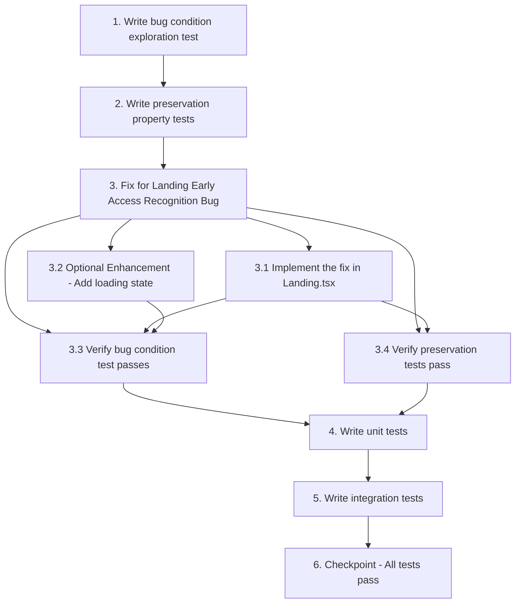

# Implementation Plan

## Overview

This bugfix implements automatic early access status verification for the Landing page component. Users with stored early access credentials will have their status verified against the backend API on mount, ensuring approved users see "Get Started" buttons instead of "Join Waitlist" buttons.

**Key Changes:**
- Add `useEffect` hook in Landing.tsx to call `checkStatus` on mount when email exists in localStorage
- Extract `checkStatus` function from `useEarlyAccessCheck` hook
- Implement exploratory test to confirm bug before fix (expected to fail)
- Implement preservation tests to ensure non-approved user behavior is unchanged
- Add comprehensive unit and integration tests

**Workflow Methodology:** Bug Condition Methodology
- Property 1 (Bug Condition): Tests that checkStatus is called on mount with stored credentials
- Property 2 (Preservation): Tests that non-approved users continue to see "Join Waitlist" behavior

## Tasks

- [x] 1. Write bug condition exploration test
  - **Property 1: Bug Condition** - Landing Page Status Check Missing
  - **CRITICAL**: This test MUST FAIL on unfixed code - failure confirms the bug exists
  - **DO NOT attempt to fix the test or the code when it fails**
  - **NOTE**: This test encodes the expected behavior - it will validate the fix when it passes after implementation
  - **GOAL**: Surface counterexamples that demonstrate the bug exists
  - **Scoped PBT Approach**: Test the concrete failing case: Landing component mounts with early access credentials in localStorage but checkStatus is never called
  - Test implementation details from Bug Condition in design:
    - Mock localStorage with `veefore_early_access_email` and `veefore_early_access_status: 'approved'`
    - Spy on `checkStatus` function from `useEarlyAccessCheck` hook
    - Render Landing component
    - Assert that `checkStatus` was NOT called on mount (this will FAIL on unfixed code, proving the bug)
    - Assert that UI displays "Join Waitlist" instead of "Get Started" (this will FAIL on unfixed code)
  - The test assertions should match the Expected Behavior Properties from design:
    - After fix: `checkStatus` SHOULD be called with stored email on mount
    - After fix: UI SHOULD display "Get Started" for approved users
  - Run test on UNFIXED code
  - **EXPECTED OUTCOME**: Test FAILS (this is correct - it proves the bug exists)
  - Document counterexamples found:
    - `checkStatus` is never invoked when Landing mounts with credentials
    - Button text remains "Join Waitlist" when it should be "Get Started"
  - Mark task complete when test is written, run, and failure is documented
  - _Requirements: 1.1, 1.2, 1.3, 1.4_

- [x] 2. Write preservation property tests (BEFORE implementing fix)
  - **Property 2: Preservation** - Non-Early-Access User Experience
  - **IMPORTANT**: Follow observation-first methodology
  - Observe behavior on UNFIXED code for non-buggy inputs (users WITHOUT early access credentials):
    - Test 1: Empty localStorage → observe "Join Waitlist" button displayed
    - Test 2: Click "Join Waitlist" without credentials → observe waitlist modal opens
    - Test 3: localStorage with only `veefore_early_access_email` but no status → observe "Join Waitlist" displayed
    - Test 4: localStorage with `veefore_early_access_status: 'pending'` → observe "Join Waitlist" displayed
  - Write property-based tests capturing observed behavior patterns from Preservation Requirements:
    - Property: For all page loads where `veefore_early_access_email` is NOT in localStorage OR `veefore_early_access_status` is NOT 'approved', Landing component SHALL display "Join Waitlist" button
    - Property: For all clicks on "Join Waitlist" button by non-approved users, waitlist modal SHALL open
    - Property: For all localStorage states without valid early access credentials, `checkStatus` SHALL NOT be called (or if called, SHALL NOT affect UI negatively)
  - Property-based testing generates many test cases for stronger guarantees
  - Run tests on UNFIXED code
  - **EXPECTED OUTCOME**: Tests PASS (this confirms baseline behavior to preserve)
  - Mark task complete when tests are written, run, and passing on unfixed code
  - _Requirements: 3.1, 3.2, 3.3, 3.4, 3.5_

- [x] 3. Fix for Landing Early Access Recognition Bug

  - [x] 3.1 Implement the fix in Landing.tsx
    - File: `client/src/pages/Landing.tsx`
    - Extract `checkStatus` function from `useEarlyAccessCheck` hook:
      ```typescript
      const { hasEarlyAccess, checkStatus } = useEarlyAccessCheck()
      ```
    - Add `useEffect` hook that runs on component mount:
      ```typescript
      useEffect(() => {
        const email = localStorage.getItem('veefore_early_access_email')
        if (email) {
          checkStatus(email)
        }
      }, [checkStatus])
      ```
    - Ensure the useEffect explicitly calls `checkStatus` with the stored email when email exists in localStorage
    - Verify that the hook's state updates trigger re-render with correct UI (button text changes from "Join Waitlist" to "Get Started")
    - _Bug_Condition: isBugCondition(pageLoad) where localStorage.getItem('veefore_early_access_email') !== null AND Landing component mounts AND checkStatus is NOT called_
    - _Expected_Behavior: For all page loads where early access credentials exist in localStorage, Landing component SHALL call checkStatus on mount and display "Get Started" button if user has early access_
    - _Preservation: All non-early-access user scenarios (no email, invalid status) SHALL continue to display "Join Waitlist" and open waitlist modal_
    - _Requirements: 1.1, 1.2, 1.3, 1.4, 2.1, 2.2, 2.3, 2.4, 2.5, 3.1, 3.2, 3.3, 3.4, 3.5_

  - [x] 3.2 (Optional Enhancement) Add loading state handling
    - Extract `isLoading` from `useEarlyAccessCheck` hook:
      ```typescript
      const { hasEarlyAccess, isLoading, checkStatus } = useEarlyAccessCheck()
      ```
    - Update button text rendering to show loading state during verification:
      ```typescript
      {isLoading ? "Verifying..." : (hasEarlyAccess ? "Get Started" : "Join Waitlist")}
      ```
    - This prevents flash of incorrect content during API verification
    - _Requirements: 2.1, 2.2_

  - [x] 3.3 Verify bug condition exploration test now passes
    - **Property 1: Expected Behavior** - Landing Page Status Check on Mount
    - **IMPORTANT**: Re-run the SAME test from task 1 - do NOT write a new test
    - The test from task 1 encodes the expected behavior
    - When this test passes, it confirms the expected behavior is satisfied
    - Run bug condition exploration test from step 1
    - **EXPECTED OUTCOME**: Test PASSES (confirms bug is fixed)
    - Assertions that should now pass:
      - `checkStatus` IS called on mount when early access credentials exist in localStorage
      - `checkStatus` IS called with the stored email from localStorage
      - UI displays "Get Started" button for approved users (after async status verification completes)
    - _Requirements: Expected Behavior Properties from design (2.1, 2.2, 2.3, 2.4)_

  - [x] 3.4 Verify preservation tests still pass
    - **Property 2: Preservation** - Non-Early-Access User Experience Preserved
    - **IMPORTANT**: Re-run the SAME tests from task 2 - do NOT write new tests
    - Run preservation property tests from step 2
    - **EXPECTED OUTCOME**: Tests PASS (confirms no regressions)
    - Confirm all preservation scenarios still work:
      - Users without credentials see "Join Waitlist"
      - Waitlist modal opens for non-approved users
      - Partial or invalid credentials don't break UI
      - localStorage synchronization continues working
    - _Requirements: Preservation Requirements from design (3.1, 3.2, 3.3, 3.4, 3.5)_

- [x] 4. Write unit tests for Landing component changes
  - Test that Landing component calls `checkStatus` when mounted with stored email in localStorage
  - Test that Landing component does NOT call `checkStatus` when mounted without stored email
  - Test that button text changes from "Join Waitlist" to "Get Started" when `hasEarlyAccess` becomes true after async verification
  - Test that button onClick handler navigates to signup page when `hasEarlyAccess` is true
  - Test that button onClick handler opens waitlist modal when `hasEarlyAccess` is false
  - Test that `checkStatus` is called with the exact email value from localStorage
  - Test multiple mount/unmount cycles: verify `checkStatus` is called on each mount
  - Test loading state display during verification (if optional enhancement 3.2 was implemented)
  - _Requirements: 2.1, 2.2, 2.3, 2.4, 2.5_

- [x] 5. Write integration tests for full user flows
  - **Test Flow 1: Approved User Returns to Landing**
    - Setup: User completes waitlist → admin approves → email stored in localStorage as `veefore_early_access_email`
    - Action: User navigates to landing page
    - Assert: `checkStatus` API call is made to `/api/early-access/status` with stored email
    - Assert: API returns `{ hasEarlyAccess: true, status: 'early_access' }`
    - Assert: UI displays "Get Started" button
    - Action: User clicks "Get Started"
    - Assert: Navigation to signup page occurs
  - **Test Flow 2: Status Revocation Scenario**
    - Setup: User has early access credentials in localStorage
    - Mock: API returns `{ hasEarlyAccess: false, status: 'revoked' }`
    - Action: User navigates to landing page
    - Assert: `checkStatus` is called and updates state based on API response
    - Assert: UI displays "Join Waitlist" button (reflecting revoked status)
    - Assert: localStorage is updated to reflect revoked status
  - **Test Flow 3: Cross-Tab Synchronization (Existing Behavior)**
    - Setup: User has early access on one tab
    - Action: Another tab with landing page is opened
    - Assert: Storage event listener triggers state update
    - Assert: Landing page shows "Get Started" without needing manual refresh
    - This tests that existing cross-tab sync behavior is preserved
  - **Test Flow 4: Network Failure Handling**
    - Setup: User has credentials in localStorage
    - Mock: API call to `/api/early-access/status` fails (network error, 500 response)
    - Action: User navigates to landing page
    - Assert: `checkStatus` handles error gracefully (no crash)
    - Assert: UI shows appropriate fallback state (either cached state or "Join Waitlist")
    - Assert: Error is logged but does not break page rendering
  - **Test Flow 5: First-Time Visitor Flow (Preservation)**
    - Setup: No localStorage data (first visit)
    - Action: User navigates to landing page
    - Assert: No API call is made (no email to check)
    - Assert: UI displays "Join Waitlist" button
    - Action: User clicks "Join Waitlist"
    - Assert: Waitlist modal opens
    - This confirms preservation of existing behavior for new users
  - _Requirements: 2.1, 2.2, 2.3, 2.4, 3.1, 3.2, 3.3, 3.4, 3.5_

- [x] 6. Checkpoint - Ensure all tests pass
  - Run all unit tests and verify they pass
  - Run all integration tests and verify they pass
  - Run bug condition exploration test (Property 1) and confirm it passes (bug is fixed)
  - Run preservation property tests (Property 2) and confirm they pass (no regressions)
  - Verify no console errors or warnings during test execution
  - Verify Landing component correctly displays "Get Started" for approved users in browser testing
  - Verify Landing component correctly displays "Join Waitlist" for non-approved users in browser testing
  - Ask the user if questions arise or if manual testing is needed


## Task Dependency Graph



```json
{
  "waves": [
    {
      "name": "Wave 1: Bug Exploration & Preservation Testing",
      "tasks": ["1", "2"]
    },
    {
      "name": "Wave 2: Implementation & Verification",
      "tasks": ["3.1", "3.2", "3.3", "3.4"]
    },
    {
      "name": "Wave 3: Comprehensive Testing",
      "tasks": ["4", "5"]
    },
    {
      "name": "Wave 4: Final Validation",
      "tasks": ["6"]
    }
  ]
}
```

**Critical Dependencies:**
- Task 1 (Bug Condition Test) MUST run and FAIL on unfixed code before proceeding to Task 3
- Task 2 (Preservation Tests) MUST run and PASS on unfixed code before proceeding to Task 3
- Task 3.1 (Implementation) MUST be completed before running Task 3.3 and 3.4 (verification)
- Task 3.3 and 3.4 (Verification) MUST pass before proceeding to Task 4 (Unit Tests)
- All previous tests MUST pass before Task 6 (Final Checkpoint)

## Notes

### Bug Condition Methodology

This bugfix follows the bug condition methodology:
- **C(X)**: Bug Condition - Landing component mounts with early access credentials in localStorage but `checkStatus` is not called
- **P(result)**: Property - Landing component SHALL call `checkStatus` on mount and display appropriate UI based on verified status
- **¬C(X)**: Non-buggy inputs - Landing component mounts without credentials or with invalid credentials
- **F**: Original (unfixed) Landing.tsx - does not call `checkStatus` explicitly on mount
- **F'**: Fixed Landing.tsx - explicitly calls `checkStatus` on mount when credentials exist

### Testing Strategy

**Exploratory Testing (Task 1):**
- Write test BEFORE fix to confirm bug exists
- Test WILL FAIL on unfixed code (this is expected and correct)
- Demonstrates that `checkStatus` is not called and UI shows wrong button

**Preservation Testing (Task 2):**
- Write tests BEFORE fix using observation-first methodology
- Observe actual behavior on unfixed code for non-approved users
- Tests WILL PASS on unfixed code (confirms baseline to preserve)
- Property-based testing recommended for comprehensive coverage

**Fix Verification (Task 3.3, 3.4):**
- Re-run SAME tests from Task 1 and Task 2
- Task 1 test should NOW PASS (bug is fixed)
- Task 2 tests should STILL PASS (no regressions)

### Property-Based Test Hover Status

Tasks 1 and 2 use the **Property N:** format to enable hover status visualization in the Kiro IDE:
- **Property 1: Bug Condition** - Hover will show test execution status
- **Property 2: Preservation** - Hover will show test execution status

### File References

**Main Implementation File:**
- `client/src/pages/Landing.tsx` - Landing page component requiring the fix

**Hook File:**
- `client/src/hooks/useEarlyAccessCheck.ts` - Provides `checkStatus` function and `hasEarlyAccess` state

**localStorage Keys:**
- `veefore_early_access_email` - Stores user's email
- `veefore_early_access_status` - Stores approval status ('approved', 'pending', etc.)

**API Endpoint:**
- `GET /api/early-access/status?email={email}` - Verifies current early access status

### Optional Enhancement

Task 3.2 (loading state handling) is optional but recommended for better UX:
- Prevents flash of incorrect content during API verification
- Shows "Verifying..." text while status check is in progress
- Extracts `isLoading` state from `useEarlyAccessCheck` hook
