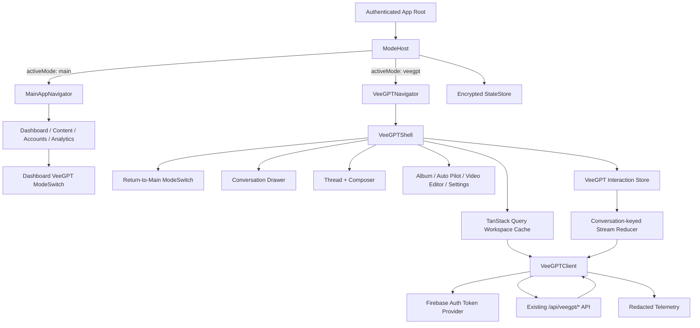

# Design Document: Mobile VeeGPT Interface

## Overview

This design replaces the React Native app's Copilot tab and dashboard API-diagnostics entry point with one production VeeGPT experience. `Main_App_Mode` and `VeeGPT_Mode` are persistent sibling roots owned by a new `ModeHost`; neither mode is pushed onto the other's navigation stack. Switching modes preserves each root's independent state, and encrypted user-scoped persistence restores the last-used mode after authentication and cold launch.

The mobile client reuses the existing authenticated `/api/veegpt/*` capability families and their backend-authoritative workspace, entitlement, model, tool, memory, usage, research, media, and rich-action behavior. It does not introduce chat endpoints, fall back to `/ai/chat`, or retain a second assistant identity.

The experience is an original Veefore product surface: restrained Veefore gradients, deep neutral conversation chrome, high-contrast typography, responsive native sheets, and purposeful motion. It follows familiar mobile conversation conventions without copying third-party names, artwork, or protected visual assets.

## Goals and Non-Goals

### Goals

- Make Main App and VeeGPT equal, independently persistent primary modes.
- Replace the dashboard diagnostics FAB with an accessible VeeGPT mode switch.
- Deliver production-grade chat, streaming, history/search, attachments, tools, research, image generation, rich cards, memory, usage, assets, and advanced VeeGPT surfaces.
- Preserve drafts and server-confirmed content through mode changes, process death, connectivity loss, and recoverable stream interruption.
- Enforce workspace isolation, backend entitlements, authenticated asset delivery, and privacy-safe telemetry at every boundary.
- Remove Copilot and diagnostics routes, code paths, labels, and obsolete persisted navigation state.

### Non-Goals

- Reimplementing VeeGPT backend logic or adding mobile-only AI routes.
- Queuing or automatically sending messages while offline.
- Reproducing the web DOM implementation inside a WebView.
- Maintaining compatibility with `/ai/chat`, the Copilot identity, or the API diagnostics screen.
- Persisting authentication tokens, provider keys, raw attachment bodies, or private asset URLs in VeeGPT state.
## Architectural Decisions

1. **Sibling roots, not a VeeGPT screen:** `ModeHost` owns two always-addressable navigator roots. Main App keeps its native bottom-tab navigator; VeeGPT owns a full-screen native-stack navigator.
2. **Persistent state by user and workspace:** active mode is user-scoped; conversation state, drafts, views, and server cache are user-and-workspace-scoped. Scope keys prevent data bleed.
3. **Server state and interaction state remain separate:** TanStack Query owns fetched entities; the VeeGPT store owns drafts, selections, stream reducers, scroll anchors, and mode/navigation snapshots.
4. **Streaming uses fetch, not Axios:** ordinary requests continue through the authenticated API abstraction, while NDJSON uses an authenticated `fetch` transport because React Native Axios does not expose an incremental response reader consistently.
5. **One reducer per conversation:** streams, polling snapshots, rich cards, and optimistic state are keyed by `conversationId`; selection never determines event ownership.
6. **Backend authority:** availability, limits, progress labels, fallback offers, model access, action status, and asset permissions come from API responses. The client never invents capabilities or silently downgrades.
7. **Explicit recovery:** reconnection refreshes; it never sends. Ambiguous non-idempotent failures reconcile server state before retry is enabled.
8. **Original native UI:** React Native views, virtualized lists, native sheets, native share/download, and native accessibility are used throughout. No VeeGPT WebView shell is introduced.

## Architecture



### Runtime Ownership

- `AuthenticatedAppRoot` waits for auth, migration, and minimal mode restoration before displaying either primary mode.
- `ModeHostProvider` owns `activeMode`, both navigation snapshots, transition locking, legacy-route migration, deep-link mode selection, and back-at-root behavior.
- `MainAppNavigator` retains Dashboard, Content, Accounts, and Analytics tabs. Existing detail screens remain nested under Main App. Copilot is absent.
- `VeeGPTNavigator` owns `Chat`, `Album`, `AutoPilot`, `VideoEditor`, `Memory`, `Usage`, `ResearchHistory`, and authenticated artifact viewers. These are children of VeeGPT, not additional assistant identities.
- `VeeGPTShell` keeps mode-level chrome, drawer, current view, and composer host stable while child surfaces change.
- `VeeGPTClient` is the only mobile boundary allowed to construct production VeeGPT requests.

## Navigation and Mode State

### Navigator Shape

```ts
type PrimaryMode = 'main' | 'veegpt';

type AuthenticatedRootParamList = {
  ModeHost: undefined;
};

type MainTabParamList = {
  Dashboard: undefined;
  Content: undefined;
  Accounts: undefined;
  Analytics: undefined;
};

type VeeGPTStackParamList = {
  Chat: { conversationId?: number; messageId?: number } | undefined;
  Album: { assetId?: string; sourceConversationId?: number } | undefined;
  AutoPilot: undefined;
  VideoEditor: { projectId?: string } | undefined;
  Memory: undefined;
  Usage: undefined;
  ResearchHistory: undefined;
  ArtifactViewer: { kind: 'image' | 'video' | 'document' | 'report'; assetId: string };
};
```

`ModeHost` renders both roots in sibling containers and changes visibility/interactivity rather than navigating from one root to the other. The inactive tree remains mounted when memory pressure permits, preserving live native navigation state. If the OS unmounts an inactive tree, its serialized snapshot is restored on demand.

### Mode Transition Protocol

1. Reject a duplicate transition while one is committing.
2. Capture the source navigator snapshot and mode interaction snapshot.
3. Persist source snapshot and target `activeMode` atomically in one versioned envelope.
4. Activate the target sibling and restore its in-memory or persisted snapshot.
5. Record transition duration and restoration outcome.
6. On persistence failure, keep the source visible and expose a retryable mode-switch error; do not visually transition to a mode that cannot be restored after process death.

At VeeGPT root, hardware/gesture back invokes `switchMode('main')`. Inside VeeGPT child routes, normal stack back behavior applies first. Main App and VeeGPT never contain routes that point to each other's root.

### Deep Links and Legacy Routes

The linking resolver normalizes incoming URLs before navigation:

- Authorized VeeGPT conversation link → activate VeeGPT, then resolve and select the conversation.
- Missing/forbidden conversation → activate VeeGPT landing and display a non-sensitive error.
- Legacy Copilot link or persisted route → activate VeeGPT landing.
- Legacy Diagnostic link or persisted route → activate Main App Dashboard.
- Unknown authenticated link → existing Main App fallback behavior.

Authorization is never inferred from the URL. The conversation is fetched through the active workspace-scoped API before content is rendered.

## Experience and Visual Design

### Veefore Design Language

The mobile VeeGPT palette extends semantic tokens rather than hard-coded component colors:

- `vee.canvas`: warm white / near-black conversation canvas.
- `vee.surface`: elevated drawer, cards, and composer surfaces.
- `vee.ink`, `vee.inkMuted`: high-contrast primary and secondary text.
- `vee.sky`: the existing Veefore sky accent for focused controls and links.
- `vee.violet`: restrained VeeGPT intelligence accent used in the logo spark and progress moments.
- `vee.success`, `vee.warning`, `vee.danger`: semantic status colors always paired with text or iconography.
- `vee.hairline`, `vee.scrim`, `vee.focus`: borders, modal scrims, and visible focus rings.

The VeeGPT mark combines the existing Veefore logo geometry with an original small star-wave motif. It appears in the mode switch and landing state only; assistant messages use typographic identity rather than repetitive avatar bubbles. Motion uses short scale/fade transitions, spring sheets, and a subtle streaming caret; reduce-motion removes translation, scale, shimmer, and continuous loops.

### Primary Surfaces

**Dashboard mode switch:** The existing bottom-right blue diagnostics FAB position becomes a 56-point VeeGPT switch with the VeeGPT mark, a compact `VeeGPT` label on wider devices, and accessibility state `Main App, switch to VeeGPT`. The dashboard quick action formerly labeled AI Copilot becomes `VeeGPT` and invokes the same mode action.

**VeeGPT header:** A compact top bar contains drawer, VeeGPT wordmark/current child title, contextual selection summary, and a Veefore-return switch. It remains usable at 200% text by collapsing labels before controls.

**Landing state:** A calm branded welcome, one-line workspace-aware description, backend-provided prompt chips, and the full composer. Prompt chips populate but never submit. Existing history exposes the drawer; a truly new workspace does not render an empty list.

**Conversation drawer:** A native drawer on tablets and modal bottom/side sheet on phones. It contains New chat, debounced search, virtualized recent history, research/album links, memory/usage/settings, workspace/account summary, and pagination sentinels. Search result rows show title, safe snippet, and match location.

**Thread:** An inverted or bottom-anchored virtualized list with stable message keys, measured row caching, markdown-native blocks, inline progress, rich cards, and a jump-to-latest affordance. User messages use a subtle Veefore-tinted surface; assistant responses are spacious content blocks optimized for reading rather than copied chat bubbles.

**Composer:** A safe-area and keyboard-aware floating surface with auto-growing multiline input, attachment previews, agent/model/account/tool chips, usage warning, and send/stop control. The input clamps between semantic minimum/maximum heights, then scrolls internally. Opening a thread never auto-focuses it.

**Progress:** Research shows a phase timeline, search/source counts, and expandable sources. Image generation/editing uses an original Veefore gradient canvas with operation and subject. Multiple tool statuses are projected only from backend events. Completed progress is replaced by persisted output.

**Rich output:** Typed cards cover post confirmation, edit confirmation, information, approval, content brief, research report, generated document, and generated media. Unsupported cards degrade to inert sanitized text.

## Proposed Mobile Module Layout

```text
mobile-native/src/
  modes/
    ModeHost.tsx
    ModeHostContext.tsx
    modeState.ts
    modePersistence.ts
    modeMigration.ts
    modeLinking.ts
  features/veegpt/
    api/VeeGPTClient.ts
    api/VeeGPTStreamTransport.ts
    api/contracts.ts
    api/errors.ts
    state/veegptStore.ts
    state/streamReducer.ts
    state/progressReducer.ts
    state/persistence.ts
    navigation/VeeGPTNavigator.tsx
    screens/VeeGPTChatScreen.tsx
    screens/VeeGPTAlbumScreen.tsx
    screens/VeeGPTMemoryScreen.tsx
    screens/VeeGPTUsageScreen.tsx
    screens/VeeGPTResearchHistoryScreen.tsx
    components/VeeGPTShell.tsx
    components/ConversationDrawer.tsx
    components/ConversationList.tsx
    components/MessageList.tsx
    components/MessageRenderer.tsx
    components/Composer.tsx
    components/ModeSwitch.tsx
    components/progress/*
    components/cards/*
    components/viewers/*
    attachments/AttachmentManager.ts
    accessibility/*
    telemetry/*
  navigation/AppNavigator.tsx
```

The feature is split by behavior rather than copying the large web page. Shared server contracts such as attachment limits and model tiers remain imported from `shared` where React Native-compatible; browser-only web components are reference behavior, not reused UI code.
## Components and Interfaces

### Mode Host

```ts
interface ModeHostController {
  activeMode: PrimaryMode;
  restoration: 'loading' | 'restored' | 'defaulted' | 'failed';
  switchMode(mode: PrimaryMode, reason: 'control' | 'back' | 'deep-link' | 'migration'): Promise<void>;
  registerSnapshot(mode: PrimaryMode, snapshot: NavigationSnapshot): void;
  handleRootBack(): boolean;
}

interface ModePersistence {
  restore(userId: string): Promise<ModeEnvelope>;
  commit(userId: string, envelope: ModeEnvelope): Promise<void>;
  clearUser(userId: string): Promise<void>;
}
```

### VeeGPT Client

```ts
interface RequestScope {
  workspaceId: string;
  correlationId: string;
  signal?: AbortSignal;
}

interface VeeGPTClient {
  listAgents(scope: RequestScope): Promise<Agent[]>;
  listConversations(scope: RequestScope, cursor?: string): Promise<Page<Conversation>>;
  searchConversations(scope: RequestScope, query: string, cursor?: string): Promise<Page<SearchHit>>;
  getMessages(scope: RequestScope, conversationId: number): Promise<Message[]>;
  createConversationStream(scope: RequestScope, input: SendInput): AsyncIterable<StreamEvent>;
  sendMessageStream(scope: RequestScope, conversationId: number, input: SendInput): AsyncIterable<StreamEvent>;
  stop(scope: RequestScope, conversationId: number): Promise<StopResult>;
  getGenerationState(scope: RequestScope, conversationId: number): Promise<GenerationSnapshot>;
  getResearchProgress(scope: RequestScope, conversationId: number): Promise<ResearchSnapshot>;
  getImageProgress(scope: RequestScope, conversationId: number): Promise<ImageSnapshot>;
  uploadAttachment(scope: RequestScope, file: LocalAttachment, onProgress: (ratio: number) => void): Promise<AttachmentRef>;
}
```

Additional typed methods cover rename/archive/delete, variants, message actions, post cards, edits, memory, limits, estimate, context, post-agent workflows, research, album, and authenticated asset delivery. UI code cannot pass arbitrary route strings.

### Interaction Store

```ts
interface VeeGPTInteractionState {
  workspaceId: string | null;
  selectedConversationId: number | null;
  activeView: 'chat' | 'album' | 'autopilot' | 'video-editor';
  drawer: { open: boolean; query: string; searchCursor?: string };
  drafts: Record<string, DraftState>; // key: workspaceId:conversationId|new
  conversations: Record<number, ConversationRuntime>;
  selection: CapabilitySelection;
  album: { selectedAssetId: string | null; sourceConversationId: number | null };
  scrollAnchors: Record<number, ScrollAnchor>;
}

interface ConversationRuntime {
  phase: 'idle' | 'submitting' | 'streaming' | 'reconciling' | 'stopping' | 'stopped' | 'failed';
  assistantTurn?: LiveAssistantTurn;
  research?: ResearchProgress;
  image?: ImageProgress;
  terminalEventId?: string;
  lastSequence?: number;
}
```

State updates are commands (`submitAccepted`, `streamEventReceived`, `workspaceChanged`, `wentOffline`, `reconciled`) rather than direct component mutation. This makes mode, stream, offline, and exactly-once behavior independently testable.

## Data Models

```ts
interface ModeEnvelope {
  schemaVersion: 2;
  userIdHash: string;
  activeMode: PrimaryMode;
  modes: {
    main: { navigation?: NavigationSnapshot; selectedTab: keyof MainTabParamList };
    veegpt: VeeGPTModeSnapshot;
  };
  updatedAt: number;
}

interface VeeGPTModeSnapshot {
  workspaceId: string | null;
  selectedConversationId: number | null;
  activeView: VeeGPTInteractionState['activeView'];
  drawerOpen: boolean;
  drafts: Record<string, PersistedDraft>;
  scrollAnchors: Record<string, ScrollAnchor>;
  selection: PersistedCapabilitySelection;
  album?: { selectedAssetId: string | null; sourceConversationId: number | null };
}

interface Conversation {
  id: number;
  workspaceId: string;
  title: string;
  messageCount: number;
  lastMessageAt: string;
  updatedAt: string;
}

interface Message {
  id: number;
  conversationId: number;
  workspaceId: string;
  role: 'user' | 'assistant';
  content: string;
  attachments: AttachmentRef[];
  cards: RichCard[];
  variants?: MessageVariant[];
  activeVariant?: number;
  deliveryStatus?: 'complete' | 'stopped' | 'failed';
  createdAt: string;
}

interface DraftState {
  text: string;
  pendingAttachments: LocalAttachment[];
  acceptedSubmissionId?: string;
  updatedAt: number;
}

interface LocalAttachment {
  localId: string;
  uri: string;
  name: string;
  mimeType: string;
  byteSize: number;
  previewUri?: string;
  state: 'pending' | 'uploading' | 'uploaded' | 'failed';
  progress: number;
  remote?: AttachmentRef;
}
```

### Persistence Boundaries

- **Protected mode store:** small versioned mode envelope, drafts, preferences, and scroll anchors, encrypted with a per-install key stored in iOS Keychain/Android Keystore. Conversation text is encrypted at rest and excluded from unencrypted device backups.
- **Workspace query cache:** normalized and keyed as `['veegpt', userHash, workspaceId, resource, ...]`. Only server-confirmed entities are persisted; every decoder validates `workspaceId` before insertion.
- **Ephemeral memory:** stream buffers, progress polling timers, local media preview URLs, abort controllers, and temporary upload bodies are never serialized.
- **Attachment metadata:** local URI references may persist for retry; raw bytes are not copied into AsyncStorage. Sign-out removes references and temporary files.
- **Authentication:** tokens continue to come from the existing Firebase token provider and are never written into feature state.

Storage decoding is segmented. A corrupt draft does not invalidate navigation; a corrupt conversation cache does not invalidate the mode envelope. Unsupported schema versions run explicit migrations or fall back to a safe Main App/default VeeGPT state.

## Existing API Reuse

The typed client uses the canonical existing `/api/veegpt` base and no fallback route. Representative mappings are:

| Capability | Existing route family |
|---|---|
| Agents | `GET /api/veegpt/agents` |
| History / create | `GET|POST /api/veegpt/conversations` |
| Search | `GET /api/veegpt/search` |
| Messages / stream | `GET|POST /api/veegpt/conversations/:id/messages` |
| Generation recovery / stop | `GET .../:id/generation-state`, `POST .../:id/stop` |
| Research / image progress | `GET .../:id/research-progress`, `GET .../:id/image-progress` |
| Rename / archive / delete | `PATCH .../:id`, `POST .../:id/archive`, `DELETE .../:id` |
| Variants / attachments / cards / edits | `/messages/:id/active-variant`, `/messages/:id/attachments`, `/messages/:id/post-card`, `/messages/:id/apply-edit` |
| Memory | `GET|DELETE /api/veegpt/memory...` |
| Usage / estimates / limits | `/usage`, `/estimate`, `/limits` |
| Context | `/context`, `/context/refresh` |
| Attachments / delivery | `/attachments/upload`, `/attachment/*` |
| Generated album / image delivery | `/album`, `/image/:assetId` |
| Post agent | `/post-agent/execute` |
| Research | `/research/history`, `/research/trends`, `/research/refresh` |

The route table is an allowlist in `VeeGPTClient`; missing methods return `CapabilityUnavailable` locally. There is no dynamic path concatenation from card payloads. Workspace-scoped requests include the active workspace exactly as the server contract requires, while user identity is derived only from the Firebase-authenticated session.

### Transport

`AuthenticatedTransport` obtains a fresh Firebase ID token immediately before each request, attaches `Authorization: Bearer <token>`, and injects a generated correlation id. Logging receives only method category, route category, correlation id, timing, status, and retry count.

`VeeGPTStreamTransport` uses React Native's streaming-capable fetch implementation and an incremental UTF-8 decoder. It applies the same auth, timeout, correlation, and workspace policies as ordinary requests. An `AbortController` cancels local reading; the server stop endpoint remains the authority for stopping generation.

## NDJSON Streaming Design

### Event Contract

```ts
type StreamEvent =
  | { type: 'conversation'; eventId: string; conversation: Conversation }
  | { type: 'userMessage'; eventId: string; message: Message }
  | { type: 'status'; eventId: string; conversationId: number; status: string }
  | { type: 'chunk'; eventId: string; conversationId: number; messageId: number; content: string }
  | { type: 'researchProgress'; eventId: string; conversationId: number; progress: ResearchDelta }
  | { type: 'imageProgress'; eventId: string; conversationId: number; progress: ImageProgress }
  | { type: 'toolProgress'; eventId: string; conversationId: number; progress: ToolProgress }
  | { type: 'complete'; eventId: string; conversationId: number; messageId: number; finalContent: string }
  | { type: 'stopped'; eventId: string; conversationId: number; messageId: number }
  | { type: 'error'; eventId: string; conversationId?: number; code?: string; message: string };
```

If the deployed event lacks `eventId`, the adapter derives a deterministic key from conversation, message, type, sequence, and content hash. This supports local deduplication without changing the backend contract.

### Parser

1. Append received bytes to a carry buffer.
2. Decode complete UTF-8 sequences and split only on newline boundaries.
3. Parse each complete nonblank line independently.
4. Validate the discriminated event shape and scope before reduction.
5. Preserve accepted prior events if a line is malformed; emit a recoverable parser error with correlation id.
6. On transport end, parse a final complete buffered line; an incomplete line remains an error.
7. If no terminal event was accepted, enter `reconciling` rather than `failed` or `complete`.

### Reducer Invariants

- A chunk replaces the live assistant content with backend cumulative content; it is never appended blindly.
- Status and progress mutate metadata only.
- First accepted terminal event wins. Duplicate or conflicting terminal events are telemetry signals but not additional state transitions.
- Events update `conversations[event.conversationId]`, never the currently selected conversation implicitly.
- Workspace mismatch is rejected before reduction.
- Completion replaces live content with `finalContent`, marks the turn terminal, and schedules a server-confirmed messages refresh.
- Stop preserves partial content and marks it stopped.
- Visual rendering is sampled at no more than 20 updates per second while the reducer may accept events more frequently; the final terminal update flushes immediately.

### Background Generation and Reconciliation

Switching conversations does not abort a generation. The runtime registry retains its reducer and only lowers polling/render priority. On reopen or process restart, the controller fetches generation state and persisted messages, then research/image progress if active. It merges by stable message identity and continues configured polling until terminal. Regenerate remains disabled during reconciliation.
## Conversation, Composer, and Search Behavior

### Conversation Lifecycle

History is server ordered and defensively stabilized by `lastMessageAt DESC`, `updatedAt DESC`, then `id DESC`. Cursor pagination appends into a normalized map and preserves a visible anchor. New chat clears the selection and composer surface but does not delete or mutate the previous conversation.

Rename is locally validated against the API title limit, then committed only from the confirmed response. Archive and delete use confirm sheets and pessimistic removal: while pending the row shows progress; on failure it remains unchanged. Terminal actions are guarded by an action key and confirmed server state.

Search is debounced, cancellable, workspace-scoped, and paginated. The current query remains local on failure. Selecting a message hit closes the drawer, loads the owning thread, positions the virtualized list by stable `messageId`, and exposes a temporary non-color highlight plus screen-reader announcement.

### Submission Transaction

A send captures an immutable `SubmissionSnapshot` containing text, attachment refs, agent, model, account focus, armed tool, local time, timezone, and a client submission id. Validation allows non-whitespace text or at least one valid uploaded attachment.

For a new chat, a synchronous creation lock is acquired before the first async operation. Only one create-and-stream request can own that lock. On server acceptance, the store clears only fields contained in the snapshot; text or attachments added while the request was pending remain. The one-shot tool clears only after acceptance. Pre-acceptance failure preserves the complete snapshot.

When offline, send creates no queue item and no network request. The composer remains editable and displays `Ready when you're back online`. Reconnection invalidates history and selected-message queries but requires a new explicit send gesture.

### Attachments

`AttachmentManager` exposes camera, photo library, and document sources only when supported and permitted. Validation imports shared count, MIME, and byte limits. Selection is incremental: invalid items are omitted with a precise reason while valid items remain.

Uploads are cancellable multipart requests with per-item progress. Message submission waits for required attachment references and associates only successful refs. Upload failure keeps the local item with retry/remove actions. Local preview URIs are revoked when removed, submitted, signed out, or when VeeGPT becomes inactive unless needed by a background upload.

Authenticated media and generated assets are opened through a delivery controller, not directly from private stored URLs. Viewers expose only contract-permitted share/download actions. Unauthorized delivery evicts cached bytes and metadata.

## Agents, Models, Accounts, Tools, and Usage

The capability bar is driven by a backend manifest:

```ts
interface CapabilityManifest {
  agents: Agent[];
  models: ModelOption[];
  tools: ToolOption[];
  accounts: AccountOption[];
  features: Record<AdvancedCapability, Availability>;
  defaults: { agentId: string; modelId?: string };
}
```

Selections are reconciled whenever the workspace, entitlement, or manifest changes. Missing agents fall back to the backend default with a notice. Missing account focus clears. Explicit model selections remain until refused; a server-offered fast model is represented as a confirmation command and is never resubmitted automatically. Armed tools are one-shot.

Usage is refreshed when the composer becomes ready and before a high-cost action. The UI renders backend warning text, reset time, upgrade availability, and estimate ranges. Reached limits disable only the refused operation. VeeGPT allowance is never inferred from conversation or message count.

## Rich Cards and Advanced Surfaces

`RichCardRenderer` accepts a closed discriminated union and delegates to typed native cards. Card commands flow through `RichActionController`, which tracks `idle → confirming → applying → terminal` and stores an idempotence key. Repeated taps while applying or terminal issue no request. Ambiguous failures first refetch the owning message before retry is offered.

Unknown card types are passed to `SafeCardFallback`, which extracts allowlisted plain-text title/status/content only. URLs, scripts, HTML, commands, and arbitrary action fields are ignored.

Research reports and generated documents use accessible native viewers with semantic headings and selectable text. Generated media uses an authenticated full-screen viewer. Album, Auto Pilot, and conversational Video Editor remain child views under `VeeGPTShell`; they retain the VeeGPT header/drawer identity and are entitlement-gated from the manifest. Album-to-chat preserves asset and source conversation ids.

## Error Handling

## Offline, Error, and Recovery Design

### Error Taxonomy

```ts
type VeeGPTErrorKind =
  | 'offline'
  | 'timeout'
  | 'authentication'
  | 'authorization'
  | 'validation'
  | 'limit'
  | 'conflict'
  | 'unavailable'
  | 'server'
  | 'stream'
  | 'unknown';

interface PresentedError {
  kind: VeeGPTErrorKind;
  message: string;
  correlationId?: string;
  recovery: 'none' | 'retry' | 'sign-in' | 'edit' | 'upgrade' | 'confirm-fast' | 'reconcile';
  canRetry: boolean;
}
```

`ErrorPresenter` maps HTTP status, transport condition, and structured backend code through an exhaustive table. Backend-safe user wording and recovery metadata win. Unknown errors use a generic message and optional correlation id; raw responses, stack traces, prompts, tokens, and private URLs are never rendered.

### Recovery Rules

- **401:** enter the existing authentication recovery flow; preserve only state allowed across token refresh.
- **403:** withhold and evict the protected resource; do not retry automatically.
- **Validation:** keep draft and point to editable invalid fields.
- **Usage/model refusal:** show backend choices; require explicit confirmation for fast fallback.
- **Timeout/network:** classify separately. Queries may retry under policy; message/action mutations reconcile before retry.
- **Malformed stream:** keep valid events, stop visual streaming, and reconcile generation plus messages.
- **Unknown server error:** show generic retry and correlation id where present.
- **Corrupt cache:** discard only the invalid segment and refetch active workspace data.

A connectivity observer drives an explicit online/offline state. It does not rely solely on request failures. Offline banners and cached content remain usable; network-only controls explain their disabled state.

## Accessibility

- Every control has a localized name, role, state, and concise hint. Icon-only controls have no unlabeled fallback.
- Interactive bounds are at least 44×44 logical points, including message actions and dismiss controls.
- Semantic token pairs are CI-tested for 4.5:1 normal text and 3:1 large text/graphical controls.
- Layout uses flex wrapping and vertical reflow at 200% text; the page itself never requires horizontal scrolling. Code and wide tables may use explicitly labeled internal horizontal regions.
- Streaming chunks are silent. Meaningful phase changes are debounced; terminal responses are announced once with an action to move focus.
- Reduced motion removes shimmer, continuous progress rotation where avoidable, transforms, and parallax; state remains clear through text, icons, and opacity.
- Focus order follows header → thread/landing → composer → contextual controls. Opening and closing sheets restores focus to the invoking control.
- Media uses backend alt text verbatim when present. Without it, accessibility text states media type and actions, never an invented visual description.

## Performance and Resource Management

- The VeeGPT shell, token set, icons, and composer are included in the authenticated bundle and require no API response to become interactive.
- Message and history lists use a virtualized native list, stable keys, estimated row sizes, memoized renderers, and pagination. Rich card/media subtrees mount only near the viewport.
- Cached message data paints before background revalidation. Loading indicators do not replace usable cached content.
- Stream events reduce immediately in memory, while body rendering is frame-batched and capped at 20 renders/second. Completion flushes synchronously.
- Search cancels obsolete requests and uses cursor pagination; 10,000 conversations never become 10,000 mounted rows.
- Inactive VeeGPT releases keyboard listeners, nonessential connectivity subscriptions, preview URIs, inactive media decoders, animations, and foreground-only polling.
- Active background generations use one centralized scheduler with server/configured intervals and app-state-aware backoff. No component starts an independent poll loop.
- Performance marks cover mode-ready, cached-thread-first-paint, stream-event-to-paint, scroll FPS, mounted-row count, and cleanup counts under `Benchmark_Profile`.

## Security and Privacy

1. Firebase session identity is the only user identity source; request builders expose no editable `userId`.
2. Workspace id is captured into each request and response decoder. A changed active workspace invalidates outstanding requests and hides old scope immediately.
3. Query keys and persisted envelopes include pseudonymous user and workspace scope. Cross-scope response insertion is rejected, evicted, and recorded as a security event.
4. Protected persistence uses Keychain/Keystore-backed encryption and platform backup protection. Auth secrets remain in the existing auth mechanism.
5. Telemetry uses allowlisted fields and pseudonymous identifiers. Sanitizers remove tokens, provider keys, prompts, attachment bodies, filenames when sensitive, and private URLs.
6. Remote links accept only `https` and explicitly supported `http` development policy; all other schemes are rejected before the OS handler.
7. Markdown and cards never execute HTML, JavaScript, commands, or arbitrary URI schemes.
8. Sign-out cancels streams/uploads, clears feature and query stores, deletes temporary files, revokes previews, and resets ModeHost to Main for the next user.

## Observability

Telemetry is asynchronous and non-blocking. Event schemas include:

- `mode_transition`: source, destination, reason, restoration outcome, duration.
- `veegpt_request`: route category, correlation id, mode, duration, retry count, outcome, safe error code.
- `veegpt_stream`: pseudonymous conversation id, time to first content, total duration, terminal outcome.
- `veegpt_restore`: state category, success/default/migration/failure, recovery path.
- `veegpt_capability_failure`: attachment/research/image/card category and safe code.
- `workspace_scope_rejected`: pseudonymous user/workspace/resource category.

The bounded queue drops oldest low-priority performance events first. Security and crash markers receive priority but still obey retention limits. Delivery failure never blocks navigation, send, stop, or recovery.

## Migration Plan

### Navigation and UI

- Replace authenticated root `Main` with `ModeHost` containing `MainAppNavigator` and `VeeGPTNavigator` siblings.
- Remove `Copilot` from `MainTabParamList`, tab registration, imports, and user-facing strings.
- Remove `Diagnostic` from `RootStackParamList`, route registration, imports, dashboard navigation, and production source.
- Replace the dashboard diagnostics FAB in place with `ModeSwitch`.
- Rename/redirect the dashboard `AI Copilot` quick action to VeeGPT mode switching.
- Keep existing Main App tab/detail state under the Main sibling.

### Code and Service Removal

- Delete `screens/copilot/CopilotScreen.tsx` after parity is available.
- Delete `screens/debug/DiagnosticScreen.tsx` from production mobile.
- Delete `services/aiService.ts` and obsolete `hooks/useAi.ts` when no non-Copilot callers remain.
- Add a CI source check that fails on production `/ai/chat`, `Copilot` navigation registration, or `Diagnostic` navigation registration.
- Do not add or fork backend chat, stream, attachment, or asset routes.

### Persisted-State Migration

`modeMigration` recognizes prior root/tab snapshots:

- `Main > Copilot` → `{ activeMode: 'veegpt', veegpt: landing }`.
- `Diagnostic` → `{ activeMode: 'main', main: Dashboard }`.
- Valid Main tab/detail routes → preserved under Main.
- Unknown or malformed routes → Main Dashboard safe default.

Migration is versioned, idempotent, and committed before the new navigator restores. Legacy deep links use the same mapping and never register compatibility screens.

## Testing Strategy

### Unit and Property Tests

Jest tests cover pure mode transitions, storage codecs/migrations, composer validation, stable ordering, request builders, error mapping, stream parsing/reduction, progress accumulation, capability reconciliation, attachment validation, card action guards, telemetry redaction, and polling schedules. Property tests run at least 100 generated cases per property and include the tag:

`Feature: mobile-veegpt-interface, Property N: <property title>`

### Integration Tests

- Authenticated client token/correlation behavior and 401 recovery.
- Workspace-scoped history, search, messages, streaming, stop, generation/research/image restoration.
- Rename/archive/delete, variants, card/edit actions, attachments, memory, usage, limits, estimates, context, research, post agent, album, and asset delivery.
- Keyboard/safe-area behavior, media permission matrix, native share/download, accessibility announcements, and protected persistence.
- Contract fixtures must come from the existing `/api/veegpt/*` API shapes; no mock-only mobile contract is introduced.

### End-to-End and Release Gates

E2E covers cold launch into each mode, repeated switching with independent state, authorized/forbidden deep links, first-message duplicate protection, background generation navigation, stop/reopen, offline/reconnect without auto-send, workspace switch isolation, rich-action deduplication, and sign-out cleanup on iOS and Android.

Accessibility gates cover labels, roles, focus, 44-point targets, contrast, reduced motion, and 200% text. Performance gates run `Benchmark_Profile` for mode readiness, cached thread paint, stream latency, history scale, scrolling FPS, render rate, and cleanup. Release fails on workspace leakage, duplicate send/action, secret exposure, obsolete `/ai/chat`, Copilot/Diagnostic routes, or exactly-one-VeeGPT identity violations.
## Correctness Properties

*A property is a behavior that must hold across all valid executions. The properties below consolidate overlapping acceptance criteria so each property provides distinct validation value rather than repeating a narrower implication.*

### Property 1: Last valid mode wins

For any finite sequence of valid primary-mode switches and cold-launch restorations, the restored active mode equals the most recently committed valid mode; for any absent, malformed, or unsupported persisted mode, restoration yields Main App and repairs the persisted value to Main App.

**Validates: Requirements 3.1, 3.2, 3.4, 3.7, 23.4**

### Property 2: Primary mode state is non-interfering

For all valid Main App snapshots, VeeGPT snapshots, and finite switch sequences, switching modes never appends one primary root to the other root's back stack and never changes the inactive mode's preserved snapshot.

**Validates: Requirements 1.2, 1.3, 3.3, 3.5, 3.6, 23.5**

### Property 3: Supported state round-trips safely

For any supported versioned state value, encoding and then decoding produces an equivalent supported value; for any invalid or unsupported segment, decoding returns the documented safe default for that segment without invalidating unrelated valid segments.

**Validates: Requirements 3.3, 3.4, 16.9, 23.6**

### Property 4: Workspace scope is an exposure invariant

For all active workspace identifiers and arbitrary collections of conversations, messages, memory items, search hits, progress snapshots, and generated assets from multiple workspaces, the visible and normalized resources are exactly the resources whose workspace matches the active workspace; every mismatch is withheld and evicted.

**Validates: Requirements 3.9, 6.9, 14.9, 20.3, 20.4, 20.5, 23.10**

### Property 5: First-message creation is single-owner

For any valid first-message payload and any number of submission attempts while its creation lock is pending, at most one create-conversation stream request is issued.

**Validates: Requirements 5.7**

### Property 6: Composer acceptance owns only its submitted snapshot

For any composer state, submission is enabled exactly when trimmed text is non-empty or at least one valid attachment exists; dismissal or pre-acceptance rejection preserves the state, while acceptance clears only text, attachments, and one-shot tool state captured in the accepted submission and preserves edits added afterward.

**Validates: Requirements 5.5, 5.8, 8.5, 8.6, 8.7, 8.9, 8.10, 13.9**

### Property 7: Stream reduction yields one coherent assistant turn

For any ordered NDJSON stream containing cumulative chunks, arbitrary interleaved status events, and one terminal event, reducing the stream produces one assistant turn whose content is the terminal content, whose status/progress events never replace answer content, and whose lifecycle is terminal exactly once.

**Validates: Requirements 9.2, 9.3, 9.4, 9.6, 23.7**

### Property 8: Stream reduction is idempotent and conversation-isolated

For any set of valid stream events, any repetitions of those events, and any interleaving across conversation identifiers, each event affects only its identified conversation and repeated events do not duplicate content, actions, or terminal transitions.

**Validates: Requirements 9.10, 23.8, 23.9**

### Property 9: Malformed stream input preserves valid progress

For any sequence of complete valid NDJSON records interleaved with malformed records or an incomplete final record, parsing preserves every previously accepted valid event in order, rejects malformed input, and produces a recoverable stream error rather than fabricated completion.

**Validates: Requirements 9.7, 9.9**

### Property 10: Progress is cumulative, truthful, and recoverable

For any ordered research, image, and tool-progress event sequence, accumulated counts and deduplicated sources equal the backend-reported data, displayed operations are a subset of reported operations, terminal progress replaces transient state once, and polling failure preserves the most recent snapshot.

**Validates: Requirements 10.2, 10.6, 10.7, 10.8**

### Property 11: Conversation and message ordering is stable

For any conversations with arbitrary recent-activity timestamps and deterministic identifiers, history is stably non-increasing by recent activity; for any messages with arbitrary creation timestamps and deterministic identifiers, thread order is stably chronological.

**Validates: Requirements 6.2, 11.1, 23.12**

### Property 12: Attachment validation is sound

For any attachment set, every accepted attachment and accepted set satisfies the shared count, MIME-type, and byte-size constraints, while every rejected attachment violates at least one reported constraint; removing an attachment excludes exactly that attachment from the next submission.

**Validates: Requirements 12.2, 12.3, 12.6, 23.11**

### Property 13: Attachment failure does not destroy pending work

For any valid pending attachment and any upload failure before message acceptance, the pending attachment metadata remains available with retry and removal actions and is not associated with a submitted message.

**Validates: Requirements 12.9**

### Property 14: Capability selections obey the current manifest

For any entitlement-filtered capability manifest and selection sequence, subsequent requests contain only currently authorized agent, model, account, and tool identifiers; unavailable agents fall back to the backend default, unavailable accounts clear, explicit accepted models persist, and an armed tool clears only after one accepted submission.

**Validates: Requirements 4.4, 13.2, 13.3, 13.5, 13.7, 13.8, 13.9**

### Property 15: Unavailable capabilities are never inferred

For any capability absent or denied in the backend manifest, selecting or navigating to that capability produces an unavailable or upgrade state and emits no legacy, inferred, or mobile-only capability request; for any album/chat view sequence, an authorized selected asset and source conversation remain preserved.

**Validates: Requirements 4.10, 19.9, 19.10**

### Property 16: Terminal rich-card actions are at-most-once

For any rich card and any number of repeated terminal-action confirmations, at most one actionable request is issued after the first accepted confirmation; failure restores the pre-action state, and any unknown card type renders only inert allowlisted text.

**Validates: Requirements 14.5, 14.10, 14.11, 23.13**

### Property 17: Usage state remains backend-authoritative

For any backend usage warning, limit, estimate, reset, upgrade, or fallback response, the presented state preserves the backend message and choices, a reached limit blocks the refused operation, and no premium-to-fast resubmission command exists before explicit user approval.

**Validates: Requirements 13.6, 15.6, 15.7, 15.8, 15.9, 15.10**

### Property 18: Offline transitions never submit implicitly

For any draft, pending attachment set, cached conversation state, and finite online/offline transition sequence, entering offline preserves all local work and emits no send request; reconnecting emits refresh/reconciliation commands only and never submits the draft without a new explicit user action.

**Validates: Requirements 16.1, 16.2, 16.3, 23.14**

### Property 19: Error classification and retry ordering are deterministic

For any transport or structured backend error, the presenter maps it to exactly one distinct supported category and recovery action; unknown errors yield the generic safe fallback with an optional correlation id, and ambiguous non-idempotent failures cannot enable retry before server reconciliation.

**Validates: Requirements 16.4, 16.5, 16.6, 16.7**

### Property 20: Accessibility transformations preserve meaning

For all supported themes, semantic text and essential-icon pairs meet their required contrast; for any motion intent with reduce-motion enabled, the result is immediate or opacity-only; and for any media item, accessibility text uses backend alt text when present or otherwise only the media type and available action.

**Validates: Requirements 2.3, 17.3, 17.6, 17.9, 17.10**

### Property 21: Rendering and polling remain bounded

For any bursty finite stream arrival schedule, visual message-body updates never exceed 20 per second and the final rendered content equals the final reduced content; for any configured background polling interval and elapsed time, poll count never exceeds the configured schedule.

**Validates: Requirements 18.6, 18.9**

### Property 22: Security-sensitive output is allowlisted

For any telemetry input containing credentials, provider keys, prompts, attachment bodies, or private asset URLs, serialization contains none of those sensitive values; for any remote URI, the OS handler is invoked only when its scheme is explicitly supported; and for any request/stream lifecycle, emitted telemetry contains only the defined metadata fields.

**Validates: Requirements 11.7, 20.7, 20.8, 21.1, 21.2, 21.3, 21.4, 21.5, 21.6, 21.7**

### Property 23: Telemetry failure cannot block product behavior

For any finite sequence of telemetry events and delivery failures, product commands complete independently and the queued telemetry remains within the configured retention bound.

**Validates: Requirements 21.9**

### Property 24: Legacy navigation migration is deterministic and idempotent

For any persisted navigation state containing obsolete Copilot or Diagnostic routes, migration maps Copilot to VeeGPT and Diagnostic to Main App, and applying the migration again produces the same result without recreating either obsolete route.

**Validates: Requirements 22.9**
