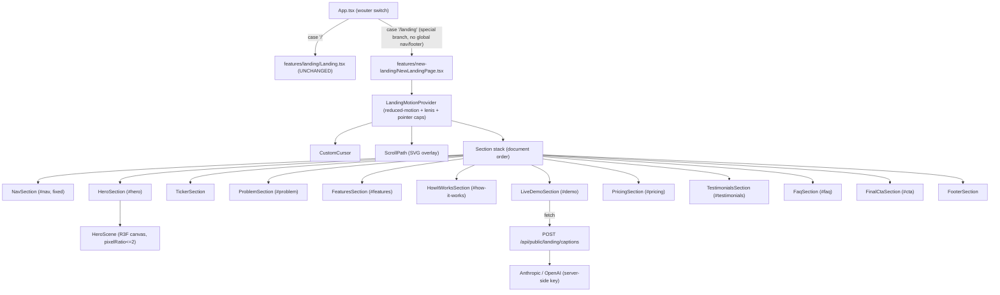
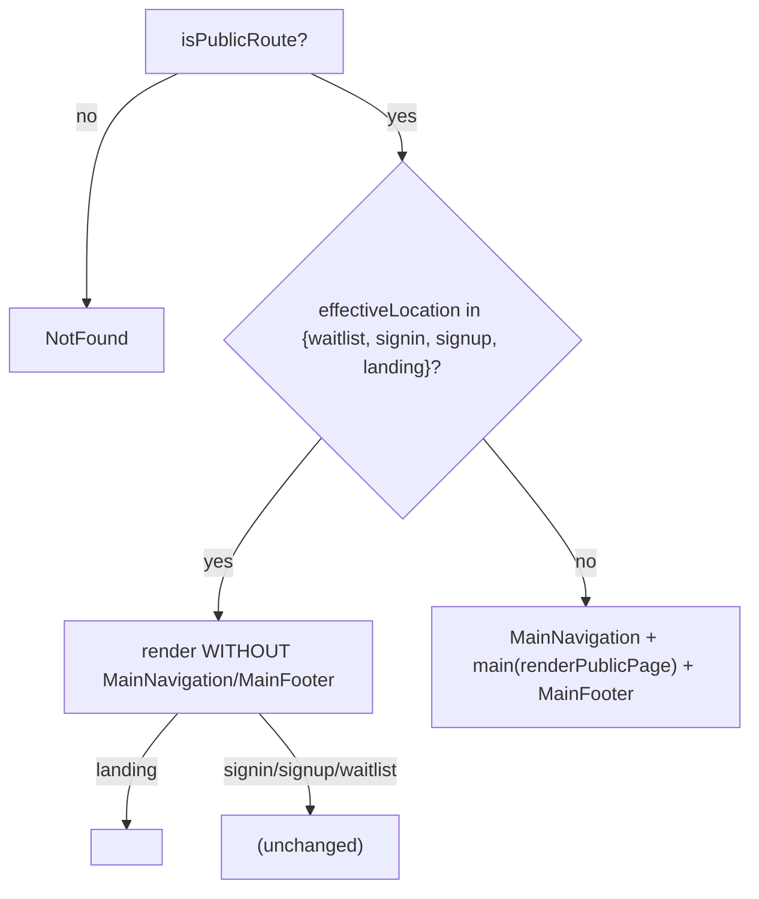
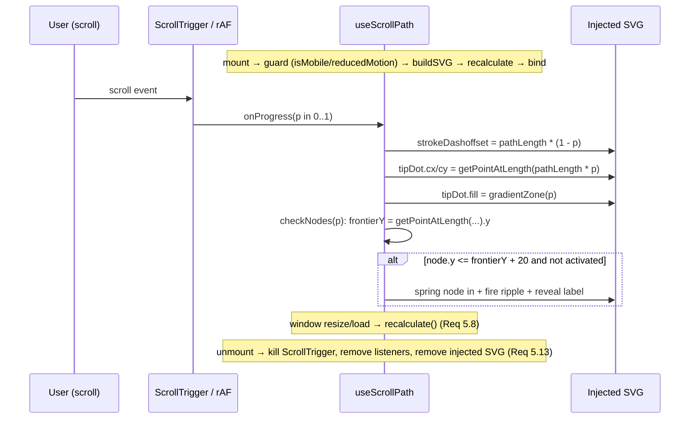
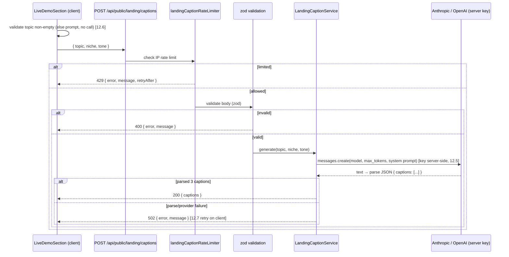

# Design Document

## Overview

This feature delivers a brand-new, world-class marketing landing page for **Veefore**, built from the visual brief in `VEEFORE_LANDING_PAGE_PROMPT_COMPLETE.md`. The brief is written for a vanilla HTML/CSS/JS stack (Three.js + GSAP + Lenis + Splitting.js + Typed.js + CountUp.js). The actual codebase is a **React 19 + Vite + wouter + Tailwind 3.4 SPA**. This design preserves the brief's visual intent **1:1** (identical sections, colour system, scroll path, animations) while re-expressing every vanilla pattern as an idiomatic React implementation driven inside the component lifecycle.

The defining constraint is **non-destructive isolation**: the existing production landing page (`client/src/features/landing/Landing.tsx`, served at `/`) is never touched. The new page lives in a brand-new feature folder and is reachable only at `/landing`, which is re-pointed from the old component to the new one.

### Vanilla-JS → React mapping (the core translation table)

| Brief (vanilla) | React adaptation | Rationale |
|---|---|---|
| Global `<script defer>` load order | React component tree + `useEffect` init ordering | No script tags; effects run after mount in deterministic order |
| `VeefScrollPath` class auto-booting on `DOMContentLoaded`, injecting SVG into `<body>` | `<ScrollPath>` component + `useScrollPath` hook that injects into the page root ref and cleans up on unmount | Lifecycle-bound; no global leakage; full teardown |
| GSAP loaded from CDN | `gsap` npm dependency (NEW), `gsap/ScrollTrigger` registered once | Already bundler-driven; pin version |
| Lenis from CDN | `lenis` npm dependency (NEW), instantiated in `useLenis` hook | Lifecycle-bound init/destroy |
| Three.js raw (`three.min.js`) | `@react-three/fiber` + `@react-three/drei` (already installed) | Declarative R3F scene; automatic disposal + pixel-ratio cap |
| Splitting.js (per-char/word split) | `framer-motion` staggered variants + a small `SplitText` helper | framer-motion already installed; no extra dep |
| Typed.js (typewriter loop) | custom `useTypewriter` hook | Tiny, avoids an unmaintained dep |
| CountUp.js (number count-up) | custom `useCountUp` hook (rAF-based) | Tiny, reduced-motion aware |
| AI call directly from client JS to Anthropic | `Caption_Proxy` server endpoint (`POST /api/public/landing/captions`) | API key must never reach the client |
| `@media (prefers-reduced-motion)` CSS guards | `useReducedMotion` hook gating every animation + CSS guards | Single source of truth for motion |

### New dependencies required

The brief needs two libraries not yet installed. They are added **individually as pinned dependencies** (Requirement 23.3):

- `gsap` (pinned, e.g. `3.13.0`) — provides `ScrollTrigger` for the scroll path draw and the pinned horizontal Features section.
- `lenis` (pinned, e.g. `1.1.x`) — smooth scroll. (The npm package `lenis` is the current name; `@studio-freight/lenis` is the legacy alias. This design uses `lenis`.)

Typed.js, Splitting.js, and CountUp.js from the brief are **deliberately not added**; they are replaced by `useTypewriter`, a framer-motion `SplitText`, and `useCountUp` respectively (Requirement 23.1).

Already-installed libraries used as-is: `three`, `@react-three/fiber`, `@react-three/drei`, `framer-motion`, `@anthropic-ai/sdk`, `openai`, `zod`, `lucide-react`, `wouter`.

### Scope boundaries

- **In scope:** new client feature folder, the `/landing` route re-point in `App.tsx`, a new unauthenticated rate-limited caption proxy endpoint on the server, the two new dependencies.
- **Out of scope (must not change):** `client/src/features/landing/Landing.tsx`, the `/` route mapping, any shared utility source (imported read-only; copied-and-scoped if a change would be needed — Requirement 1.4/1.5).

## Architecture

### High-level composition



### Layering

1. **Route layer** — `App.tsx` maps `/landing` to the new root inside a special branch that renders **without** the global `MainNavigation`/`MainFooter` wrapper (the new page ships its own nav + footer).
2. **Orchestration layer** — `NewLandingPage` composes a motion provider, the global overlays (cursor, scroll path), and the ordered section stack. It owns the `Page_Load_Sequence` and the page-level container ref.
3. **Section layer** — one component per section, each independently importable/mountable for testing (Requirement 3.3).
4. **Primitive/hook layer** — reusable modules: `ScrollPath`, `CustomCursor`, hooks (`useLenis`, `useReducedMotion`, `useScrollProgress`, `useTypewriter`, `useCountUp`, `useInViewOnce`, `useMediaQuery`), constants (colours, content), and a scoped styles file.
5. **Server layer** — `Caption_Proxy` endpoint that calls the AI provider with a server-held key and returns `{ captions: string[] }`.

### Motion gating model

A single `LandingMotionProvider` resolves three booleans once and exposes them via context to every descendant:

- `reducedMotion` — from `prefers-reduced-motion: reduce`.
- `isMobile` — viewport `<= 768px` (`Mobile_Breakpoint`).
- `finePointer` — `(pointer: fine)` media query.

Every animated effect reads these flags rather than querying the environment independently, guaranteeing consistent suppression (Requirement 21.1) and a single place to reason about motion.

## Components and Interfaces

### Feature folder tree

```
client/src/features/new-landing/
├── index.ts                         # re-export NewLandingPage (named + default)
├── NewLandingPage.tsx               # orchestrator root (no large inline markup)
├── README.md
├── newLanding.css                   # scoped tokens + keyframes (class .veef-landing root)
│
├── context/
│   └── LandingMotionProvider.tsx    # reducedMotion / isMobile / finePointer context
│
├── primitives/
│   ├── ScrollPath.tsx               # SVG overlay component (wraps useScrollPath)
│   ├── CustomCursor.tsx             # dot + ring + trail
│   ├── SplitText.tsx                # framer-motion per-char/word reveal
│   ├── TiltCard.tsx                 # pointer-tilt wrapper (clamped ±deg)
│   └── GlowButton.tsx               # coral CTA with hover glow + focus ring
│
├── hooks/
│   ├── useScrollPath.ts             # build/draw/teardown SVG path (GSAP or rAF)
│   ├── useLenis.ts                  # smooth scroll init/destroy
│   ├── useReducedMotion.ts          # prefers-reduced-motion subscription
│   ├── useMediaQuery.ts             # generic matchMedia subscription
│   ├── useScrollProgress.ts         # 0..1 page scroll progress
│   ├── useTypewriter.ts             # looping typewriter (Typed.js replacement)
│   ├── useCountUp.ts                # rAF number count-up (CountUp.js replacement)
│   ├── useInViewOnce.ts             # IntersectionObserver one-shot reveal
│   └── usePageLoadSequence.ts       # orchestrates the 2.4s entrance timeline
│
├── constants/
│   ├── colors.ts                    # Colour_System tokens (single source of truth)
│   ├── scrollPath.ts                # xPattern, sectionIds, labels, gradient stops
│   ├── content.ts                   # nav links, problems, features, pricing, faqs, testimonials
│   └── pricing.ts                   # monthly/annual price tables
│
├── sections/
│   ├── NavSection.tsx
│   ├── HeroSection.tsx
│   ├── hero/
│   │   ├── HeroScene.tsx            # R3F <Canvas> wrapper
│   │   ├── FloatingCard.tsx         # 3D/CSS metric card
│   │   ├── OrbitingBadges.tsx
│   │   ├── NotificationToasts.tsx
│   │   └── ParticleField.tsx
│   ├── TickerSection.tsx
│   ├── ProblemSection.tsx
│   ├── FeaturesSection.tsx          # pinned horizontal scroll
│   ├── HowItWorksSection.tsx
│   ├── LiveDemoSection.tsx
│   ├── PricingSection.tsx
│   ├── TestimonialsSection.tsx
│   ├── FaqSection.tsx
│   ├── FinalCtaSection.tsx
│   └── FooterSection.tsx
│
├── api/
│   └── captions.ts                  # client fetch wrapper for Caption_Proxy
│
└── __tests__/
    ├── ... unit tests per section
    └── ... property tests (see Testing Strategy)
```

Server-side (new files only):

```
server/routes/v1/
├── public-landing.routes.ts         # POST /captions (unauthenticated, rate-limited)
└── public-landing.routes.test.ts    # integration test

server/services/
└── LandingCaptionService.ts         # thin server-side AI caller (key stays server-side)
```

### Component interfaces (TypeScript-style signatures)

```ts
// NewLandingPage.tsx
export const NewLandingPage: React.FC; // default + named export

// context/LandingMotionProvider.tsx
interface LandingMotion {
  reducedMotion: boolean;
  isMobile: boolean;      // <= 768px
  finePointer: boolean;   // (pointer: fine)
}
export function useLandingMotion(): LandingMotion;

// primitives/ScrollPath.tsx
interface ScrollPathProps {
  containerRef: React.RefObject<HTMLElement>; // page root for measuring height
}

// primitives/TiltCard.tsx
interface TiltCardProps {
  maxTiltX?: number; // default 8
  maxTiltY?: number; // default 6
  children: React.ReactNode;
}

// sections/* — all take no required props except where navigation is needed
interface NavProps { onNavigate?: (page: string) => void }
interface CtaProps { onNavigate?: (page: string) => void }

// api/captions.ts
interface CaptionRequest { topic: string; niche: string; tone: string }
interface CaptionResponse { captions: string[] }
function generateCaptions(req: CaptionRequest, signal?: AbortSignal): Promise<CaptionResponse>;
```

### Routing change design (App.tsx)

Two minimal, surgical edits — the `/` case is untouched (Requirement 2.2/2.4).

1. **Add a lazy import** for the new root alongside the existing `Landing` lazy import:

```ts
const NewLanding = React.lazy(() =>
  import('./features/new-landing').then(m => ({ default: m.NewLandingPage }))
)
```

2. **Re-point the `/landing` case and exclude it from the global nav/footer wrapper.** Currently both `/` and `/landing` render `<Landing/>`, and all public routes except `/waitlist`, `/signin`, `/signup` render inside the `<MainNavigation/> + <main/> + <MainFooter/>` wrapper. Because the new page ships its **own** nav and footer, `/landing` must join the special-case branch that renders bare (like signin/signup).



Minimal diff intent:
- Extend the special-branch condition from `=== '/waitlist' || === '/signin' || === '/signup'` to also include `=== '/landing'`.
- In that branch, add a `/landing` arm rendering `<RouteErrorBoundary routeName="New Landing"><Suspense fallback={<LoadingSpinner type="minimal"/>}><NewLanding/></Suspense></RouteErrorBoundary>` (Requirement 2.5 reuses the existing minimal fallback).
- Update the `renderPublicPage()` `/landing` case to also point at `<NewLanding/>` for completeness/defensive consistency, though the special branch intercepts it first.
- `/landing` remains in the `publicRoutes` array (Requirement 2.3) — no change needed there.
- The `/` case in both `renderPublicPage()` and the wrapper logic is left byte-for-byte unchanged (Requirement 2.2).

This is the **only** permitted change in `App.tsx`.

### Scroll_Path system design

The brief's `VeefScrollPath` class is re-expressed as `<ScrollPath>` + `useScrollPath`, preserving the exact algorithm: inject an absolutely-positioned SVG spanning full page height, read section `offsetTop`s to build waypoints, generate a cubic bezier winding through an `xPattern`, draw via `stroke-dashoffset` proportional to scroll, ride a colour-shifting tip dot on the frontier, and spring/ripple/label nodes as the frontier passes.

React-idiomatic differences from the vanilla class:
- The SVG is injected into the **page root element** (the container ref), not `document.body`, so teardown is scoped and guaranteed.
- All listeners (`scroll`, `resize`, `load`) and the GSAP `ScrollTrigger` instance are created in `useScrollPath` and **killed in the effect cleanup** on unmount (Requirement 5.13).
- The hook early-returns (renders nothing) when `isMobile` or `reducedMotion` is true (Requirements 5.11, 5.12) — and because those come from context, it also re-evaluates if the viewport crosses the breakpoint.
- Drawing prefers GSAP `ScrollTrigger` (scrubbed) and falls back to a passive rAF-throttled scroll listener if ScrollTrigger is unavailable, exactly as the brief specifies.



Key parameters preserved from the brief (`constants/scrollPath.ts`): `xPattern` per section, gradient stops (coral→gold→cyan→mint→rose→cyan→coral, **no purple**), node colours, `tension` 0.48, main stroke 1.5, glow stroke 8 @ 0.22 opacity, tip radius 4, node radius 3.5, scrub 0.6. Z-index 2 for the container, content at 3+, `pointer-events: none` on the container (Requirements 5.9, 5.10).

> Note: the brief uses 9 section IDs for waypoints (`hero, problem, features, how-it-works, demo, pricing, testimonials, faq, cta`). Nav, Ticker, and Footer are not waypoints; the path enters top-center above hero and exits bottom-center below cta, exactly as specified.

### Colour system + zero-purple enforcement

`constants/colors.ts` is the single source of truth, mirroring the brief exactly:

```ts
export const COLORS = {
  bgPrimary: '#040C18', bgSecondary: '#071428', bgTertiary: '#0A1F3A', bgFooter: '#020810',
  coral: '#FF4D2E', cyan: '#00D4FF', gold: '#FFB800', mint: '#00FF87', rose: '#FF2D7A',
  textPrimary: '#FFFFFF', textSecondary: '#7A8FA8', textMuted: '#3D5166',
} as const;
export const GRADIENTS = {
  hero: 'linear-gradient(135deg,#FF4D2E,#FFB800)',
  cyan: 'linear-gradient(135deg,#00D4FF,#00FF87)',
  hot:  'linear-gradient(135deg,#FF2D7A,#FF4D2E)',
  card: 'linear-gradient(145deg,#071428,#0A1F3A)',
} as const;
```

**Scoping strategy (no leakage — Requirement 4.5):**
- The root element carries a single class `veef-landing`. `newLanding.css` declares all CSS custom properties (`--veef-coral`, etc.), keyframes, and the imported `@font-face`/Google Fonts under that scope (`.veef-landing { ... }`, `.veef-landing .foo { ... }`). No global selectors, no `:root` overrides, no element-tag global rules.
- Section components use Tailwind utility classes with **arbitrary values referencing the hex tokens** (e.g. `bg-[#040C18]`, `text-[#FF4D2E]`) or the scoped CSS variables, so no edits to the shared `tailwind.config.ts` are required (Requirement 1.5).
- Because Tailwind is project-wide, the design avoids adding new theme tokens to the shared config; all landing-specific colours are inline arbitrary values or scoped CSS vars, which cannot leak to other routes.

**Zero-purple enforcement (Requirement 4.2):** the palette contains no purple, and a unit/property test asserts that no rendered style string in any section contains a purple hue (see Testing Strategy). The brief's existing `/` landing uses purple orbs; the new page must not.

### Per-section component designs

All sections render under `.veef-landing`, use only `Colour_System` colours, and read motion flags from `useLandingMotion()`.

**NavSection** (`id` not a waypoint; fixed). Props: `{ onNavigate }`. State: `scrolled` (boolean from a scroll listener at 80px threshold), `mobileOpen`. Transparent ↔ blurred navy backgrounds are mutually exclusive on `scrolled` (Requirement 6.2/6.3). Links Home/Features/How It Works/Pricing/Blog with per-letter hover rise via `SplitText`. "Try Free" `GlowButton` with coral glow hover (6.5). At `<=768px`: hamburger → full-screen overlay with staggered links (6.6). Reduced motion: instant state changes, no letter-rise.

**HeroSection** (`id="hero"`, `100vh`). Reserves explicit canvas dimensions to prevent CLS (7.2, 22.1). Left column: eyebrow pill, char-reveal headline (`SplitText`), subheadline, `useTypewriter` audience loop, two CTAs, three `useCountUp` trust stats. Right column: `HeroScene` (R3F) + `FloatingCard` (tilt via `TiltCard`, clamped ±8°X/±6°Y — 7.4; holds tilt when pointer stops — 7.5; sine float 3s/12px — 7.x), `OrbitingBadges` (continuous orbit + pulse — 7.6), `NotificationToasts` (slide-in/pause/slide-out loop — 7.7), `ParticleField` (60 dots, coral/cyan/gold — 7.8). Reduced motion: static final state, no float/orbit/toast cycling/particle drift (7.9).

**TickerSection** (not a waypoint). Full-width seamless marquee (content tripled for no-gap loop — 8.1), 40s loop, pause on hover when motion allowed (8.2), stationary under reduced motion regardless of hover (8.3). Implemented as a CSS keyframe translateX with duplicated track; pause via `animation-play-state` toggled on hover.

**ProblemSection** (`id="problem"`). Renders exactly 6 cards; if content array > 6 it slices to first 6 and hides extras (9.1/9.2). 2×3 grid, alternating coral/cyan/gold top borders. Cards flip in on Y-axis with stagger via `useInViewOnce` + framer-motion (9.3). Reduced motion: reveal without flip (9.4).

**FeaturesSection** (`id="features"`). 5 panels with accent colours coral/cyan/gold/mint/rose (10.3). Desktop: GSAP `ScrollTrigger` pin + horizontal pan over ~400vh scroll distance (10.2). At `<=768px`: vertical stacked scroll layout, no pin (10.4). Reduced motion: panels stacked, no pinned horizontal animation (10.5). The pin/pan ScrollTrigger is created and killed inside the section's effect.

**HowItWorksSection** (`id="how-it-works"`). 3 sequential steps with coral/cyan/gold badges; dotted connector SVG draws on enter via `stroke-dashoffset` (11.2). Reduced motion: static steps + connector, no draw/hover/micro-interactions (11.3).

**LiveDemoSection** (`id="demo"`). Inputs: topic text field, niche selector, tone selector, generate `GlowButton` (12.1). On generate with topic present: call `Caption_Proxy` via `api/captions.ts`, show shimmer skeleton until response (12.2), then render 3 caption cards each with a copy control (12.3). Copy writes caption to clipboard (12.4). Empty topic → inline prompt, no proxy call (12.6). Error/no captions → descriptive message + retry affordance (12.7). State machine: `idle → validating → loading → success | error`. Uses `AbortController` for cancellation on unmount.

**PricingSection** (`id="pricing"`). 3 INR tiers Starter/Growth/Agency; Growth elevated + "Most Popular" mint badge (13.1/13.2). Monthly/Annual toggle animates prices via `useCountUp` (13.3); reduced motion sets prices instantly (13.4). Price tables in `constants/pricing.ts`.

**TestimonialsSection** (`id="testimonials"`). Masonry (3/2/1 columns). Cards stagger-fade on enter (14.2), hover accent glow + lift (14.3). Single column at `<=768px` (14.4). Reduced motion: no fade/lift animation.

**FaqSection** (`id="faq"`). 8 accordion items; at most one open at a time — opening one closes others (15.2). Open item rotates indicator + slide-down answer (15.3). State: single `openIndex: number | null`. Keyboard operable (buttons, `aria-expanded`).

**FinalCtaSection** (`id="cta"`). Headline, supporting text, primary + secondary CTAs, trust badges (16.1). Radial glow + particles in Colour_System colours; particles render even when drift disabled (16.2/16.4). Primary CTA coral glow hover (16.3).

**FooterSection** (not a waypoint). ≥4 content columns + bottom bar with copyright + legal links (17.1). Social icons with coral glow hover (17.2). `bgFooter` `#020810`.

### Hero 3D approach (R3F)

`HeroScene` wraps a drei/`@react-three/fiber` `<Canvas>`:
- `dpr={[1, 2]}` (or `gl={{ ... }}` with `setPixelRatio(Math.min(devicePixelRatio, 2))`) to cap pixel ratio at 2 (Requirement 22.2).
- Canvas container has explicit reserved width/height so layout is stable before first paint (22.1, 7.2).
- Scene content kept lightweight (the "main card" visual is a CSS/`FloatingCard` element layered over a subtle 3D ambient backdrop — orbiting badges are CSS 3D transforms per the brief, not Three.js meshes). R3F handles geometry/material/texture disposal automatically on unmount; any manually created resources are disposed in cleanup (22.5).
- Under reduced motion, the R3F frameloop is set to `"demand"` (no continuous animation) and a single static frame is rendered.

### Page load sequence orchestration

`usePageLoadSequence` drives the 2.4s timeline (Requirement 19.1) using a GSAP timeline (or framer-motion orchestration) with the brief's exact ordering: Nav (0.0s) → eyebrow (0.3s) → headline chars (0.5s) → subheadline (1.0s) → CTAs (1.3s) → trust stats count-up (1.5s) → 3D card (1.7s) → orbiting badges (2.0s) → particle field (2.2s) → scroll path fade-in (2.4s). The hook returns per-element animation state/variants consumed by Hero subcomponents and the ScrollPath. Under reduced motion, the hook **does not run** and every element is mounted in its final visible state (19.2).

## Data Models

These are client-side view models and the proxy contract — no database changes.

```ts
// constants/content.ts
interface NavLink { label: string; href: string }
interface ProblemCard { icon: string; title: string; body: string; accent: 'coral'|'cyan'|'gold' }
interface FeaturePanel { title: string; description: string; accent: 'coral'|'cyan'|'gold'|'mint'|'rose'; visual: 'calendar'|'chat'|'generator'|'dashboard'|'credits' }
interface HowStep { index: 1|2|3; title: string; body: string; glow: 'coral'|'cyan'|'gold' }
interface PricingTier {
  name: 'Starter'|'Growth'|'Agency';
  monthly: number;  // INR
  annual: number;   // INR effective monthly when billed annually
  credits: number;
  features: string[];
  popular: boolean;
}
interface Testimonial { name: string; handle: string; platform: 'instagram'|'youtube'; rating: 1|2|3|4|5; quote: string; accent: keyof typeof COLORS }
interface FaqItem { question: string; answer: string }

// scroll path
interface Waypoint { x: number; y: number; label?: string; color?: string }
interface ScrollPathConfig {
  xPattern: number[];           // fraction of width per section
  sectionIds: string[];         // '#hero', ...
  nodeLabels: string[];
  gradientStops: { offset: string; color: string }[];
  nodeColors: string[];
  tension: number; mainStrokeWidth: number; glowStrokeWidth: number;
  glowOpacity: number; tipDotRadius: number; nodeDotRadius: number; scrub: number;
}

// Caption proxy contract (client + server share shape)
interface CaptionProxyRequest { topic: string; niche: string; tone: string }
interface CaptionProxySuccess { captions: string[] }          // exactly 3 on success
interface CaptionProxyError { error: string; message: string } // 4xx/5xx body
```

### Caption_Proxy request flow



## Correctness Properties

*A property is a characteristic or behavior that should hold true across all valid executions of a system — essentially, a formal statement about what the system should do. Properties serve as the bridge between human-readable specifications and machine-verifiable correctness guarantees.*

The following properties are derived from the acceptance criteria prework. Redundant colour and reduced-motion criteria across sections have been consolidated into single cross-cutting properties to avoid duplication.

### Property 1: Only Colour_System colours, never purple

*For any* section component of the New_Landing_Page, every colour value applied to backgrounds, text, borders, gradients, shadows, glows, and SVG fills is a member of the Colour_System palette, and no applied colour resolves to a purple hue.

**Validates: Requirements 4.1, 4.2, 5.4, 7.8, 10.3**

### Property 2: Scroll path draws in exact proportion to scroll progress

*For any* scroll progress value p in the closed interval [0, 1], the drawn fraction of the Scroll_Path equals p (equivalently, the applied `stroke-dashoffset` equals `pathLength * (1 - p)`), and the drawn fraction is monotonically non-decreasing as p increases.

**Validates: Requirements 5.2**

### Property 3: Scroll path winds rather than running straight

*For any* set of section waypoints generated from the configured `xPattern`, the resulting bezier path contains at least two distinct x-coordinates (the path is not a single vertical line).

**Validates: Requirements 5.3**

### Property 4: Tip dot colour matches the current gradient zone

*For any* scroll progress value p in [0, 1], the computed gradient-zone index is within the bounds of the gradient stop array and the Tip_Dot fill colour equals the colour of that zone's stop.

**Validates: Requirements 5.6**

### Property 5: Each section node activates at most once

*For any* monotonically non-decreasing sequence of scroll-progress updates, every Section_Node transitions from inactive to active at most once and never reverts (its spring/ripple/label fire exactly once).

**Validates: Requirements 5.7**

### Property 6: Scroll path renders only on desktop with motion enabled

*For any* combination of viewport width and Reduced_Motion state, the Scroll_Path is rendered if and only if the viewport width is greater than the Mobile_Breakpoint and Reduced_Motion is not active.

**Validates: Requirements 5.11, 5.12**

### Property 7: Navigation background state is threshold-exclusive

*For any* vertical scroll offset, the Navigation is in exactly one of the transparent or blurred background states: blurred when the offset exceeds 80px and transparent when it is at or below 80px.

**Validates: Requirements 6.2, 6.3**

### Property 8: Hero card tilt is clamped

*For any* pointer position over the Hero, the resulting card tilt on the X axis lies within [-8°, +8°] and on the Y axis within [-6°, +6°].

**Validates: Requirements 7.4**

### Property 9: Problem section shows at most six cards

*For any* array of provided pain-point items, the Problem section renders exactly `min(count, 6)` cards, never more than six, and preserves the first six in order when more are supplied.

**Validates: Requirements 9.1, 9.2**

### Property 10: Pricing toggle shows the selected period's value and round-trips

*For any* pricing tier, the displayed price always equals the table value for the currently selected billing period, and toggling from monthly to annual and back to monthly restores the original monthly price.

**Validates: Requirements 13.3, 13.4**

### Property 11: Caption proxy never leaks the API key

*For any* request input to the Caption_Proxy, the response body and response headers never contain the AI provider API key value.

**Validates: Requirements 12.5**

### Property 12: Empty topic never calls the proxy

*For any* topic string composed entirely of whitespace (including the empty string), activating the generate control does not invoke the Caption_Proxy and instead surfaces a prompt to enter a topic.

**Validates: Requirements 12.6**

### Property 13: At most one FAQ item is open

*For any* sequence of FAQ item activations, the number of simultaneously open items is always at most one, and activating a closed item collapses any previously open item.

**Validates: Requirements 15.2**

### Property 14: Custom cursor renders only on fine-pointer desktop with motion enabled

*For any* combination of fine-pointer support, Reduced_Motion state, and viewport width, the Custom_Cursor is rendered if and only if the device supports a fine pointer, Reduced_Motion is not active, and the viewport width is greater than the Mobile_Breakpoint; otherwise the native cursor is used.

**Validates: Requirements 18.4, 18.5**

### Property 15: Page load sequence preserves the specified order

*For any* run of the Page_Load_Sequence with motion enabled, the scheduled start times of the choreographed elements are non-decreasing in the order specified by the design brief (nav, eyebrow, headline, subheadline, CTAs, trust stats, 3D card, badges, particles, scroll path).

**Validates: Requirements 19.1**

### Property 16: Three.js pixel ratio is capped at 2

*For any* device pixel ratio value, the pixel ratio applied to the Three.js renderer equals `min(devicePixelRatio, 2)` and never exceeds 2.

**Validates: Requirements 22.2**

### Property 17: Reduced motion suppresses all animation

*For any* section rendered while Reduced_Motion is active, no element exposes a running continuous, entrance, or interaction-triggered animation, and hover/click interactions produce no motion (elements are shown in their final state).

**Validates: Requirements 21.1, 7.9, 8.3, 9.4, 10.5, 11.3, 16.4, 19.2**

## Error Handling

### Client

- **Caption_Demo empty input:** topic validated client-side; whitespace-only blocks the request and shows an inline prompt (no network call). Property 12.
- **Caption_Demo request failure:** any non-2xx response, network error, or response without 3 captions transitions the demo to an `error` state with a descriptive, user-facing message and a visible retry control (Requirement 12.7). Requests use `AbortController`; an abort during unmount is swallowed silently.
- **Library init failure:** if GSAP/Lenis/Three init throws, the effect catches, logs, and degrades gracefully — the page still renders content (sections are visible without the enhancement). The ScrollPath specifically falls back from GSAP ScrollTrigger to a rAF scroll listener.
- **Route error isolation:** the `/landing` branch is wrapped in the existing `RouteErrorBoundary` so a runtime error in the new page cannot crash the app shell.
- **Cleanup contract:** unmount teardown for Lenis + Custom_Cursor is treated as incomplete if either the Lenis `destroy()` or the listener removal fails; failures are logged (Requirement 18.6). Three.js disposal and `cancelAnimationFrame` run on unmount (Requirement 22.5).

### Server (Caption_Proxy)

| Condition | Status | Body |
|---|---|---|
| Invalid/missing body fields (zod) | 400 | `{ error: 'invalid_request', message }` |
| Rate limit exceeded | 429 | `{ error, message, retryAfter }` (from limiter) |
| AI provider error / unparseable output / no captions | 502 | `{ error: 'generation_failed', message }` |
| Provider timeout | 504 | `{ error: 'timeout', message }` |
| Unexpected | 500 | `{ error: 'internal_error', message }` |

The handler wraps the provider call in try/catch, never forwards raw provider errors or stack traces to the client, and never echoes configuration. A single retry with backoff is attempted server-side for transient provider failures before returning 502.

## Testing Strategy

### Dual approach

- **Unit/example tests** verify specific behaviors, structure, accessibility, and edge cases per section.
- **Property-based tests** verify the universal invariants in Correctness Properties.
- **Integration tests** verify the Caption_Proxy end-to-end wiring (auth-free + rate limited).

### Property-based testing

PBT **is appropriate** for this feature because the logic layer (scroll-path math, tilt clamp, colour constraints, FAQ/accordion state, pricing toggle, validation, motion gating predicates) consists of pure functions and deterministic state transitions with large input spaces.

- Library: **fast-check** (already in `devDependencies`), with vitest. Client tests run under `vitest.client.config.ts` (happy-dom); server tests under the default vitest config.
- Each property test runs a **minimum of 100 iterations**.
- Each property test is tagged with a comment referencing its design property, format:
  `// Feature: new-landing-page, Property {number}: {property_text}`
- Each correctness property is implemented by a **single** property-based test.
- To keep properties testable, the pure logic is factored into testable units: `scrollPathMath.ts` (dashoffset, zone index, winding, node activation reducer), `tilt.ts` (clamp), `colorGuard.ts` (palette/purple check), pricing reducer, FAQ reducer, cursor/scrollpath visibility predicates, pixel-ratio clamp, and the page-load timeline descriptor. Properties test these units plus rendered output where feasible.
- DOM-layout-dependent criteria (overflow at 375px, true CLS) are **not** property-tested due to jsdom/happy-dom layout limitations; they are covered by example tests at representative widths and manual/visual verification.

### Unit/example tests (per area)

- Routing: `/landing` mounts new page; `/` still mounts existing landing (regression); loading fallback shows; `/landing` stays public.
- Isolation (smoke): assert `features/landing/Landing.tsx` content unchanged and `/` mapping unchanged.
- Each section: mounts independently; renders required elements (Requirements 6.4, 7.3, 10.1, 11.1, 12.1, 13.1, 14.1, 15.1, 16.1, 17.1); correct section `id`s.
- Interactions: nav hover glow, mobile hamburger overlay, ticker pause-on-hover, demo copy-to-clipboard, demo error+retry, FAQ expand visuals.
- Accessibility: keyboard reachability, focus indicators, text alternatives (Requirements 21.2–21.4).
- Cleanup (spies): ScrollPath removes injected DOM + listeners; Lenis destroyed; Three disposed; rAF cancelled.

### Integration tests (Caption_Proxy)

- Unauthenticated request with a valid body returns 200 `{ captions: string[] }` (3 items) — provider mocked.
- Empty/invalid body returns 400.
- Exceeding the rate limit returns 429 (1–3 examples).
- Key-leak guard: response body/headers never contain the configured key (this is also Property 11, run as PBT over random inputs with a mocked provider).

## Requirements Traceability

| Requirement | Design element(s) | Verification |
|---|---|---|
| 1 Non-destructive isolation | Feature folder tree; scope boundaries; read-only imports / scoped copies | Smoke + regression example |
| 2 Routing to /landing | Routing change design (App.tsx special branch + lazy import) | Examples 2.1/2.2/2.5; smoke 2.3/2.4 |
| 3 Section architecture | Layering; feature folder tree; per-section components | Independent-mount examples |
| 4 Colour system / zero purple | `constants/colors.ts`; scoping strategy; `colorGuard` | Property 1 |
| 5 Scroll path | ScrollPath design + `useScrollPath` + `scrollPathMath` | Properties 2,3,4,5,6; examples 5.1/5.5/5.8/5.9/5.10/5.13 |
| 6 Navigation | NavSection design | Property 7; examples 6.1/6.4/6.5/6.6 |
| 7 Hero | HeroSection + hero subcomponents + R3F | Properties 8,16,17; examples 7.1/7.2/7.3/7.5/7.6/7.7 |
| 8 Ticker | TickerSection design | Property 17; examples 8.1/8.2 |
| 9 Problem | ProblemSection design | Property 9; example 9.3 |
| 10 Features | FeaturesSection pinned-horizontal design | Property 17; examples 10.1/10.2/10.3/10.4 |
| 11 How It Works | HowItWorksSection design | Property 17; examples 11.1/11.2 |
| 12 Live Demo + proxy | LiveDemoSection + Caption_Proxy + LandingCaptionService | Properties 11,12; integration + examples 12.1/12.2/12.3/12.4/12.7/12.8 |
| 13 Pricing | PricingSection + `constants/pricing.ts` + `useCountUp` | Property 10; examples 13.1/13.2 |
| 14 Testimonials | TestimonialsSection design | Examples 14.1–14.4 |
| 15 FAQ | FaqSection reducer (`openIndex`) | Property 13; example 15.3 |
| 16 Final CTA | FinalCtaSection design | Property 17; examples 16.1/16.2/16.3 |
| 17 Footer | FooterSection design | Examples 17.1/17.2 |
| 18 Cursor + smooth scroll | CustomCursor + `useLenis` + visibility predicate | Property 14; examples 18.1/18.2/18.3/18.6 |
| 19 Page load sequence | `usePageLoadSequence` timeline | Property 15; covered-by-17 for 19.2 |
| 20 Responsive | Per-section mobile layouts; scoping | Examples at 375/768/1024/1440/max |
| 21 Accessibility + reduced motion | `LandingMotionProvider`; a11y patterns | Property 17; examples 21.2–21.4 |
| 22 Performance | Reserved canvas dims; pixel-ratio cap; lazy images; font preload; disposal | Property 16; examples 22.1/22.3/22.4/22.5 |
| 23 Library adaptation | Vanilla→React mapping; new pinned deps; lifecycle init/teardown | Smoke 23.3; examples 23.1/23.2; 23.4 manual/visual |
