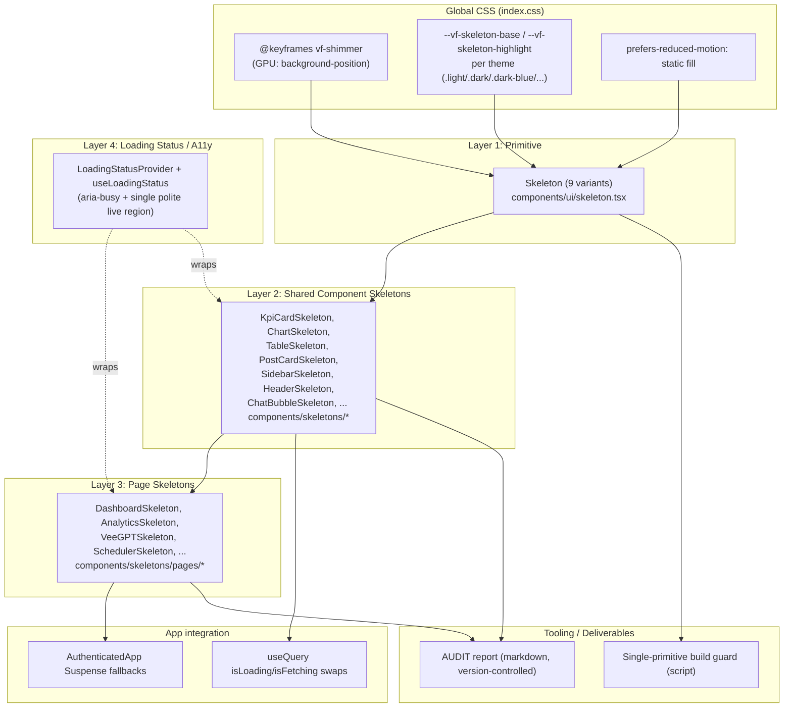

# Design Document

## Overview

This design specifies a single, consolidated, pixel-perfect skeleton loading system for the Veefore web client (`client/src`). It replaces the current fragmented loading story — a monolithic `type`-switched `SkeletonPageLoader`, a duplicate `Skeleton` primitive in `LoadingSpinner.tsx`, co-located legacy skeletons (e.g. `BestTimeWidgetSkeleton`), full-screen spinners, and ad-hoc `animate-pulse`/"Loading..." loaders — with one variant-based `Skeleton` primitive, a library of dedicated `Component_Skeleton`s and `Page_Skeleton`s, a globally defined GPU-accelerated shimmer that respects `prefers-reduced-motion`, multi-theme placeholder/shimmer colors driven by CSS variables, zero-layout-shift swaps, conditional-rendering parity, an accessibility loading-status context, and a version-controlled audit report.

The design is grounded in the current codebase:

- **Routing** lives in `client/src/AuthenticatedApp.tsx` (a `wouter` `<Switch>` of `<Route>`s, each wrapping a lazily imported page in `React.Suspense` with `fallback={<SkeletonPageLoader type="..." />}`) and `client/src/App.tsx` (public routes + the pre-auth boot loader `<LoadingSpinner type="dashboard" />`).
- **The current skeleton module** is `client/src/components/ui/skeleton.tsx`. It exports a bare `Skeleton` (a `<div>` with a hard-coded gray gradient and an inline `style={{ animation: 'shimmer 1.5s ...' }}`), ~18 composed skeletons (`SkeletonCard`, `SkeletonWorkspaceCard`, `SkeletonIntegrationCard`, `SkeletonAutomationCard`, `SkeletonDashboardStats`, `SkeletonTable`, `SkeletonPageHeader`, `SkeletonProfileCard`, etc.), and `SkeletonPageLoader` which switches on a `type` string and injects the `@keyframes shimmer` definition inside an inline `<style>` block. It also exports `SkeletonSidebarLayout`.
- **A duplicate `Skeleton`** is exported from `client/src/components/LoadingSpinner.tsx`, plus `LoadingSpinner` (a full-screen branded spinner used as the auth/boot loader). There is no separate `GlobalLoader` symbol today, but the requirements treat the `LoadingSpinner`/`GlobalLoader`/`animate-spin` family as `Generic_Loader`s.
- **Theming** is class-based (`tailwind.config.ts` uses `darkMode: 'class'`). `client/src/lib/theme.ts` applies one of five visual themes (`light`, `dark`, `dark-blue`, `dark-black`, `dark-gray`) by toggling root classes (all non-light variants also get the `dark` class), sets per-theme `--theme-*` CSS custom properties on `document.documentElement`, and dispatches a `theme-changed` event. `client/src/hooks/useTheme.ts` reads/writes the theme and re-renders consumers without remounting the tree.
- **Reduced motion** is handled globally in `client/src/index.css` via `@media (prefers-reduced-motion: reduce)` which clamps animation durations; there is currently **no** `useMotionPreferences`/`useReducedMotion` hook (the prompt's reference does not exist yet, so this design introduces one).
- **Data loading** uses `@tanstack/react-query` `useQuery` `isLoading`/`isFetching` flags (e.g. `AuthenticatedApp` for `/api/user` and `/api/workspaces`, `BestTimeWidget` via `useSocialAccounts`). Components express loading by early-returning a skeleton or spinner.
- **Conditional rendering** is real and central: `BestTimeWidget` returns `BestTimeWidgetSkeleton` while `isLoading`, keeps the skeleton while `isFetching` with no data (to avoid flashing empty state), renders a "No Data / Gathering Data" empty card when resolved-but-empty, and renders the populated data card otherwise. This is the canonical example for Requirement 9.

Available testing tooling (from `package.json`): `vitest` 4, `@testing-library/react` + `@testing-library/jest-dom`, `happy-dom`, and `fast-check` 4 (property-based testing). The design's testing strategy builds on these.

### Goals

1. One `Skeleton` primitive with nine variants and one documented import path (R1, R2).
2. Remove all duplicate/legacy skeletons and generic loaders, with a build-time guard for single-primitive uniqueness (R2, R3).
3. A dedicated `Page_Skeleton` per authenticated route and `Component_Skeleton` per reusable data-dependent component, organized by clear conventions (R4).
4. Pixel-perfect matching within documented tolerances (R5).
5. Global GPU shimmer, 1.2–2.0s, reduced-motion static fill (R6).
6. Multi-theme placeholder/shimmer colors, glass + gradient/space surfaces, theme switch without remount (R7).
7. Zero layout shift, CLS ≤ 0.1 (R8).
8. Conditional-rendering parity (R9).
9. Performance: Suspense fallbacks, pure memoized skeletons, DOM budget, 16ms display, animation stops on unmount (R10).
10. Accessibility: `aria-busy`, single polite status per page, `aria-hidden` primitives (R11).
11. Audit report + per-page verification deliverables (R12, R13).

## Architecture

The system is organized as four layers plus tooling, all under `client/src`.



### Layer responsibilities

- **Layer 1 — Primitive (`components/ui/skeleton.tsx`)**: the single `Skeleton` component. Renders exactly one shimmering placeholder block, selects shape/border-radius from a `variant` prop (nine-member set), reads color from theme CSS variables, applies the global shimmer animation class, sets `aria-hidden="true"`, renders no text glyphs, and gives a consumer `className` precedence over variant base styles. This is the **only** module allowed to define the primitive.
- **Layer 2 — Shared Component Skeletons (`components/skeletons/`)**: pure presentational components composing the primitive to mirror reusable data-dependent components (KPI cards, charts, tables, post cards, sidebar, header, chat bubbles, conversation lists, notification cards, integration/social-account cards, forms). Each is `React.memo`-wrapped.
- **Layer 3 — Page Skeletons (`components/skeletons/pages/`)**: one `Page_Skeleton` per authenticated route, composing Layer 2 skeletons + the primitive to mirror the full page layout. Used as `Suspense` fallbacks and as the in-page loading state.
- **Layer 4 — Loading status / accessibility (`components/skeletons/LoadingStatusProvider.tsx`)**: a React context that owns the single per-page polite live region and the page-level `aria-busy` state, so multiple simultaneous skeletons announce loading exactly once (R11.1, R11.5).
- **Tooling**: a Node script (`scripts/skeleton-guard.mjs`) wired into the build that fails if more than one primitive definition or any banned legacy/generic-loader pattern is found in `client/src` (R2.6); and the `AUDIT` markdown report generated/maintained during migration (R12, R13).

### Migration position

The new module path `@/components/ui/skeleton` is preserved as the documented primitive import path (it already exists and is widely imported), but its contents are replaced: the primitive becomes variant-based, and the monolithic `SkeletonPageLoader` and ~18 ad-hoc composed skeletons are removed in favor of Layer 2/3 components under `@/components/skeletons`. The duplicate `Skeleton` export in `LoadingSpinner.tsx` is deleted; `LoadingSpinner` itself is retained **only** for the narrow pre-auth boot exception (R3.5) and is renamed/marked accordingly.

## Components and Interfaces

### 1. Skeleton primitive

File: `client/src/components/ui/skeleton.tsx` (single documented import path: `@/components/ui/skeleton`).

```tsx
export type SkeletonVariant =
  | 'text' | 'avatar' | 'button' | 'card'
  | 'chart' | 'table' | 'circle' | 'rectangle' | 'pill'

export interface SkeletonProps extends React.HTMLAttributes<HTMLDivElement> {
  /** Visual shape. Defaults to 'rectangle'. Unknown values fall back to 'rectangle'. */
  variant?: SkeletonVariant
  className?: string
}

export function Skeleton({ variant = 'rectangle', className, children, ...props }: SkeletonProps): JSX.Element
```

Behavior:

- A frozen `SKELETON_VARIANTS` set defines the nine allowed names; `VARIANT_BASE_CLASS[variant]` maps each to its default shape and border radius (R1.2, R1.3). Example mapping: `text → h-4 rounded` (full width unless overridden), `avatar → rounded-full aspect-square`, `circle → rounded-full`, `button → h-10 rounded-md`, `pill → h-6 rounded-full`, `card → rounded-xl`, `chart → rounded-md`, `table → rounded-md`, `rectangle → rounded-md`.
- Missing `variant` → `rectangle` (R1.4). A value not in the set is normalized to `rectangle` and still renders a visible block (R1.5).
- Class merge order is `cn(BASE_SHIMMER_CLASS, VARIANT_BASE_CLASS[v], className)`; because Tailwind/`cn` (tailwind-merge) gives the **last** conflicting utility precedence, the consumer `className` overrides variant dimensions/spacing (R1.6).
- Always applies the global shimmer animation class `vf-skeleton` (defined in CSS, R6/R7) — never an inline `<style>` (R6.1).
- Always sets `aria-hidden="true"` (R11.2).
- Renders `children` into the DOM **only** as visually-hidden, non-painting content (or ignores them); the painted output contains zero final-component text glyphs (R1.8, R1.9). Implementation: children are not rendered as text at all — the component returns a `<div>` with no text node; any passed `children` are dropped from output to guarantee zero glyphs.

### 2. Shared component skeletons

Folder: `client/src/components/skeletons/`. Naming convention: `<ComponentName>Skeleton`. Each file co-locates one skeleton (or a small family). All are `React.memo` pure components with no props that change output by default (R10.2, R10.4), optionally accepting a bounded `count`/`rows` prop for lists (R9.8).

Representative set (derived from the audit of reusable data-dependent components):

| Skeleton | Mirrors | Key layout notes |
|---|---|---|
| `KpiCardSkeleton` | Dashboard KPI/metric cards | `min-h-[200px]` icon + label block, grid cell parity |
| `PerformanceScoreSkeleton` | `dashboard/performance-score` | gradient banner + 2 stat cards |
| `ChartSkeleton` | analytics charts | reserves fixed chart height (`h-[280px]`), `variant="chart"` |
| `TableSkeleton` | data tables | header row + `rows` (3–10) body rows |
| `PostCardSkeleton` | scheduled/draft/published post cards | thumbnail + 2 text lines + action button |
| `SidebarSkeleton` | `layout/sidebar` (w-24 rail) | icon stack |
| `HeaderSkeleton` | `layout/header` | logo + actions |
| `ChatBubbleSkeleton` | VeeGPT message bubble | avatar + variable-width text lines |
| `ConversationListItemSkeleton` | chat/conversation list | avatar + 2 lines |
| `NotificationCardSkeleton` | notification cards | icon + text |
| `SocialAccountCardSkeleton` | social-account/integration cards | avatar + status pill + button |
| `BestTimeWidgetSkeleton` | `dashboard/best-time-widget` | replaces the legacy co-located skeleton (R4.3) |
| `FormSkeleton` | settings/profile forms | label + input rows |

### 3. Page skeletons

Folder: `client/src/components/skeletons/pages/`. Naming convention: `<RouteName>Skeleton`. One per authenticated route enumerated from `AuthenticatedApp.tsx` (R4.1):

`DashboardSkeleton`, `PlanSkeleton` (calendar), `PostsSkeleton`, `ScheduledPostsSkeleton`, `DraftsSkeleton`, `PublishedPostsSkeleton`, `CreatePostSkeleton`, `AnalyticsSkeleton`, `PostAnalyticsSkeleton`, `VeeGPTSkeleton`, `AutomationSkeleton`, `VideoGeneratorSkeleton`, `ProfileSkeleton`, `SettingsSkeleton`, `SocialListeningSkeleton`, `BestTimeSkeleton`, `SecurityDashboardSkeleton`, `AdminPanelSkeleton`, plus any additional authenticated routes discovered during the audit (`TestFixtures`, `EncryptionHealth`, `Inbox`, content/dm-automation tabs).

Each page skeleton composes shared skeletons within the same outer container/grid the real page uses so the `Suspense` fallback occupies the identical slot (R8.2, R10.1).

### 4. Loading status / accessibility context

File: `client/src/components/skeletons/LoadingStatusProvider.tsx`.

```tsx
interface LoadingStatusContextValue {
  /** Register that some region of the page is loading; returns an unregister fn. */
  beginLoading(id: string): () => void
  /** True while >=1 region is loading. Drives page-level aria-busy. */
  isPageLoading: boolean
}

export function LoadingStatusProvider({ children }: { children: React.ReactNode }): JSX.Element
export function useLoadingStatus(): LoadingStatusContextValue
/** Convenience: registers loading on mount, unregisters on unmount. */
export function useRegisterSkeleton(active: boolean): void
```

Behavior:

- Maintains a ref-counted set of active skeleton ids. The provider renders **one** `aria-live="polite"` region whose text is `"Loading…"` while count > 0 and is cleared within 500ms after count reaches 0 (R11.1, R11.4, R11.5).
- The provider sets `aria-busy={isPageLoading}` on the page content wrapper.
- Page skeletons/`Suspense` fallbacks call `useRegisterSkeleton(true)` on mount; component-level skeletons used inside an already-mounted page register too, but the single shared live region ensures exactly one aggregate announcement (R11.5).
- Mounted once near the authenticated shell (wrapping `<main>` in `AuthenticatedApp`'s layouts) so every route participates.

### 5. App integration points

- **Suspense fallbacks** in `AuthenticatedApp.tsx`: every `fallback={<SkeletonPageLoader type="x" />}` is replaced by the matching `Page_Skeleton` (e.g. `fallback={<DashboardSkeleton />}`) (R10.1). `SkeletonSidebarLayout` is replaced by composing `SidebarSkeleton` + the relevant page skeleton.
- **In-page data swaps**: components currently early-returning a spinner/skeleton on `isLoading` switch to their `Component_Skeleton`, following the conditional-parity pattern (see Data Models → Conditional rendering).
- **Pre-auth boot exception**: `App.tsx`'s `<LoadingSpinner type="dashboard" />` (shown before any authenticated layout is known) is the single allowed brand loader (R3.5), recorded in the audit.

### 6. Build guard tooling

File: `scripts/skeleton-guard.mjs`, invoked in the build pipeline (and CI). It scans `client/src` and fails the build when:
- more than one module defines a `Skeleton` primitive component (R2.6),
- any `Skeleton` export remains in `LoadingSpinner.tsx` (R2.2),
- any reference to `SkeletonPageLoader` remains (R2.3),
- any banned generic-loader pattern (`animate-spin`, standalone placeholder `animate-pulse`, "Loading..." text used as a primary indicator) remains outside the allow-list recorded in the audit (R3).

## Data Models

### SkeletonVariant

```ts
const SKELETON_VARIANTS = [
  'text', 'avatar', 'button', 'card', 'chart',
  'table', 'circle', 'rectangle', 'pill',
] as const
type SkeletonVariant = typeof SKELETON_VARIANTS[number]
const DEFAULT_VARIANT: SkeletonVariant = 'rectangle'

function normalizeVariant(v: unknown): SkeletonVariant {
  return (typeof v === 'string' && (SKELETON_VARIANTS as readonly string[]).includes(v))
    ? (v as SkeletonVariant)
    : DEFAULT_VARIANT
}
```

### Theme color model

Placeholder and shimmer colors are defined as CSS variables, set per theme class on `:root`/`html`. The primitive references only these variables, so a theme change updates colors on the already-mounted element with no remount (R7.5).

```css
/* light (default) */
:root {
  --vf-skeleton-base: 226 232 240;       /* slate-200 */
  --vf-skeleton-highlight: 241 245 249;  /* slate-100 */
}
.dark, html.dark            { --vf-skeleton-base: 51 65 85;  --vf-skeleton-highlight: 71 85 105; }
.dark-blue, html.dark-blue  { --vf-skeleton-base: 45 55 72;  --vf-skeleton-highlight: 58 70 92; }
.dark-black, html.dark-black{ --vf-skeleton-base: 51 51 51;  --vf-skeleton-highlight: 68 68 68; }
.dark-gray, html.dark-gray  { --vf-skeleton-base: 64 64 64;  --vf-skeleton-highlight: 82 82 82; }
```

Each base/highlight pair is chosen so the placeholder fill has ≥1.2:1 luminance contrast against its theme background and the highlight has ≥1.1:1 contrast against the base (R7.1, R7.2). Unknown/unsupported theme value → the `:root` (light) values apply because no theme class matched (R7.6).

### Shimmer animation model

```css
@keyframes vf-shimmer {
  0%   { background-position: 200% 0; }
  100% { background-position: -200% 0; }
}

.vf-skeleton {
  background-color: rgb(var(--vf-skeleton-base));
  background-image: linear-gradient(
    90deg,
    rgb(var(--vf-skeleton-base)) 0%,
    rgb(var(--vf-skeleton-highlight)) 50%,
    rgb(var(--vf-skeleton-base)) 100%
  );
  background-size: 200% 100%;
  background-repeat: no-repeat;
  animation: vf-shimmer 1.6s linear infinite; /* within 1.2–2.0s (R6.4) */
  will-change: background-position;            /* GPU compositing hint */
}

@media (prefers-reduced-motion: reduce) {
  .vf-skeleton {
    animation: none;                            /* no positional/opacity change (R6.3) */
    background-image: none;                     /* static fill = base color */
    background-color: rgb(var(--vf-skeleton-base));
  }
}
```

Only `background-position` animates (a non-layout, GPU-compositable property), satisfying R6.2. The static reduced-motion fill uses the same base color as the animated placeholder's non-sweep state, preserving contrast (R6.3).

### Loading state model (data → skeleton mapping)

For react-query-backed components, the resolved UI state is derived from query flags:

```ts
type RenderState = 'loading' | 'populated' | 'empty' | 'error'

function resolveRenderState(q: {
  isLoading: boolean; isFetching: boolean; isError: boolean; data: unknown
}, isEmpty: (d: unknown) => boolean): RenderState {
  if (q.isError) return 'error'                       // R9.5
  if (q.isLoading) return 'loading'                   // initial fetch, no data yet
  if (q.data === undefined) return 'loading'          // R9.4: not resolved
  if (isEmpty(q.data)) {
    return q.isFetching ? 'loading' : 'empty'         // avoid flashing empty (BestTimeWidget pattern)
  }
  return 'populated'
}
```

The component renders: `loading → <XSkeleton/>`, `populated → <X/>`, `empty → <XEmptyState/>`, `error → <XErrorState/>`. The skeleton is shown only while the request is in flight and hands off on resolve (R9.3, R9.4, R9.5).

### Conditional rendering model (Requirement 9 — key concern)

Conditional sections are classified by what is known at loading time:

```ts
type ConditionalKnowledge =
  | { kind: 'known-absent' }    // condition known false before section would render
  | { kind: 'known-present' }   // condition known true
  | { kind: 'unknown' }         // not yet resolved during loading
```

Rules applied by every page/component skeleton:

1. **`known-absent`** → the skeleton **omits** that section entirely and reserves **no** width/height/grid cell/flex slot for it (R9.1). Implementation: the skeleton accepts the same gating props/flags the real component uses (e.g. feature flags, plan tier, account presence) and conditionally renders nothing.
2. **`unknown`** → the skeleton renders **only the populated variant** of the section (never the empty variant, never both) (R9.2). The dashboard "Optimal Posting Time" widget is the canonical case: while data is unknown, `BestTimeWidgetSkeleton` mirrors the **data card** layout, not the "Gathering Data" empty card.
3. **`known-present`** → render the populated-variant placeholder.
4. **Hand-off**: on resolve, the skeleton is replaced by the real component which then chooses populated/empty/error itself (R9.3). On failure, no populated placeholder lingers (R9.5).
5. **Self-managed loading**: if a final component manages its own loading display (like `BestTimeWidget`, which internally returns its own skeleton), the system does not force an outer skeleton over it (R9.6) — the component owns the swap, using `BestTimeWidgetSkeleton` from the new library.
6. **Interaction-gated content** (content shown only after a user action that has not occurred) is never pre-rendered as a placeholder (R9.7).
7. **Variable lists/grids** render a fixed count between 3 and 10 placeholder items (default 5 for lists, 3 for card grids), never implying the exact final count (R9.8). Encoded as a clamped `count` prop: `clamp(count ?? DEFAULT, 3, 10)`.

This model directly answers the conditional-parity concern: the dashboard skeleton omits placeholders for sections it can already tell will be absent, shows only the populated variant for sections whose presence is still unknown, and defers empty/error rendering to the real component after hand-off.

### Zero-layout-shift model

- Skeleton and final component share the **same outer container, grid template, and flex slot** (R8.2). Page skeletons reuse the exact wrapper classes of their pages.
- Fixed-dimension regions (charts, media thumbnails, avatars) reserve identical dimensions within 4px (R8.3) using the same Tailwind size classes / `variant="chart"`/`variant="avatar"`.
- The empty/error states are also designed to fit the same slot so swap-to-empty/error obeys the same 8px no-shift guarantee (R8.5).

## Correctness Properties

*A property is a characteristic or behavior that should hold true across all valid executions of a system — essentially, a formal statement about what the system should do. Properties serve as the bridge between human-readable specifications and machine-verifiable correctness guarantees.*

These properties apply to the **pure-logic** parts of this feature: variant normalization and class composition, theme color contrast, the loading-state and conditional-rendering resolver, bounded list counts, the loading-status aggregation, the audit count/list invariant, and the per-page verification recording logic. They do **not** apply to pixel-perfect geometry, CLS, glassmorphism/gradient reproduction, or visual theme rendering — those are covered by integration/visual/measurement tests in the Testing Strategy (see Requirements 5, 7.3–7.5, 8, 10.5/10.6).

### Property 1: Supported variant applies its base shape class

*For any* variant in the supported nine-member set, the rendered `Skeleton` element's class list includes that variant's base shape/border-radius class.

**Validates: Requirements 1.2, 1.3**

### Property 2: Invalid variant falls back to rectangle and still renders a visible block

*For any* value that is not a member of the supported variant set (arbitrary strings, numbers, null, undefined, objects), `normalizeVariant` returns `rectangle`, and the rendered `Skeleton` is a non-empty element carrying the rectangle base class and the shimmer class.

**Validates: Requirements 1.4, 1.5**

### Property 3: Custom className overrides variant base styling for conflicting properties

*For any* variant in the supported set and *any* dimension or border-radius utility class supplied via `className`, the merged class list resolves the conflict in favor of the custom class (tailwind-merge last-wins) while still including the shimmer base class.

**Validates: Requirements 1.6**

### Property 4: Primitive render invariants (shimmer class, aria-hidden, no inline animation)

*For any* variant and *any* HTML props, the rendered `Skeleton` element carries the global `vf-skeleton` shimmer class, has `aria-hidden="true"`, and contains no inline `<style>` block or inline `animation` style declaration.

**Validates: Requirements 1.7, 6.1, 11.2**

### Property 5: Placeholder renders no final-component text glyphs

*For any* text passed to the `Skeleton` as children, the rendered element's visible `textContent` is empty (zero text characters).

**Validates: Requirements 1.8, 1.9**

### Property 6: Theme placeholder and shimmer colors meet contrast thresholds

*For any* supported theme in the set (`light`, `dark`, `dark-blue`, `dark-black`, `dark-gray`), the luminance contrast ratio between that theme's skeleton base color and its background is at least 1.2:1, and the contrast ratio between its shimmer highlight color and its base color is at least 1.1:1.

**Validates: Requirements 7.1, 7.2**

### Property 7: Unsupported theme resolves to light placeholder colors

*For any* theme identifier that is not a member of the supported theme set, the effective skeleton base and highlight colors equal the `light` theme values.

**Validates: Requirements 7.6**

### Property 8: Theme change preserves the mounted skeleton DOM node

*For any* ordered pair of supported themes, switching the active theme while a skeleton is displayed keeps the same skeleton DOM element instance mounted (no unmount/remount occurs).

**Validates: Requirements 7.5**

### Property 9: Known-absent conditional sections are omitted with no reserved space

*For any* set of gating flags marking one or more conditional sections as known-absent, the rendered skeleton contains zero placeholder nodes and reserves no grid cell or flex slot for those sections.

**Validates: Requirements 9.1**

### Property 10: Unknown conditional sections render only the populated variant

*For any* conditional section whose data condition is unknown during loading, the skeleton renders exactly the populated variant of that section and renders neither the empty variant nor multiple variants simultaneously.

**Validates: Requirements 9.2**

### Property 11: Loading-state resolution hands off correctly

*For any* combination of query flags (`isLoading`, `isFetching`, `isError`) and data value, `resolveRenderState` returns `loading` if and only if the request is in flight or unresolved (including empty-while-fetching), returns `error` whenever the request has failed (never `loading` or `populated`), and otherwise returns `populated` or `empty` according to the emptiness predicate — so a populated placeholder is never shown after the request resolves or fails.

**Validates: Requirements 4.6, 9.3, 9.4, 9.5**

### Property 12: Variable lists render a bounded placeholder count

*For any* requested item count (including `undefined`, zero, negative, and very large values), the number of placeholder items rendered by a list/grid skeleton equals `clamp(count ?? default, 3, 10)` and always lies within the inclusive range [3, 10].

**Validates: Requirements 9.8**

### Property 13: Component skeletons are pure and deterministic

*For any* props, rendering a `Component_Skeleton` twice produces identical serialized DOM output (identical structure, ordering, and styling).

**Validates: Requirements 10.2**

### Property 14: Unmounting removes the skeleton element and stops its animation

*For any* skeleton component, after it is unmounted its placeholder element is no longer present in the DOM, so no shimmer animation continues to run for it.

**Validates: Requirements 10.7**

### Property 15: At most one aggregate loading status per page

*For any* number N ≥ 1 of simultaneously active skeleton registrations under a single `LoadingStatusProvider`, exactly one `aria-live="polite"` status region exists and the page content wrapper has `aria-busy="true"`; when all registrations are removed, `aria-busy` becomes `false` and the status text is cleared.

**Validates: Requirements 11.1, 11.4, 11.5**

### Property 16: Audit category count equals its itemized list length

*For any* generated audit category map (pages scanned, components scanned, skeletons created, generic loaders removed, legacy skeletons removed, CLS issues fixed, missing skeletons), the audit validator passes if and only if every category's integer count equals the length of that category's itemized list, and the report builder always derives each count from its list length.

**Validates: Requirements 12.7**

### Property 17: Per-page production-ready status derivation

*For any* set of per-page verification check outcomes (checks 1 through 6), the recorded overall status is "production ready" if and only if all six checks pass; if any check fails, the page is recorded as not production ready together with each failing check and its observed value.

**Validates: Requirements 13.7, 13.8**

## Error Handling

- **Invalid variant**: normalized to `rectangle`; never throws, always renders a visible block (Property 2, R1.5).
- **Unsupported/unknown theme**: no theme class matches, so light-theme CSS variables apply; never throws (Property 7, R7.6).
- **Data fetch failure**: `resolveRenderState` maps `isError` to `error`; the skeleton is torn down and the component's error/empty state is shown — no lingering populated placeholder (Property 11, R9.5). Page/section error boundaries (`RouteErrorBoundary`, `SectionErrorBoundary`, already in the codebase) remain responsible for thrown render errors; skeletons themselves are side-effect-free and cannot throw on data.
- **Out-of-range list counts**: clamped into [3, 10]; negative/zero/huge/undefined inputs are all handled (Property 12, R9.8).
- **Build guard violations**: the guard script exits non-zero with a message identifying duplicate primitive definitions or banned patterns, failing the build (R2.6).
- **Missing skeleton at runtime**: if a route/component has no registered skeleton, the audit lists it under "missing skeletons" (R12.3) and the per-page verification marks the page not production ready (R13.8); there is no silent fallback to a generic spinner inside the authenticated shell.
- **Reduced motion**: handled declaratively in CSS (`animation: none`, static fill); no JS branch can leave a moving animation running (R6.3).

## Testing Strategy

### Dual approach

- **Property-based tests** (using `fast-check` + `vitest` + `@testing-library/react` on `happy-dom`) implement the 17 correctness properties above. Each property is implemented as a **single** property-based test, configured for a **minimum of 100 iterations** (`fc.assert(fc.property(...), { numRuns: 100 })`), and tagged with a comment of the form:

  `// Feature: pixel-perfect-skeleton-loading, Property N: <property text>`

  We do not implement a PBT engine from scratch — `fast-check` is already a dependency.

- **Example/unit tests** cover specific scenarios and edge cases that are not universal: the nine-name variant set equality (R1.2), `rectangle` default (R1.4), the keyframes existing once and animating only GPU properties (R6.1, R6.2), the 1.2–2.0s infinite cycle config (R6.4), reduced-motion static fill (R6.3, R11.3), pre-auth brand-loader exception (R3.5), preserved status-dot `animate-pulse` allow-list (R3.6), self-managed loading components (R9.6), interaction-gated omission (R9.7), Suspense-fallback wiring (R10.1), side-effect-free render via fetch/timer spies (R10.3), and memoization (R10.4).

### Integration / measurement / visual tests (non-PBT)

- **Pixel-perfect matching (R5), DOM node budget (R10.5), 16ms display (R10.6)**: rendered bounding-box and node-count comparisons between each skeleton and its final component in the representative data state, run in jsdom for structure and in Playwright (or the existing Lighthouse CI in `.lighthouserc.json`) for real geometry. Per-component tolerances: 4px per dimension/gap, 8px outer height.
- **Zero layout shift / CLS (R8)**: route-level CLS measured via Lighthouse CI / Playwright `layout-shift` PerformanceObserver across the migrated routes at each Tailwind breakpoint; assert ≤ 0.1 and per-swap movement ≤ 8px, including swap-to-empty and swap-to-error.
- **Theme rendering, glassmorphism, gradient/space surfaces (R7.3, R7.4, R7.5, R6.5)**: visual regression snapshots in `light` and at least one dark variant per page; computed-style assertions for backdrop blur radius and background opacity within 10%.
- **Build guard (R2.6)**: unit tests over fixture directories (one valid, one with a duplicate primitive, one with a banned pattern) asserting exit codes.
- **Audit & per-page verification (R12, R13)**: schema-validation tests for the audit document (every category has a count and an itemized list with name + path), plus the count/list-length and overall-status-derivation properties (Properties 16, 17). The audit is a version-controlled markdown file in the repo.

### Per-page verification procedure (R13)

For every authenticated route, verification records pass/fail for: (1) dimensions/spacing within 4px/8px, (2) responsive parity at the page's breakpoints, (3) correct rendering in light + ≥1 dark variant, (4) CLS ≤ 0.1, (5) shimmer present + reduced-motion static fill, (6) conditional-rendering parity; and derives an overall production-ready status (Property 17). Results are written to the audit report.

## Design Decisions and Rationale

1. **Keep the import path `@/components/ui/skeleton`, replace its contents.** The path is already imported across the codebase; preserving it minimizes churn while the monolithic `SkeletonPageLoader` and ad-hoc composed skeletons are removed. Shared/page skeletons move to `@/components/skeletons` to separate the primitive from compositions (R2.5).

2. **CSS-variable-driven colors instead of hard-coded Tailwind gradients.** The current primitive hard-codes `from-gray-200 ... dark:from-gray-700`, which cannot express five themes and forces a class swap (risking remount) on theme change. Driving color from `--vf-skeleton-base`/`--vf-skeleton-highlight` lets the same mounted node recolor instantly when the theme class changes, satisfying no-remount and ≤400ms update (R7.5, Property 8) and enabling all five themes plus contrast guarantees (R7.1, R7.2).

3. **Global keyframes in `index.css`, not inline `<style>`.** Today `@keyframes shimmer` is injected inside `SkeletonPageLoader`, so bare `Skeleton` usages elsewhere do not animate. Defining `@keyframes vf-shimmer` and the `.vf-skeleton` class globally guarantees every primitive animates (R6.1) and centralizes the reduced-motion rule (R6.3).

4. **Animate `background-position` only.** Chosen over `transform`/`opacity` sweeps because a gradient background-position sweep gives the "content filling in" feel without overlay elements, is GPU-compositable, and touches no layout property (R6.2).

5. **A ref-counted `LoadingStatusProvider` for accessibility.** Multiple component skeletons can be on screen at once; a shared provider guarantees a single polite announcement and one page-level `aria-busy`, avoiding screen-reader flooding (R11.1, R11.5, Property 15). Primitives are `aria-hidden` so only the aggregate status is announced (R11.2).

6. **A `resolveRenderState` resolver as the single conditional-rendering contract.** Centralizing the loading/populated/empty/error decision (modeled on the real `BestTimeWidget` behavior, including "keep skeleton while fetching to avoid flashing empty") makes conditional parity testable as one property and consistent across components (R9.3–R9.5, Property 11).

7. **Bounded list counts via `clamp(count ?? default, 3, 10)`.** Prevents skeletons from implying exact final counts and guards against bad inputs (R9.8, Property 12).

8. **A build-time guard script.** Static enforcement is the only reliable way to keep "exactly one primitive" and "no generic loaders" true over time as the codebase evolves (R2.6, R3).

## Migration Strategy

1. **Introduce the new primitive and CSS** (`Skeleton` variants, `@keyframes vf-shimmer`, `.vf-skeleton`, theme variables in `index.css`) without removing the old exports yet. Add `LoadingStatusProvider` around the authenticated `<main>`.
2. **Build the shared `Component_Skeleton` library** under `@/components/skeletons`, derived from each final component, including `BestTimeWidgetSkeleton` (R4.3).
3. **Build the `Page_Skeleton` library** under `@/components/skeletons/pages`, one per route enumerated from `AuthenticatedApp.tsx` (R4.1).
4. **Swap Suspense fallbacks** in `AuthenticatedApp.tsx` from `SkeletonPageLoader type="x"` / `SkeletonSidebarLayout` to the matching page skeletons.
5. **Migrate in-page data-loading swaps** to `resolveRenderState` + the matching component skeleton; remove ad-hoc `animate-spin`/`Loading...`/standalone `animate-pulse` per the audit, preserving status-dot `animate-pulse` (R3.6) and the pre-auth `LoadingSpinner` boot exception (R3.5).
6. **Delete legacy code**: the duplicate `Skeleton` in `LoadingSpinner.tsx`, the monolithic `SkeletonPageLoader`, the ~18 ad-hoc composed skeletons, and co-located legacy skeletons (R2.2, R2.3, R4.3).
7. **Enable the build guard** in the build/CI pipeline (R2.6).
8. **Run the audit + per-page verification**, writing results to the version-controlled audit report; the migration is not complete until legacy reference count is zero and missing-skeleton count is zero (or justified) (R2.7, R12.4, R12.5).

The audit report is stored at `client/SKELETON_AUDIT.md` (version-controlled, R12.6).
