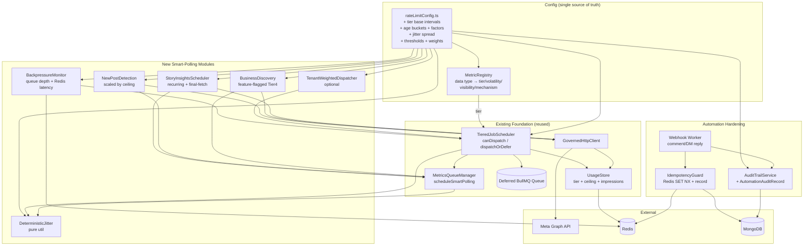
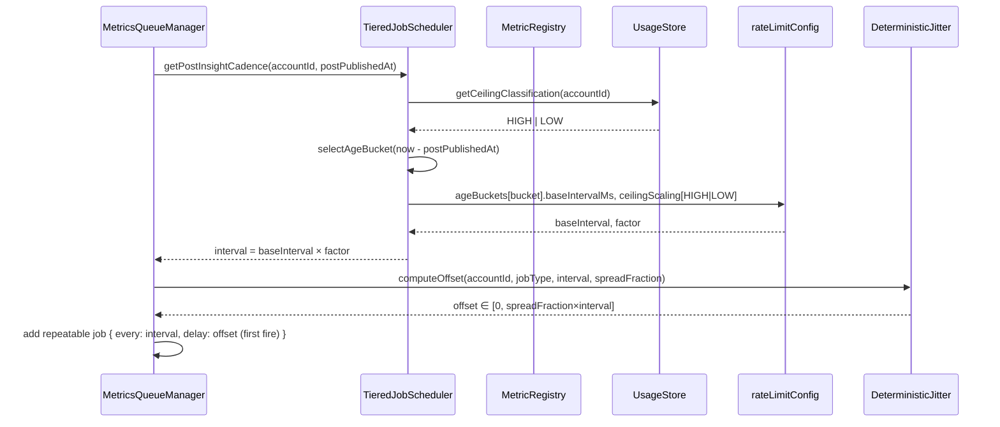

# Design Document: Smart Polling System

## Overview

The Smart Polling System is an **enhancement layer** that extends the already-delivered `instagram-rate-limit-architecture` and `enterprise-insights-sync` foundations. It does not redesign or duplicate any existing component. Instead it plugs new, narrowly-scoped modules into the existing flow:

```
GovernedHttpClient → UsageStore → TieredJobScheduler → MetricsQueueManager
```

The 14-requirement delta breaks down into three concerns:

1. **A single source of truth for cadence** — a new `MetricRegistry` table assigns every Instagram data type to exactly one of four classification tiers, and the existing `TieredJobScheduler` reads per-tier base intervals from `rateLimitConfig` instead of guessing intervals.
2. **Correctness fixes for the metrics actually requested** — migrate the deprecated `impressions` metric to `views` for post-2024-07-02 content (keeping `impressions` only for legacy backfill), and bundle `saved`/`shares` into the single media-insights field-expansion request.
3. **Enterprise hardening** — age-based post cadence, story hard-deadline handling, follower-demographics gating, deterministic jitter, new-post detection, optional Business Discovery, idempotency on retryable reply jobs, an audit trail, graceful internal backpressure degradation, and optional tenant priority weighting — all driven by new runtime-configurable values in `rateLimitConfig`.

### Design Principles

| Principle | Application |
|-----------|-------------|
| Extend, never replace | All new logic plugs into existing `TieredJobScheduler.canDispatch/dispatchOrDefer/getPollingCadence` and `MetricsQueueManager.scheduleSmartPolling` |
| One source of truth | `MetricRegistry` is the only place a metric→tier mapping lives; `rateLimitConfig` is the only place numbers live |
| Config-driven, no literals | Every interval, threshold, factor, and weight is added to `rateLimitConfig` following the existing typed-interface + `ENV_OVERRIDES` pattern |
| Pure logic where possible | Cadence selection, jitter, age-bucketing, backpressure state, and weighting are pure functions, making them property-testable |
| OSS BullMQ only | Per-account governance stays at the application level (existing `UsageStore` tier check); no BullMQ Pro features. Jitter uses BullMQ `delay`; retry jitter uses BullMQ `backoff.jitter` |

### Foundation Reused As-Is

- `server/config/rateLimitConfig.ts` — extended with new typed fields and `ENV_OVERRIDES` entries.
- `server/services/UsageStore.ts` — reused unchanged for `getEffectiveUsage`, `getTier`, `getCeilingClassification`, `updateImpressionsEstimate`, rolling impressions estimate.
- `server/services/TieredJobScheduler.ts` — extended with new methods; existing `canDispatch`/`dispatchOrDefer`/deferred queue reused.
- `server/queues/metricsQueue.ts` — `MetricsQueueManager.scheduleSmartPolling`/`scheduleMetricsFetch` extended; repeatable-job diffing-with-cache pattern reused.

---

## Architecture



### Where Each New Module Plugs In

| New module | Integration point | Existing code touched |
|-----------|-------------------|----------------------|
| `MetricRegistry` | Read by `getPostInsightCadence` / cadence selection | `TieredJobScheduler` (new methods only) |
| Config extensions | Imported everywhere via `rateLimitConfig` | `rateLimitConfig.ts` (additive) |
| `selectInsightMetrics` | Builds field-expansion string for media insights | `enterprise-insights-sync` request builder, `rateLimitConfig` strings |
| `getPostInsightCadence` | New method on `TieredJobScheduler` | `TieredJobScheduler`, `MetricsQueueManager.scheduleSmartPolling` |
| `StoryInsightsScheduler` | Dedicated BullMQ queue + delayed final-fetch | `metricsQueue` queue patterns |
| `DeterministicJitter` | `delay` option on first scheduling | `MetricsQueueManager.scheduleSmartPolling` |
| `BackpressureMonitor` | Consulted inside `canDispatch`/`dispatchOrDefer` | `TieredJobScheduler` |
| `TenantWeightedDispatcher` | Worker/dispatch selection during contention | `TieredJobScheduler` |
| `IdempotencyGuard` | Wraps reply side-effect in webhook worker | webhook worker |
| `AuditTrailService` | Called after each automated action | webhook worker |

### Cadence Selection Data Flow



---

## Components and Interfaces

### 1. MetricRegistry (`server/config/metricRegistry.ts`)

A single typed in-code table. Adding a metric means adding one row. Startup validation rejects zero or duplicate tier assignments.

```typescript
/** Four-level classification, ascending in how aggressively the metric is polled. */
export enum ClassificationTier {
  TIER_1 = 1, // real-time priority (webhook or active-view poll)
  TIER_2 = 2, // refresh-on-view
  TIER_3 = 3, // scheduled moderate frequency
  TIER_4 = 4, // background low frequency
}

export type Volatility = 'high' | 'medium' | 'low';
export type Visibility = 'high' | 'medium' | 'low';
export type DataMechanism = 'webhook' | 'poll';

/** One row of the registry — the complete classification of one data type. */
export interface MetricRegistryEntry {
  dataType: MetricDataType;
  classificationTier: ClassificationTier;
  volatility: Volatility;
  visibility: Visibility;
  mechanism: DataMechanism;   // 'webhook' types are never polled
  webhookEligible: boolean;
}

export type MetricDataType =
  | 'comments' | 'dms' | 'follower_count' | 'reach' | 'views'
  | 'profile_views' | 'saved' | 'shares' | 'story_insights' | 'mentions'
  | 'scheduled_post_status' | 'follower_demographics' | 'online_followers'
  | 'business_action_clicks' | 'new_post_detection' | 'business_discovery';

export class MetricRegistry {
  /** Frozen table — the single source of truth (Req 1.1, 1.3). */
  static readonly ENTRIES: ReadonlyArray<MetricRegistryEntry>;

  /** Look up a single row; throws if the data type is not registered. */
  static get(dataType: MetricDataType): MetricRegistryEntry;

  /** True for webhook-only types that must never be polled (Req 1.5). */
  static isWebhookOnly(dataType: MetricDataType): boolean;

  /**
   * Startup validation (Req 1.8): every listed data type appears exactly once.
   * Also enforces Req 1.2 — equal (volatility, visibility) ⇒ equal tier.
   * Throws on any violation to fail startup.
   */
  static validate(): void;

  /**
   * Returns the per-tier base interval (ms) for a data type by reading
   * config.metricTierBaseIntervalsMs keyed by the entry's tier (Req 1.4).
   */
  static baseIntervalMs(dataType: MetricDataType, config: RateLimitConfig): number;
}
```

The registry table (full contents shown in Data Models) is validated once at module load by calling `MetricRegistry.validate()`, mirroring how `rateLimitConfig` runs `validateRateLimitConfigAtStartup` at import time.

### 2. Config Extensions (`server/config/rateLimitConfig.ts`)

New typed fields added to the existing `RateLimitConfig` interface (additive — existing fields unchanged). Each carries a doc comment with source and an ISO-8601 last-verified date (Req 14.6). Missing/out-of-range overrides are rejected and the last valid value retained with an error surfaced (Req 14.5).

```typescript
/** Post-age bucket boundaries and per-bucket base intervals (Req 4). */
export interface PostAgeBucketConfig {
  /** Upper bound (exclusive) of this bucket in ms; the last bucket uses Infinity. */
  maxAgeMs: number;
  /** Base media-insight refresh interval (ms) for this bucket. */
  baseIntervalMs: number;
}

export interface SmartPollingConfig {
  /**
   * Per-tier base polling interval (ms), keyed by ClassificationTier (Req 1.4, 14.1).
   * Tier 1 shortest → Tier 4 longest. Source: internal cadence policy.
   * Last verified: 2025-01-15
   */
  metricTierBaseIntervalsMs: Record<1 | 2 | 3 | 4, number>;

  /**
   * Ordered age buckets: 0–48h, 48h–7d, 7–30d, >30d (Req 4.1–4.5).
   * Intervals MUST be strictly increasing across buckets.
   * Last verified: 2025-01-15
   */
  postAgeBuckets: PostAgeBucketConfig[];

  /** Cadence multiplier per ceiling classification (Req 4.1–4.4). LOW ≥ HIGH. */
  ceilingScalingFactor: { HIGH: number; LOW: number };

  /**
   * Jitter spread as a fraction of base interval (Req 7.2, 7.5).
   * Constrained to [0.10, 0.25]; default 0.25.
   * Last verified: 2025-01-15
   */
  jitterSpreadFraction: number;

  /** Minimum recent follower_count to allow demographics calls (Req 6.5). Default 100. */
  followerDemographicsThreshold: number;

  /** New-post detection intervals (ms) scaled by ceiling (Req 8.1, 8.2, 8.4). */
  newPostDetectionMs: { highCeiling: number; lowCeiling: number };

  /** Recurring story-insights interval (ms) (Req 5.1). Default ~2.5h. */
  storyRecurringIntervalMs: number;
  /** Pre-expiry lead time (ms) for the final fetch (Req 5.2). Default 30min. */
  storyFinalFetchLeadMs: number;
  /** Story lifetime (ms) — 24h. Used to compute the final-fetch deadline. */
  storyLifetimeMs: number;

  /** Backpressure thresholds + sample interval (Req 12.3, 12.6, 12.7). */
  backpressure: {
    /** Queue-depth job count above which pressure is active. */
    triggerQueueDepth: number;
    /** Redis command latency (ms) above which pressure is active. */
    triggerRedisLatencyMs: number;
    /** Clear thresholds — MUST be strictly less than trigger (hysteresis, Req 12.7). */
    clearQueueDepth: number;
    clearRedisLatencyMs: number;
    /** Sampling interval (ms) for queue depth + latency (Req 12.6). */
    evaluationIntervalMs: number;
  };

  /** Audit trail (Req 11.5, 11.6). */
  audit: {
    /** Retention period (seconds) for the TTL index. */
    retentionSeconds: number;
    /** Max persistence retries on write failure. */
    persistenceMaxRetries: number;
  };

  /** Business Discovery (Req 9). */
  businessDiscovery: {
    enabled: boolean;
    intervalMs: number;
    maxCompetitorsPerAccount: number;
  };

  /** Tenant priority weighting (Req 13). */
  tenantPriority: {
    enabled: boolean;
    /** tenantId → weight (1–1000). Invalid/missing ⇒ default 1 + warning (Req 13.5). */
    weights: Record<string, number>;
    /** Rolling fairness window (ms). Default 60_000. */
    windowMs: number;
  };
}

// RateLimitConfig gains: smartPolling: SmartPollingConfig;
```

New `ENV_OVERRIDES` entries follow the existing array-of-`EnvOverride` pattern, e.g.:

```typescript
{ envKey: 'SP_JITTER_SPREAD_FRACTION', configPath: ['smartPolling', 'jitterSpreadFraction'], parse: Number },
{ envKey: 'SP_FOLLOWER_DEMOGRAPHICS_THRESHOLD', configPath: ['smartPolling', 'followerDemographicsThreshold'], parse: Number },
{ envKey: 'SP_STORY_RECURRING_MS', configPath: ['smartPolling', 'storyRecurringIntervalMs'], parse: Number },
{ envKey: 'SP_STORY_FINAL_LEAD_MS', configPath: ['smartPolling', 'storyFinalFetchLeadMs'], parse: Number },
{ envKey: 'SP_BP_TRIGGER_QUEUE_DEPTH', configPath: ['smartPolling', 'backpressure', 'triggerQueueDepth'], parse: Number },
{ envKey: 'SP_BP_CLEAR_QUEUE_DEPTH', configPath: ['smartPolling', 'backpressure', 'clearQueueDepth'], parse: Number },
{ envKey: 'SP_AUDIT_RETENTION_SECONDS', configPath: ['smartPolling', 'audit', 'retentionSeconds'], parse: Number },
{ envKey: 'SP_BUSINESS_DISCOVERY_ENABLED', configPath: ['smartPolling', 'businessDiscovery', 'enabled'], parse: parseBool },
// ... one entry per new value (Req 14.3)
```

A new range-validation step in `buildRateLimitConfig` rejects overrides outside their allowed range (e.g. jitter spread outside [0.10, 0.25], clear ≥ trigger), logs which value failed, and retains the prior valid value (Req 14.5).

### 3. Views / Impressions Field Selection (`server/services/insightMetricSelection.ts`)

```typescript
/** The deprecation boundary: media on/after this date use `views`, not `impressions`. */
export const VIEWS_CUTOVER_UTC = Date.parse('2024-07-02T00:00:00Z');

/**
 * Returns the insight metric set for a media object based on its publish time (Req 2.1, 2.4).
 * - published >= 2024-07-02 → 'views'
 * - published  < 2024-07-02 → 'impressions' (legacy backfill only, Req 2.3)
 */
export function selectInsightMetrics(mediaPublishedAt: Date | number): {
  primaryReachMetric: 'views' | 'impressions';
  fieldExpansion: string;
};

/**
 * Corrected current-content field-expansion string (Req 2.2, 3.1):
 *   insights.metric(views,reach,saved,shares,total_interactions)
 * `likes` and `comments` come from the media node fields, bundled in the same request.
 */
export const CURRENT_CONTENT_INSIGHT_EXPANSION =
  'insights.metric(views,reach,saved,shares,total_interactions)';

/** Legacy backfill expansion for pre-cutover media only. */
export const LEGACY_BACKFILL_INSIGHT_EXPANSION =
  'insights.metric(impressions,reach,saved,shares,total_interactions)';
```

**Deprecation fallback (Req 2.6):** the media-insights caller wraps the request — if Meta returns an `impressions`-deprecated/unavailable error on a current-content request, it retries once with `impressions` replaced by `views`, records that the substitution occurred, and does **not** mark the job failed. The existing `rateLimitConfig`/backfill expansion strings that currently say `impressions` are updated to `views` for current content.

### 4. Age-Based Post Cadence (extension to `TieredJobScheduler`)

```typescript
class TieredJobScheduler {
  // ... existing members ...

  /**
   * Compute the media-insight refresh interval for a post (Req 4.1–4.6).
   * Selects the age bucket for (now − postPublishedAt), multiplies the bucket's
   * base interval by the ceiling scaling factor. Pure-ish: reads ceiling from
   * UsageStore, all numbers from config.
   */
  async getPostInsightCadence(accountId: string, postPublishedAt: number): Promise<number>;

  /** Pure: select the bucket index for a post age (ms). */
  static selectAgeBucket(postAgeMs: number, buckets: PostAgeBucketConfig[]): number;

  /** Pure: bucketBaseInterval × ceilingScaling[classification]. */
  static computePostInterval(
    postAgeMs: number,
    classification: CeilingClassification,
    config: RateLimitConfig
  ): number;
}
```

`saved` and `shares` are **not** separate jobs — they ride in the same media-insights request via `CURRENT_CONTENT_INSIGHT_EXPANSION` (Req 3.1, 3.2), so they inherit this exact cadence (Req 3.3). On each polling cycle the scheduler recomputes the bucket; if the post has crossed a boundary it reschedules the repeatable job to the new interval within one cycle (Req 4.6), reusing the existing `scheduleSmartPolling` repeatable-job diffing.

### 5. StoryInsightsScheduler (`server/services/StoryInsightsScheduler.ts`)

Uses a dedicated BullMQ queue following the existing `metricsQueue` queue patterns. Delayed jobs use the BullMQ `delay` option.

```typescript
export interface StoryInsightsJobData {
  accountId: string;
  storyId: string;
  publishTimeMs: number;
  kind: 'recurring' | 'final';
}

export class StoryInsightsScheduler {
  constructor(scheduler: TieredJobScheduler, usageStore: UsageStore, config: RateLimitConfig);

  /**
   * On story detection (Req 5.1, 5.2):
   *  - schedule recurring Story_Insights_Job every storyRecurringIntervalMs
   *  - schedule one Final_Fetch_Job with delay = (publishTime + 24h − lead) − now
   */
  async onStoryDetected(accountId: string, storyId: string, publishTimeMs: number): Promise<void>;

  /**
   * Final fetch execution (Req 5.3–5.5, 5.7, 5.9):
   *  - if account NOT Critical → override headroom deferral and run
   *  - if Critical and past expiry → record not-captured, stop (no further attempts)
   *  - on success → cancel recurring polling for the story
   *  - error code 10 (<5 viewers) → mark complete, no retry, no error log (Req 5.6)
   *  - other failure before expiry → full-jitter backoff retry, bounded before expiry (Req 5.7)
   */
  async runFinalFetch(data: StoryInsightsJobData): Promise<void>;

  /** Pure: compute the final-fetch fire delay (ms) from publish time + config. */
  static computeFinalFetchDelayMs(publishTimeMs: number, now: number, config: RateLimitConfig): number;

  /** Pure: is a retry still safely schedulable before expiry? */
  static canRetryBeforeExpiry(publishTimeMs: number, nextAttemptAtMs: number, config: RateLimitConfig): boolean;
}
```

A received story-insights webhook does **not** cancel the recurring poll or final fetch — they remain the safety net (Req 5.8).

### 6. Follower Demographics Gate + Tier-4 Low-Frequency Metrics (extension to `TieredJobScheduler`)

```typescript
class TieredJobScheduler {
  /**
   * Gate follower_demographics on most-recent follower_count vs threshold (Req 6.1, 6.2, 6.7).
   * Returns true only if followerCount >= config threshold AND it hasn't run in the
   * rolling 24h window for this account.
   */
  async shouldScheduleFollowerDemographics(accountId: string, lastFollowerCount: number): Promise<boolean>;

  /** Pure: threshold gate (Req 6.1, 6.5, 6.7). */
  static demographicsGateOpen(lastFollowerCount: number, threshold: number): boolean;
}
```

`online_followers` and the business-action-click metrics (`email_contacts`, `phone_call_clicks`, `text_message_clicks`, `get_directions_clicks`) are registered as Tier 4 and dispatched at most once per rolling 24h window per account (Req 6.3, 6.4) via a per-account `lastDispatchedAt` marker in Redis. A follower_demographics error code 10 marks the job complete with no retry and no error log (Req 6.6).

### 7. DeterministicJitter (`server/utils/deterministicJitter.ts`)

```typescript
/**
 * Pure, stateless first-fire offset for a recurring job (Req 7.1–7.3, 7.6).
 * offset ∈ [0, spreadFraction × baseIntervalMs]. Stable across restarts/instances
 * because it derives solely from a stable string hash of (accountId|jobType).
 * Cryptographic strength is NOT required.
 *
 * baseIntervalMs <= 0 (missing/zero/negative) ⇒ returns 0 (Req 7.6).
 * spreadFraction is clamped to [0.10, 0.25] by config validation (Req 7.2).
 */
export function computeJitterOffset(
  accountId: string,
  jobType: string,
  baseIntervalMs: number,
  spreadFraction: number
): number;

/** Simple stable 32-bit string hash (e.g. FNV-1a / djb2). Deterministic, non-crypto. */
export function stableHash(input: string): number;
```

Integration: `MetricsQueueManager.scheduleSmartPolling` computes the offset and passes it as the BullMQ `delay` **only when first creating** the repeatable job (the existing "add jobs that don't already exist" branch), so subsequent occurrences fire at the base interval with no re-applied offset (Req 7.1). The `jobId` remains the existing deterministic `smart-poll-{workspaceId}-{accountId}-{cadenceType}-{repeatMs}` key. Retry jitter uses BullMQ `backoff: { type: 'exponential', jitter: ... }` (Req 7.4).

### 8. New-Post Detection (extension to `TieredJobScheduler` + `MetricsQueueManager`)

```typescript
export interface NewPostDetectionJobData {
  workspaceId: string;
  accountId: string;
  token: string;
}

class TieredJobScheduler {
  /** Interval scaled by ceiling: 2–4h HIGH, 6–8h LOW (Req 8.1, 8.2, 8.4). */
  static newPostDetectionInterval(classification: CeilingClassification, config: RateLimitConfig): number;
}
```

Behavior: the detection request is routed through `GovernedHttpClient` so it counts against usage (Req 8.6). Posts published through Veefore are registered for insight polling directly and skip detection (Req 8.3). A discovered unknown post is registered for age-based polling per Requirement 4 (Req 8.5). Failure/throttle preserves last-known detection state and does not create duplicate registrations for already-registered posts (Req 8.7), using an idempotent "registered post ids" set keyed by account.

### 9. Business Discovery (`server/services/BusinessDiscoveryScheduler.ts`, feature-flagged)

```typescript
export class BusinessDiscoveryScheduler {
  constructor(scheduler: TieredJobScheduler, config: RateLimitConfig);

  /**
   * Only when config.smartPolling.businessDiscovery.enabled (Req 9.1, 9.4):
   *  - Tier 4, deferrable without bound under load (Req 9.1)
   *  - ≤ once / 24h per competitor (Req 9.2)
   *  - cap at maxCompetitorsPerAccount (Req 9.3)
   *  - routed through GovernedHttpClient (Req 9.5)
   *  - not-found/inaccessible error → record failed lookup, mark complete, no retry (Req 9.6)
   */
  async scheduleForAccount(accountId: string, competitorUsernames: string[]): Promise<void>;
}
```

### 10. IdempotencyGuard (`server/services/IdempotencyGuard.ts`)

```typescript
export interface IdempotencyResult {
  /** 'reserved' = caller may perform the side-effect; 'already_completed' = skip; 'unavailable' = store failure */
  status: 'reserved' | 'already_completed' | 'unavailable';
}

export class IdempotencyGuard {
  constructor(redis: Redis, completionStore: CompletionStore /* durable, e.g. Mongo */);

  /**
   * Deterministic key for a reply side-effect (Req 10.1):
   *   hash(accountId + ':' + (commentId | threadId) + ':' + ruleId)
   * Identical across all retries of the same intended action.
   */
  static buildKey(parts: { accountId: string; sourceId: string; ruleId: string }): string;

  /**
   * Atomically reserve the key (Redis SET NX) and check durable completion (Req 10.2, 10.3).
   * Two concurrent executions of the same key: only one gets 'reserved'.
   * If a durable completion record exists → 'already_completed'.
   * If Redis or the completion store cannot be read/written → 'unavailable' (Req 10.5).
   */
  async reserve(key: string): Promise<IdempotencyResult>;

  /** Durably record completion BEFORE the job is marked complete (Req 10.4). */
  async recordCompletion(key: string): Promise<void>;
}
```

Applied in the webhook worker around comment-reply and DM-reply automation (Req 10.6). If `reserve` returns `unavailable`, the side-effect is left un-performed, an error is surfaced, and the job is preserved for safe retry (Req 10.5).

### 11. AuditTrail (`server/models/Automation/AutomationAuditRecord.ts` + `server/services/AuditTrailService.ts`)

Mongoose model follows existing patterns (`MetaUsageTracker`, `AutomationRule`).

```typescript
export interface IAutomationAuditRecord extends Document {
  targetAccountId: string;
  ruleId: string;
  ruleName?: string;
  actionType: 'comment_reply' | 'dm_reply';
  triggeringInput: Record<string, any>;
  contentSent?: string;
  outcome: 'success' | 'failure';
  failureReason?: string;
  occurredAt: Date;          // UTC, second precision (Req 11.3)
  createdAt: Date;
}

export class AuditTrailService {
  constructor(config: RateLimitConfig);

  /**
   * Persist exactly one record per action (Req 11.1, 11.2, 11.4).
   * Retries up to config.smartPolling.audit.persistenceMaxRetries on failure,
   * surfaces an error rather than silently discarding (Req 11.5).
   */
  async record(record: Omit<IAutomationAuditRecord, keyof Document | 'createdAt'>): Promise<void>;
}
```

Retention via a TTL index on `occurredAt` using `config.smartPolling.audit.retentionSeconds` (Req 11.6).

### 12. BackpressureMonitor (`server/services/BackpressureMonitor.ts`)

```typescript
export type BackpressureState = 'active' | 'cleared';

export class BackpressureMonitor {
  constructor(metricsQueue: Queue, redis: Redis, config: RateLimitConfig);

  /** Sample queue depth + Redis command latency every evaluationIntervalMs (Req 12.6). */
  start(): void;
  stop(): void;

  /** Current shed state, consulted by the scheduler. */
  getState(): BackpressureState;

  /**
   * Pure hysteresis transition (Req 12.1–12.4, 12.7, 12.8):
   *  - if redisUnreachable ⇒ 'active' (Req 12.8)
   *  - else if depth > triggerQueueDepth OR latency > triggerRedisLatencyMs ⇒ 'active'
   *  - else if depth < clearQueueDepth AND latency < clearRedisLatencyMs ⇒ 'cleared'
   *  - else ⇒ retain previous state (no oscillation; clear < trigger guaranteed by config)
   */
  static nextState(
    prev: BackpressureState,
    sample: { queueDepth: number; redisLatencyMs: number | null },
    config: RateLimitConfig
  ): BackpressureState;
}
```

Integration: `TieredJobScheduler.canDispatch`/`dispatchOrDefer` consult `getState()`. When active, work is shed in **ascending** tier order (Tier 4 first) and moved to the existing durable deferred queue — never dropped (Req 12.2, 12.5). When cleared, deferred work resumes in **descending** tier order (Tier 1 first) via the existing `reEvaluateDeferredJobs` (Req 12.4).

### 13. TenantWeightedDispatcher (optional, extension to dispatch selection)

```typescript
export class TenantWeightedDispatcher {
  constructor(config: RateLimitConfig);

  /**
   * Choose the next tenant to dispatch under contention (Req 13.1–13.3).
   * - enabled  ⇒ proportional to normalized weights over a rolling 60s window,
   *   within ±10pp, guaranteeing ≥1 job/tenant/window (Req 13.1, 13.2)
   * - disabled ⇒ equal shares (round-robin) (Req 13.3)
   */
  selectNextTenant(pending: TenantPending[], windowCounts: Record<string, number>): string;

  /** Pure: resolve a tenant weight, defaulting invalid/missing to 1 + warning (Req 13.4, 13.5). */
  static resolveWeight(tenantId: string, weights: Record<string, number>): number;
}
```

---

## Data Models

### MetricRegistry Table (Req 1.1, 1.2)

| Data type | Tier | Volatility | Visibility | Mechanism | Webhook-eligible |
|-----------|------|-----------|-----------|-----------|------------------|
| comments | 1 | high | high | webhook | yes |
| dms | 1 | high | high | webhook | yes |
| mentions | 1 | high | high | webhook | yes |
| story_insights | 1 | high | high | poll | no* |
| follower_count | 2 | medium | high | poll | no |
| reach | 2 | medium | high | poll | no |
| views | 2 | medium | high | poll | no |
| profile_views | 2 | medium | high | poll | no |
| saved | 2 | medium | medium | poll | no |
| shares | 2 | medium | medium | poll | no |
| scheduled_post_status | 3 | low | high | poll | no |
| new_post_detection | 3 | medium | low | poll | no |
| follower_demographics | 4 | low | low | poll | no |
| online_followers | 4 | low | low | poll | no |
| business_action_clicks | 4 | low | low | poll | no |
| business_discovery | 4 | low | low | poll | no |

\* `story_insights` arrives via webhook **and** is polled as the guaranteed safety net (Req 5.8), so it is classified Tier 1 but `mechanism: 'poll'`. Comments, dms, mentions are webhook-only and never polled (Req 1.5).

The table enforces Req 1.2: any two metrics with identical (volatility, visibility) share a tier — e.g. `saved`/`shares` (medium, medium → Tier 2); the four Tier-4 metrics (low, low). `new_post_detection` is (medium, low) so it stays unique to Tier 3 without colliding with the (medium, medium) Tier-2 pair. `validate()` throws at startup if a data type is missing, duplicated, or violates the equal-pair rule (Req 1.8).

### Per-Tier Base Intervals & Age Buckets (config defaults)

```typescript
metricTierBaseIntervalsMs: { 1: 5*60_000, 2: 60*60_000, 3: 3*60*60_000, 4: 24*60*60_000 }, // T1<T2<T3<T4

postAgeBuckets: [
  { maxAgeMs: 48*3600_000,        baseIntervalMs: 1*3600_000  }, // 0–48h   : hourly
  { maxAgeMs: 7*24*3600_000,      baseIntervalMs: 6*3600_000  }, // 48h–7d  : 6h
  { maxAgeMs: 30*24*3600_000,     baseIntervalMs: 24*3600_000 }, // 7–30d   : daily
  { maxAgeMs: Number.POSITIVE_INFINITY, baseIntervalMs: 7*24*3600_000 }, // >30d : weekly
],                                                               // strictly increasing (Req 4.2, 4.3, 4.4)

ceilingScalingFactor: { HIGH: 1.0, LOW: 2.0 }, // LOW polled less often (Req 4.1–4.4)
```

### AutomationAuditRecord (MongoDB collection `automationAuditRecords`)

| Field | Type | Notes |
|-------|------|-------|
| `targetAccountId` | string (indexed) | Req 11.3 |
| `ruleId` | string | rule that matched (Req 11.1, 11.2) |
| `ruleName` | string? | denormalized for review |
| `actionType` | `'comment_reply' \| 'dm_reply'` | Req 11.4 |
| `triggeringInput` | Mixed | the input that triggered the action |
| `contentSent` | string? | content sent on success (Req 11.1) |
| `outcome` | `'success' \| 'failure'` | Req 11.1, 11.2 |
| `failureReason` | string? | populated on failure |
| `occurredAt` | Date | UTC, second precision; TTL index `expireAfterSeconds = retentionSeconds` (Req 11.3, 11.6) |

### Idempotency Records

```
Redis reservation:  idem:reserve:{key}  → SET NX, short TTL (in-flight guard)   (Req 10.2)
Durable completion: Mongo `idempotencyCompletions` { key (unique), completedAt } (Req 10.4)
```

`key = stableHash(accountId + ':' + (commentId|threadId) + ':' + ruleId)` (Req 10.1). Reservation is atomic via `SET key value NX PX ttl`; completion is recorded durably before the job is marked complete so it survives retries/restarts (Req 10.4).

### Config Additions Summary (Req 14.1)

All of the following live under `rateLimitConfig.smartPolling`: `metricTierBaseIntervalsMs`, `postAgeBuckets`, `ceilingScalingFactor`, `jitterSpreadFraction`, `followerDemographicsThreshold`, `newPostDetectionMs`, `storyRecurringIntervalMs`, `storyFinalFetchLeadMs`, `storyLifetimeMs`, `backpressure.*`, `audit.*`, `businessDiscovery.*`, `tenantPriority.*`. Each has a documented ENV override (Req 14.3) and ISO-8601 last-verified date (Req 14.6); the registry tier assignments live in `MetricRegistry.ENTRIES` (Req 14.1).

---

## Correctness Properties

*A property is a characteristic or behavior that should hold true across all valid executions of a system — essentially, a formal statement about what the system should do. Properties serve as the bridge between human-readable specifications and machine-verifiable correctness guarantees.*

These properties target the **pure logic** of the smart-polling delta (registry classification, cadence math, jitter, idempotency keys, backpressure hysteresis, weighting). I/O-bound and configuration/wiring criteria are covered by example/integration/smoke tests in the Testing Strategy instead. Each property is implemented with a single fast-check property test running ≥100 iterations.

### Property 1: Registry assigns exactly one tier per data type

*For any* data type in the canonical metric list, `MetricRegistry` contains exactly one entry for it with a `classificationTier` in {1,2,3,4}, and `MetricRegistry.validate()` succeeds on the canonical table while throwing for any table with a missing or duplicated data type.

**Validates: Requirements 1.1, 1.8**

### Property 2: Equal volatility and visibility imply equal tier

*For any* two registry entries that share the same `volatility` and the same `visibility`, their `classificationTier` is identical.

**Validates: Requirements 1.2**

### Property 3: Cadence base interval is keyed by the metric's tier

*For any* data type, `MetricRegistry.baseIntervalMs(dataType, config)` equals `config.smartPolling.metricTierBaseIntervalsMs[entry.classificationTier]` for that data type's entry — selection reads the per-tier interval and nothing else.

**Validates: Requirements 1.4**

### Property 4: Webhook-only data types are never polled

*For any* data type, the scheduler permits polling if and only if the registry entry is not webhook-only; `comments`, `dms`, and `mentions` are never schedulable for polling.

**Validates: Requirements 1.5**

### Property 5: Views-versus-impressions date boundary

*For any* media publish timestamp, `selectInsightMetrics` returns `views` (and never `impressions`) when the timestamp is on or after 2024-07-02T00:00:00Z, and permits `impressions` only when the timestamp is strictly earlier.

**Validates: Requirements 2.1, 2.3, 2.4**

### Property 6: Media insights are bundled into a single request

*For any* media object, building its current-content insight request yields exactly one field-expansion request whose metric set contains `views`, `reach`, `saved`, `shares`, and `total_interactions` together — no separate request is produced for `saved` or `shares`.

**Validates: Requirements 3.1, 3.2, 3.3**

### Property 7: Age-bucket interval ordering and ceiling scaling

*For any* two post ages `a < b`, `computePostInterval(a, c, config) <= computePostInterval(b, c, config)` for a fixed ceiling `c`, and the interval is strictly greater once `b` falls in a later bucket; and *for any* post age, the LOW-ceiling interval is greater than or equal to the HIGH-ceiling interval (equal to `bucketBaseInterval × ceilingScalingFactor[c]`).

**Validates: Requirements 4.1, 4.2, 4.3, 4.4**

### Property 8: Story final-fetch delay arithmetic

*For any* story publish time and current time, `computeFinalFetchDelayMs` equals `(publishTimeMs + storyLifetimeMs − storyFinalFetchLeadMs) − now`, i.e. the final fetch is scheduled exactly one lead-time before the 24-hour expiry.

**Validates: Requirements 5.2**

### Property 9: Story retry stays before expiry

*For any* story publish time and proposed next-attempt time, `canRetryBeforeExpiry` returns true if and only if the next attempt is scheduled strictly before `publishTimeMs + storyLifetimeMs`.

**Validates: Requirements 5.7**

### Property 10: Follower-demographics threshold gate

*For any* most-recent follower count and configured threshold, `demographicsGateOpen` returns false when the count is strictly below the threshold and true when it is greater than or equal to the threshold (the gate transitions exactly at the threshold, so an upward crossing re-enables scheduling).

**Validates: Requirements 6.1, 6.5, 6.7**

### Property 11: Deterministic jitter determinism and bounds

*For any* account ID, job type, base interval, and spread fraction in [0.10, 0.25], `computeJitterOffset` returns the same value on repeated calls (no persisted state) and that value lies in `[0, spreadFraction × baseInterval]`; when the base interval is missing, zero, or negative the offset is exactly 0.

**Validates: Requirements 7.1, 7.2, 7.3, 7.6**

### Property 12: New-post detection interval scales with ceiling

*For any* ceiling classification, `newPostDetectionInterval` returns an interval within the configured per-ceiling range, with the LOW-ceiling interval strictly greater than the HIGH-ceiling interval.

**Validates: Requirements 8.1, 8.2**

### Property 13: New-post registration is duplicate-free

*For any* sequence of detected post IDs (including repeats), registering each leaves the account's registered-post set containing each ID exactly once — re-detecting an already-registered post creates no duplicate.

**Validates: Requirements 8.7**

### Property 14: Business Discovery respects the competitor cap

*For any* list of competitor usernames, the number of scheduled Business_Discovery_Jobs never exceeds `config.smartPolling.businessDiscovery.maxCompetitorsPerAccount`, and is zero whenever the feature is disabled.

**Validates: Requirements 9.1, 9.3, 9.4**

### Property 15: Idempotency key determinism

*For any* `(accountId, sourceId, ruleId)` triple, `IdempotencyGuard.buildKey` is a pure deterministic function — identical inputs always yield identical keys, and any difference in the intended side-effect (different account, source, or rule) yields a different key.

**Validates: Requirements 10.1**

### Property 16: Idempotent side-effect performed at most once

*For any* number of retries carrying the same idempotency key, the guarded side-effect is performed at most once: after a completion is recorded, every subsequent reserve resolves to skip.

**Validates: Requirements 10.3**

### Property 17: Exactly one audit record per action with required fields

*For any* automated comment-reply or DM-reply action (success or failure), exactly one `AutomationAuditRecord` is produced, containing the matched rule, triggering input, outcome, a UTC second-precision `occurredAt`, and the target account identifier.

**Validates: Requirements 11.1, 11.2, 11.3, 11.4**

### Property 18: Backpressure hysteresis does not oscillate

*For any* sequence of samples whose values fall within the band between the clear and trigger thresholds (clear < trigger by construction), `nextState` retains the previous state for every sample — the state only flips when a sample exceeds the trigger (→ active) or falls strictly below all clear thresholds (→ cleared); an unmeasurable (null) Redis latency always yields `active`.

**Validates: Requirements 12.7, 12.8**

### Property 19: Backpressure sheds ascending and resumes descending by tier

*For any* mixed-tier set of pending jobs, when pressure is active the shed order is strictly ascending by classification tier (Tier 4 first), and when cleared the resume order is strictly descending by classification tier (Tier 1 first).

**Validates: Requirements 12.1, 12.2, 12.4**

### Property 20: Weighted fair dispatch under contention

*For any* set of tenants with pending jobs and configured weights, with weighting enabled the long-run share of dispatched jobs per tenant over the rolling window is within ±10 percentage points of that tenant's normalized weight, and every tenant with pending jobs receives at least one dispatch per window.

**Validates: Requirements 13.1, 13.2**

### Property 21: Equal shares when weighting disabled, valid weights when enabled

*For any* set of tenants, with weighting disabled each tenant with pending jobs receives an equal share (within rounding); and *for any* weight input, `resolveWeight` returns a weight in [1,1000], defaulting missing or invalid weights to 1.

**Validates: Requirements 13.3, 13.4, 13.5**

### Property 22: Invalid config overrides retain the last valid value

*For any* environment override that is missing, unparseable, or outside its allowed range (e.g. jitter spread outside [0.10, 0.25], or a clear threshold not strictly below its trigger), `buildRateLimitConfig` rejects the override, retains the prior valid value, and reports the failing key.

**Validates: Requirements 14.5**

---

## Error Handling

| Error source | Handling strategy | Outcome |
|--------------|-------------------|---------|
| `impressions` deprecated/unavailable on current content (Req 2.6) | Retry once substituting `views`; record substitution | Job not marked failed |
| `saved`/`shares` unavailable for media type (Req 3.4) | Record returned metrics, omit only the missing field, mark complete | No separate request/retry |
| Story error code 10 (<5 viewers) (Req 5.6) | Record insufficient data, mark complete | No retry, not logged as error |
| Story final fetch other failure before expiry (Req 5.7) | Full-jitter backoff retry, bounded by `canRetryBeforeExpiry` | Stops at expiry |
| Critical-tier final fetch unexecuted at expiry (Req 5.5) | Record not-captured | No further attempts |
| follower_demographics error code 10 (Req 6.6) | Record insufficient data, mark complete | No retry, not logged as error |
| New-post detection failure/throttle (Req 8.7) | Preserve last-known detection state | No duplicate registrations |
| Business Discovery competitor not found/inaccessible (Req 9.6) | Record failed lookup, mark complete | No retry |
| Idempotency store read/write failure (Req 10.5) | Leave side-effect un-performed, surface error | Job preserved for safe retry |
| Audit persistence failure (Req 11.5) | Retry up to `audit.persistenceMaxRetries`, surface error | Never silently discarded |
| Redis unreachable for backpressure sampling (Req 12.8) | Treat backpressure as active, shed ascending | Resumes when latency measurable below clear |
| Invalid tenant weight (Req 13.5) | Default to 1, log configuration warning | Dispatch continues |
| Invalid/out-of-range config override (Req 14.5) | Reject override, retain last valid value, surface error identifying the key | Build does not crash |

All retryable failures reuse the existing deferred BullMQ queue and `GovernedHttpClient` retry/backoff infrastructure rather than introducing new retry machinery. Redis-unavailable degradation reuses `UsageStore`'s existing local-cache fallback.

---

## Testing Strategy

### Dual approach

- **Property tests (fast-check 4.x + vitest 4.x)** verify the 22 universal properties above across ≥100 generated inputs each.
- **Unit/example tests** cover concrete scenarios, specific error codes, and partial responses.
- **Integration tests** cover the I/O-bound and wiring criteria (governed-client routing, atomic Redis reservation, durable completion ordering, env-override application).
- **Smoke/type tests** cover config presence and the build-fails-on-mistyped-config criteria.

### Property test conventions

Matches existing `server/services/__tests__/*.property.test.ts`:
- Each test file imports `* as fc from 'fast-check'` and `describe/it/expect` from `vitest`.
- Minimum 100 iterations (`fc.assert(fc.property(...), { numRuns: 100 })` or higher).
- Each property tagged with a comment: `Feature: smart-polling-system, Property {N}: {title}`.
- Run via `vitest run` (single execution — no watch mode).

Planned property test files:
- `server/config/__tests__/metricRegistry.property.test.ts` — Properties 1, 2, 3, 4
- `server/services/__tests__/insightMetricSelection.property.test.ts` — Properties 5, 6
- `server/services/__tests__/postInsightCadence.property.test.ts` — Property 7
- `server/services/__tests__/StoryInsightsScheduler.property.test.ts` — Properties 8, 9
- `server/services/__tests__/followerDemographicsGate.property.test.ts` — Property 10
- `server/utils/__tests__/deterministicJitter.property.test.ts` — Property 11
- `server/services/__tests__/newPostDetection.property.test.ts` — Properties 12, 13
- `server/services/__tests__/BusinessDiscoveryScheduler.property.test.ts` — Property 14
- `server/services/__tests__/IdempotencyGuard.property.test.ts` — Properties 15, 16
- `server/services/__tests__/AuditTrailService.property.test.ts` — Property 17
- `server/services/__tests__/BackpressureMonitor.property.test.ts` — Properties 18, 19
- `server/services/__tests__/TenantWeightedDispatcher.property.test.ts` — Properties 20, 21
- `server/config/__tests__/rateLimitConfig.smartPolling.property.test.ts` — Property 22

### Example / unit tests

- Active-view Tier 1 scoping (Req 1.6); unbounded Tier 4 deferral (Req 1.7).
- Field-expansion string assertions (Req 2.2); rolling impressions from views (Req 2.5); deprecation-retry behavior (Req 2.6).
- Partial media response omitting `saved`/`shares` (Req 3.4); boundary-crossing reschedule (Req 4.6).
- Story recurring schedule (Req 5.1); non-Critical override / Critical defer / Critical-past-expiry stop (Req 5.3–5.5); webhook-does-not-replace (Req 5.8); success-stops-polling (Req 5.9).
- online_followers / business-action-clicks once-per-24h (Req 6.3, 6.4); demographics error code 10 (Req 6.6).
- BullMQ backoff jitter field present (Req 7.4); spread fraction from config (Req 7.5).
- Veefore-published skip (Req 8.3); discovered-post registration (Req 8.5); governed-client routing (Req 8.6).
- Business Discovery not-found handling (Req 9.6).
- Audit persistence retry (Req 11.5); retention TTL index (Req 11.6).

### Integration tests

- Idempotency: two concurrent `reserve` calls on the same key — exactly one `reserved` (Req 10.2); completion recorded before job completion (Req 10.4); store-unavailable preserves job (Req 10.5); applied to comment/DM reply workers (Req 10.6).
- Business Discovery / new-post detection routed through `GovernedHttpClient` and counted against usage (Req 8.6, 9.5).
- Backpressure: shed work lands in the durable deferred queue, never dropped (Req 12.5); sampling at `evaluationIntervalMs` (Req 12.6).
- Config env-override application without code change (Req 14.3) and adoption within the base interval without restart (Req 14.4).

### Smoke / type tests

- `config.smartPolling` exposes every required value (Req 14.1).
- `tsc` build fails on a missing or mistyped config field (Req 14.2).
- Doc comments with ISO-8601 last-verified dates present on new config values (Req 14.6) — lint/review check.

---

## Requirements Traceability

| Requirement | Design component(s) | Properties / Tests |
|-------------|--------------------|--------------------|
| **1** Metric Classification Registry | `MetricRegistry` (table + `validate`/`baseIntervalMs`/`isWebhookOnly`); `TieredJobScheduler` reads tier→interval | Properties 1, 2, 3, 4; examples 1.6, 1.7 |
| **2** Migrate `impressions` → `views` | `insightMetricSelection` (`selectInsightMetrics`, expansion strings, deprecation fallback); `rateLimitConfig` strings | Property 5; examples 2.2, 2.5, 2.6 |
| **3** Bundle `saved`/`shares` | `CURRENT_CONTENT_INSIGHT_EXPANSION`; `getPostInsightCadence` | Property 6; example 3.4 |
| **4** Age-based post cadence | `TieredJobScheduler.getPostInsightCadence` / `selectAgeBucket` / `computePostInterval`; `postAgeBuckets` + `ceilingScalingFactor` config | Property 7; examples 4.5, 4.6 |
| **5** Story hard-deadline handling | `StoryInsightsScheduler` (recurring + final-fetch, dedicated BullMQ queue, delay option) | Properties 8, 9; examples 5.1, 5.3–5.6, 5.8, 5.9 |
| **6** Follower demographics + Tier 4 | `TieredJobScheduler.shouldScheduleFollowerDemographics` / `demographicsGateOpen`; registry Tier 4 + 24h markers | Property 10; examples 6.3, 6.4, 6.6 |
| **7** Deterministic jitter | `deterministicJitter` util; `MetricsQueueManager.scheduleSmartPolling` delay; BullMQ backoff jitter | Property 11; examples 7.4, 7.5 |
| **8** New-post detection | `TieredJobScheduler.newPostDetectionInterval`; detection job via `GovernedHttpClient`; registered-post set | Properties 12, 13; examples 8.3, 8.5, 8.6 |
| **9** Business Discovery | `BusinessDiscoveryScheduler` (feature-flagged Tier 4, cap, governed) | Property 14; example 9.6 |
| **10** Idempotency | `IdempotencyGuard` (deterministic key, atomic reserve, durable completion) | Properties 15, 16; integration 10.2, 10.4, 10.5, 10.6 |
| **11** Audit trail | `AutomationAuditRecord` model + `AuditTrailService` (retry, TTL retention) | Property 17; examples 11.5, 11.6 |
| **12** Backpressure degradation | `BackpressureMonitor` (`nextState` hysteresis); `TieredJobScheduler` shed/resume ordering + durable deferred queue | Properties 18, 19; integration 12.5, 12.6 |
| **13** Tenant priority weighting | `TenantWeightedDispatcher` (`selectNextTenant`, `resolveWeight`) | Properties 20, 21; example 13.4 |
| **14** Runtime-configurable values | `rateLimitConfig.smartPolling` additions + `ENV_OVERRIDES` + range validation | Property 22; smoke/type 14.1, 14.2, 14.6; examples 14.3, 14.4 |
