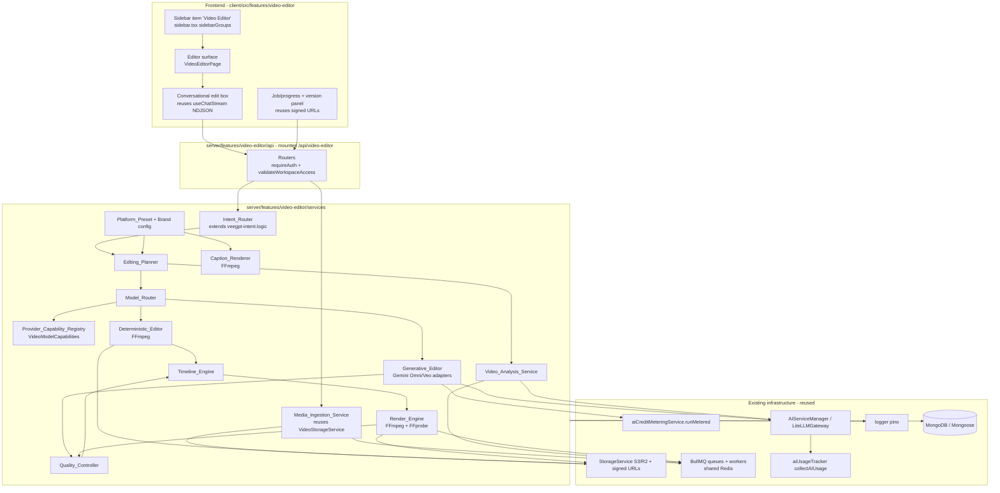
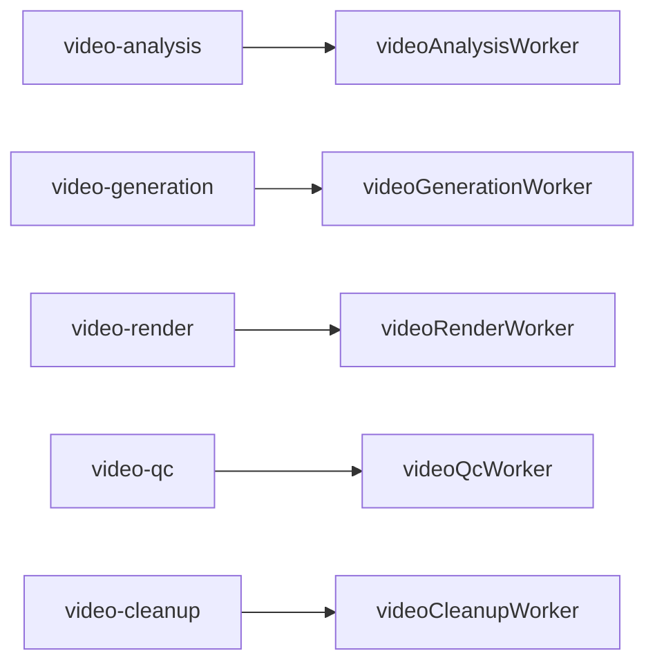
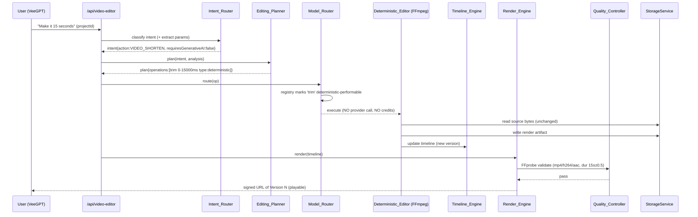
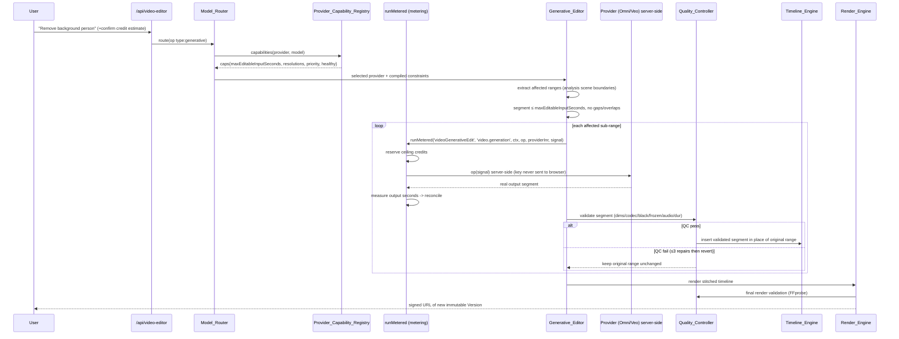

# Design Document

## Overview

The Veefore AI Video Editor is a multi-engine orchestration subsystem delivered as a first-class capability inside the existing VeeGPT product. It ingests source media, analyzes it, plans an edit, routes each planned operation to the correct execution engine (deterministic FFmpeg processing or generative AI), composes a real timeline, runs quality control, renders a validated video file, and lets the user refine the result conversationally across immutable versions.

This design deliberately **maps every component onto existing Veefore infrastructure** rather than inventing parallel systems. The investigation of the real repository established the following anchors, and the design is built on top of them:

| Concern | Existing module the design reuses | Path |
| --- | --- | --- |
| Credit metering (estimate→reserve→execute→measure→reconcile, idempotency, AbortSignal) | `aiCreditMeteringService.runMetered(...)` | `server/features/subscription/services/AICreditMeteringService.ts` |
| Feature/credit registration | `AICreditFeature` union + `CREDIT_MODEL` | `server/config/plan-config.ts` |
| Object storage (S3/R2 + local fallback, signed URLs) | `StorageService` / `getStorageService()` | `server/features/storage/services/storage.service.ts` |
| FFprobe metadata + thumbnails (fluent-ffmpeg) | `VideoStorageService` | `server/features/storage/services/video-storage.service.ts` |
| Async work (BullMQ shared Redis, lazy workers) | queue + `QueueManager` pattern | `server/queues/aiQueue.ts`, `server/queues/researchQueue.ts`, `server/workers/*` |
| Capability-based model routing precedent | `resolveRoute`, `Capability`, `ModelSpec` | `server/services/ai-model-routing.ts` |
| Provider SDK access (Gemini/OpenAI) + gateway | `AIServiceManager`, `LiteLLMGateway` | `server/services/AIServiceManager.ts`, `server/services/litellm/LiteLLMGateway.ts` |
| VeeGPT intent classification | `classifyIntent`, `Capability`, `FORCED_TOOL_CAPABILITY` | `server/routes/veegpt-intent.logic.ts` |
| VeeGPT chat surface + NDJSON streaming | `router` at `/api/chat`, `useChatStream` | `server/routes/veegpt-chat.routes.ts`, `client/src/features/chat/hooks/useChatStream.ts` |
| Sidebar navigation (wouter) | `sidebarGroups`, `getActiveViewFromLocation` | `client/src/components/layout/sidebar.tsx` |
| App routing | wouter `<Route>` + `<ProtectedRoute>` | `client/src/AuthenticatedApp.tsx` |
| Auth (Firebase/session → `req.user`) | `requireAuth` | `server/middleware/require-auth.ts` |
| Workspace isolation / ownership | `validateWorkspaceAccess`, `requireWorkspaceMember` | `server/middleware/workspace-validation.ts` |
| AI usage analytics chokepoint | `AIUsageEvent`, `withAIFeature`/`collectAIUsage`, `AIFeature` | `server/services/aiUsageTracker.ts` |
| Model-call audit | `recordModelCall` | `server/services/ai-call-log.ts` |
| Structured logging (pino, redaction) | `logger` | `server/config/logger.ts` |
| Mongoose model idiom | `mongoose.models.X || mongoose.model(...)` | `server/models/AiImageAsset.ts`, `server/models/index.ts` |
| Route registration | `registerRoutes(app, ...)` + `app.use('/api/<feature>', router)` | `server/index.ts`, `server/routes.ts` |

Two architectural principles govern the whole feature and are enforced structurally in this design:

1. **Deterministic-first routing.** The `Model_Router` MUST NOT invoke a generative provider for an operation deterministic media processing can perform. This is enforced by the `Provider_Capability_Registry` flagging deterministic-performable operation types and the router routing those to the `Deterministic_Editor` unconditionally (Req 6.1, 6.2, 8.2, 24.1).
2. **No-Mock production integrity.** Every user-visible action executes a real backend operation, progress derives from actual completed stages, provider outputs are the real provider results, and unimplemented capabilities surface an explicit unavailable state rather than a fake success (Req 23).

The feature is organized under a new backend feature module `server/features/video-editor/` (mirroring `server/features/storage/` and `server/features/analytics/`) and a new frontend feature `client/src/features/video-editor/` (mirroring `client/src/features/video-generator/`). No existing production module is replaced; the design extends the credit-feature union, the AI-usage feature union, the sidebar, the router, and the queue topology.

### Research Notes and Key Findings

- **Metering is a single generic primitive, not per-feature ledgers.** `runMetered<T>(feature, usageFeature, ctx, operation, additionalProviderCostInr?, signal?)` already performs estimate (`CREDIT_MODEL[feature].ceiling`) → reserve (atomic pre-call debit) → execute (`operation(signal)` raced against abort) → measure (`collectAIUsage` + `computeCreditCharge`) → reconcile (`adjustReservation` refunds ceiling→measured or debits an overage). It is idempotent via a per-operation `idempotencyKey` and refunds the full reservation on failure/abort. The video editor therefore performs **no** custom credit arithmetic — it wraps each generative provider call in `runMetered` and passes measured non-LLM provider cost (e.g. Gemini Omni per-second video billing) through `additionalProviderCostInr`. This directly satisfies Req 17 without a separate accounting system.
- **`additionalProviderCostInr` is the correct channel for video-second billing.** Video generation is billed by output seconds, not tokens. `computeCreditCharge` already adds `additionalProviderCostInr` to the token-derived provider cost before applying the dynamic margin, so the design computes INR from measured output seconds × provider rate (from the capability record) and passes it as `additionalProviderCostInr`. Token usage from any accompanying LLM planning/prompt-compilation calls is captured automatically by `collectAIUsage`.
- **Capability routing already exists as a precedent** (`ai-model-routing.ts`) but is scoped to text/vision/video *reading* capability of chat models. The video editor needs a richer, versioned, editable registry (`VideoModelCapabilities` from the master spec §2/§34). This is a new registry, but it follows the same "read capability metadata, never hardcode limits, report the reason" philosophy.
- **Storage keys are folder-scoped.** `StorageService.uploadFile({ folder })` returns a stable `key`; `getSignedUrl(key, { expiresIn })` defaults to 3600s and caps at 86400s — matching Req 19.3 exactly. `VideoStorageService` already extracts FFprobe metadata and generates thumbnails, so ingestion reuses it and adds proxy/waveform.
- **Queues degrade safely.** Every queue export is `null` when Redis is unavailable and workers are lazily imported on first enqueue. The video editor adds queues following this exact pattern; job execution is asynchronous and never blocks the initiating request (Req 18.1).
- **VeeGPT streaming is NDJSON over HTTP POST**, not WebSocket, with a per-conversation `AbortController` map for Stop. The editor reuses this transport for conversational editing and job-progress streaming, and reuses the `AbortSignal` plumbing that `runMetered` already honours for cancellation (Req 18.5, 17.10).
- **`queueTranscode` in `VideoStorageService` is an in-memory placeholder** (explicitly `TODO`). The design does NOT build on it; render/transcode work goes through the new BullMQ queues so it is real, resumable, and observable (No-Mock, Req 18).
- **Mongoose models use the hot-reload-safe idiom** and declare indexes inline and via `Schema.index(...)`. All new models follow this and live under `server/models/VideoEditor/` re-exported from `server/models/index.ts`.

## Architecture

### High-level component diagram



### Request/execution model

- **Synchronous control-plane** requests (create project, read project, add source metadata, create plan, submit edit, read job status, cancel, list/restore versions, request signed URL) are handled by Express routers mounted at `/api/video-editor`, each guarded by `requireAuth` then `validateWorkspaceAccess({ source })` and per-project ownership checks (Req 19.1, 21).
- **Asynchronous data-plane** work (ingestion preparation, analysis, generative editing, render, QC, cleanup) runs on BullMQ workers. The route enqueues a `Video_Edit_Job` and returns immediately with a job id; the client polls `GET /api/video-editor/jobs/:id` or reads the NDJSON progress stream (Req 18.1, 18.4).
- **Conversational editing** reuses the VeeGPT NDJSON streaming transport. A video-editing turn is classified by the extended `Intent_Router`, planned, and any long-running work is enqueued; the stream reports stage-based status events identical in shape to the existing chat events.

### Queue topology (extends `server/queues/`)

Following the `aiQueue.ts`/`researchQueue.ts` pattern (shared `getSharedRedisConnection()`, `null` when Redis absent, lazy `getWorker()` import), five queues are added under `server/queues/`:



Job options mirror the existing convention: `removeOnComplete`/`removeOnFail` caps, and **`attempts` tuned per cost** — `video-generation` uses `attempts: 1` at the queue level (paid provider calls, like `researchQueue`), with the QC-driven repair loop deciding retries deliberately; `video-render`/`video-analysis` use bounded retries with exponential backoff. `video-cleanup` performs temporary-file removal with up to 3 additional attempts and exponential backoff (Req 18.6, 20.7). All job ids are deterministic (`ve-{type}-{projectId}-{versionId}-{opId}`) so BullMQ de-duplicates concurrent submissions and retries are idempotent (Req 18.7).

### Deterministic-edit flow (Acceptance Test A — Req 24.1/24.2)



### Generative segmented-edit flow (Acceptance Test B/D — Req 9, 24.3–24.6)



### Conversational refinement flow (Acceptance Test C — Req 16)

```mermaid
sequenceDiagram
  participant U as User
  participant R as /api/video-editor
  participant VER as Version manager
  participant PL as Editing_Planner
  participant EXEC as Router+Editors
  participant DB as MongoDB

  U->>R: "Make it more cinematic" (projectId, parentVersion?)
  R->>VER: resolve parent (specified or active)
  VER->>DB: create Version V2 derived from V1 (V1 immutable)
  R->>PL: plan refinement against V2 state
  PL->>EXEC: execute operations
  EXEC->>DB: persist V2 timeline + artifacts (provenance)
  U->>R: "Make it less dramatic"
  R->>VER: create Version V3 from active V2 (V1,V2 immutable)
  Note over VER,DB: source bytes byte-identical; unaffected ranges pixel-identical
```

## Components and Interfaces

All services live in `server/features/video-editor/services/`. Interfaces are provider-neutral and pure where practical (planning, segmentation, timeline math, QC classification, capability matching are pure functions to enable property-based testing and match the `veegpt-*.logic.ts` convention).

### Intent_Router (`intent-router.service.ts`, extends `server/routes/veegpt-intent.logic.ts`)

Adds a `video_edit` capability to the VeeGPT `Capability` union and a set of video intents. Because the existing `classifyIntent` is pure and DB/LLM-free, video intent extraction that needs a structured object (action + parameters) is a **two-stage** design:

1. Capability gate (pure, extends `classifyIntent`): decides the turn is a video-editing turn (via `FORCED_TOOL_CAPABILITY['video_editor'] = 'video_edit'`, attached-video media signal, and video keyword signals — never keyword-alone, matching the existing hybrid contract).
2. Structured extraction (LLM, via `AIServiceManager`) producing the `VideoIntent` object.

```ts
type VideoIntentAction =
  | 'VIDEO_EDIT' | 'VIDEO_ANALYZE' | 'VIDEO_REPURPOSE' | 'VIDEO_SHORTEN'
  | 'VIDEO_GENERATE' | 'VIDEO_CAPTION' | 'VIDEO_AUDIO_ENHANCE'
  | 'VIDEO_REMOVE_OBJECT' | 'VIDEO_REPLACE_BACKGROUND' | 'VIDEO_ADD_BROLL'
  | 'VIDEO_CREATE_AD' | 'VIDEO_CREATE_REEL' | 'VIDEO_CREATE_SHORT'
  | 'VIDEO_CREATE_STORY' | 'VIDEO_RESIZE' | 'VIDEO_EXPORT'
  | 'VIDEO_EDIT_CONTINUE' | 'VIDEO_EDIT_UNDO' | 'VIDEO_EDIT_REDO'
  | 'VIDEO_COMPARE' | 'VIDEO_QC';

const UNSPECIFIED = null; // explicit unspecified value (Req 2.3)

interface VideoIntent {
  action: VideoIntentAction;
  inputAssets: string[];
  targetPlatform: string | null;
  targetAspectRatio: string | null;
  targetDurationMs: number | null;
  editingStyle: string | null;
  requestedChanges: string[];
  protectedElements: ProtectedElement[];
  brandRequirements: string | null;
  audioRequirements: string | null;
  captionRequirements: string | null;
  outputRequirements: string | null;
  qualityRequirements: string | null;
  confidence: number;                // 0..1
  requiresGenerativeAI: boolean;     // true iff ≥1 change needs visual synthesis (Req 2.4)
  requiresDeterministicEditing: boolean; // true iff ≥1 change is deterministic (Req 2.5)
}

interface IntentRouter {
  classify(input: ClassifyVideoIntentInput): Promise<VideoIntent>;
}
```

- Confidence threshold default `0.70` from config; below threshold → request clarification, enqueue nothing, leave project unchanged (Req 2.6).
- Any text extracted from video/captions/OCR is placed in a `user`-trust-layer / DATA position and never treated as an instruction, exactly as the existing `ContextComposer` trust ordering enforces (Req 2.7, master §54).

### Media_Ingestion_Service (`media-ingestion.service.ts`, reuses `VideoStorageService`)

```ts
interface MediaIngestionService {
  validateAndAccept(input: UploadDescriptor): Promise<VideoSource>; // signature + size validation BEFORE storing
  createResumableUpload(input: LargeUploadDescriptor): Promise<ResumableUploadTicket>; // >100MB → object-storage direct
  probeAndPrepare(sourceId: string): Promise<IngestionResult>; // FFprobe + proxy + thumbnails + waveform (async job)
}
```

- Container allowlist: MP4, MOV, WebM, AVI, MPEG; size 1 byte – 10,240 MB. **Byte-signature (magic-number) validation runs before any bytes are persisted** (Req 3.1–3.4). Rejections create no `Video_Source` and persist no bytes.
- Uses `VideoStorageService.extractMetadata`/`generateVideoThumbnail` (FFprobe + fluent-ffmpeg), adds proxy + waveform generation. Stores original immutably via `StorageService.uploadFile({ folder: 'video-editor/{projectId}/original' })` and never overwrites it (Req 3.5, 3.6, 20.4).
- Files >100 MB use resumable/object-storage upload rather than routing the full binary through the app server (Req 3.10). This uses presigned multipart URLs from `StorageService` (S3/R2), with local-fallback accepting a direct stream in dev.
- Progress is stage-derived and monotonic; never reports 100% before all stages complete (Req 3.11).

### Video_Analysis_Service (`video-analysis.service.ts`)

Produces the `VideoAnalysis` record. Deterministic scene detection (FFmpeg scene filter) runs **before** AI semantic enrichment (Req 4.2). Transcript, audio features (silence/speech/loudness with configurable −40 dB / 0.5 s defaults), and decision-support scores (hook candidates, important moments, each with start/end/confidence 0..1) are computed. Semantic enrichment calls Gemini via `AIServiceManager` (video capability), wrapped so token usage is captured by `collectAIUsage`. Completed analysis is persisted as a `Video_Artifact`; a completed analysis is reused without re-analysis (Req 4.9). Enrichment-unavailable keeps deterministic results but does not mark the analysis completed (Req 4.10); failure records an error code and persists no reusable partial artifact (Req 4.11).

### Editing_Planner (`editing-planner.service.ts`, pure core)

Converts `VideoIntent` + `VideoAnalysis` into a structured JSON `EditingPlan`. Pure planning core (testable) wrapped by a thin service that calls the LLM for style/goal reasoning when needed.

```ts
type OperationType = 'deterministic' | 'generative' | 'analysis' | 'render';
type OperationStatus = 'executable' | 'unavailable' | 'error';

interface TimelineRangeMs { startMs: number; endMs: number; } // start≥0, end>start, within source duration

interface PlanOperation {
  sequenceIndex: number;            // explicit execution order (Req 5.1)
  type: OperationType;              // exactly one (Req 5.3)
  kind: string;                     // e.g. 'trim','remove_silence','caption','generative_edit'
  range: TimelineRangeMs;           // required for every op (Req 5.4)
  preservationConstraints: ProtectedElement[]; // attached where range overlaps a protected element (Req 5.5)
  status: OperationStatus;
  limitation?: string;              // set when unavailable (Req 5.6, 6.5)
  params: Record<string, unknown>;
}

interface EditingPlan {
  projectGoal: string;
  target: { platform: string | null; aspectRatio: string | null; maxDurationMs: number | null; exportProfile: string };
  operations: PlanOperation[];      // ordered; may be empty/error-only but never null (Req 5.2)
}
```

Applies the selected `Platform_Preset` (aspect/duration/safe areas/export profile) and, when requested, the workspace brand profile; missing preset/brand → error indication, plan unchanged (Req 13.2–13.5).

### Provider_Capability_Registry (`provider-capability-registry.ts` + `VideoModelCapabilities` config)

Versioned, editable metadata store — the authoritative answer to "can provider P/model M do operation O, and within what bounds". Not hardcoded anywhere else (Req 7.3).

```ts
interface VideoModelCapabilities {
  provider: string;
  model: string;
  version: string;                       // version id; prior versions retained (Req 7.5)
  supportedOperations: string[];         // required
  editableInputSeconds: { min: number; max: number };  // required (Req 7.1)
  outputSeconds: { min: number; max: number };         // required
  outputResolutions: string[];           // required
  inputModalities: string[];             // required
  outputModalities: string[];            // required
  priorityRank: number;                  // routing tie-break (Req 6.4)
  costPerOutputSecondInr: number;        // fuels additionalProviderCostInr
  guaranteesPreservation: ProtectedElement[]; // which protected elements it can guarantee
}

type CapabilityLookup =
  | { supported: true; caps: VideoModelCapabilities }
  | { supported: false }; // explicit unsupported; never a default/partial (Req 7.4)

interface ProviderCapabilityRegistry {
  register(rec: VideoModelCapabilities): RegisterResult; // rejects records missing required fields (Req 7.2)
  lookup(provider: string, model: string): CapabilityLookup;
  candidatesFor(operationType: string): VideoModelCapabilities[]; // only providers supporting it (Req 6.3)
  isDeterministicPerformable(operationKind: string): boolean;     // deterministic-first gate (Req 6.1)
}
```

A separate config also flags which operation kinds are deterministic-performable (trim, cut, concat, crop, resize, aspect conversion, fps conversion, audio, captions, speed, fades, encoding — master §4). Records are stored in MongoDB with version history; the registry never mutates a stored version (append-only), so a model upgrade adds a new version without touching routing source (Req 7.5).

### Model_Router (`model-router.service.ts`, pure core)

```ts
type RoutingDecision =
  | { engine: 'deterministic'; reason: string }
  | { engine: 'generative'; provider: string; model: string; reason: string }
  | { engine: 'analysis'; provider: string; model: string; reason: string }
  | { engine: 'render'; reason: string }
  | { engine: 'unavailable'; reason: string }; // explicit; no provider call (Req 6.5)

interface ModelRouter {
  route(op: PlanOperation, health: ProviderHealthView): RoutingDecision;
}
```

Deterministic-performable → `deterministic` with no provider candidate considered (Req 6.1, 8.2). Otherwise consult registry candidates supporting the op type, exclude unhealthy providers (Req 6.7), pick highest `priorityRank` then registry order (Req 6.4). No candidate → fallback policy in order → still none → `unavailable` with reason surfaced (Req 6.5). Every decision records selected provider/model/reason into the operation's routing record (Req 6.6) and is audited via `recordModelCall` (reusing `ai-call-log.ts`). Health recovery re-includes a provider for subsequently evaluated ops (Req 6.8).

### Deterministic_Editor (`deterministic-editor.service.ts`, FFmpeg)

Performs trim/cut/crop/resize/aspect/fps/audio/captions/speed/fades/encode via fluent-ffmpeg. Never calls a provider (Req 8.1). Reads source bytes without modification (Req 8.4). Produces exactly one `Video_Artifact` per successful op traceable to its job (Req 8.3). Silence removal uses transcript + audio silence segments and cuts only analysis-classified silence, blocking removal that overlaps speech (Req 8.5, 12.2, 12.3). Audio enhancement normalizes to the configured integrated-loudness target ±1.0 LU with a true-peak ceiling (Req 12.1) and keeps original voice byte-identical unless a voice change is explicitly requested (Req 12.4). Failure records an error code, marks the job failed, produces no artifact (Req 8.6).

### Generative_Editor (`generative-editor.service.ts` + provider adapters)

Provider-neutral interface (master §34) with concrete `GeminiOmniAdapter` and `VeoAdapter`; all calls execute server-side via `AIServiceManager`/Gemini SDK — keys never reach the browser (Req 7.8, 19.5).

```ts
interface VideoAIProvider {
  getCapabilities(): VideoModelCapabilities;
  estimateCost(req: VideoRequest): Promise<CostEstimate>;
  generate(req: VideoGenerationRequest, signal?: AbortSignal): Promise<VideoGenerationResult>;
  edit(req: VideoEditRequest, signal?: AbortSignal): Promise<VideoEditResult>;
  analyze?(req: VideoAnalysisRequest, signal?: AbortSignal): Promise<VideoAnalysisResult>;
}
```

Segmentation (pure `segmentation.logic.ts`): extract every range overlapping the affected region and exclude non-overlapping ranges (Req 9.1); bound each sub-range to `caps.editableInputSeconds.max` (Req 9.2, 9.5); place cuts only at detected scene boundaries (Req 9.3) and never inside a continuously tracked subject or a continuous audio utterance (Req 9.4); emitted sub-ranges are contiguous with **no gaps and no overlaps** covering the affected region (Req 9.5). Over-capability ranges are split or rerouted, never sent oversized (Req 9.6). The prompt compiler turns the user request into a provider-safe instruction (never the raw prompt) with explicit preservation constraints (Req 9.7, 9.8, master §13). If capability metadata cannot guarantee a required `Protected_Element`, it reroutes to a guaranteeing pipeline or warns, and does not invoke the provider otherwise (Req 9.9, 9.10). Validated segments are inserted in place of the original range with matching duration (Req 9.11, 9.12); extraction failure aborts and preserves the timeline (Req 9.13); QC failure keeps the original range and surfaces the failure (Req 9.14). Every generative call is wrapped in `runMetered` (see Credit Metering below).

### Timeline_Engine (`timeline-engine.service.ts`, pure core)

Maintains sequences/tracks/clips/audio clips/caption clips/effects/transitions with 1 ms resolution. Rejects invalid placements (negative start, start≥end, track index out of range) leaving the model unchanged (Req 10.3); stores source in/out points independent of timeline start/end (Req 10.5) and rejects invalid source timings (Req 10.6). Updated state is exposed within 100 ms of accepting an operation (Req 10.2). The timeline model is the **sole authoritative source** for render; two renders of an unchanged model produce byte-identical output (Req 10.4, 15) — achieved by deterministic FFmpeg command generation from the model plus fixed encoder settings.

### Caption_Renderer (`caption-renderer.service.ts`, FFmpeg deterministic)

Word-level timing when available, else segment/phrase-level (never fails) (Req 11.1, 11.2). Deterministic rendering: same captions+preset+typography → identical output (Req 11.3). Positions within preset safe areas (Req 11.4), wraps to max characters-per-line (Req 11.5), applies ≥4.5:1 contrast treatment (Req 11.6), applies workspace brand typography with default-typography fallback + indication on failure (Req 11.7, 11.8).

### Quality_Controller (`quality-controller.service.ts`)

Verifies output exists and is non-empty first (Req 14.1); validates container/codec/dims/fps/audio-stream-count against requested and duration within 0.5 s (Req 14.2); classifies a quality failure on black-frame ≥0.5 s, frozen-frame ≥2.0 s, missing/fully-silent audio, duration off by >0.5 s, or artifacts ≥25% of frame area (Req 14.3). Drives the repair loop (retry / simplified prompt / deterministic fallback / alternative provider / user clarification), max 3 attempts, then a final fallback of reverting to the prior valid version; if still failing, preserves the prior valid version, does not mark success, returns a QC-failed error (Req 14.4–14.7). Classification is a pure function over FFprobe/frame-analysis metrics to enable property tests. QC **never marks corrupted output as success** (Req 14, 15.7, 23.3).

### Render_Engine (`render-engine.service.ts`, FFmpeg + FFprobe)

Renders the timeline to MP4/H.264/AAC (or configured profile) (Req 15.1). Validates existence + min byte size (Req 15.2), FFprobe video stream + container/codec/dims match (Req 15.3), duration within 0.5 s and fps within 0.01 (Req 15.4), audio stream when expected (Req 15.5). All checks pass → job COMPLETED (Req 15.6); any check fails → job FAILED with error code, input version retained, output not exposed as success (Req 15.7).

### Job_System (`job-system.service.ts` + queues + workers)

Wraps the five BullMQ queues. Each `Video_Edit_Job` has exactly one state from `{QUEUED, PREPARING, UPLOADING, ANALYZING, PLANNING, EDITING, RENDERING, QUALITY_CHECK, COMPLETED, FAILED, CANCELLED, RETRYING}`, with COMPLETED/FAILED/CANCELLED terminal (Req 18.2). Assigns idempotency key, attempt number (from 1), configurable timeout ≤3600 s, and input/output artifact references (Req 18.3). Progress is an integer 0–100 derived solely from completed stages (Req 18.4, 23.2, 23.6). Cancellation within 5 s: mark CANCELLED, stop later stages, cancel provider op via `AbortSignal`, remove temp files, reconcile reserved credits via metering (Req 18.5); cleanup failures still cancel and schedule ≤3 backoff retries (Req 18.6). Retries are idempotent via the idempotency key, max 3 attempts (Req 18.7); timeout → FAILED + release credits (Req 18.8); attempts exhausted → FAILED + release credits (Req 18.9).

### Credit Metering Integration (reuses `aiCreditMeteringService`)

- A new credit feature `videoGenerativeEdit` is added to the `AICreditFeature` union and `CREDIT_MODEL` in `server/config/plan-config.ts` (dynamic mode, floor/ceiling tuned for video), and a matching `AIFeature` `video.generation` already exists in `aiUsageTracker.ts`.
- Every generative operation executes as:

```ts
const { result, settlement } = await aiCreditMeteringService.runMetered(
  'videoGenerativeEdit',      // AICreditFeature (reservation ceiling)
  'video.generation',         // AIFeature (usage tagging)
  { userId, workspaceId, idempotencyKey: job.idempotencyKey },
  (signal) => provider.edit(compiledRequest, signal),   // server-side provider call
  measuredOutputSeconds * caps.costPerOutputSecondInr,   // additionalProviderCostInr
  job.abortSignal,
);
```

This yields: reserve estimate before the provider call (Req 17.2), reconcile to measured usage within the settlement (Req 17.3), idempotent at-most-once charging across retries (Req 17.4), full release on failure/abort with no net deduction (Req 17.5, 17.10). The server balance/cost is authoritative; client-supplied balances/costs are never accepted (Req 17.6, 19.5). Pre-execution the route calls `assertCanAfford`/`ensureCreditAccount` to present the estimate and require confirmation (300 s timeout → cancel, no provider call, no deduction) and to block when credits are insufficient with an upgrade/add-credit path (Req 17.7–17.9). Because `additionalProviderCostInr` is measured from actual output seconds, a failed generation that produced no billable seconds reconciles to the token-only (typically zero video) cost and the reservation is released.

### API endpoints (mounted `/api/video-editor`, registered in `server/routes.ts`)

All guarded by `requireAuth` + `validateWorkspaceAccess` + per-project ownership. Response/error shapes follow the newer `{ success, data | error: { code, message } }` convention used by the subscription/workspace modules.

```
POST   /api/video-editor/projects
GET    /api/video-editor/projects/:id
PATCH  /api/video-editor/projects/:id
DELETE /api/video-editor/projects/:id
POST   /api/video-editor/projects/:id/sources            # add asset (or resumable ticket)
POST   /api/video-editor/projects/:id/analyze
GET    /api/video-editor/projects/:id/analysis
POST   /api/video-editor/projects/:id/plan
POST   /api/video-editor/projects/:id/edits              # submit edit (enqueues job)
POST   /api/video-editor/projects/:id/render
GET    /api/video-editor/jobs/:jobId
POST   /api/video-editor/jobs/:jobId/cancel
GET    /api/video-editor/projects/:id/versions
POST   /api/video-editor/projects/:id/versions/:versionId/restore
POST   /api/video-editor/projects/:id/export
GET    /api/video-editor/artifacts/:artifactId/signed-url # 3600s signed URL
```

### Security & isolation

Ownership/workspace access enforced on every project-referencing request via the existing middleware; non-owner → 403 with no data (Req 19.1, 19.2). No valid session → 401 (Req 1.3). Artifacts delivered only via signed URLs ≤3600 s (`StorageService.getSignedUrl`), never permanent public paths; expired/invalid → rejected (Req 19.3, 19.4). userId/workspaceId/balance/cost/ownership/URLs are server-derived (Req 19.5). External/provider media URLs are fetched only if on the configured allowlist and never to private/loopback/link-local/internal addresses (SSRF guard) (Req 19.6, 19.7). User-facing errors exclude keys/secrets/stack traces; full detail logged server-side only via `logger` (which already redacts tokens) (Req 19.8, 22.4).

### Frontend surface (`client/src/features/video-editor/`)

- Sidebar: add `{ icon: Video, label: 'Video Editor', key: 'video-editor', url: '/video-editor' }` to a `sidebarGroups` group and `'/video-editor'` to `getActiveViewFromLocation` in `sidebar.tsx`; keep it reachable under the responsive breakpoint via the existing pattern (Req 1.1, 1.8).
- Route: add a wouter `<Route path="/video-editor">` wrapping `<ProtectedRoute>` + `<Suspense fallback={<VideoEditorSkeleton/>}>` in `AuthenticatedApp.tsx` (Req 1.2).
- Editor: reuses the existing design system; opens within the VeeGPT surface using current session/user/active workspace; interactive within 3 s; loads subscription tier + credit balance + brand profile from existing services and blocks credit-consuming actions with an error indication if that context is unavailable (Req 1.2, 1.4, 1.5). No active workspace → error, editor not opened (Req 1.6). Exactly one attached video in the conversation is used as the source without re-upload (Req 1.7).
- Conversational editing + progress reuse `useChatStream` (NDJSON) and signed-URL previews; progress is always stage-derived/indeterminate, never timer-interpolated (Req 23.2, 23.6).

### Observability & admin analytics

Structured `logger` events for the full lifecycle set (project creation, source ingestion, analysis start/complete, plan creation, edit job submission, job start/complete/failure, render completion, export completion) with event type, timestamp, user/workspace/project/job ids (Req 22.1). Provider-call completion logs latency/provider/model/output-seconds/estimated-cost/actual-cost/retry-count; failures log latency/provider/model/retry-count/reason (Req 22.2, 22.3). Keys/secrets/tokens/signed URLs excluded (Req 22.4). Admin AI-usage analytics is extended by recording video edit/generation counts, provider spend, success/retry/QC-failure rates via the existing `AIUsageEvent` collection plus a video-specific aggregation (Req 22.5). Log-emit failures never abort the in-progress operation (Req 22.6).

## Data Models

New Mongoose models under `server/models/VideoEditor/`, re-exported from `server/models/index.ts`, all using the `mongoose.models.X || mongoose.model(...)` idiom and `{ timestamps: true }`. Indexes on `userId`, `workspaceId`, `projectId`, `jobId`, `status`, `createdAt` per Req 16.11. Media bytes always live in `StorageService`; models store only metadata + storage keys (matching `AiImageAsset`).

### VideoProject

```ts
interface IVideoProject extends Document {
  projectId: string;          // unique, indexed
  userId: string;             // indexed (owner)
  workspaceId: string;        // indexed (isolation)
  name: string;
  activeVersionId?: string;   // current active version
  targetPlatform?: string;
  retentionPolicyAllowsSourceDeletion: boolean; // default false (Req 20.8)
  status: 'active' | 'deleted';
  createdAt: Date; updatedAt: Date;
}
// index: { workspaceId:1, userId:1, createdAt:-1 }, { projectId:1 } unique
```

### VideoSource (immutable)

```ts
interface IVideoSource extends Document {
  sourceId: string;           // unique, indexed
  projectId: string;          // indexed
  workspaceId: string; userId: string;
  storageKey: string;         // original bytes in StorageService (folder original/)
  container: string; mimeType: string; sizeBytes: number;
  durationMs: number; width: number; height: number; fps: number; codec: string;
  immutable: true;            // never overwritten (Req 3.6, 20.4)
  createdAt: Date;
}
```

### VideoVersion (immutable snapshot)

```ts
interface IVideoVersion extends Document {
  versionId: string;          // unique, indexed
  projectId: string;          // indexed
  parentVersionId: string | null; // lineage (Req 16.6)
  workspaceId: string; userId: string;
  timelineId: string;         // snapshot of timeline model
  label?: string;
  createdAt: Date;            // immutable after creation (Req 16.4, 16.5)
}
// index: { projectId:1, createdAt:1 }
```

### VideoTimeline

```ts
interface ITimelineElement {
  kind: 'clip'|'audioClip'|'captionClip'|'effect'|'transition';
  trackIndex: number;
  timelineStartMs: number; timelineEndMs: number; // ms, 1ms resolution
  sourceAssetId?: string; sourceInMs?: number; sourceOutMs?: number; // independent of timeline (Req 10.5)
  params?: Record<string, unknown>;
}
interface IVideoTimeline extends Document {
  timelineId: string; projectId: string; versionId: string;
  workspaceId: string; userId: string;
  sequences: { tracks: number }[];
  elements: ITimelineElement[];
  createdAt: Date;
}
```

### VideoEditOperation

```ts
interface IVideoEditOperation extends Document {
  operationId: string; projectId: string; jobId?: string;
  sequenceIndex: number;
  type: 'deterministic'|'generative'|'analysis'|'render';
  kind: string;
  startMs: number; endMs: number;
  preservationConstraints: string[];
  status: 'executable'|'unavailable'|'error'|'completed'|'failed';
  limitation?: string;
  routing?: { provider: string; model: string; reason: string }; // Req 6.6
  createdAt: Date;
}
```

### VideoEditJob

```ts
type JobState = 'QUEUED'|'PREPARING'|'UPLOADING'|'ANALYZING'|'PLANNING'
  |'EDITING'|'RENDERING'|'QUALITY_CHECK'|'COMPLETED'|'FAILED'|'CANCELLED'|'RETRYING';
interface IVideoEditJob extends Document {
  jobId: string;              // unique, indexed
  projectId: string;          // indexed
  workspaceId: string; userId: string;
  idempotencyKey: string;     // unique — mirrors metering idempotency (Req 18.3, 18.7)
  state: JobState;            // indexed
  attempt: number;            // from 1
  timeoutSec: number;         // ≤3600
  progress: number;           // 0..100, stage-derived
  completedStages: string[];
  inputArtifactIds: string[]; outputArtifactIds: string[];
  errorCode?: string;
  creditIdempotencyKey?: string; // link to AICreditTransaction
  createdAt: Date; updatedAt: Date;
}
// index: { projectId:1, state:1, createdAt:-1 }, { idempotencyKey:1 } unique
```

### VideoArtifact (immutable, with provenance)

```ts
type ArtifactCategory = 'original'|'proxy'|'audio'|'thumbnails'|'analysis'|'generated'|'renders'|'exports';
interface IVideoArtifact extends Document {
  artifactId: string;         // unique, indexed
  projectId: string;          // indexed
  workspaceId: string; userId: string;
  category: ArtifactCategory; // exactly one of eight (Req 20.1)
  storageKey: string;         // immutable bytes (Req 20.4)
  mimeType: string; sizeBytes?: number;
  provenance: {               // all required (Req 20.2, 20.3)
    jobId: string;
    inputVersionId: string;
    provider: string;
    model: string;
    prompt: string;
    costCredits: number;
  };
  createdAt: Date;
}
// index: { projectId:1, category:1, createdAt:-1 }
```

Provenance is required at creation; if any of {jobId, inputVersionId, provider, model, prompt, cost} cannot be determined the artifact is rejected and not stored, with an error naming the missing fields (Req 20.3). For deterministic artifacts, `provider`/`model` record the deterministic engine identifier (e.g. `ffmpeg`) so the field is always present.

### Storage layout

```
video-editor/{projectId}/original/    video-editor/{projectId}/proxy/
video-editor/{projectId}/audio/       video-editor/{projectId}/thumbnails/
video-editor/{projectId}/analysis/    video-editor/{projectId}/generated/
video-editor/{projectId}/renders/     video-editor/{projectId}/exports/
```

Each artifact lives under exactly one category folder scoped to its project (Req 20.1). Temp working files live in a per-job working directory removed within 60 s of a terminal state or timeout, with ≤3 retry attempts (Req 20.5–20.7). Source is retained on project delete unless the retention-policy flag permits deletion (Req 20.8).

### Configuration models (single-source)

Platform presets and brand-aware values load from a single configuration source (`video-editor.config.ts`) referenced by every consumer, so changing a preset value changes it everywhere with no code change (Req 13.1, master §19). `VideoModelCapabilities` records and the deterministic-performable operation set live in the `Provider_Capability_Registry` (versioned, DB-backed).

## Correctness Properties

*A property is a characteristic or behavior that should hold true across all valid executions of a system — essentially, a formal statement about what the system should do. Properties serve as the bridge between human-readable specifications and machine-verifiable correctness guarantees.*

This feature is strongly suited to property-based testing because its core is a set of **pure functions**: routing decisions, generative segmentation, timeline math, caption layout, quality-control classification, capability matching, plan construction, and credit reconciliation arithmetic. Each pure core is factored into a `*.logic.ts` module (matching the existing `veegpt-*.logic.ts` convention) so it can be exercised over generated inputs without touching FFmpeg, providers, storage, Redis, or Mongo. Infrastructure wiring, UI rendering, provider integration, and the end-to-end acceptance scenarios (Req 24) are validated by integration/smoke/example tests instead — see Testing Strategy.

The properties below were derived from the prework analysis and consolidated to remove redundancy. Each is universally quantified and traces to the acceptance criteria it validates.

### Intent Routing

### Property 1: Intent generative/deterministic flags are exact biconditionals

*For any* extracted `VideoIntent`, `requiresGenerativeAI` is true if and only if at least one entry in `requestedChanges` is classified as requiring generative visual synthesis, and `requiresDeterministicEditing` is true if and only if at least one entry is classified as deterministic-performable.

**Validates: Requirements 2.4, 2.5**

### Property 2: Unspecified intent fields carry the explicit unspecified sentinel

*For any* input message, every `VideoIntent` field for which the message provides no value equals the explicit unspecified sentinel (`null`/empty per field type) and is never populated with an inferred value.

**Validates: Requirements 2.3**

### Property 3: Highest-confidence intent is selected

*For any* set of candidate intents with confidences, the classifier selects the candidate with the maximum confidence.

**Validates: Requirements 2.2**

### Property 4: Below-threshold confidence changes nothing

*For any* classification whose maximum confidence is not strictly above the configured threshold (default 0.70), the router requests clarification, enqueues no operation, and leaves the project state unchanged.

**Validates: Requirements 2.6**

### Property 5: Extracted media text is never executed as instruction

*For any* text extracted from video content, captions, or OCR — including text that syntactically resembles a command — the routing/planning result is identical to the result for the same message with that extracted text replaced by an inert placeholder of equal length (i.e. extracted text occupies a data position only and never alters control flow).

**Validates: Requirements 2.7**

### Media Ingestion

### Property 6: Ingestion accepts exactly the supported, in-range media and persists nothing otherwise

*For any* candidate upload, ingestion accepts it and creates a `Video_Source` if and only if its actual byte signature matches a supported container (MP4, MOV, WebM, AVI, MPEG) and its size is within 1 byte to 10,240 MB inclusive; for every rejected candidate no `Video_Source` record and no file bytes are persisted, and signature validation always precedes any persistence.

**Validates: Requirements 3.1, 3.2, 3.3, 3.4**

### Property 7: Source bytes are immutable for the source lifetime

*For any* `Video_Source` and any subsequent sequence of edit, analysis, render, or version operations on its project, the stored original bytes and the source metadata record remain byte-for-byte unchanged.

**Validates: Requirements 3.6, 8.4, 24.5**

### Property 8: Progress is stage-derived, monotonic, and never prematurely complete

*For any* job or ingestion run, the reported progress is a non-decreasing integer in [0,100] computed solely from the count of actually completed stages over total stages, is never reported as 100 or "complete" while any stage remains incomplete, and is reported as indeterminate whenever the actual completion state is unknown.

**Validates: Requirements 3.11, 18.4, 23.2, 23.6**

### Analysis

### Property 9: Deterministic scene detection precedes AI enrichment

*For any* analysis run, deterministic scene detection completes and its results are recorded before any AI semantic-enrichment call is issued.

**Validates: Requirements 4.2**

### Property 10: Analysis scores and transcript segments are well-formed and in-bounds

*For any* completed `VideoAnalysis`, every transcript segment satisfies `startMs < endMs` with non-null text, and every hook candidate and important moment has `startMs < endMs` within the source duration and a confidence in the closed interval [0.0, 1.0].

**Validates: Requirements 4.3, 4.6**

### Property 11: Silence classification matches its definition

*For any* loudness curve, a time range is classified as silence if and only if loudness remains below the configured loudness threshold (default −40 dB) continuously for at least the configured minimum duration (default 0.5 s).

**Validates: Requirements 4.5**

### Property 12: Completion implies fully-populated analysis; failure yields no reusable partial

*For any* analysis run, it is marked completed only when duration, frame rate, dimensions, aspect ratio, scene results, transcript, audio features, and decision-support scores are all populated; and any run whose enrichment is unavailable or that fails is not marked completed and persists no reusable `VideoAnalysis` artifact.

**Validates: Requirements 4.7, 4.10, 4.11**

### Property 13: Completed analysis is reused idempotently

*For any* `Video_Source` that already has a completed `VideoAnalysis` artifact, triggering analysis again returns the existing artifact and issues no new analysis AI call.

**Validates: Requirements 4.9**

### Editing Planner

### Property 14: Every editing plan is well-formed and never null

*For any* `VideoIntent` and `VideoAnalysis`, the planner returns a non-null `EditingPlan` in which: operations carry strictly-ordered sequence indices; each operation has exactly one type from {deterministic, generative, analysis, render}; each operation range satisfies `startMs ≥ 0`, `endMs > startMs`, and both within the source duration; every operation whose range overlaps a specified `Protected_Element` carries a preservation constraint identifying it; and any operation no engine can perform has an unavailable status with a limitation and is not marked executable. When the intent cannot be fulfilled the plan is empty or error-only, never absent.

**Validates: Requirements 5.1, 5.2, 5.3, 5.4, 5.5, 5.6**

### Model & Tool Routing

### Property 15: Deterministic-performable operations never call a generative provider

*For any* planned operation whose kind is flagged deterministic-performable in the `Provider_Capability_Registry`, the router returns a deterministic routing decision and initiates no generative provider call.

**Validates: Requirements 6.1, 6.2, 8.1, 8.2, 24.1**

### Property 16: Generative provider selection is capability-, health-, and priority-correct

*For any* generative/analysis operation and provider-health view, the selected provider (a) supports the requested operation type in its capability metadata, (b) is not marked unhealthy, and (c) has the highest `priorityRank` among healthy supporting candidates with ties broken by registry order; if no healthy supporting candidate exists after applying the fallback policy, the decision is `unavailable` with a reason and no provider call is initiated; and a provider that transitions back to healthy is included for subsequently evaluated operations.

**Validates: Requirements 6.3, 6.4, 6.5, 6.7, 6.8**

### Property 17: Every non-deterministic routing decision records provider, model, and reason

*For any* operation routed to a generative or analysis provider, the operation's routing record contains the selected provider identifier, the selected model identifier, and a non-empty routing reason.

**Validates: Requirements 6.6**

### Provider Capability Abstraction

### Property 18: Capability records missing any required field are rejected

*For any* `VideoModelCapabilities` record submitted for registration, it is stored if and only if it contains all required fields (supported operations, editable input duration bounds, output duration bounds, output resolutions, and input/output modalities); a record missing any required field is rejected, not stored, and produces an error naming the missing field.

**Validates: Requirements 7.2**

### Property 19: Unknown provider/model yields an explicit unsupported result

*For any* lookup of a provider or model with no stored capability record, the registry returns an explicit unsupported result and never a default or partial capability.

**Validates: Requirements 7.4**

### Property 20: Capability versioning is append-only

*For any* sequence of capability-record registrations for a provider/model, registering a new version leaves all previously registered versions retrievable unchanged.

**Validates: Requirements 7.5**

### Deterministic Editing

### Property 21: A successful deterministic operation yields exactly one traceable artifact; a failed one yields none

*For any* deterministic operation, success produces exactly one `Video_Artifact` traceable to its originating `Video_Edit_Job`, and failure produces no artifact, records an error code, and marks the job failed.

**Validates: Requirements 8.3, 8.6**

### Generative Editing & Segmentation

### Property 22: Segmentation partitions the affected region with no gaps or overlaps within capability bounds

*For any* affected region, provider capability, and analysis, the emitted output sub-ranges are contiguous and exactly cover the affected region with no gaps and no overlaps; every extracted/emitted sub-range has duration ≤ `caps.editableInputSeconds.max`; every non-overlapping range is excluded; every cut lies on a detected scene boundary; and no cut falls inside a continuously tracked subject or a continuous audio utterance.

**Validates: Requirements 9.1, 9.2, 9.3, 9.4, 9.5, 9.6**

### Property 23: The provider never receives the raw user prompt and always receives required preservation constraints

*For any* generative edit, the instruction sent to the provider is the compiler output (never the raw user prompt) and, for every `Protected_Element` the user marked required, contains an explicit preservation constraint for that element.

**Validates: Requirements 9.7, 9.8**

### Property 24: Unguaranteeable protected elements block the provider unless rerouted or warned

*For any* generative edit where the selected provider's capability metadata cannot guarantee a required `Protected_Element`, the system either reroutes to a pipeline whose metadata guarantees it or presents a warning identifying the unguaranteed element, and does not invoke that provider in any other case.

**Validates: Requirements 9.9, 9.10**

### Property 25: Validated segments replace their range length-aligned; failures preserve the timeline

*For any* generative edit, a QC-validated segment is inserted in place of the original range with duration aligned to the replaced range; and if range extraction fails or a segment fails QC, the original range/timeline is retained unchanged and an error is surfaced.

**Validates: Requirements 9.12, 9.13, 9.14**

### Timeline Engine

### Property 26: Invalid timeline placements and source timings are rejected without mutating the model

*For any* operation that would place an element with a negative start, `start ≥ end`, or an out-of-range track index, or that references source media with a negative in-point, `out ≤ in`, or an out-point exceeding the source duration, the timeline engine rejects it, leaves the model unchanged, and returns an error describing the invalid placement/timing.

**Validates: Requirements 10.3, 10.6**

### Property 27: Clip source in/out points are independent of timeline placement

*For any* clip referencing source media, its stored source in-point and out-point are preserved independently of and unaffected by changes to its timeline start/end times.

**Validates: Requirements 10.5**

### Property 28: Rendering an unchanged timeline is deterministic

*For any* timeline model, rendering it twice without modification produces byte-identical output; likewise rendering the same captions, `Platform_Preset`, and typography inputs produces identical caption output on every run.

**Validates: Requirements 10.4, 11.3, 15.1**

### Captions

### Property 29: Rendered captions respect safe areas, line length, and contrast

*For any* caption set rendered for a target `Platform_Preset`, each caption's complete text bounding box falls entirely within the preset safe areas, no rendered line exceeds the configured maximum characters-per-line, and the text-to-immediate-background contrast ratio is at least 4.5:1.

**Validates: Requirements 11.4, 11.5, 11.6**

### Audio

### Property 30: Loudness normalization stays within tolerance and ceiling

*For any* audio-enhancement operation, the output integrated loudness is within ±1.0 LU of the configured target and the true-peak level does not exceed the configured true-peak ceiling.

**Validates: Requirements 12.1**

### Property 31: Silence removal removes only silence and never touches speech

*For any* audio and silence-removal request, only ranges classified as silence by the analysis are removed, every detected speech segment is present and uncut in the output, no silence is removed unless silence removal was explicitly requested, and any requested silence range overlapping a detected speech segment is blocked with the source audio left unmodified and an error returned.

**Validates: Requirements 12.2, 12.3, 8.5**

### Property 32: Original voice is byte-identical unless a voice change is requested

*For any* operation that does not explicitly request a voice change, the user's original voice audio in the output is byte-for-byte identical to the source voice audio.

**Validates: Requirements 12.4**

### Platform Presets & Brand

### Property 33: Preset values resolve from a single source everywhere

*For any* preset value and any component that consumes it, the value read equals the value in the single configuration source; changing the configuration value changes the value observed by every consumer with no other change.

**Validates: Requirements 13.1**

### Property 34: Unsupported platform or missing brand leaves the plan unchanged; violations block render/export

*For any* plan, selecting a platform with no `Platform_Preset` is rejected with an error and leaves the existing plan unchanged; requesting brand style with no workspace brand profile is rejected with an error and leaves the plan unchanged; and while any composition violates its target preset's constraints, render and export are blocked and the composition is preserved until every violation is resolved.

**Validates: Requirements 13.3, 13.5, 13.7**

### Quality Control & Rendering

### Property 35: QC classifies quality failures exactly per definition and checks existence first

*For any* candidate output and its measured metrics, QC first requires the file to exist and be non-empty, then classifies the output as a quality failure if and only if at least one holds: a fully-black frame sequence ≥ 0.5 s, a frozen frame sequence ≥ 2.0 s, an expected audio stream absent or silent for 100% of its duration, measured duration differing from requested by more than 0.5 s, or visual artifacts affecting ≥ 25% of frame area in any frame; and it validates container/codec/dimensions/frame-rate/audio-stream-count against the requested values.

**Validates: Requirements 14.1, 14.2, 14.3**

### Property 36: Repair attempts are bounded and terminal failure preserves the prior valid version

*For any* operation entering the repair loop, the number of repair attempts never exceeds the configured maximum (default 3); if failure persists after the maximum and the final revert fallback, the prior valid version is preserved unchanged, the render is not marked successful, and a QC-failed error is returned.

**Validates: Requirements 14.5, 14.6, 14.7**

### Property 37: Render validation is sound — success implies a valid file, failure never exposes success

*For any* render, the job is marked COMPLETED only if the output exists with size ≥ the profile minimum and FFprobe confirms a video stream with matching container/codec/dimensions, duration within 0.5 s of the timeline expected duration, frame rate within 0.01 fps of the profile, and an audio stream present when expected; if any check fails the job is marked FAILED with an error code, the immutable input version is retained, and the output is not exposed as a successful render.

**Validates: Requirements 15.2, 15.3, 15.4, 15.5, 15.6, 15.7**

### Versioning & Variants

### Property 38: Version creation preserves history and records lineage; versions are immutable

*For any* refinement, creating a new `Video_Version` leaves all prior versions byte-for-byte unchanged and stores a reference to its parent version; any operation other than version creation that attempts to modify an existing version is rejected with an immutability error and leaves the version unchanged.

**Validates: Requirements 16.4, 16.5, 16.6**

### Property 39: Variant requests are bounded and independent

*For any* variant request of 1 to 5 variants, an independent editing plan is created for each and each is rendered and metered independently; a request for more than 5 variants is rejected, creates no variant, and returns a limit-exceeded error.

**Validates: Requirements 16.9, 16.10**

### Credit Metering

### Property 40: Credit accounting conserves credits and never overcharges

*For any* generative operation metered through `runMetered`, the estimate is reserved before the provider call and the user's net credit deduction equals the measured actual usage; if the provider call fails or is aborted without incurring provider cost the full reservation is released with zero net deduction; and across any number of retries under the same idempotency key the operation is charged at most once.

**Validates: Requirements 17.2, 17.3, 17.4, 17.5, 17.10**

### Property 41: Insufficient credits block the provider call with no deduction

*For any* requested generative operation where available credits are less than the estimated cost (or the balance is zero even for a zero-cost edit), the operation is blocked, no provider call is made, no credits are deducted, and an upgrade/add-credit path is presented.

**Validates: Requirements 17.9, 24.7**

### Property 42: Server-side credit balance and cost are authoritative

*For any* request, the balance and cost used for gating and settlement are derived from server-side state, and any client-supplied balance or cost value has no effect on the outcome.

**Validates: Requirements 17.6, 19.5**

### Job System

### Property 43: Job state is single-valued with terminal absorbing states

*For any* `Video_Edit_Job` at any time, it holds exactly one state from the defined set, and once it reaches COMPLETED, FAILED, or CANCELLED no further state transition occurs.

**Validates: Requirements 18.2**

### Property 44: Retries are idempotent — no duplicate artifacts or charges

*For any* job retried under its idempotency key (up to the configured maximum of 3 attempts), execution produces no duplicate side effects, artifacts, or credit charges.

**Validates: Requirements 18.7**

### Security & Isolation

### Property 45: Non-owners are denied with no data leakage

*For any* request referencing a `Video_Project` the authenticated user does not own and has no workspace access to, the request is rejected with HTTP 403 and no project or artifact data is returned; and any read/CRUD returns only projects owned by the requester's active workspace.

**Validates: Requirements 19.1, 19.2, 21.2, 21.3**

### Property 46: Artifacts are served only via short-lived signed URLs

*For any* granted artifact access, delivery uses a signed URL whose validity does not exceed 3600 seconds and never a permanent public storage path.

**Validates: Requirements 19.3**

### Property 47: SSRF guard blocks non-allowlisted and internal destinations

*For any* external or provider-supplied media URL, an outbound fetch is issued if and only if the destination is on the configured allowlist and does not resolve to a private, loopback, link-local, or internal address; all other URLs are rejected with no outbound request issued.

**Validates: Requirements 19.6, 19.7**

### Property 48: Secrets never appear in user-facing errors or logs

*For any* error returned to a caller or event emitted to logs, the output contains no provider API keys, secrets, authentication tokens, or signed/private media URLs.

**Validates: Requirements 19.8, 22.4**

### Storage & Provenance

### Property 49: Artifacts are single-category, provenance-complete, and immutable

*For any* `Video_Artifact`, it is stored under exactly one of the eight categories (original, proxy, audio, thumbnails, analysis, generated, renders, exports) scoped to its project; creation is rejected (and nothing stored, with an error naming the missing fields) unless all provenance fields — originating job, input version, provider, model, prompt, and cost — are present; and once stored its bytes are never overwritten, replaced, or modified.

**Validates: Requirements 20.1, 20.2, 20.3, 20.4**

### Property 50: Source media survives project deletion unless retention policy permits removal

*For any* project deletion, the original `Video_Source` is retained unless the configured retention-policy flag explicitly permits its deletion.

**Validates: Requirements 20.8**

### Input Validation & No-Mock Integrity

### Property 51: Invalid endpoint input is rejected without mutating state

*For any* request to an input-accepting endpoint that omits a required field or supplies a value failing the endpoint's validation, the request is rejected using the existing conventions, the failed constraint is indicated, and no `Video_Editor` record is created or mutated.

**Validates: Requirements 21.6**

### Property 52: A failed backend operation preserves pre-operation state and never fabricates success

*For any* backend operation that fails, the caller receives a failure state with an error indication, the pre-operation state of affected data is preserved without partial or fabricated results, and no success response is returned for an operation that did not execute; capabilities that cannot yet be implemented surface an explicit unavailable state rather than a fake success.

**Validates: Requirements 23.4, 23.5**

## Error Handling

Error handling follows the existing Veefore conventions: typed error classes with `statusCode` (as in `InsufficientAICreditsError`), the newer `{ success:false, error: { code, message } }` response envelope used by the subscription/workspace modules, and structured server-side logging via the pino `logger` (which already redacts tokens). No user-facing error exposes provider keys, secrets, or stack traces (Req 19.8, 22.4).

### Classification and mapping

| Failure domain | Detection | User-facing outcome | Internal handling |
| --- | --- | --- | --- |
| Auth / no session | `requireAuth` | HTTP 401, no data (Req 1.3) | none logged as error |
| Ownership / workspace | `validateWorkspaceAccess` + per-project check | HTTP 403, no data (Req 19.2) | log actor/project ids |
| No active workspace | route guard | actionable error, editor not opened (Req 1.6) | — |
| Missing/invalid input | zod-style validation at route | 400 with failed-constraint indication, no mutation (Req 21.6) | — |
| Unsupported upload (signature/size) | `Media_Ingestion_Service` pre-persist validation | error indicating format/size, no source created (Req 3.3, 3.4) | log rejected signature/size only |
| FFprobe metadata failure | ingestion probe | ingestion marked failed, bytes retained (Req 3.8) | error code `INGEST_PROBE_FAILED` |
| Analysis failure / enrichment unavailable | analysis pipeline | not completed; no reusable partial (Req 4.10, 4.11) | error code, deterministic results retained |
| Operation unavailable (no engine/provider) | planner / router | explicit unavailable state + reason surfaced, no provider call (Req 5.6, 6.5, 23.4) | routing reason recorded |
| Protected element unguaranteeable | `Generative_Editor` | reroute or warning; provider not invoked otherwise (Req 9.9, 9.10) | — |
| Extraction failure (generative) | segmentation/extraction | abort, timeline unchanged, error surfaced (Req 9.13) | error code |
| QC failure | `Quality_Controller` | after ≤3 repairs + revert fallback: prior valid version preserved, QC-failed error (Req 14.7) | per-attempt logs |
| Render validation failure | `Render_Engine` FFprobe checks | job FAILED, input retained, not exposed as success (Req 15.7) | error code identifies failed check |
| Provider call failure | adapter | mapped to a useful message (master §30), reservation released (Req 17.5) | latency/provider/model/retry/reason logged (Req 22.3) |
| Insufficient credits | metering pre-check / mid-flight | block + upgrade/add-credit path, no deduction; mid-flight abort within 5 s (Req 17.9, 17.10) | — |
| Confirmation timeout (300 s) | route timer | cancel, no provider call, no deduction (Req 17.8) | — |
| Job timeout / attempts exhausted | worker | job FAILED, credits released (Req 18.8, 18.9) | error code |
| Cancellation cleanup failure | cleanup step | job still CANCELLED, ≤3 backoff retries scheduled (Req 18.6) | error recorded if all fail |
| Temp-file removal failure | cleanup worker | ≤3 retries, error recorded if all fail (Req 20.7) | — |
| Provenance incomplete | artifact creation | artifact rejected, not stored, error names missing fields (Req 20.3) | — |
| SSRF / off-allowlist URL | fetch guard | fetch rejected, no outbound request (Req 19.7) | log blocked host only |
| Log emit failure | logging call | operation continues uninterrupted (Req 22.6) | swallowed best-effort |

### Cross-cutting rules

- **Fail-closed for money and media.** Any uncertainty in metering resolves through `runMetered`'s existing compensation (release/refund on failure or abort), never a silent charge (Req 17.5, 17.10). Any uncertainty in output validity resolves to FAILED, never a fabricated success (Req 15.7, 23.5).
- **State preservation on failure.** Every failure path preserves the pre-operation state of the affected timeline/version/source (Property 52; Req 23.5) — the immutable source and prior versions are the recovery anchors.
- **Retryability.** Transient failures (provider 5xx, network) are retried under the job idempotency key up to 3 attempts; deterministic validation failures (bad input, unsupported format, provenance gaps) are not retried.

## Testing Strategy

A dual approach is used: **property-based tests** verify the universal invariants above over generated inputs, and **example/integration/smoke tests** verify concrete behaviors, infrastructure wiring, provider integration, and the end-to-end acceptance scenarios.

### Property-based tests

- **Library:** `fast-check` with `vitest` (the repository's existing test runner — see `tests/*.test.ts`). Property-based testing is NOT implemented from scratch.
- **Targets:** the pure `*.logic.ts` cores — `model-router.logic.ts`, `segmentation.logic.ts`, `timeline-engine.logic.ts`, `caption-layout.logic.ts`, `quality-controller.logic.ts`, `provider-capability-registry.logic.ts`, `editing-planner.logic.ts`, `intent-extraction.logic.ts` (over a stubbed classifier boundary), `credit-reconciliation.logic.ts` (a pure model of the reserve/measure/reconcile arithmetic that mirrors `computeCreditCharge`/`adjustReservation`), and ingestion signature/size validation.
- **Configuration:** each property test runs a minimum of 100 iterations (`fc.assert(fc.property(...), { numRuns: 100 })`).
- **Traceability tags:** each property test carries a comment of the form
  `// Feature: veefore-ai-video-editor, Property {n}: {property text}`
  and references the design property it implements.
- **Generators:** custom arbitraries for timelines (tracks/clips with ms ranges), analyses (scenes, subject tracks, utterances, loudness curves), capability records (with/without required fields, multiple versions/priorities/health), plans/operations, protected-element sets, provider-cost/usage tuples, and byte-signature/size fixtures for ingestion. Edge cases (empty region, zero-length ranges, boundary sizes 1 B / 10,240 MB / 10,240 MB+1, whitespace/instruction-like extracted text, single-scene videos, all-silence/all-speech audio) are folded into the generators per the prework EDGE_CASE items (Req 3.4, 4.4, 11.2, 13.5, 16.3, 16.8, 16.10, 17.8, 18.6, 18.8, 18.9, 19.4, 20.6, 20.7, 22.6).

Property → test module map (representative):

| Properties | Test module |
| --- | --- |
| 15, 16, 17 | `model-router.logic.test.ts` |
| 22, 23, 24, 25 | `segmentation.logic.test.ts` |
| 26, 27, 28 | `timeline-engine.logic.test.ts` |
| 29 | `caption-layout.logic.test.ts` |
| 35, 36 | `quality-controller.logic.test.ts` |
| 18, 19, 20 | `provider-capability-registry.logic.test.ts` |
| 1–5 | `intent-extraction.logic.test.ts` |
| 14, 34, 39 | `editing-planner.logic.test.ts` |
| 40, 41, 42, 44 | `credit-reconciliation.logic.test.ts` |
| 6 | `media-ingestion-validation.logic.test.ts` |
| 8, 43 | `job-state.logic.test.ts` |
| 47 | `ssrf-guard.logic.test.ts` |
| 49 | `artifact-provenance.logic.test.ts` |

### Unit / example tests

Concrete behaviors that are not universal: sidebar item renders and routes (Req 1.1, 1.2), attached-video reuse (Req 1.7), specific intent classifications (Req 2.1), FFprobe-failure handling (Req 3.8), preset/brand application happy paths (Req 13.2, 13.4), repair-strategy selection (Req 14.4), version derive-from-parent/active and restore (Req 16.1, 16.2, 16.7), confirmation flow (Req 17.7). Kept minimal — property tests carry the input-space coverage.

### Integration tests

Infrastructure and provider wiring that does not vary meaningfully with input: storage upload/immutability and signed-URL delivery against `StorageService` (Req 3.5, 19.3), BullMQ enqueue/execute/cancel/timeout against a test Redis (Req 18.1, 18.5, 18.8), metering against a test Mongo verifying reserve→reconcile ledger transitions end-to-end (Req 17.2, 17.3), analysis-artifact persistence and reuse (Req 4.8, 4.9), lifecycle log emission and admin-analytics aggregation (Req 22.1, 22.2, 22.5), and real Gemini Omni/Veo adapter calls behind a gated live-provider suite (Req 7.7). Provider integration uses 1–3 representative examples, not property iteration (per the prework INTEGRATION classification).

### End-to-end acceptance tests (Req 24)

Each Req 24 scenario is a browser/integration acceptance test against real services:
- **Test A** (Req 24.1, 24.2): 30 s → 15 s deterministic edit; assert no generative provider call, no generative credits, MP4/H.264/AAC decodes fully, duration 15 s ± 0.5 s.
- **Test B** (Req 24.3, 24.4): in-cap background-object removal; assert generative routing, reserve→call→reconcile, real artifact stored, timeline insertion, QC run, final render.
- **Test C** (Req 24.5): refinement + opposing refinement; assert one new version each, source byte-unchanged, unaffected ranges pixel-identical (frame hash comparison).
- **Test D** (Req 24.6): 60 s video, generative change only where a person appears; assert full analysis, correct range identification, per-capability segmentation, edit confined to affected ranges, unaffected ranges pixel-identical.
- **Test E** (Req 24.7): reserved estimate exceeds balance; assert no provider call, no success, actionable upgrade/add-credit action, no deduction.

### Failure-injection tests

Provider 5xx/timeout, abort mid-generation, QC-failure escalation through the repair loop to revert, job timeout, and cancellation-cleanup failure — asserting the Error Handling table outcomes and the failure-preserves-state property (Property 52).

## Requirements Traceability

| Requirement | Design coverage | Correctness properties / tests |
| --- | --- | --- |
| 1 Sidebar & access | Frontend surface; auth/workspace guards | Example/integration (1.1–1.8); Property 45 (isolation) |
| 2 Intent routing | Intent_Router (two-stage) | Properties 1–5 |
| 3 Ingestion | Media_Ingestion_Service (reuses VideoStorageService) | Properties 6, 7, 8; integration 3.5/3.7/3.9 |
| 4 Analysis | Video_Analysis_Service | Properties 9–13; integration 4.8 |
| 5 Planner | Editing_Planner (pure core) | Property 14 |
| 6 Routing | Model_Router + Provider_Capability_Registry | Properties 15, 16, 17 |
| 7 Capability abstraction | Provider_Capability_Registry; VideoAIProvider interface | Properties 18, 19, 20; example 7.6/7.8; integration 7.7 |
| 8 Deterministic editing | Deterministic_Editor (FFmpeg) | Properties 15, 7, 21, 31 |
| 9 Generative & segmentation | Generative_Editor + segmentation.logic | Properties 22, 23, 24, 25 |
| 10 Timeline | Timeline_Engine (pure core) | Properties 26, 27, 28 |
| 11 Captions | Caption_Renderer (FFmpeg) | Properties 28, 29; example 11.1/11.7; edge 11.2/11.8 |
| 12 Audio | Deterministic_Editor audio | Properties 30, 31, 32 |
| 13 Presets & brand | Platform_Preset/Brand config | Properties 33, 34; example 13.2/13.4/13.6 |
| 14 QC & repair | Quality_Controller | Properties 35, 36 |
| 15 Rendering | Render_Engine (FFmpeg + FFprobe) | Properties 28, 37 |
| 16 Versioning & variants | Version manager + Mongoose models | Properties 38, 39; edge 16.3/16.8; integration 16.11 |
| 17 Credit metering | runMetered integration (+ videoGenerativeEdit feature) | Properties 40, 41, 42, 44; edge 17.8/17.10 |
| 18 Job system | Job_System + BullMQ queues/workers | Properties 8, 43, 44; integration 18.1/18.5; edge 18.6/18.8/18.9 |
| 19 Security | Middleware + signed URLs + SSRF guard | Properties 45, 46, 47, 48, 42 |
| 20 Storage & provenance | Storage layout + VideoArtifact provenance | Properties 49, 50; integration/timing 20.5–20.7 |
| 21 API design | Routers mounted /api/video-editor | Properties 45, 51; example 21.1/21.4/21.5/21.7 |
| 22 Observability | logger events + admin analytics | Property 48; integration 22.1/22.2/22.3/22.5; edge 22.6 |
| 23 No-mock integrity | Real backend ops; stage-derived progress | Properties 8, 52; architectural 23.1/23.3 |
| 24 E2E acceptance | Full pipeline | Properties 7, 15, 22, 40, 41; E2E Tests A–E |
