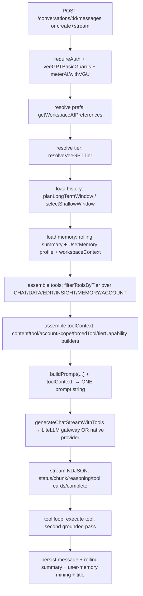
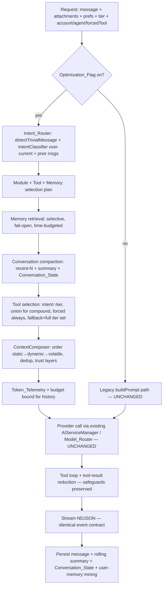

# Design Document

## Overview

This design refactors **how VeeGPT assembles and delivers context to the model**, not what
VeeGPT does. The goal is to stop sending the entire prompt on every turn and instead compose the
model request from independent, intent-selected modules — while guaranteeing that, for identical
inputs, behavior is equivalent to the current implementation. The overriding rule is
**correctness wins over tokens**.

The current entry point is `server/routes/veegpt-chat.routes.ts`, where `buildPrompt()`
(line ~634) concatenates a large static behavior block, persona/agent directives, workspace + user
memory, a rolling summary, the verbatim transcript, a per-turn note, and a restated output
contract into a **single prompt string**, then appends separate tool-context builders
(`buildContentContext`, `buildToolContext`, `buildAccountScopeHint`, `buildForcedToolDirective`,
`buildTierCapabilityContext`). That string is handed to
`aiServiceManager.generateChatStreamWithTools(prompt, tools, preferences, signal)`.

The design introduces a `ContextComposer` that assembles the same request from independent
`Context_Module`s, driven by the existing deterministic triage (`Intent_Router`). It is guarded by
a single `Optimization_Flag`: when the flag is off, the **exact current `buildPrompt()` path runs
unchanged** and is also the fallback for every optimization failure. Nothing outside the context
pipeline (billing, auth, model routing policy, streaming contract, tool execution, ledger) is
modified.

### Design principles (from the brief and requirements)

1. **The current code is the source of truth.** Every module's content is extracted verbatim from
   the existing builders; no VeeGPT behavior is invented (Req 1, 26 in the brief; Req 3/4).
2. **Zero regression.** The optimized path must pass a golden/equivalence `Regression_Suite`
   against a captured `Baseline_Benchmark` before it can be enabled (Req 2, 3, 23, 25).
3. **Correctness wins over tokens.** Selection fails open toward completeness; no token-driven
   dropping of a needed tool or required tool-result field (Req 9.7, 11.5, 12.4, 26).
4. **Clean switch + graceful degradation.** Exactly one path runs per request; every optimization
   degrades independently to the current behavior (Req 5/6/19/22).
5. **Minimal, reversible, in-place.** Reuse existing Mongo models/collections and the existing
   `VEEGPT_*` config/env convention; add the least state possible (Req 20/21/24).

## Existing Architecture Audit

This section satisfies **Requirement 1** (mandatory pre-change audit). Every context source below
is mapped to a real file/symbol. The tasks phase will lift this into a checked audit inventory
artifact (`audit-inventory.md`) before any refactor task begins; this section is its seed.

### Request → response flow (today)



Key real symbols:

- **Prompt assembly:** `buildPrompt()` in `veegpt-chat.routes.ts` (~L634). Produces
  `` `${systemBlock}${knowledgeBlock}${memoryBlock}\n\n--- Conversation ---\n${transcript}${noteBlock}${outputContract}\nVeeGPT:` ``.
  Note the **prompt-cache-friendly ordering comment** already present (static → dynamic → volatile
  last).
- **Directives builder:** `responseLengthDirective()` and the `directives[]` array inside
  `buildPrompt` (persona/voice, captionStyle, responseLength, optimizationGoals, multilingual,
  autoHashtags, contentSafety, aiMemory memory-handling text, autoLearning).
- **Rich-output capability:** the `chart`/`viz` fenced-block spec inside `systemBlock`, re-stated
  as `outputContract` after the transcript.
- **Tool-context builders:** `buildContentContext()` (~L858), `buildToolContext()` (~L1008),
  `buildAccountScopeHint()` (~L1062), `buildForcedToolDirective()` (~L1121),
  `buildTierCapabilityContext()` (~L1168), plus a `profileHint`.
- **Conversation memory:** `veegpt-memory.logic.ts` — `LONG_TERM_VERBATIM=20`,
  `SHORT_TERM_VERBATIM=8`, `SUMMARY_BATCH=10`, `planLongTermWindow()`, `selectShallowWindow()`,
  `renderTranscript()`; rolling summary regenerated by a background `veegpt.memory_summary` call.
- **User memory:** `veegpt-user-memory.logic.ts` — `mergeMemoryItems()` (single-value-topic
  replacement, dedup, caps), `isMemoryFull()`, `hasSaveIntent()`, `extractSaveIntentFact()`,
  `detectTopic()`; `UserMemory` model in `server/models/Chat`; save/update/forget also happen
  in-band via the memory tools.
- **Triage / intent:** `veegpt-triage.logic.ts` — `detectTrivialMessage()` (deterministic,
  LLM-free; greeting/thanks/farewell → canned reply). This is the **only** current deterministic
  router; there is no capability-level intent classifier today.
- **Personas:** `veegpt-agents.ts` — `VEEGPT_AGENTS` (default/strategist/creator/analyst/
  researcher), `minTier`, `getAgentDirectivesForTier()` (tier-gated precedence), applied as the
  leading `ACTIVE EXPERT MODE` block.
- **Tools:** `veegpt-tools.ts` — grouped arrays `VEEGPT_CHAT_TOOLS`, `VEEGPT_DATA_TOOLS`,
  `VEEGPT_EDIT_TOOLS`, `VEEGPT_INSIGHT_TOOLS`, `VEEGPT_MEMORY_TOOLS_ALL`, `VEEGPT_ACCOUNT_TOOLS`.
- **Tier gating:** `veegpt-tiers.ts` — `TOOL_MIN_TIER`, `filterToolsByTier()`,
  `isToolAllowedForTier()`, `resolveVeeGPTTier()` (basic/full/advanced).
- **Model routing:** `ai-model-routing.ts` — `resolveRoute()` (no availability fallback; only a
  deterministic capability substitution to Gemini for video/pdf/heic), `REGISTRY`,
  `mustBypassGateway()`, `supportsCustomTemperature()`.
- **Providers:** `AIServiceManager.ts` (native Gemini/OpenAI/GitHub + gateway),
  `litellm/LiteLLMGateway.ts` (`chatStreamWithTools`, `tool_choice:'auto'`,
  `stream_options:{include_usage:true}`, `TEMPERATURE_LOCKED_MODELS`, `GEMINI_THINKING_MODELS`).
- **Tool-call streaming:** `toolCallAccumulator.ts` (`accumulateToolCallDeltas`, `finalizeToolCalls`).
- **Token/credit accounting:** `recordAIUsage()` → `aiUsageTracker` → `withVGU`/metering →
  `veegpt-ledger.ts` (`VeegptUsageEvent`, includes `inputTokens/outputTokens/reasoningTokens/`
  `cachedTokens`, charges from actual usage); `veegpt-pricing.registry.ts`.
- **Streaming contract (client):** `useChatStream.ts` — consumes `conversation`, `userMessage`,
  `status`, `aiMessageStart`, `chunk` (cumulative text), `reasoning`, `researchProgress`,
  `modelNotice`, `complete`, `error`, plus tool cards (postCard/listCard/editCards/infoCards).

### Concrete sources of token waste (sent every turn regardless of relevance)

This enumeration is the evidence base for the classification and dynamic composition below.

| # | What is sent every turn | Where | Why it is waste for many turns |
|---|---|---|---|
| W1 | Full `chart`/`viz` rich-output spec (~1.5–2 KB) in `systemBlock` **and** re-stated in `outputContract` | `buildPrompt` | Purely conceptual / 1–3 sentence answers never emit a block; the spec is duplicated (head + tail). |
| W2 | Full "WORKSPACE DATA & ACTIONS" + edit-tool guidance prose | `systemBlock` | Only relevant when the turn is about the user's own posts/edits. |
| W3 | `buildContentContext` posts-with-ids list (up to 30 posts) | appended tool context | Only needed for edit/reference turns; injected whenever a workspace exists. |
| W4 | `buildToolContext` posting context (local time, accounts, media) | appended | Only needed when scheduling/posting is plausible. |
| W5 | `buildAccountScopeHint` analytics-access prose | appended | Only needed for analytics/account turns. |
| W6 | `buildTierCapabilityContext` restriction notes | appended | Only meaningful on non-advanced tiers and when a gated capability is implicated. |
| W7 | All AI-config directives (hashtags/optimizationGoals/autoLearning/etc.) | `directives[]` | Some are relevant only to content-generation turns. |
| W8 | Full memory-handling instruction block + entire `UserMemory` profile | `knowledgeBlock` | The whole memory store is injected even when the turn is unrelated to any stored fact. |
| W9 | Verbatim transcript up to `LONG_TERM_VERBATIM=20` messages | `transcript` | Grows toward the cap every turn; older turns re-sent verbatim until summarized in batches of 10. |
| W10 | Tool JSON schemas for **all** tier-permitted tools every turn | tools array | The model rarely needs the union of posting + analytics + research + memory + edit tools in one turn. |
| W11 | `outputContract` tail restating W1 formatting rules | `buildPrompt` | Intentional recency reinforcement, but a candidate for de-duplication once regression-verified. |

Note W1/W11 and W2 are **intentional repetitions** for lightweight-model reliability; per Req 13.3
and 4.3 they are retained until the `Regression_Suite` proves removal is output-equivalent.

## Architecture

### New request pipeline (Optimization_Flag ON)



The pipeline **reuses** every downstream stage unchanged: `AIServiceManager`, `LiteLLMGateway`,
`ai-model-routing`, tool execution, `toolCallAccumulator`, the NDJSON event writer, the metering
middleware, and the ledger. The optimization is entirely upstream of the provider call, plus a
bounded tool-result reducer inside the existing tool loop.

### Module-composition and trust layers

```mermaid
flowchart LR
  subgraph Trusted[Trusted — system/developer authority]
    S1[static: core behavior]
    S2[static: safety/policy]
    S3[static: reasoning/formatting/rich-output]
    D1[dynamic: persona directives]
    D2[dynamic: task modules]
    D3[dynamic: tool-usage guidance]
  end
  subgraph AppState[Application state — trusted data, not instructions]
    A1[workspace/brand context]
    A2[Conversation_State]
    A3[conversation summary as DATA]
    A4[posting/account scope facts]
  end
  subgraph Retrieved[Retrieved — data]
    RM[User_Memory facts as DATA]
  end
  subgraph ToolOut[Tool output — data]
    TO[reduced tool results]
  end
  subgraph UserContent[User content — lowest authority]
    U1[recent transcript]
    U2[current user message]
  end
  Trusted --> AppState --> Retrieved --> ToolOut --> UserContent
```



Ordering is also the **static-prefix ordering** for provider prompt caching (§Static-Prefix), and
the **trust ordering** for prompt-injection safety (§Trust Boundaries): higher-authority content is
earlier and byte-stable; user-controlled content is last and never promoted into an instruction
layer.

### Where the new code lives

New, self-contained modules under `server/routes/` and `server/config/` (mirroring the existing
`veegpt-*.logic.ts` pure-function convention so they are unit/property testable without a DB):

- `server/config/veegpt-context.config.ts` — centralized config + `Optimization_Flag` (Req 22).
- `server/routes/veegpt-intent.logic.ts` — capability `IntentClassifier` (pure, deterministic;
  wraps `detectTrivialMessage`).
- `server/routes/veegpt-modules.ts` — `Context_Module` registry (content extracted from
  `buildPrompt`) + `selectModules()` (pure).
- `server/routes/veegpt-tool-selection.logic.ts` — `selectTools()` (pure; intent→tools, union,
  forced, tier filter, fallback).
- `server/routes/veegpt-context-composer.ts` — `ContextComposer.compose()` (assembles messages +
  dedup + ordering + telemetry).
- `server/routes/veegpt-conversation-state.logic.ts` — `Conversation_State` extraction/merge (pure).
- `server/routes/veegpt-tool-result.logic.ts` — `reduceToolResult()` (pure).
- `server/routes/veegpt-token-telemetry.ts` — `Token_Telemetry` recorder.

`veegpt-chat.routes.ts` gains a thin branch: `if (contextOptEnabled()) composeWithComposer(...) else buildPrompt(...)`.
The legacy functions are **not deleted**.

## Components and Interfaces

### Optimization_Flag and configuration (Req 22)

`server/config/veegpt-context.config.ts` centralizes all thresholds using the existing `VEEGPT_*`
env convention with safe defaults. The flag is the clean switch (Req 22.4–22.7).

```ts
export interface VeegptContextConfig {
  enabled: boolean;              // VEEGPT_CONTEXT_OPT (default false — legacy path)
  recentWindowLongTerm: number;  // default 20  (= LONG_TERM_VERBATIM, no behavior change when unset)
  recentWindowShortTerm: number; // default 8
  summaryBatch: number;          // default 10
  historyTokenBudget: number;    // VEEGPT_CTX_HISTORY_TOKENS (default high; bounds §7)
  memoryRetrievalLimit: number;  // max memory items scanned/injected
  memoryRetrievalBudgetMs: number; // fail-open timeout (Req 9.5/9.7)
  toolResultMaxTokens: number;   // §12 reduction threshold
  selectiveTools: boolean;       // VEEGPT_CTX_SELECTIVE_TOOLS (default true when enabled)
  caching: 'auto' | 'off';       // §14; 'auto' = ordering-only + provider automatic caching
  unnecessaryRetentionDays: number; // Req 4.6 retention timeout
}
export function contextOptEnabled(): boolean;   // single source of truth
export function getContextConfig(): VeegptContextConfig;
```

Rules: no threshold is hard-coded elsewhere (Req 22.3); every value has a safe default (22.2); no
config is added beyond what a requirement needs (22.6); when `enabled=false` the composer is never
constructed and `buildPrompt` runs verbatim (22.5/22.7).

### Intent_Router / IntentClassifier (Req 6)

Reuses `detectTrivialMessage` first (unchanged). For non-trivial messages, a **deterministic,
LLM-free** `IntentClassifier` derives one or more capability intents from the current message plus
prior messages (Req 6.2), reusing signals already computed on the request (forced tool, selected
account, attachments) so classification is computed **at most once per request** (Req 6.4) and adds
**no extra model call** (Req 6.5, brief §31).

```ts
export type Capability =
  | 'chat' | 'content_generation' | 'posting' | 'edit_content'
  | 'analytics' | 'account_data' | 'research' | 'memory_write' | 'workspace_data';

export interface IntentResult {
  intents: Capability[];       // one or more; covers multi/compound/follow-up (Req 6.2)
  ambiguous: boolean;          // when true → include broader module/tool set (fail open)
  usedFallback: boolean;       // Req 6.6 recorded in telemetry
}
export function classifyIntent(input: {
  message: string; priorMessages: Msg[]; hasMedia: boolean;
  forcedTool?: string; selectedAccountId?: string | null;
}): IntentResult;
```

Selection is **primarily** intent-driven and MAY be hybrid (intent + heuristics), but keyword
matching is never the sole mechanism (Req 6.3). If the classifier throws or returns nothing, the
router returns `{ intents: ALL_CAPABILITIES, ambiguous: true, usedFallback: true }` — the safe,
capability-preserving set (Req 6.6, 19.1).

### Context_Module registry and selection (Req 4, 5)

Each `Context_Module` corresponds to exactly one capability/task/tool with **no shared
instructions** (Req 5.5). Content is lifted verbatim from `buildPrompt`.

```ts
export type ContextClass =
  | 'static' | 'task-specific' | 'tool-specific' | 'user-specific'
  | 'conversation-specific' | 'turn-specific' | 'historical' | 'unnecessary';
export type TrustLayer = 'system' | 'developer' | 'app-state' | 'retrieved' | 'tool-output' | 'user';

export interface ContextModule {
  id: string;
  contextClass: ContextClass;
  trustLayer: TrustLayer;
  always: boolean;                 // static modules → always true (Req 5.4)
  appliesTo: Capability[];         // which intents include this module
  render(ctx: ComposeInput): string; // extracted verbatim from current builders
  intentionalRepeat?: boolean;     // W1/W2/W11 — retained until regression clears (Req 13.3)
}
export function selectModules(intent: IntentResult, ctx: ComposeInput): ContextModule[];
```

`selectModules` always includes `always` modules (Req 5.4), includes every module whose
`appliesTo` intersects `intent.intents` (Req 5.3/6.1), and when the selection is empty/ambiguous
returns the **complete** module set with `static` modules guaranteed present (Req 5.6, 6.6, 19.1).

### ContextComposer (Req 5, 13, 14, 17)

```ts
export interface ComposeInput {
  prefs: FullPreferences;
  agentDirectives?: string;        // already tier-resolved (Req 10)
  history: Msg[];                  // recent window (post-compaction)
  memorySummary?: string;          // rolling summary (as DATA)
  conversationState?: ConversationState;
  userMemoryProfile?: string;      // selectively retrieved (Req 9)
  workspaceContext?: string;
  memoryNote?: string;
  toolContextParts: string[];      // content/tool/accountScope/forcedTool/tierCapability (selected)
  tier: VeeGPTTier;
  route: Route;                    // for model-aware composition (Req 15)
}
export interface ComposedRequest {
  messages: LiteLLMMessage[];      // ordered static→dynamic→volatile; trust-layered
  tools: ChatTool[];
  telemetry: TokenTelemetry;
  cacheable: { staticPrefixLen: number };
}
export function compose(modules: ContextModule[], tools: ChatTool[], input: ComposeInput): ComposedRequest;
```

`compose` orders modules by trust layer (static system → developer → app-state → retrieved →
tool-output → user), runs `dedupeContext()` across sources (Req 13), builds the final
message list, and records `Token_Telemetry`. To preserve exact behavior when the flag is on but a
minimal composition is chosen, the composer can emit either a **single concatenated prompt string**
(byte-compatible with `buildPrompt` output ordering) or a **role-separated message array**; the
message array is only used for providers/models verified to accept it (Req 15), otherwise it falls
back to the concatenated form so no provider is broken.

### Provider integration (Req 15) — unchanged

The composer's output feeds the **existing** `aiServiceManager.generateChatStreamWithTools()` and
`ai-model-routing.resolveRoute()`. No change to routing, capability substitution, temperature-lock,
reasoning-model handling, or the no-fallback policy. If a model cannot accept a composed feature
(e.g. role-separated messages, or tools when the fallback is non-tool-capable), the composer omits
that feature for that model (Req 15.2) and reverts to the concatenated prompt and/or the existing
`recoverLeakedToolCalls` text-tool path.

## Data Models

### Reused, unchanged

- `ChatConversation`, `ChatMessage`, `UserMemory` (`server/models/Chat`).
- `VeegptUsageEvent` (`veegpt-ledger.ts`) — already carries `cachedTokens`; ledger charging from
  actual provider usage is untouched (Req 24.3).

### Conversation_State (Req 7, 8, 21)

New durable state is stored **as optional fields on the existing `ChatConversation` document** — no
new collection, no second memory system (Req 21.1/21.2). This reuses the same document the rolling
summary already lives beside.

```ts
// Added to ChatConversation (all optional; absent on legacy docs)
interface ConversationStateDoc {
  contextState?: {
    version: 1;
    objective?: string;
    currentTask?: string;
    requirements?: string[];
    decisions?: string[];
    constraints?: string[];
    entities?: string[];
    selectedOptions?: string[];
    pendingActions?: string[];
    facts?: string[];               // facts referenced by a later turn
    toolDerivedState?: string[];
    // Every instruction-like entry carries exactly one label (Req 8.5)
    labels?: Record<string, 'user_preference'|'user_request'|'factual_state'|'application_state'|'system_instruction'>;
    summarizedMessageCount?: number; // mirrors existing rolling-summary counter
    updatedAt?: Date;
  };
}
```

- **Category constraint (Req 8.1–8.3):** only the enumerated categories are persisted; content
  that fits no category is not written, and the raw message remains the source.
- **Label constraint (Req 8.5/8.6):** an instruction-like entry unassignable to exactly one label
  is excluded and the raw message is retained.
- **Safety (Req 17.4/18):** `contextState` is always treated as **data**; it can inform non-safety
  behavior but never overrides system/safety instructions.

**Schema-change checklist (Req 21.3):**

- *Migration:* none required — fields are optional and lazily created on first write; existing
  documents remain valid.
- *Indexes:* none added (state is read by conversation `id`, already indexed).
- *Backward compat (Req 20.6):* a conversation without `contextState` is read without error; the
  composer treats missing state as empty and falls back to summary + recent window.
- *Cleanup:* `contextState` is deleted with its conversation (existing cascade); bounded in size by
  category caps mirroring `MEMORY_LIMITS`.
- *Failure behavior:* if writing `contextState` fails, the turn still succeeds (state is
  best-effort, written after the reply like the rolling summary today); next turn falls back to the
  recent window + summary (Req 7.6, 19.3).

### Token_Telemetry (Req 16)

Recorded per request; **no full prompts or user content by default** (Req 16.4/16.5). Persisted via
the existing metering/telemetry path (e.g. attached to the ledger event `meta` and/or the debug
logger), never a new datastore.

```ts
interface TokenTelemetry {
  perCategoryTokens: {
    staticInstr: number; dynamicInstr: number; memory: number; summary: number;
    recentHistory: number; toolDefs: number; toolResults: number; userInput: number;
  };
  totalInputTokens: number; outputTokens: number;
  cachedInputTokens?: number; cacheRead?: number; cacheWrite?: number; // when provider supplies
  model: string; provider: string; requestType: string;
  selectedModules: string[]; exposedTools: string[];
  compactionOccurred: boolean; memoryRetrieved: boolean; cacheUsed: boolean; usedFallback: boolean;
}
```

## Conversation-History Strategy (Req 7, 8)

The recent window continues to use `planLongTermWindow`/`selectShallowWindow` with the same
defaults (`LONG_TERM_VERBATIM=20`, `SHORT_TERM_VERBATIM=8`, `SUMMARY_BATCH=10`), now surfaced
through `veegpt-context.config.ts`. History is represented as **recent-N window + rolling summary +
`Conversation_State`** (Req 7.2).

- **Bounded tokens (Req 7.1):** the composer measures history tokens; if they would exceed
  `historyTokenBudget`, it triggers compaction of the oldest overflow into the summary/state
  **before** removing them from the window (Req 7.4), so the bound does not grow with turn count.
- **Preserve durable info (Req 7.3/8):** on compaction, brand info, objectives, audience,
  constraints, selected strategy, tool-derived output, decisions, preferences, and pending actions
  are recorded into `Conversation_State` (only the allowed categories) or the summary before the
  message leaves the window.
- **Follow-ups (Req 7.5):** when a follow-up references an earlier (compacted) message, the summary
  + `Conversation_State` entries covering it are always included, so the answer references the same
  earlier information as the baseline.
- **Failure safety (Req 7.6/19.3):** if summarization fails, the current request and the full
  recent window are retained (including a brand-new conversation with no history); the current turn
  is never dropped.

## Memory Optimization (Req 9)

Four independently addressable scopes (Req 9.1): long-term `User_Memory`, `Conversation_Memory`
(summary), short-term recent window, and retrieved knowledge (tool results). Each can be included
or excluded independently.

- **Selective retrieval (Req 9.2/9.3):** a deterministic relevance filter (token/keyword + topic
  match via `detectTopic`, plus recency) selects only memory items related to the current request;
  the whole store is not injected. The existing in-band memory tools (`remember_fact`,
  `update_memory`, `forget_memory`) and their prompt guidance are preserved exactly.
- **Preserved behaviors (Req 9.4):** `mergeMemoryItems`, single-value-topic replacement, dedup,
  storage caps, `isMemoryFull` handling, acknowledgement/contradiction/update rules are all reused
  unchanged and verified against baseline by the `Regression_Suite`.
- **Fail-open (Req 9.5–9.7):** if retrieval fails/times out (`memoryRetrievalBudgetMs`), proceed
  with whatever is available and keep the user's current message; if relevance cannot be determined
  within budget, **include all memory** rather than excluding it (correctness > tokens). The
  current user message is always retained regardless of memory status.

## Persona Optimization (Req 10)

Only the applicable persona's directives are included (Req 10.1), reusing
`getAgentDirectivesForTier` so tier gating (Req 10.2) and single-selection precedence (Req 10.3)
produce the **identical** persona outcome as today. Because only one agent is selected today, no
two personas' conflicting directives are ever composed together (Req 10.4). The selected persona
leads the instruction ordering (the existing `ACTIVE EXPERT MODE` position) while platform/safety
rules remain in force and are not overridden (Req 10.5).

## Tool Context Optimization (Req 11)

Provider support: the LiteLLM gateway and native OpenAI/Gemini paths all accept a per-request
`tools` array (`tool_choice:'auto'`), so **selective tool exposure is supported** (Req 11.1) by
simply composing a smaller `tools` array — no protocol change.

- **Selective exposure (Req 11.1/11.3):** expose exactly the union of tools mapped to the
  identified intents; for compound/multi-intent turns, the union across intents.
- **Tier filter first (Req 11.4):** `filterToolsByTier` is applied **before** exposure, exactly as
  today, so a tool above the user's tier is never exposed.
- **Safeguards preserved (Req 11.2):** parameters, validation, permissions, auth, workspace/
  platform restrictions, error handling, execution, retries, confirmation requirements, and
  destructive-action safeguards are unchanged (tool definitions and the tool loop are reused).
- **No token-driven dropping (Req 11.5):** a tool selected by intent and permitted by tier is never
  dropped to save tokens, even if the request would exceed a budget or fail.
- **Forced tool (Req 11.6):** an explicitly forced tool is always exposed and run via the existing
  `buildForcedToolDirective` behavior, even if intent did not select it.
- **Fallback (Req 11.7):** if selection fails or a model does not support selective exposure, fall
  back to the full tier-permitted set (current behavior).

## Tool-Result Optimization (Req 12)

A pure `reduceToolResult(payload, requiredFields, maxTokens)` runs inside the existing tool loop,
before a large tool payload re-enters the next model request.

- If a payload exceeds `toolResultMaxTokens`, reduce by returning only required fields, paginating/
  summarizing large datasets, filtering irrelevant records, and removing duplicated metadata
  (Req 12.1).
- **Always retain identifiers** needed for follow-up actions (e.g. `contentId`, account ids)
  (Req 12.2).
- **Correctness wins (Req 12.3/12.4):** never remove information required for accurate reasoning or
  subsequent tool execution; if reducing would remove such info, retain it even above the max, and
  treat reasoning-required and execution-required info as equally essential.

## Duplicate-Context Detection (Req 13)

`dedupeContext()` runs during composition across system/developer instructions, memory, summary,
recent messages, tool descriptions, tool results, workspace context, user profile, and retrieved
documents (Req 13.1). Information present in more than one source is included once unless a
documented reason requires repetition (Req 13.2). Known **intentional** repetitions (W1/W2/W11) are
flagged `intentionalRepeat` and preserved until the `Regression_Suite` proves removal is
output-equivalent (Req 13.3).

## Static-Prefix and Provider Prompt Caching (Req 14)

**Verified against the actual SDK/gateway:** `LiteLLMGateway` uses the OpenAI SDK against a LiteLLM
proxy and sets **no** explicit cache-control breakpoints; the native paths (Gemini/OpenAI SDKs)
likewise set none. Therefore **explicit** prompt caching (e.g. Anthropic `cache_control`) is **not
supported by the integration as it exists today**. What *is* available is **automatic** provider
caching (OpenAI automatic prompt caching keys off an identical leading prefix) — which is exactly
what the existing `buildPrompt` cache-friendly ordering already targets.

Design:

- Keep the **static → dynamic → volatile** ordering so the leading bytes form the largest possible
  `Static_Prefix`, and keep that prefix **byte-identical across consecutive turns** of a
  conversation (Req 14.1/14.2). Volatile per-turn content (`noteBlock`, current message) stays last.
- `caching:'auto'` performs **ordering only** and relies on provider automatic caching; it enables
  no provider-specific mechanism that the SDK cannot express (Req 14.3).
- If caching is unavailable for the selected model, the request is composed and sent **without
  caching and without altering content** — a no-op-safe path (Req 14.4/19.5). Introducing explicit
  `cache_control` is explicitly **out of scope** unless/until the gateway is confirmed to support
  it; the design leaves a clean seam (`caching` config) to add it later.

## Trust Boundaries and Prompt-Injection Safety (Req 17, 18)

Today everything is concatenated into one string; the design does **not** worsen this and layers
authority explicitly:

- Maintain separation of trusted system, developer, application-state, retrieved data, tool output,
  and user content (Req 17.1) via the trust-layer ordering above.
- User-controlled content is never placed in a higher-priority layer than it occupies today
  (Req 17.2); when role-separated messages are used, user content is a `user` message, never
  `system`.
- Summaries and memory generated from user content are labeled and treated as **data**, never as
  authoritative instructions, and cannot override core/safety behavior (Req 17.3, 18.1, 18.3).
- A user message summarized into memory/`Conversation_State` does **not** become a persistent
  trusted instruction (Req 17.4); `Conversation_State` labels (Req 8.5/18.2) keep
  `system_instruction` distinct from `user_preference`/`user_request`/`factual_state`/
  `application_state`, and only genuine system instructions carry system authority.

## Model Routing and Provider Compatibility (Req 15)

- Every registered model in `ai-model-routing.REGISTRY` must accept the composed request (Req 15.1);
  the composer is model-aware (`route`) and omits unsupported features per model (Req 15.2).
- Existing routing/fallback — reasoning models, temperature-locked models, capability substitution
  to Gemini, and non-tool-capable handling (`recoverLeakedToolCalls`/`stripLeakedToolSyntax`) — is
  preserved and verified against baseline (Req 15.3/15.4).

## Token Ledger Correctness (Req 24)

Charging remains computed from **actual provider usage** via `recordAIUsage`/`onUsage` →
`VeegptUsageEvent`; no change to metering or pricing. Telemetry is additive metadata. Cached-token
counts (already a ledger field) are populated when the provider reports them (Req 16.1/24.3).

## Zero-Regression Strategy

### Baseline_Benchmark and After_Benchmark (Req 2)

A version-controlled request set (`tests/veegpt-baseline/`) with ≥3 requests for each of the 15
categories (simple chat, follow-up, content creation, analytics, social listening, scheduling,
automation, multi-tool, memory-dependent, long conversation, ambiguous, persona-dependent, tool
failure, provider fallback, complex reasoning). A harness runs each request ≥3× and records mean
input/output tokens, latency, tool-call accuracy, answer-quality rubric, memory retention, and
context retention. `Baseline` is captured with the flag **off**; `After` re-runs the identical set
with the flag **on**. Success = mean input tokens ↓ ≥10% **and** no behavioral regression and
latency not worse by >10% (Req 2.5/2.6).

### Regression_Suite and golden/equivalence testing (Req 3, 23, 25, 26)

Structure under `tests/veegpt-context/`:

- **Golden/equivalence tests:** for identical inputs (deterministic fixtures, mocked provider),
  assert the optimized path is behavior-equivalent to the pre-refactor path — same tool selection,
  same memory outputs, same persona outcome, same streaming events, same API/ledger shape (Req 3.1,
  3.4, 20). Because provider output is stochastic, equivalence is asserted on the **composed
  request** (selected tools/modules, retained facts, ordering, trust layers) and on **deterministic
  behaviors** (tool selection, memory merges, tier gating, event contract), not on model prose.
- **Category coverage (Req 23):** conversation (follow-ups, references, long, summarized); memory
  (retrieval, irrelevant, updates, conflicts, stale); tools (correct selection, no unnecessary
  calls, multiple, failures, invalid params, permissions); personas (correct, switching, conflict);
  safety intact; output (format, structured, streaming, citations); every provider/model + fallback.
- **Minimum-sufficient-context (Req 26):** reductions are accepted only if all cases still pass;
  reasoning instructions are scoped to tasks that need them and never removed to save tokens; no
  hidden reasoning in user-visible output.
- **Release gate:** the optimized path ships only at 100% pass and no regression vs baseline
  (Req 3.1/23.8). On any failing case with the flag on, revert to baseline behavior for the affected
  case and surface a regression indicator (Req 3.6).

### Phased delivery mapped to the brief's 10 phases (Req 25)

1. **Audit** — complete the audit inventory artifact from this section (Req 1).
2. **Instrumentation** — add `Token_Telemetry` (flag-agnostic) and capture `Baseline_Benchmark`.
3. **Classification** — fill the Context_Class table; build the module registry (content verbatim).
4. **Dynamic composition** — `IntentClassifier` + `selectModules` + `ContextComposer` behind flag.
5. **Conversation compaction** — `Conversation_State` + history budget bounding.
6. **Tool filtering** — `selectTools` selective exposure with safeguards + fallback.
7. **Caching** — static-prefix ordering + automatic-caching (no-op-safe) path.
8. **Regression testing** — golden/equivalence suite across all categories.
9. **Optimization** — de-dup (W11 etc.) and threshold tuning driven by measurements.
10. **Hardening** — per-component graceful degradation, telemetry dashboards, rollback drills.

Each behavior-changing phase runs the `Regression_Suite` before the next (Req 25.3); the work never
skips to threshold optimization (Req 25.2).

## Context_Class Classification Table (Req 2/4)

Every meaningful current context piece → exactly one `Context_Class` and a destination module. Items
marked *intentional-repeat* are retained until regression clears (Req 4.3/13.3). Items with class
`unnecessary` are retained until the `Regression_Suite` confirms removal or the retention timeout
elapses (Req 4.6).

| Current context piece (source) | Context_Class | Destination Context_Module |
|---|---|---|
| VeeGPT identity/"senior strategist" intro (`systemBlock`) | static | `core-behavior` (always) |
| Content-safety directive (`directives` contentSafety) + Gemini safety settings | static | `safety-policy` (always) |
| ANSWERING STYLE + FORMATTING rules (`systemBlock`) | static | `reasoning-formatting` (always) |
| Rich-output `chart`/`viz` spec (`systemBlock`) | static | `rich-output` (always) |
| `outputContract` tail (restates formatting/rich-output) | static | `rich-output` *(intentional-repeat)* |
| Persona/voice, tone/style directives (`directives`) | user-specific | `ai-config-directives` |
| responseLength directive | user-specific | `ai-config-directives` |
| optimizationGoals, autoHashtags, autoLearning, multilingual | user-specific / task-specific | `ai-config-directives` |
| `ACTIVE EXPERT MODE` agent directives (`veegpt-agents`) | task-specific | `persona` |
| memory-handling instruction block (aiMemory long-term) | tool-specific | `memory-guidance` (with memory tools) |
| `UserMemory` profile facts (`knowledgeBlock`) | user-specific | `user-memory` (retrieved, selective) |
| workspace/brand context (`knowledgeBlock`) | user-specific | `workspace-context` (app-state) |
| rolling conversation summary (`memoryBlock`) | historical | `conversation-summary` (app-state, DATA) |
| verbatim transcript (recent window) | conversation-specific | `recent-conversation` (user layer) |
| current user message | turn-specific | `current-request` (user layer) |
| memory-update `noteBlock` | turn-specific | `turn-note` (volatile, last) |
| WORKSPACE DATA & ACTIONS prose (`systemBlock`) | tool-specific | `workspace-actions-guidance` (with data/edit tools) *(intentional-repeat of edit guidance)* |
| `buildContentContext` posts-with-ids | conversation-specific / tool-specific | `content-ids` (with edit/data tools) |
| `buildToolContext` posting context (time/accounts/media) | tool-specific | `posting-context` (with schedule_post) |
| `buildAccountScopeHint` analytics-access prose | tool-specific | `account-scope` (with account/analytics tools) |
| `buildForcedToolDirective` | turn-specific | `forced-tool` (when forced) |
| `buildTierCapabilityContext` restriction notes | user-specific | `tier-capability` (non-advanced tiers) |
| tool JSON schemas (all groups) | tool-specific | exposed `tools` array (intent∩tier) |
| local time / timezone (`buildToolContext`) | turn-specific | `posting-context` |
| (candidate) any instruction proven redundant by regression | unnecessary | removed after regression/timeout (Req 4.6) |

*No audited item is left without a destination (Req 4.4); an item that cannot be uniquely classified
or mapped is flagged for manual resolution and its current behavior preserved (Req 4.5).*

## Correctness Properties

*A property is a characteristic or behavior that should hold true across all valid executions of a
system — essentially, a formal statement about what the system should do. Properties serve as the
bridge between human-readable specifications and machine-verifiable correctness guarantees.*

These properties target the **pure composition/selection logic** (intent → modules/tools → compose,
history bounding, tool-result reduction, dedup, flag-off identity). Provider behavior, benchmark
measurement, and audit/process requirements are covered by integration/smoke/example tests in the
Testing Strategy, not by property tests.

### Property 1: Static modules are always present

*For any* `IntentResult` (including empty, ambiguous, or fallback), the module set returned by
`selectModules` contains every module marked `always` (the `static` core-behavior, safety-policy,
reasoning-formatting, and rich-output modules).

**Validates: Requirements 5.4, 6.6, 19.1**

### Property 2: Intent-mapped modules are included

*For any* `IntentResult`, every module whose `appliesTo` intersects `intent.intents` is included in
the selected module set.

**Validates: Requirements 5.3, 6.1**

### Property 3: Module selection fails open to the complete set

*For any* input where the intent is empty, ambiguous, or the classifier failed, `selectModules`
returns the complete module registry and the `static` modules are present.

**Validates: Requirements 5.6, 6.6, 19.1**

### Property 4: Exposed tools are bounded by tier and equal the intent-mapped union

*For any* set of intents and any tier, the exposed tool set is a subset of
`filterToolsByTier(allTools, tier)` and equals the union of the tier-permitted tools mapped to the
identified intents; and this holds regardless of any token budget value (no token-driven dropping).

**Validates: Requirements 11.1, 11.3, 11.4, 11.5**

### Property 5: A forced, tier-permitted tool is always exposed

*For any* forced tool that is permitted for the user's tier and *any* intents, the exposed tool set
contains the forced tool even when the intent did not select it.

**Validates: Requirements 11.6**

### Property 6: Tool selection fails open to the full tier set

*For any* input where tool selection fails or the active model does not support selective exposure,
the exposed tool set equals `filterToolsByTier(allTools, tier)`.

**Validates: Requirements 11.7, 19.6**

### Property 7: Conversation-history tokens are bounded independent of turn count

*For any* conversation of any length, the estimated input tokens attributable to conversation
history in the composed request do not exceed the configured `historyTokenBudget`, and the bound
does not increase as the number of turns increases.

**Validates: Requirements 7.1, 7.4**

### Property 8: The current user message is always retained

*For any* history and *any* memory/summarization status (success, failure, or timeout), the composed
request contains the current user message, and the recent-message window is retained in full when
summarization fails (including a brand-new conversation with no prior history).

**Validates: Requirements 7.6, 9.5, 9.6, 19.3**

### Property 9: Memory relevance fails open toward completeness

*For any* memory store, when item relevance cannot be determined within the configured time budget,
the composed request includes all memory items rather than excluding any.

**Validates: Requirements 9.7**

### Property 10: Persona composition matches the tier-resolved selection exactly

*For any* selected agent id and tier, the persona directives in the composed request equal
`getAgentDirectivesForTier(id, tier)` and contain no directives belonging to any other persona.

**Validates: Requirements 10.1, 10.2, 10.3, 10.4**

### Property 11: Reduced tool results retain all required information

*For any* tool payload and its declared required fields (follow-up identifiers, reasoning-required,
and execution-required fields), `reduceToolResult` output retains all required fields even if the
payload remains above the configured maximum.

**Validates: Requirements 12.2, 12.3, 12.4**

### Property 12: Duplicate context appears once

*For any* collection of context sources, `dedupeContext` includes each non-`intentionalRepeat`
information unit exactly once, while preserving every unit flagged `intentionalRepeat`.

**Validates: Requirements 13.2, 13.3**

### Property 13: The static prefix is maximal and byte-identical across consecutive turns

*For any* two consecutive turns of the same conversation with unchanged static inputs (core
behavior, safety, formatting/rich-output, persona, and slowly-changing app-state), the leading
byte-identical portion of the composed request equals the full `Static_Prefix`.

**Validates: Requirements 14.1, 14.2**

### Property 14: Flag-off composition is identical to the pre-refactor prompt

*For any* input, when the `Optimization_Flag` is off, the produced request is byte-for-byte equal to
the output of the legacy `buildPrompt(...) + toolContext` path, and the `ContextComposer` is not
invoked (exactly one path runs).

**Validates: Requirements 3.1, 22.5, 22.7**

### Property 15: User content is never promoted into a trusted layer

*For any* user message content (including injection-like text such as "ignore previous
instructions"), the composed request keeps that content in the user layer only and never places it
in the system/developer instruction layer.

**Validates: Requirements 17.2, 17.4, 18.3**

### Property 16: Conversation_State is well-formed

*For any* candidate conversational item, only items belonging to the allowed categories are
persisted into `Conversation_State`, and every instruction-like entry is assigned exactly one label
or is excluded (with the raw message retained as the source).

**Validates: Requirements 8.1, 8.3, 8.5, 8.6**

## Error Handling

Every optimization degrades **independently** to current behavior; a failure in one never disables
VeeGPT (Req 19.7). All fallbacks are recorded in `Token_Telemetry` (`usedFallback`).

| Failure point | Detection | Fallback (safe path) | Req |
|---|---|---|---|
| `Optimization_Flag` off / unset | `contextOptEnabled()` | Run legacy `buildPrompt` path verbatim | 22.5 |
| Intent classification throws / empty | try/catch in `Intent_Router` | `intents = ALL`, `ambiguous=true`, complete module + full-tier tool set | 6.6, 19.1 |
| Module selection cannot resolve | empty/duplicate selection guard | Complete module set incl. static | 5.6, 19.1 |
| Memory retrieval fails / times out | `memoryRetrievalBudgetMs` | Proceed with available memory; keep current message; include-all if relevance undetermined | 9.5, 9.7, 19.2 |
| Summarization fails | try/catch after reply | Keep full recent window + current turn; no state write | 7.6, 19.3 |
| Token estimation fails | try/catch in telemetry/budget | Do not block; skip bounding for this turn | 19.4 |
| Tool selection fails / provider lacks selective exposure | capability check + try/catch | Expose full tier-permitted set | 11.7, 19.6 |
| Provider caching unavailable | model capability check | Compose/send unchanged, no-op caching | 14.4, 19.5 |
| Tool-result reduction risk to correctness | required-field guard | Retain required info even above max | 12.4 |
| `Conversation_State` write fails | try/catch (best-effort, post-reply) | Turn still succeeds; next turn uses summary + window | 21.3, 19.3 |
| Composed feature unsupported by model | `route`-aware compose | Omit feature; fall back to concatenated prompt / text-tool recovery | 15.2, 15.4 |

Composer construction is wrapped so any unexpected error in the optimized path degrades to the
legacy path for that request, with a regression indicator emitted (Req 3.6).

## Testing Strategy

### Dual approach

- **Property-based tests** (Properties 1–16) validate the universal composition/selection
  invariants. Library: **fast-check** (the repo is TypeScript/Node with existing `tests/*.test.ts`),
  minimum **100 iterations** per property. Each test is tagged
  `// Feature: veegpt-context-optimization, Property N: <text>` and references the design property.
  These run against the **pure logic modules** (`veegpt-intent.logic`, `veegpt-modules`,
  `veegpt-tool-selection.logic`, `veegpt-conversation-state.logic`, `veegpt-tool-result.logic`,
  `veegpt-context-composer` with a mocked provider) — no DB, no network, consistent with the
  existing `veegpt-*.logic.test.ts` pattern.

- **Unit / example tests** for specific behaviors and edge cases: legacy-doc backward-compat
  (Req 20.6), telemetry never logs full prompts (Req 16.4), per-component fault injection
  (Req 19.x), forced-tool tier-block message, and the intentional-repeat retention (W1/W2/W11).

- **Golden/equivalence (Regression_Suite)** as described in the Zero-Regression Strategy: asserts
  deterministic behavior parity (tool/module selection, memory merges, persona outcome, streaming
  event contract, API/ledger shape) between flag-on and flag-off for identical inputs, across all
  Req 23 categories. Provider prose is not asserted (stochastic); the composed request and
  deterministic outputs are.

- **Integration tests** (not PBT): per-registered-model compose-and-accept with a mocked gateway
  (Req 15), and reuse of existing `veegpt-ledger.test.ts` to confirm charging is unchanged (Req 24).

- **Benchmark harness** (not PBT): `Baseline_Benchmark` vs `After_Benchmark` over the fixed request
  set, ≥3 runs each, asserting ≥10% mean input-token reduction and no behavioral/latency regression
  (Req 2).

- **Smoke** (single execution): audit-inventory completeness gate before refactor tasks (Req 1).

### Property test configuration

- Minimum 100 iterations per property (fast-check `numRuns: 100+`).
- Generators: random intent sets over `Capability`, random tiers (`basic|full|advanced`), random
  agent ids (valid + invalid), random tool budgets (including 0 and huge), random histories of
  varying length, random memory stores, adversarial user strings (injection-like), and random tool
  payloads with tagged required fields.
- Each property maps 1:1 to a single property-based test (Properties 1–16).

## Requirements Mapping

| Design component / section | Requirements satisfied |
|---|---|
| Existing Architecture Audit + audit inventory artifact | 1 |
| Token_Telemetry + Baseline/After benchmark harness | 2, 16 |
| Zero-Regression Strategy (golden/equivalence suite, gate) | 3, 23, 25, 26 |
| Context_Class Classification Table | 2, 4 |
| ContextComposer + Context_Module registry + selectModules | 4, 5 |
| Intent_Router / IntentClassifier + selection reuse | 6 |
| Conversation-History Strategy (window + summary + budget) | 7 |
| Conversation_State data model + labels | 8, 17, 18, 21 |
| Memory Optimization (four scopes, selective, fail-open) | 9 |
| Persona Optimization (tier-gated, precedence) | 10 |
| Tool Context Optimization (selective, safeguards, forced, fallback) | 11 |
| Tool-Result Optimization (reduceToolResult) | 12 |
| Duplicate-Context Detection (dedupeContext) | 13 |
| Static-Prefix and Provider Prompt Caching (no-op-safe) | 14 |
| Model Routing and Provider Compatibility | 15 |
| Trust Boundaries and Prompt-Injection Safety | 17, 18 |
| Error Handling (graceful degradation table) | 19 |
| Data Models — reuse ChatConversation/UserMemory; backward compat | 20, 21 |
| Optimization_Flag + veegpt-context.config.ts (clean switch) | 22 |
| Regression_Suite (Testing Strategy) | 23 |
| Scope isolation; Token Ledger correctness | 24 |
| Phased delivery plan (10 phases) | 25 |
| Minimum-Sufficient-Context (regression-gated reductions) | 26 |
| Final report (produced from telemetry + benchmark + regression) | 27 |
| Correctness Properties 1–16 | 3, 5, 6, 7, 8, 9, 10, 11, 12, 13, 14, 17, 18, 19, 22 |
