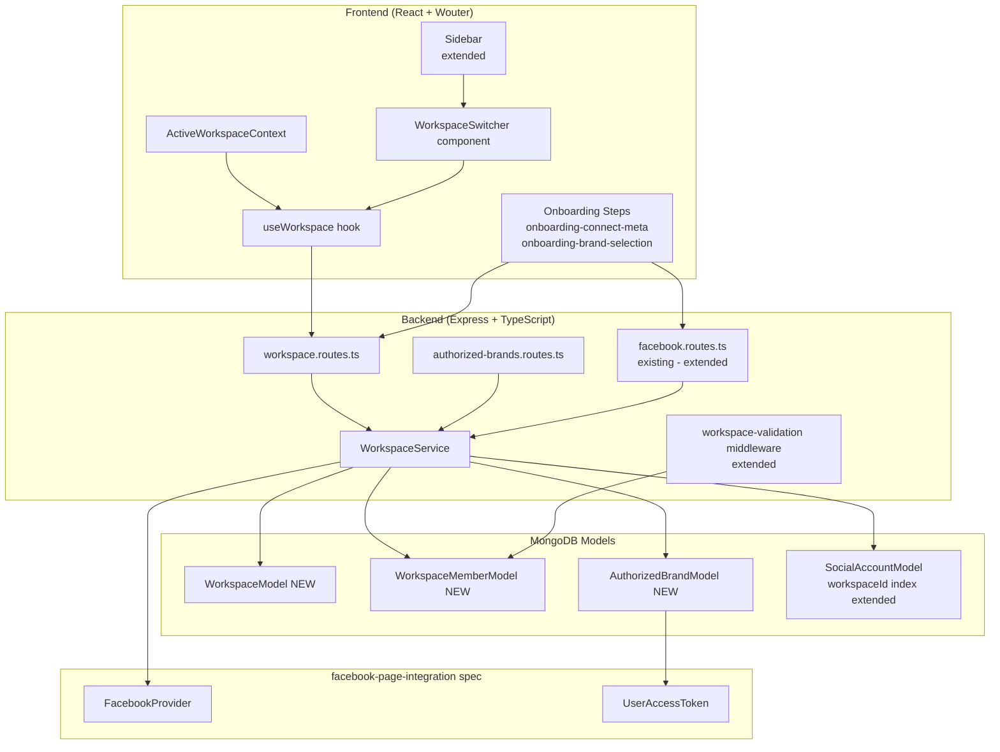
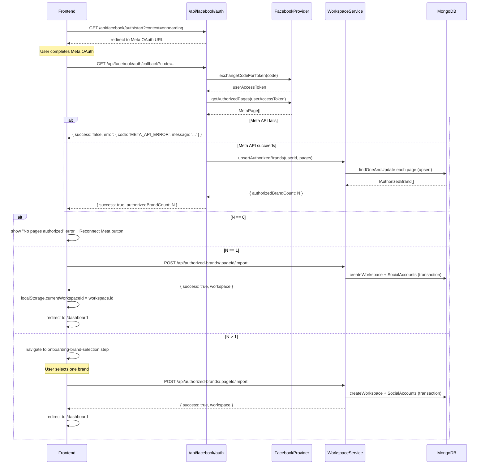

# Design Document: Workspace & Meta Account Connection

## Overview

This document describes the technical design for the Workspace & Meta Account Connection feature in Veefore. A workspace is the top-level isolation boundary for one brand, business, creator, or client — all social accounts, analytics, content, AI memory, and settings belong to exactly one workspace.

This design builds on the `facebook-page-integration` spec (which owns `SocialAccount`, `FacebookProvider`, `SocialPlatformProvider`, `PlatformCapabilityRegistry`) and adds: the `WorkspaceModel`, `WorkspaceMemberModel`, `AuthorizedBrandModel`, the `WorkspaceService` backend class, workspace-scoped API routes, workspace context isolation middleware, the onboarding Meta connection steps, the `useWorkspace` hook, the `WorkspaceSwitcher` component, and an `ActiveWorkspaceContext`.

The design deliberately separates concerns: the `facebook-page-integration` spec owns everything about tokens and raw Meta API calls; this spec owns everything about how authorized pages become workspaces and isolated brand contexts.

---

## Architecture

### System Diagram



### What is New vs Extended

| Layer | Status | Notes |
|---|---|---|
| `WorkspaceModel` | **New** | `server/models/Workspace/WorkspaceModel.ts` |
| `WorkspaceMemberModel` | **New** | `server/models/Workspace/WorkspaceMemberModel.ts` |
| `AuthorizedBrandModel` | **New** | `server/models/AuthorizedBrand/AuthorizedBrandModel.ts` |
| `SocialAccountModel` compound index | **Extended** | Adds unique compound index on `(platform, accountId, ownerId)` |
| `WorkspaceService` | **New** | `server/services/WorkspaceService.ts` |
| `workspace.routes.ts` | **New** | `server/routes/workspace.routes.ts` |
| `authorized-brands.routes.ts` | **New** | `server/routes/authorized-brands.routes.ts` |
| `workspace-validation.ts` middleware | **Extended** | Adds WorkspaceMember lookup and `req.workspaceRole` attachment |
| `facebook.routes.ts` callback | **Extended** | Calls `WorkspaceService.upsertAuthorizedBrands` post-OAuth |
| `useSignUpFlow` hook | **Extended** | Adds two new step types |
| `SignUpIntegrated.tsx` | **Extended** | Renders two new onboarding step components |
| `useWorkspace` hook | **New** | `client/src/hooks/useWorkspace.ts` |
| `ActiveWorkspaceContext` | **New** | `client/src/contexts/ActiveWorkspaceContext.tsx` |
| `WorkspaceSwitcher` component | **New** | `client/src/components/workspace/WorkspaceSwitcher.tsx` |
| `sidebar.tsx` | **Extended** | Inserts `WorkspaceSwitcher` above the VeeGPT logo section |

---

## Components and Interfaces

### Plan Limit Table

```typescript
// server/services/WorkspaceService.ts

export type WorkspacePlan = 'FREE' | 'STARTER' | 'PRO' | 'BUSINESS' | 'ENTERPRISE';

export const PLAN_LIMITS: Record<WorkspacePlan, number | null> = {
  FREE: 1,
  STARTER: 2,
  PRO: 5,
  BUSINESS: 20,
  ENTERPRISE: null, // unlimited unless custom limit set
};
```

### WorkspaceService Interface

```typescript
// server/services/WorkspaceService.ts

export interface WorkspaceLimits {
  currentCount: number;
  planLimit: number | null;       // null = unlimited (Enterprise)
  remainingCapacity: number | null; // null = unlimited
}

export interface CreateWorkspaceInput {
  ownerId: string;  // Firebase UID
  name: string;
  plan: WorkspacePlan;
}

export interface ImportBrandInput {
  userId: string;
  pageId: string;
  workspaceId?: string; // if omitted, a new workspace is created
}

export class WorkspaceService {
  async createWorkspace(input: CreateWorkspaceInput): Promise<IWorkspace>;
  async getWorkspaceLimits(userId: string): Promise<WorkspaceLimits>;
  async getActiveWorkspace(userId: string): Promise<IWorkspace | null>;
  async switchWorkspace(userId: string, workspaceId: string): Promise<void>;
  async importAuthorizedBrand(input: ImportBrandInput): Promise<IWorkspace>;
  async upsertAuthorizedBrands(userId: string, pages: MetaPage[]): Promise<IAuthorizedBrand[]>;
  async renameWorkspace(workspaceId: string, newName: string, userId: string): Promise<IWorkspace>;
  async deleteWorkspace(workspaceId: string, userId: string): Promise<void>;
  async getUserWorkspaces(userId: string): Promise<IWorkspace[]>;
  async getWorkspaceById(workspaceId: string, userId: string): Promise<IWorkspace | null>;
}
```

### MetaPage type (bridge from facebook-page-integration)

```typescript
// server/services/WorkspaceService.ts

export interface MetaPage {
  pageId: string;
  pageName: string;
  pageProfilePictureUrl: string;
  linkedInstagramAccountId: string | null;
  linkedInstagramUsername: string | null;
  accessToken: string;
  tokenExpiresAt: Date;
}
```

---

## Data Models

### WorkspaceModel

```typescript
// server/models/Workspace/WorkspaceModel.ts

import mongoose, { Schema, Document, Model } from 'mongoose';

export type WorkspaceStatus = 'ACTIVE' | 'SUSPENDED' | 'DELETED';

export interface IWorkspace extends Document {
  ownerId: string;           // Firebase UID
  name: string;              // max 100 chars
  plan: WorkspacePlan;
  status: WorkspaceStatus;
  activeWorkspaceId?: string; // denormalized — user's currently selected workspace
  customWorkspaceLimit?: number; // Enterprise only: null means use plan default
  createdAt: Date;
  updatedAt: Date;
  memberCount: number;        // virtual
}

const WorkspaceSchema = new Schema<IWorkspace>(
  {
    ownerId: { type: String, required: true, index: true },
    name: { type: String, required: true, maxlength: 100, trim: true },
    plan: {
      type: String,
      enum: ['FREE', 'STARTER', 'PRO', 'BUSINESS', 'ENTERPRISE'],
      required: true,
      default: 'FREE',
    },
    status: {
      type: String,
      enum: ['ACTIVE', 'SUSPENDED', 'DELETED'],
      required: true,
      default: 'ACTIVE',
    },
    customWorkspaceLimit: { type: Number, min: 1, max: 999, default: null },
  },
  {
    timestamps: true,
    toJSON: { virtuals: true },
    toObject: { virtuals: true },
  }
);

// Compound unique index: same owner cannot have two workspaces with the same name (case-insensitive handled at service layer)
WorkspaceSchema.index({ ownerId: 1, name: 1 }, { unique: true, partialFilterExpression: { status: { $ne: 'DELETED' } } });

// Virtual: memberCount — populated via WorkspaceMemberModel
WorkspaceSchema.virtual('memberCount', {
  ref: 'WorkspaceMember',
  localField: '_id',
  foreignField: 'workspaceId',
  count: true,
});

export const WorkspaceModel: Model<IWorkspace> = mongoose.model<IWorkspace>('Workspace', WorkspaceSchema);
```

### WorkspaceMemberModel

```typescript
// server/models/Workspace/WorkspaceMemberModel.ts

export type WorkspaceRole = 'OWNER' | 'ADMIN' | 'EDITOR' | 'CONTENT_CREATOR' | 'VIEWER';
export type MemberStatus = 'ACTIVE' | 'DELETED';

export interface IWorkspaceMember extends Document {
  workspaceId: mongoose.Types.ObjectId;
  userId: string;       // Firebase UID
  role: WorkspaceRole;
  status: MemberStatus;
  invitedAt: Date;
  joinedAt: Date | null; // null until invite accepted; set at creation for OWNER
  createdAt: Date;
  updatedAt: Date;
}

const WorkspaceMemberSchema = new Schema<IWorkspaceMember>(
  {
    workspaceId: { type: Schema.Types.ObjectId, ref: 'Workspace', required: true, index: true },
    userId: { type: String, required: true, index: true },
    role: {
      type: String,
      enum: ['OWNER', 'ADMIN', 'EDITOR', 'CONTENT_CREATOR', 'VIEWER'],
      required: true,
    },
    status: { type: String, enum: ['ACTIVE', 'DELETED'], default: 'ACTIVE' },
    invitedAt: { type: Date, required: true },
    joinedAt: { type: Date, default: null },
  },
  { timestamps: true }
);

// Each user has exactly one member record per workspace
WorkspaceMemberSchema.index({ workspaceId: 1, userId: 1 }, { unique: true });

export const WorkspaceMemberModel: Model<IWorkspaceMember> =
  mongoose.model<IWorkspaceMember>('WorkspaceMember', WorkspaceMemberSchema);
```

### AuthorizedBrandModel

```typescript
// server/models/AuthorizedBrand/AuthorizedBrandModel.ts

export type AuthorizedBrandStatus = 'INACTIVE' | 'IMPORTED' | 'EXPIRED';

export interface IAuthorizedBrand extends Document {
  userId: string;                       // Firebase UID — the authorizing user
  pageId: string;                       // Meta Facebook Page ID
  pageName: string;
  pageProfilePictureUrl: string;
  linkedInstagramAccountId: string | null;
  linkedInstagramUsername: string | null;
  authorizationTokenRef: mongoose.Types.ObjectId; // ref to UserAccessToken in facebook-page-integration
  tokenExpiresAt: Date;
  authorizedAt: Date;
  status: AuthorizedBrandStatus;
  createdAt: Date;
  updatedAt: Date;
}

const AuthorizedBrandSchema = new Schema<IAuthorizedBrand>(
  {
    userId: { type: String, required: true, index: true },
    pageId: { type: String, required: true },
    pageName: { type: String, required: true },
    pageProfilePictureUrl: { type: String, required: true },
    linkedInstagramAccountId: { type: String, default: null },
    linkedInstagramUsername: { type: String, default: null },
    authorizationTokenRef: { type: Schema.Types.ObjectId, ref: 'UserAccessToken', required: true },
    tokenExpiresAt: { type: Date, required: true },
    authorizedAt: { type: Date, required: true },
    status: {
      type: String,
      enum: ['INACTIVE', 'IMPORTED', 'EXPIRED'],
      required: true,
      default: 'INACTIVE',
    },
  },
  { timestamps: true }
);

// One AuthorizedBrand record per (userId, pageId) — upsert target
AuthorizedBrandSchema.index({ userId: 1, pageId: 1 }, { unique: true });

export const AuthorizedBrandModel: Model<IAuthorizedBrand> =
  mongoose.model<IAuthorizedBrand>('AuthorizedBrand', AuthorizedBrandSchema);
```

### SocialAccount Compound Index Extension

The `SocialAccountModel` is defined in the `facebook-page-integration` spec. This spec adds one compound unique index to enforce the exclusivity invariant:

```typescript
// Addition to server/models/SocialAccount/SocialAccount.ts (extends existing schema)
// Prevent the same platform account from being ACTIVE in more than one workspace

SocialAccountSchema.index(
  { platform: 1, accountId: 1, ownerId: 1 },
  {
    unique: true,
    partialFilterExpression: { connectionStatus: 'ACTIVE' },
    name: 'unique_active_account_per_owner',
  }
);
```

---

## Backend Service Architecture

### WorkspaceService — Key Method Implementations

#### createWorkspace — atomic limit enforcement

```typescript
async createWorkspace(input: CreateWorkspaceInput): Promise<IWorkspace> {
  const session = await mongoose.startSession();
  try {
    return await session.withTransaction(async () => {
      // Validate owner exists
      const user = await UserModel.findOne({ firebaseUid: input.ownerId }).session(session);
      if (!user) throw new WorkspaceError('USER_NOT_FOUND', 'Owner does not exist');

      // Atomic count + limit check within transaction
      const limit = this.resolveLimit(user.plan, user.customWorkspaceLimit);
      const currentCount = await WorkspaceModel.countDocuments({
        ownerId: input.ownerId,
        status: { $ne: 'DELETED' },
      }).session(session);

      if (limit !== null && currentCount >= limit) {
        throw new WorkspaceError('WORKSPACE_LIMIT_REACHED',
          `Plan ${user.plan} allows a maximum of ${limit} workspace(s). Current count: ${currentCount}.`);
      }

      // Case-insensitive name uniqueness check
      const nameLower = input.name.trim().toLowerCase();
      const duplicate = await WorkspaceModel.findOne({
        ownerId: input.ownerId,
        status: { $ne: 'DELETED' },
      }).where('name').regex(new RegExp(`^${escapeRegExp(nameLower)}$`, 'i')).session(session);
      if (duplicate) throw new WorkspaceError('WORKSPACE_NAME_CONFLICT', 'A workspace with this name already exists.');

      // Create workspace
      const [workspace] = await WorkspaceModel.create([{
        ownerId: input.ownerId, name: input.name.trim(), plan: input.plan, status: 'ACTIVE',
      }], { session });

      // Bootstrap OWNER member record
      await WorkspaceMemberModel.create([{
        workspaceId: workspace._id, userId: input.ownerId, role: 'OWNER',
        status: 'ACTIVE', invitedAt: workspace.createdAt, joinedAt: workspace.createdAt,
      }], { session });

      return workspace;
    });
  } finally {
    await session.endSession();
  }
}
```

#### upsertAuthorizedBrands — idempotent, called after Meta OAuth callback

```typescript
async upsertAuthorizedBrands(userId: string, pages: MetaPage[]): Promise<IAuthorizedBrand[]> {
  const results: IAuthorizedBrand[] = [];
  for (const page of pages) {
    const brand = await AuthorizedBrandModel.findOneAndUpdate(
      { userId, pageId: page.pageId },
      {
        $set: {
          pageName: page.pageName,
          pageProfilePictureUrl: page.pageProfilePictureUrl,
          linkedInstagramAccountId: page.linkedInstagramAccountId,
          linkedInstagramUsername: page.linkedInstagramUsername,
          authorizationTokenRef: page.tokenRef,
          tokenExpiresAt: page.tokenExpiresAt,
          authorizedAt: new Date(),
          // Reset to INACTIVE only if not already IMPORTED
          ...(await this.shouldResetStatus(userId, page.pageId) ? { status: 'INACTIVE' } : {}),
        },
      },
      { upsert: true, new: true, setDefaultsOnInsert: true }
    );
    results.push(brand);
  }
  return results;
}
```

#### importAuthorizedBrand — transactional workspace + SocialAccount creation

```typescript
async importAuthorizedBrand(input: ImportBrandInput): Promise<IWorkspace> {
  const session = await mongoose.startSession();
  try {
    return await session.withTransaction(async () => {
      const brand = await AuthorizedBrandModel.findOne(
        { userId: input.userId, pageId: input.pageId }
      ).session(session);
      if (!brand) throw new WorkspaceError('BRAND_NOT_FOUND', 'Authorized brand not found.');
      if (brand.status === 'EXPIRED' || brand.tokenExpiresAt < new Date()) {
        await AuthorizedBrandModel.updateOne({ _id: brand._id }, { status: 'EXPIRED' }, { session });
        throw new WorkspaceError('TOKEN_EXPIRED', 'Authorization expired. Please reconnect Meta.');
      }

      // Create or use existing workspace
      const workspace = input.workspaceId
        ? await WorkspaceModel.findById(input.workspaceId).session(session)
        : await this.createWorkspaceInSession(
            { ownerId: input.userId, name: brand.pageName, plan: 'FREE' }, session
          );
      if (!workspace) throw new WorkspaceError('WORKSPACE_NOT_FOUND', 'Workspace not found.');

      // Import Facebook Page SocialAccount
      await this.importSocialAccount({
        platform: 'facebook', accountId: brand.pageId,
        pageName: brand.pageName, profilePictureUrl: brand.pageProfilePictureUrl,
        workspaceId: workspace._id, ownerId: input.userId,
      }, session);

      // Import Instagram account if present
      if (brand.linkedInstagramAccountId) {
        await this.importSocialAccount({
          platform: 'instagram', accountId: brand.linkedInstagramAccountId,
          pageName: brand.linkedInstagramUsername || brand.pageName,
          profilePictureUrl: brand.pageProfilePictureUrl,
          workspaceId: workspace._id, ownerId: input.userId,
        }, session);
      }

      // Mark brand as imported
      await AuthorizedBrandModel.updateOne(
        { _id: brand._id }, { status: 'IMPORTED' }, { session }
      );

      return workspace;
    });
  } finally {
    await session.endSession();
  }
}
```

#### deleteWorkspace — soft delete with cascade

```typescript
async deleteWorkspace(workspaceId: string, userId: string): Promise<void> {
  const session = await mongoose.startSession();
  try {
    await session.withTransaction(async () => {
      const workspace = await WorkspaceModel.findById(workspaceId).session(session);
      if (!workspace || workspace.ownerId !== userId)
        throw new WorkspaceError('NOT_FOUND_OR_UNAUTHORIZED', 'Workspace not found or access denied.');

      // Prevent deletion of last ACTIVE workspace
      const activeCount = await WorkspaceModel.countDocuments({
        ownerId: userId, status: 'ACTIVE',
      }).session(session);
      if (activeCount <= 1)
        throw new WorkspaceError('CANNOT_DELETE_LAST_WORKSPACE',
          'Cannot delete your only active workspace.');

      // Soft delete workspace
      await WorkspaceModel.updateOne({ _id: workspaceId }, { status: 'DELETED' }, { session });

      // Cascade: mark all member records DELETED
      await WorkspaceMemberModel.updateMany(
        { workspaceId }, { status: 'DELETED' }, { session }
      );

      // Cascade: mark all SocialAccounts DISCONNECTED
      await SocialAccountModel.updateMany(
        { workspaceId }, { connectionStatus: 'DISCONNECTED' }, { session }
      );

      // Update user's activeWorkspaceId to next available workspace
      const nextWorkspace = await WorkspaceModel.findOne({
        ownerId: userId, status: 'ACTIVE', _id: { $ne: workspaceId },
      }).sort({ createdAt: 1 }).session(session);

      await UserModel.updateOne(
        { firebaseUid: userId }, { activeWorkspaceId: nextWorkspace?._id || null }, { session }
      );
    });
  } finally {
    await session.endSession();
  }
}
```

---

## API Routes

All routes in `server/routes/workspace.routes.ts` and `server/routes/authorized-brands.routes.ts`. All routes require `requireAuth` middleware. Routes with `:id` additionally run `validateWorkspaceAccess`.

### Workspace Routes

```
GET    /api/workspaces               → list all non-deleted workspaces for authenticated user
POST   /api/workspaces               → create workspace (enforces plan limit)
GET    /api/workspaces/limits        → { currentCount, planLimit, remainingCapacity }
GET    /api/workspaces/active        → { id, name, plan, socialAccountCount }
POST   /api/workspaces/active        → switch active workspace { workspaceId }
GET    /api/workspaces/:id           → get single workspace (membership required)
PATCH  /api/workspaces/:id           → rename workspace { name }
DELETE /api/workspaces/:id           → soft-delete workspace

GET    /api/workspaces/:id/members   → list members (OWNER or ADMIN only)
POST   /api/workspaces/:id/members   → 501 Not Implemented (schema ready, feature not yet active)
DELETE /api/workspaces/:id/members/:userId → 501 Not Implemented
```

### Authorized Brand Routes

```
GET    /api/authorized-brands              → list user's AuthorizedBrand records
DELETE /api/authorized-brands/:pageId     → remove an inactive brand (with confirmation)
POST   /api/authorized-brands/:pageId/import → import brand into new workspace
```

### Route Handler Sketch — POST /api/workspaces

```typescript
router.post('/', requireAuth, async (req: AuthenticatedRequest, res) => {
  try {
    const { name, plan } = req.body;
    if (!name || typeof name !== 'string') {
      return res.status(400).json({ success: false, error: { code: 'INVALID_INPUT', message: 'name is required' } });
    }
    const workspace = await workspaceService.createWorkspace({
      ownerId: req.userId!, name, plan: plan || 'FREE',
    });
    return res.status(201).json({ success: true, data: workspace });
  } catch (err: any) {
    if (err.code === 'WORKSPACE_LIMIT_REACHED') {
      return res.status(403).json({ success: false, error: { code: err.code, message: err.message } });
    }
    if (err.code === 'WORKSPACE_NAME_CONFLICT') {
      return res.status(409).json({ success: false, error: { code: err.code, message: err.message } });
    }
    return res.status(500).json({ success: false, error: { code: 'INTERNAL_ERROR', message: 'Unexpected error' } });
  }
});
```

### Error Code Reference

| Code | HTTP Status | Description |
|---|---|---|
| `WORKSPACE_LIMIT_REACHED` | 403 | User is at or over their plan limit |
| `WORKSPACE_NAME_CONFLICT` | 409 | Duplicate name for same owner |
| `SOCIAL_ACCOUNT_ALREADY_IMPORTED` | 409 | Same (provider, accountId) already active in another workspace |
| `TOKEN_EXPIRED` | 422 | AuthorizedBrand token expired — re-OAuth required |
| `BRAND_NOT_FOUND` | 404 | AuthorizedBrand record not found |
| `NOT_FOUND_OR_UNAUTHORIZED` | 403 | Workspace not found or user is not a member |
| `CANNOT_DELETE_LAST_WORKSPACE` | 422 | Attempt to delete the user's only active workspace |
| `USER_NOT_FOUND` | 400 | ownerId does not reference a valid user |

---

## Meta OAuth → Workspace Import Flow



---

## Frontend Architecture

### Onboarding Step Extension

Two new steps are added to the `SignupStep` union type in `client/src/features/auth/hooks/useSignUpFlow.ts`:

```typescript
export type SignupStep = 
  | 'form' 
  | 'verification' 
  | 'creating' 
  | 'onboarding-profile' 
  | 'onboarding-goals' 
  | 'onboarding-platforms' 
  | 'onboarding-plan'
  | 'onboarding-connect-meta'    // NEW: "Connect your Meta account" CTA screen
  | 'onboarding-brand-selection'; // NEW: Shown only when N > 1 authorized pages
```

Step transitions in `handleOnboardingNext`:
- `onboarding-plan` → `onboarding-connect-meta` (always — replacing the current direct completion)
- `onboarding-connect-meta` → Meta OAuth redirect (no in-hook step; OAuth callback drives next step)
- OAuth callback with N=1 → auto-import → redirect to dashboard
- OAuth callback with N>1 → `onboarding-brand-selection`
- `onboarding-brand-selection` (user selects brand) → import → redirect to dashboard

`getOnboardingStepNumber` additions:
```typescript
case 'onboarding-connect-meta': return 5;
case 'onboarding-brand-selection': return 6;
```

### useWorkspace Hook

```typescript
// client/src/hooks/useWorkspace.ts

import { useQuery, useMutation, useQueryClient } from '@tanstack/react-query';
import { useActiveWorkspaceContext } from '@/contexts/ActiveWorkspaceContext';

export interface Workspace {
  id: string;
  name: string;
  plan: string;
  status: string;
  ownerId: string;
  createdAt: string;
  updatedAt: string;
  memberCount: number;
}

export interface WorkspaceLimits {
  currentCount: number;
  planLimit: number | null;
  remainingCapacity: number | null;
}

export interface AuthorizedBrand {
  pageId: string;
  pageName: string;
  pageProfilePictureUrl: string;
  linkedInstagramAccountId: string | null;
  status: 'INACTIVE' | 'IMPORTED' | 'EXPIRED';
  tokenExpiresAt: string;
}

export interface UseWorkspaceReturn {
  activeWorkspace: Workspace | null;
  workspaces: Workspace[];
  workspaceLimits: WorkspaceLimits | null;
  isLoadingWorkspace: boolean;
  switchWorkspace: (id: string) => Promise<void>;
  inactiveBrands: AuthorizedBrand[];
  isAtLimit: boolean;
}

export function useWorkspace(): UseWorkspaceReturn {
  const { activeWorkspaceId, setActiveWorkspaceId, invalidateWorkspaceData } = useActiveWorkspaceContext();
  const queryClient = useQueryClient();

  const { data: workspaces = [], isLoading: loadingList } = useQuery({
    queryKey: ['workspaces'],
    queryFn: () => apiRequest('/api/workspaces').then(r => r.data),
    staleTime: 5 * 60 * 1000,
  });

  const { data: limits } = useQuery({
    queryKey: ['workspace-limits'],
    queryFn: () => apiRequest('/api/workspaces/limits').then(r => r.data),
    staleTime: 5 * 60 * 1000,
  });

  const { data: inactiveBrands = [] } = useQuery({
    queryKey: ['authorized-brands'],
    queryFn: () => apiRequest('/api/authorized-brands').then(r => r.data),
    staleTime: 5 * 60 * 1000,
  });

  const activeWorkspace = workspaces.find((w: Workspace) => w.id === activeWorkspaceId) || workspaces[0] || null;

  const switchWorkspace = async (id: string) => {
    await apiRequest('/api/workspaces/active', { method: 'POST', body: { workspaceId: id } });
    setActiveWorkspaceId(id);
    invalidateWorkspaceData();
  };

  const isAtLimit = limits
    ? limits.planLimit !== null && limits.currentCount >= limits.planLimit
    : false;

  return {
    activeWorkspace,
    workspaces,
    workspaceLimits: limits || null,
    isLoadingWorkspace: loadingList,
    switchWorkspace,
    inactiveBrands,
    isAtLimit,
  };
}
```

### ActiveWorkspaceContext

```typescript
// client/src/contexts/ActiveWorkspaceContext.tsx

import React, { createContext, useContext, useState, useCallback } from 'react';
import { useQueryClient } from '@tanstack/react-query';

interface WorkspaceContextValue {
  activeWorkspaceId: string | null;
  setActiveWorkspaceId: (id: string) => void;
  invalidateWorkspaceData: () => void;
}

const ActiveWorkspaceContext = createContext<WorkspaceContextValue | null>(null);

export function ActiveWorkspaceProvider({ children }: { children: React.ReactNode }) {
  const [activeWorkspaceId, setActiveWorkspaceIdState] = useState<string | null>(
    () => localStorage.getItem('currentWorkspaceId')
  );
  const queryClient = useQueryClient();

  const setActiveWorkspaceId = useCallback((id: string) => {
    localStorage.setItem('currentWorkspaceId', id);
    setActiveWorkspaceIdState(id);
    // Notify existing WorkspaceValidator singleton (backward compatibility)
    window.dispatchEvent(new Event('workspace-changed'));
  }, []);

  const invalidateWorkspaceData = useCallback(() => {
    // Invalidate all queries that are workspace-scoped
    queryClient.invalidateQueries({ predicate: (query) => {
      const key = query.queryKey;
      return Array.isArray(key) && (
        key.includes('analytics') ||
        key.includes('social-accounts') ||
        key.includes('posts') ||
        key.includes('calendar') ||
        key.includes('inbox') ||
        key.includes('settings')
      );
    }});
  }, [queryClient]);

  return (
    <ActiveWorkspaceContext.Provider value={{ activeWorkspaceId, setActiveWorkspaceId, invalidateWorkspaceData }}>
      {children}
    </ActiveWorkspaceContext.Provider>
  );
}

export function useActiveWorkspaceContext(): WorkspaceContextValue {
  const ctx = useContext(ActiveWorkspaceContext);
  if (!ctx) throw new Error('useActiveWorkspaceContext must be used within ActiveWorkspaceProvider');
  return ctx;
}
```

### WorkspaceSwitcher Component

```typescript
// client/src/components/workspace/WorkspaceSwitcher.tsx

import React, { useState } from 'react';
import { ChevronDown, Plus, Building2 } from 'lucide-react';
import { cn } from '@/lib/utils';
import { useWorkspace } from '@/hooks/useWorkspace';
import { useLocation } from 'wouter';

export function WorkspaceSwitcher() {
  const { workspaces, activeWorkspace, switchWorkspace, isAtLimit, workspaceLimits } = useWorkspace();
  const [open, setOpen] = useState(false);
  const [, setLocation] = useLocation();

  // Only render when user has more than one workspace
  if (workspaces.length <= 1) return null;

  const handleSwitch = async (id: string) => {
    if (id === activeWorkspace?.id) { setOpen(false); return; }
    await switchWorkspace(id);
    setOpen(false);
  };

  const handleAddWorkspace = () => {
    if (isAtLimit) return; // button is visually disabled
    setOpen(false);
    setLocation('/settings/add-workspace');
  };

  return (
    <div className="relative px-2 pb-4">
      {/* Trigger button */}
      <button
        onClick={() => setOpen(!open)}
        className={cn(
          "w-full flex items-center gap-2 px-3 py-2 rounded-xl transition-all duration-200",
          "bg-gray-50 dark:bg-slate-700 hover:bg-gray-100 dark:hover:bg-slate-600",
          "border border-gray-200/50 dark:border-slate-600/50 text-left"
        )}
        aria-haspopup="listbox"
        aria-expanded={open}
      >
        {/* Avatar */}
        <div className="w-7 h-7 rounded-lg bg-gradient-to-br from-blue-500 to-purple-600 flex items-center justify-center flex-shrink-0">
          <span className="text-white text-xs font-bold">
            {activeWorkspace?.name?.[0]?.toUpperCase() || 'W'}
          </span>
        </div>
        <span className="flex-1 text-xs font-medium text-gray-700 dark:text-gray-200 truncate">
          {activeWorkspace?.name || 'Workspace'}
        </span>
        <ChevronDown className={cn("w-3 h-3 text-gray-400 transition-transform duration-200", open && "rotate-180")} />
      </button>

      {/* Dropdown */}
      {open && (
        <div className={cn(
          "absolute left-2 right-2 top-full mt-1 z-50",
          "bg-white dark:bg-slate-800 rounded-xl shadow-xl",
          "border border-gray-200/50 dark:border-slate-600/50 overflow-hidden"
        )} role="listbox">
          {workspaces.filter(w => w.status !== 'DELETED').map(ws => (
            <button
              key={ws.id}
              role="option"
              aria-selected={ws.id === activeWorkspace?.id}
              onClick={() => handleSwitch(ws.id)}
              className={cn(
                "w-full flex items-center gap-2 px-3 py-2 text-left transition-colors duration-150",
                ws.id === activeWorkspace?.id
                  ? "bg-blue-50 dark:bg-blue-900/20 text-blue-600 dark:text-blue-400"
                  : "hover:bg-gray-50 dark:hover:bg-slate-700 text-gray-700 dark:text-gray-200"
              )}
            >
              <div className="w-6 h-6 rounded-lg bg-gradient-to-br from-blue-500 to-purple-600 flex items-center justify-center flex-shrink-0">
                <span className="text-white text-xs font-bold">{ws.name[0].toUpperCase()}</span>
              </div>
              <div className="flex-1 min-w-0">
                <p className="text-xs font-medium truncate">{ws.name}</p>
                {ws.status === 'SUSPENDED' && (
                  <p className="text-xs text-amber-500">Suspended</p>
                )}
              </div>
            </button>
          ))}

          {/* Add Workspace */}
          <div className="border-t border-gray-100 dark:border-slate-700">
            <button
              onClick={handleAddWorkspace}
              disabled={isAtLimit}
              title={isAtLimit
                ? `Plan limit reached (${workspaceLimits?.currentCount}/${workspaceLimits?.planLimit}). Upgrade to add more.`
                : 'Add workspace'}
              className={cn(
                "w-full flex items-center gap-2 px-3 py-2 text-left transition-colors duration-150",
                isAtLimit
                  ? "opacity-40 cursor-not-allowed text-gray-400"
                  : "hover:bg-gray-50 dark:hover:bg-slate-700 text-blue-600 dark:text-blue-400"
              )}
            >
              <Plus className="w-4 h-4" />
              <span className="text-xs font-medium">Add Workspace</span>
            </button>
          </div>
        </div>
      )}
    </div>
  );
}
```

### Sidebar Integration

The `WorkspaceSwitcher` is inserted at the top of the sidebar, above the VeeGPT logo section. In `client/src/components/layout/sidebar.tsx`, the outer container's opening now renders:

```tsx
// Before VeeGPT logo section div:
<WorkspaceSwitcher />

{/* VeeGPT Logo Section */}
<div className="flex flex-col items-center py-6 ...">
```

---

## Workspace Context Isolation Middleware

The existing `server/middleware/workspace-validation.ts` is extended:

```typescript
// server/middleware/workspace-validation.ts (extended)

import { Request, Response, NextFunction } from 'express';
import { WorkspaceMemberModel } from '../models/Workspace/WorkspaceMemberModel';

declare module 'express' {
  interface Request {
    workspaceId?: string;
    workspaceRole?: string;
  }
}

export async function validateWorkspaceAccess(req: Request, res: Response, next: NextFunction) {
  try {
    const userId = (req as any).userId;
    if (!userId) return res.status(401).json({ success: false, error: { code: 'UNAUTHENTICATED', message: 'Authentication required' } });

    // Resolution order: header → query → body
    const workspaceId =
      (req.headers['x-workspace-id'] as string) ||
      (req.query.workspaceId as string) ||
      (req.body?.workspaceId as string);

    if (!workspaceId) {
      return res.status(400).json({ success: false, error: { code: 'WORKSPACE_ID_REQUIRED', message: 'X-Workspace-ID header is required' } });
    }

    // Validate membership and attach role
    const member = await WorkspaceMemberModel.findOne({
      workspaceId,
      userId,
      status: 'ACTIVE',
    }).lean();

    if (!member) {
      return res.status(403).json({ success: false, error: { code: 'WORKSPACE_ACCESS_DENIED', message: 'You are not a member of this workspace' } });
    }

    req.workspaceId = workspaceId;
    req.workspaceRole = member.role;
    next();
  } catch (err) {
    next(err);
  }
}
```

---

## Active Workspace Session Strategy

- **Primary store**: `users.activeWorkspaceId` field in MongoDB user record (updated on each `POST /api/workspaces/active` call).
- **Client cache**: `localStorage.currentWorkspaceId` (read/written by `ActiveWorkspaceContext`; read by existing `workspaceValidator.ts`).
- **`GET /api/workspaces/active`** logic:
  1. Read `user.activeWorkspaceId`.
  2. Verify it's `ACTIVE` and user is a `WorkspaceMember`.
  3. If not valid, fall back to oldest `ACTIVE` workspace owned by the user.
  4. If none found, return 404 with `{ code: 'NO_ACTIVE_WORKSPACE' }`.
- **On workspace deletion**: server updates `user.activeWorkspaceId` to the oldest remaining `ACTIVE` workspace within the same transaction.
- **On app load**: `ActiveWorkspaceContext` initializes from `localStorage.currentWorkspaceId`; `workspaceValidator.ts` validates it against the workspace list on first API call.

---

## Error Handling

### Service-Level Error Class

```typescript
// server/services/WorkspaceService.ts

export class WorkspaceError extends Error {
  constructor(public code: string, message: string) {
    super(message);
    this.name = 'WorkspaceError';
  }
}
```

### Route-Level Handling Pattern

```typescript
// Standard error handler in workspace routes

function handleWorkspaceError(err: unknown, res: Response) {
  if (err instanceof WorkspaceError) {
    const statusMap: Record<string, number> = {
      WORKSPACE_LIMIT_REACHED: 403,
      WORKSPACE_NAME_CONFLICT: 409,
      SOCIAL_ACCOUNT_ALREADY_IMPORTED: 409,
      TOKEN_EXPIRED: 422,
      BRAND_NOT_FOUND: 404,
      NOT_FOUND_OR_UNAUTHORIZED: 403,
      CANNOT_DELETE_LAST_WORKSPACE: 422,
      USER_NOT_FOUND: 400,
    };
    const status = statusMap[err.code] || 500;
    return res.status(status).json({ success: false, error: { code: err.code, message: err.message } });
  }
  console.error('[WorkspaceRoute] Unexpected error:', err);
  return res.status(500).json({ success: false, error: { code: 'INTERNAL_ERROR', message: 'An unexpected error occurred' } });
}
```

### Frontend Error States

- Workspace switch failure: retain previous workspace view, show toast, provide retry button.
- Limit reached: disable "Add Workspace" in dropdown with tooltip; show upgrade prompt linking to `/settings/billing`.
- Token expired on import: show "Reconnect Meta" button triggering OAuth flow.
- Zero pages authorized: show explanatory message with "Reconnect Meta" CTA.
- Import failure: roll back silently (server handles), show error toast with retry.

---

## Correctness Properties

*A property is a characteristic or behavior that should hold true across all valid executions of a system — essentially, a formal statement about what the system should do. Properties serve as the bridge between human-readable specifications and machine-verifiable correctness guarantees.*

This feature has pure service-layer logic (limit enforcement, idempotent upserts, atomic mutations, membership validation, isolation invariants) that benefits from property-based testing. The property-based testing library for this TypeScript/Node.js codebase is **fast-check**.

---

### Property 1: Workspace Limit Invariant

*For any* user U with plan P and current non-deleted workspace count C, if C >= planLimit(P), then any call to `createWorkspace` for that user SHALL return a `WORKSPACE_LIMIT_REACHED` error and the workspace count SHALL remain C. Even when multiple concurrent creation requests are submitted simultaneously, the final count SHALL never exceed `planLimit(P)`.

**Validates: Requirements 2.2, 2.7**

---

### Property 2: SocialAccount Exclusivity Invariant

*For any* (platform, accountId) pair that is already associated with an `ACTIVE` SocialAccount in workspace W1 owned by user U, attempting to import that same (platform, accountId) into any other workspace owned by user U SHALL return a `SOCIAL_ACCOUNT_ALREADY_IMPORTED` error, and no new SocialAccount record with that (platform, accountId) SHALL be created.

**Validates: Requirements 1.5, 5.9**

---

### Property 3: AuthorizedBrand Upsert Idempotency

*For any* set of Meta pages P1…PN, calling `upsertAuthorizedBrands(userId, pages)` any number of times K (K >= 1) with the same set SHALL result in exactly one `AuthorizedBrand` record per unique `pageId` — never more. The final record for each `pageId` SHALL reflect the values from the most recent call.

**Validates: Requirements 3.4, 8.6**

---

### Property 4: Workspace Deletion Cascade

*For any* workspace W with N `WorkspaceMember` records and M `SocialAccount` records, after a successful `deleteWorkspace(W.id, ownerId)` call: all N `WorkspaceMember` records SHALL have `status = 'DELETED'`, and all M `SocialAccount` records SHALL have `connectionStatus = 'DISCONNECTED'`. The workspace record itself SHALL have `status = 'DELETED'`. No member or social account records SHALL be hard-deleted.

**Validates: Requirements 1.6, 9.3**

---

### Property 5: Owner Membership Bootstrap and memberCount Consistency

*For any* newly created workspace W, exactly one `WorkspaceMember` record SHALL exist with `workspaceId = W.id`, `userId = W.ownerId`, and `role = 'OWNER'`, with both `invitedAt` and `joinedAt` set to the workspace creation timestamp. The `memberCount` virtual field on W SHALL equal the total count of all `WorkspaceMember` records associated with W, regardless of their role or join status.

**Validates: Requirements 10.1, 10.6**

---

### Property 6: Workspace Name Uniqueness Per Owner

*For any* user U who already has an `ACTIVE` or `SUSPENDED` workspace named N, attempting to create a second workspace with a name that equals N (case-insensitively) SHALL return `WORKSPACE_NAME_CONFLICT`. Similarly, attempting to rename an existing workspace to any name that case-insensitively matches another non-deleted workspace owned by the same user SHALL return `WORKSPACE_NAME_CONFLICT`. The name comparison SHALL be case-insensitive.

**Validates: Requirements 1.3, 9.1**

---

### Property 7: Workspace Context Isolation

*For any* two distinct workspaces W1 and W2 owned by the same user, all backend API responses for requests scoped to W1 (via `X-Workspace-ID: W1.id`) SHALL contain only data records with `workspaceId = W1.id`. No data record belonging to W2 SHALL appear in any W1-scoped response, regardless of how similar the data is between the two workspaces.

**Validates: Requirements 6.1, 6.4**

---

### Property 8: Workspace Membership Authorization

*For any* workspaceId W and any user U who does not have an `ACTIVE` `WorkspaceMember` record for W, every authenticated request to any workspace-scoped API endpoint with `X-Workspace-ID: W` SHALL return HTTP 403 with error code `WORKSPACE_ACCESS_DENIED`. No workspace data SHALL be returned to non-members.

**Validates: Requirements 6.4, 10.3**

---

### Property 9: SocialAccount Import Fidelity

*For any* Meta API response containing pages P1…PN, the set of imported `SocialAccount` records SHALL correspond exactly to the accounts described in the response: one Facebook SocialAccount per Page, and one Instagram SocialAccount for each Page that has a non-null `instagram_business_account` field. The imported Instagram accounts SHALL contain only the IDs and usernames explicitly returned by Meta — no additional Instagram accounts SHALL be inferred or added.

**Validates: Requirements 3.1, 3.2, 3.3**

---

### Property 10: Workspace Mutation Atomicity

*For any* workspace creation or brand import operation that fails at any point (SocialAccount creation error, duplicate detection, network error), the resulting database state SHALL be as if the operation never started: no partial `Workspace` record, no partial `WorkspaceMember` record, and no partial `SocialAccount` record SHALL exist. The operation SHALL either fully succeed or fully roll back.

**Validates: Requirements 5.4, 3.5**

---

### Property 11: Limits Endpoint Mathematical Consistency

*For any* user U with workspace count C and plan limit L (where L is non-null), the response from `GET /api/workspaces/limits` SHALL satisfy: `response.currentCount == C`, `response.planLimit == L`, and `response.remainingCapacity == max(0, L - C)`. For Enterprise users with `L = null`, both `planLimit` and `remainingCapacity` SHALL be `null`.

**Validates: Requirements 2.1, 2.6**

---

### Property 12: Plan Downgrade Suspension Ordering

*For any* user U with K workspaces (ordered by `createdAt` ascending) who downgrades to a plan allowing at most M workspaces where M < K: exactly K-M workspaces SHALL be `SUSPENDED`, and they SHALL be the K-M workspaces with the most recent `createdAt` timestamps. The M oldest workspaces SHALL remain `ACTIVE`.

**Validates: Requirements 2.4**

---

## Testing Strategy

### Dual Testing Approach

Both unit/integration tests and property-based tests are used in tandem. Unit tests verify specific flows and concrete error messages; property tests verify universal invariants across generated inputs.

### Property-Based Testing Setup

- **Library**: `fast-check` (TypeScript-native, integrates with Jest/Vitest)
- **Minimum iterations**: 100 per property test
- **Tag format**: `// Feature: workspace-meta-connection, Property N: <property title>`
- **Scope**: `WorkspaceService` is a pure class with no Express dependencies — all property tests run against the service directly with a test MongoDB instance (MongoDB Memory Server)

### Example Property Test Skeleton

```typescript
// tests/workspace-meta-connection.property.test.ts
// Feature: workspace-meta-connection, Property 1: Workspace Limit Invariant

import * as fc from 'fast-check';
import { WorkspaceService } from '../server/services/WorkspaceService';

describe('Property 1: Workspace Limit Invariant', () => {
  it('never exceeds plan limit under concurrent creation', async () => {
    await fc.assert(fc.asyncProperty(
      fc.constantFrom('FREE', 'STARTER', 'PRO') as fc.Arbitrary<WorkspacePlan>,
      fc.array(fc.string({ minLength: 3, maxLength: 50 }), { minLength: 1, maxLength: 25 }),
      async (plan, names) => {
        const userId = await createTestUser(plan);
        const limit = PLAN_LIMITS[plan]!;
        const uniqueNames = [...new Set(names)];

        // Fire all creation requests concurrently
        const results = await Promise.allSettled(
          uniqueNames.map(name => workspaceService.createWorkspace({ ownerId: userId, name, plan }))
        );

        const succeeded = results.filter(r => r.status === 'fulfilled').length;
        const finalCount = await WorkspaceModel.countDocuments({ ownerId: userId, status: { $ne: 'DELETED' } });

        // Invariant: final count never exceeds limit
        expect(finalCount).toBeLessThanOrEqual(limit);
        expect(succeeded).toBeLessThanOrEqual(limit);
      }
    ), { numRuns: 100 });
  });
});
```

### Unit and Integration Test Coverage

- **Onboarding routing**: N=0, N=1, N>1 page scenarios with example-based tests
- **Plan limit table**: one example per plan type
- **Token expiry**: edge-case test with an expired `AuthorizedBrand`
- **Workspace switcher**: renders only when `workspaces.length > 1` (React Testing Library)
- **Middleware**: non-member returns 403; member gets role attached to request
- **Rename validation**: empty string, whitespace-only, >100 chars, duplicate name
- **Delete last workspace**: returns `CANNOT_DELETE_LAST_WORKSPACE`
- **Meta API failure**: no records created or modified

### Notes on Not Using PBT For

- **Onboarding UX routing** (N=0/1/>1 branching): example-based only — branching on a count comparison, no generative benefit
- **WorkspaceSwitcher rendering**: snapshot test — UI component
- **API route wiring**: integration tests with representative examples
- **MongoDB schema fields**: smoke test verifying required fields exist
